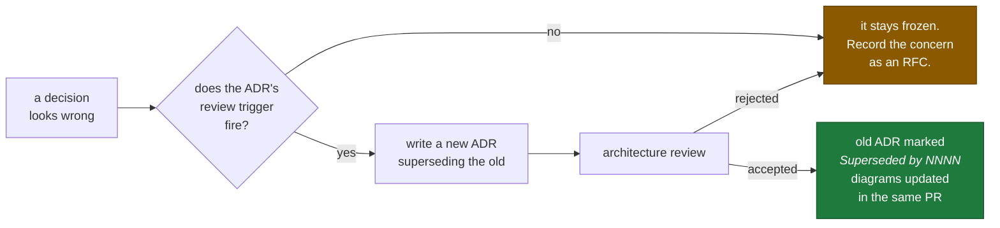

# Architecture Freeze

**Status:** FROZEN · **Effective:** 2026-08-06 · **Phase:** 2.5 complete

This document is the **single source of truth** for the CallScreen platform
architecture. Where anything else — a diagram, a README, a comment, a
conversation — disagrees with this document or the ADRs it indexes, this document
wins and the other artefact is a bug.

---

## 1 · What "frozen" means

**Frozen.** Every decision in ADR-0001 through ADR-0012. These are not
suggestions, defaults, or starting points. Implementation follows them.

**Not frozen.** Everything below the decision line: internal design of a service,
choice of library within a service, database schema detail, prompt wording, UI,
test strategy, refactoring. Engineers should exercise judgement freely there —
the freeze exists to stop re-litigating settled questions, not to stop thinking.

**The distinction, concretely:**

| Frozen | Not frozen |
|---|---|
| Carrier-side screening (ADR-0002) | How `telephony-gateway` structures its state machine |
| Aurora per bounded context (ADR-0009) | The tables inside `content` |
| Four-tier LLM ladder (ADR-0006) | The prompt text in each tier |
| p95 ≤ 1 500 ms (ADR-0011) | How a service meets its hop allocation |
| Audio off by default (ADR-0012) | The settings-screen layout |
| AWS `ap-south-1` (ADR-0008) | Node instance families |

---

## 2 · The decisions

| ADR | Decision | Reversibility |
|---|---|---|
| [0001](docs/adr/0001-monorepo-structure-and-tooling.md) | Monorepo, native per-language tooling, Bazel deferred | Medium |
| [0002](docs/adr/0002-telephony-architecture.md) | **Carrier-side screening via conditional call forwarding, with an on-device pre-filter** | **Very low — the foundation** |
| [0003](docs/adr/0003-carrier-cpaas-selection.md) | Exotel primary, Plivo secondary, both live | Medium — provider port |
| [0004](docs/adr/0004-media-transport.md) | Provider WebSocket at the carrier leg, WebRTC at the app leg | Medium — audio bus |
| [0005](docs/adr/0005-streaming-stt-architecture.md) | Google STT v2 primary 🇮🇳, Deepgram secondary, Sarvam shadow | High — routing policy |
| [0006](docs/adr/0006-llm-routing-strategy.md) | Four-tier ladder: none → Haiku 4.5 → Sonnet 5 → Opus 5 | High — routing policy |
| [0007](docs/adr/0007-streaming-tts-architecture.md) | ElevenLabs Flash primary, sentence-level streaming | High — routing policy |
| [0008](docs/adr/0008-cloud-infrastructure.md) | AWS, `ap-south-1` + `ap-south-2`, EKS on Graviton | Low |
| [0009](docs/adr/0009-database-and-event-backbone.md) | Aurora per bounded context, Redis, MSK, S3 | Low |
| [0010](docs/adr/0010-authentication-and-device-trust.md) | MSISDN identity, hardware-bound PoP tokens, Play Integrity | Low |
| [0011](docs/adr/0011-end-to-end-latency-budget.md) | **p50 ≤ 900 ms, p95 ≤ 1 500 ms, allocated per hop** | Medium — re-baselined at 30 days |
| [0012](docs/adr/0012-privacy-dpdp-consent-retention.md) | Announcement as lawful basis, audio off by default, India-resident | **Very low — statutory** |

Full index and format: [`docs/adr/README.md`](docs/adr/README.md).

---

## 3 · Invariants

These are not merely decisions. **Violating one is a defect regardless of what
else it achieves**, and no local optimisation justifies breaking one.

| # | Invariant | Source | Why it cannot bend |
|---|---|---|---|
| **I1** | Every screened call opens with a deterministic, model-free announcement identifying the AI and the recording | 0012 §5.1 | It is the caller's lawful basis. A model in this path could be suppressed by prompt injection. |
| **I2** | Personal data does not leave India except under the four-condition consent gate | 0012 §5.4 | Statutory. Enforced at three independent layers. |
| **I3** | Thinking stays enabled on tool-calling LLM tiers | 0006 §2 | Disabling it silently drops tool calls with no error. Invisible failure. |
| **I4** | Caller speech is untrusted input; tools reachable by the agent are read-mostly and cannot disclose subscriber PII | 0006 §10 | The agent talks to hostile strangers by design. |
| **I5** | No secret ships in the APK; the device credential is generated on-device and non-exportable | 0010 §5 | An APK is a public artefact. |
| **I6** | Services drain before terminating — readiness false, then close | 0004 §9 | A pod restart otherwise drops live phone calls. |
| **I7** | Kafka payloads carry identifiers, not personal content | 0009 §10 | Kafka cannot delete a record. Erasure depends on this and it cannot be retrofitted. |
| **I8** | An unclassified schema field is treated as `PERSONAL` — fails closed | 0012 §10 | The default is the control. |
| **I9** | `media-relay` never writes audio to disk | 0004 §10 | Persistence is a policy-gated act, never a side effect. |
| **I10** | Undiverted inbound calls to our DIDs are refused as hostile | 0002 §10 | DIDs are publicly dialable. |
| **I11** | Under load, shed at admission or downgrade a tier — never skip fraud scoring or the safety layer | 0011 §10 | Degradation must fail safe. |
| **I12** | Each service owns its schema; no cross-service table access | Phase 1 §20 | Enforced by separate clusters and credentials, not convention. |

---

## 4 · Numbers that are fixed

| Metric | Value | Source |
|---|---|---|
| End-to-end response latency, p50 | **≤ 900 ms** | 0011 |
| End-to-end response latency, p95 | **≤ 1 500 ms** | 0011 |
| End-to-end response latency, p99 | **≤ 2 500 ms** (hard ceiling) | 0011 |
| Barge-in | **≤ 20 ms** — one frame interval | 0011 |
| Endpointing window | 250 ms p50 / 350 ms p95 | 0011 |
| Ring delay before forwarding | 5 s | 0002 |
| Access token lifetime | 15 min | 0010 |
| Refresh token lifetime | 90 days, rotating | 0010 |
| Call audio retention | 30 days default (7–90 configurable) | 0012 |
| Transcript retention | 90 days default (7–180 configurable) | 0012 |
| Coverage gate, new code | ≥ 85% | Phase 1 §17 |
| Coverage gate, critical modules | ≥ 90% | Phase 1 §17 |

Critical modules: `session-orchestrator`, `fraud-engine`, `billing`, `identity`,
`core/telephony`.

---

## 5 · The frozen stack

| Layer | Choice | ADR |
|---|---|---|
| **Android** | Kotlin · Compose · Material 3 · Hilt · minSdk 26 · compileSdk 35 | Phase 1 |
| **Telephony plane** | Go — `telephony-gateway`, `media-relay`, `session-orchestrator` | 0002, 0004 |
| **AI tier** | Python 3.12 — `asr-gateway`, `ai-orchestrator`, `tts-gateway`, `fraud-engine`, `transcript-service`, `prompt-registry` | 0005–0007 |
| **Application plane** | Go — `edge-api`, `identity`, `contacts-sync`, `notification-fanout`, `billing` | Phase 1 |
| **Contracts** | Protobuf + buf; Connect-RPC at the mobile edge | 0001 |
| **Carrier** | Exotel primary 🇮🇳, Plivo secondary | 0003 |
| **STT** | Google STT v2 🇮🇳 · Deepgram 🌐 · Sarvam 🇮🇳 shadow | 0005 |
| **LLM** | `claude-haiku-4-5` · `claude-sonnet-5` · `claude-opus-5` | 0006 |
| **TTS** | ElevenLabs Flash 🌐 · Cartesia 🌐 · Sarvam 🇮🇳 shadow | 0007 |
| **Cloud** | AWS `ap-south-1` + `ap-south-2` · EKS · Graviton | 0008 |
| **Data** | Aurora PostgreSQL ×4 · ElastiCache Redis · MSK · S3 | 0009 |
| **Auth** | MSISDN + OTP · Keystore PoP · Play Integrity · EdDSA JWT | 0010 |

---

## 6 · Changing a frozen decision

The freeze is not permanent. It is a **procedural gate**, not a prohibition.

**Rules.**

1. **Never edit an accepted ADR.** Supersede it. The record of why we were wrong
   is the point.
2. **Every ADR carries an observable review trigger.** If it has not fired, the
   decision stays. "I would have chosen differently" is not a trigger.
3. **A superseding ADR needs architecture-team approval** via CODEOWNERS on
   `docs/adr/`.
4. **Diagrams update in the same pull request.** A diagram that outlives its ADR
   is worse than no diagram.
5. **Invariants (§3) require explicit sign-off**, not merely a superseding ADR.
   Each one exists because breaking it causes a failure that is silent, statutory,
   or both.

**Emergency exception.** A production incident may require violating a frozen
decision to restore service. Do it, then file a superseding ADR or a revert
within five working days. An undocumented emergency deviation becomes permanent
architecture by accident, which is how systems rot.

---

## 7 · Where things are

| Artefact | Location |
|---|---|
| Decisions | [`docs/adr/`](docs/adr/README.md) |
| Diagrams | [`docs/architecture/`](docs/architecture/README.md) |
| Repository conventions | [`CONTRIBUTING.md`](CONTRIBUTING.md) |
| Security policy | [`SECURITY.md`](SECURITY.md) |
| Data classification | `contracts/proto/callscreen/common/v1/annotations.proto` |
| Compliance artefacts | `docs/compliance/` |
| Runbooks | `docs/runbooks/` |

**The single most important file in the repository** is
`annotations.proto`. It is where the privacy policy in ADR-0012 stops being a
document and becomes an enforced property of every service — driving log
redaction, retention, residency routing, and analytics exclusion automatically.

---

## 8 · State of the build

**Phase 2 is complete and verified.** 223 files, 524 directories.

| Gate | Result |
|---|---|
| `buf lint` · `buf format` · `buf generate` | ✅ 58 files, 4 languages |
| Go — build · vet · test, 11 modules | ✅ 11/11 |
| Python — ruff · mypy strict · pytest | ✅ 31 files typed, 83 tests |
| Android — assemble ×3 variants · unit tests | ✅ debug, staging, release |
| Docker build | ⚠️ **not run** — daemon unavailable |
| CI | ⚠️ **not run** — no git repository initialised |

**Exists:** repository foundation, contracts workspace, shared platform packages
in Go and Python, 8 Go and 6 Python service skeletons, Android build with
convention plugins and 14 core modules, Dockerfiles, local stack, CI workflows,
quality gates.

**Deliberately absent:** authentication, telephony, AI, call screening, UI
screens, business logic, database schemas, feature modules.

---

## 9 · Carried into Phase 3

Known, tracked, not silently ignored.

| # | Item | Owner |
|---|---|---|
| 1 | `git init`, first commit, branch protection, merge queue — **CI cannot run without this** | Platform |
| 2 | Docker image builds verified once a daemon is available | Platform |
| 3 | Renovate first run to pin container base-image digests (deliberately left unpinned rather than guessed) | Platform |
| 4 | Per-carrier behaviour matrix — Jio, Airtel, Vi, BSNL — **launch blocker** | Telephony |
| 5 | DPIA, Grievance Officer, generated data map, tested erasure runbook — **all four are launch blockers** | Compliance |
| 6 | `tools/sipp-harness` and `tools/audio-fixtures` — **required before the first telephony feature** | Telephony / QA |
| 7 | `tests/eval` gates: accuracy, fraud recall, safety, injection, latency, cost | AI |
| 8 | Latency re-baseline after 30 days of production traffic (ADR-0011 §14) | Platform |
| 9 | Terraform, Kubernetes and Helm are structural only — no real infrastructure yet | SRE |
| 10 | DR game day for `ap-south-2` promotion | SRE |

---

## 10 · Sign-off

| Aspect | Status |
|---|---|
| ADR-0001 … ADR-0012 | **Accepted** |
| Architecture diagrams | **Complete** — 8 documents |
| Invariants | **Defined** — 12 |
| Latency budget | **Allocated** — 11 hops, named owners |
| Repository foundation | **Built and verified** |
| Product implementation | **Not started** |

**This architecture is frozen. Phase 3 implements it.**

Every future pull request is measured against this document. A change that
contradicts it is either wrong, or it is a superseding ADR — and it must say
which.
