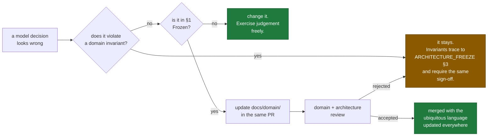

# Domain Freeze

**Status:** PROPOSED — awaiting approval · **Phase:** 4 · **Date:** 2026-08-07

This document is the **single source of truth** for the CallScreen business
domain. Where anything else — a schema, a contract, a service, a conversation —
disagrees with this document or the domain documents it indexes, this document
wins and the other artefact is a bug.

It sits above [`docs/domain/`](docs/domain/README.md) as
[`ARCHITECTURE_FREEZE.md`](ARCHITECTURE_FREEZE.md) sits above `docs/adr/` and
[`UX_FREEZE.md`](UX_FREEZE.md) sits above `docs/ux/`.

---

## 1 · What "frozen" means here

**Frozen.** The eleven bounded contexts and their boundaries. Every aggregate
root and its consistency boundary. Every domain invariant. The ubiquitous
language. The context map and its relationship patterns. The shared kernel's
membership. Domain event names. Every entity's privacy classification and audit
level.

**Not frozen.** Database schemas, indexes, migrations. Protobuf message shapes.
Service decomposition within a context. Internal algorithms. Repository
implementations. Query optimisation. Test strategy. Anything below the modelling
line.

| Frozen | Not frozen |
|---|---|
| `Subscriber` contains `Device` and `ConsentRecord` | How those are stored |
| `FraudAssessment` cannot exist without evidence | How evidence is indexed |
| `telephony.forwarding.lapsed.v1` | Its payload's protobuf field numbers |
| `Announcement` is a value object | Which table holds its versions |
| `CallerList` holds both lists | Whether entries are soft- or hard-deleted |
| Consumer never commands Telephony | Which service serves the pre-filter cache |
| `AccessGrant` expires in ≤ 60 minutes | How expiry is scheduled |

---

## 2 · The eleven contexts

| # | Context | Subdomain | Aggregates | Document |
|---|---|---|---|---|
| 10 | Identity | Generic + statutory | 4 | [10-identity.md](docs/domain/10-identity.md) |
| 11 | Consumer | Supporting | 5 | [11-consumer.md](docs/domain/11-consumer.md) |
| 12 | **Telephony** | **Core** | 4 | [12-telephony.md](docs/domain/12-telephony.md) |
| 13 | Voice | Supporting | 3 | [13-voice.md](docs/domain/13-voice.md) |
| 14 | **AI Orchestration** | **Core** | 7 | [14-ai-orchestration.md](docs/domain/14-ai-orchestration.md) |
| 15 | **Fraud Detection** | **Core** | 6 | [15-fraud-detection.md](docs/domain/15-fraud-detection.md) |
| 16 | Business | Supporting | 6 | [16-business.md](docs/domain/16-business.md) |
| 17 | Billing | Generic | 5 | [17-billing.md](docs/domain/17-billing.md) |
| 18 | Notifications | Supporting | 4 | [18-notifications.md](docs/domain/18-notifications.md) |
| 19 | Analytics | Generic | 3 | [19-analytics.md](docs/domain/19-analytics.md) |
| 20 | Administration | Supporting | 7 | [20-administration.md](docs/domain/20-administration.md) |

**54 aggregates. 11 contexts. 3 core.**

Cross-cutting: [strategic design](docs/domain/00-strategic-design.md) ·
[modelling conventions](docs/domain/01-modelling-conventions.md) ·
[ubiquitous language](docs/domain/02-ubiquitous-language.md) ·
[event storming](docs/domain/03-event-storming.md) ·
[interaction matrix](docs/domain/40-cross-context-interaction-matrix.md) ·
[aggregate map](docs/domain/41-aggregate-map.md).

---

## 3 · Reconciliation with ADR-0009

**ADR-0009 fixes four Aurora clusters and calls them bounded contexts. This
document defines eleven. Both are correct at different granularities, and the
mapping is recorded rather than left to be discovered.**

ADR-0009's four are **persistence contexts** — units of physical isolation
chosen so a cross-boundary `JOIN` is impossible rather than merely discouraged.
The eleven here are **domain contexts** — units of linguistic and modelling
consistency.

**The rule that survives unchanged:** a context never reads another context's
schema, regardless of which cluster hosts it. Enforced exactly as ADR-0009
enforces it — separate schemas with separate credentials.

| Cluster | Hosts |
|---|---|
| `identity` | Identity · Consumer · Business (org, membership) · Notifications · Administration |
| `telephony` | Telephony · Business (line, routing) |
| `content` | Voice · AI Orchestration · Fraud Detection |
| `billing` | Billing |
| **None** | **Analytics** — fed from Kafka into a separate analytical store (ADR-0009 §14) |

Two consequences: **Business spans two clusters**, so adding a line is a saga
with specified compensations; and **Analytics has no production store**, which
is what makes Invariant U11 achievable rather than aspirational.

Full mapping: [`00 §0.7`](docs/domain/00-strategic-design.md).

---

## 4 · Domain invariants

Every architectural invariant and every UX invariant with domain content is
carried here as a named domain invariant on a named aggregate — enforceable at
construction rather than by review.

| Frozen invariant | Carried as | Enforced by |
|---|---|---|
| **I1** Announcement | INV-TE-1, INV-AI-1, INV-AI-11 | A missing state-machine edge; an immutable value object |
| **I2** Residency | INV-ID-8 | Residency binding on every `PERSONAL` attribute |
| **I3** Thinking enabled | INV-AI-2 | Prompt save-time rejection |
| **I4** Untrusted caller speech | INV-AI-3, INV-CO-2, INV-BU-9 | Empty-by-default `DisclosureScope`; refusal at tool invocation |
| **I5** Device credential | INV-ID-3 | Construction refuses a transmitted credential |
| **I6** Drain before terminate | P-TE-6 | `DrainService` |
| **I7** Identifiers not content | Every event definition | **No content field exists in any payload** |
| **I8** Unclassified is `PERSONAL` | INV-AN-3 | `ClassificationGuardService`, reading the descriptor |
| **I9** No audio to disk | INV-VO-1, INV-TE-6, INV-AD-11 | One persistence path, consent-gated |
| **I10** Undiverted refused | INV-TE-2, INV-TE-3 | `CallSession` cannot be constructed without a diversion |
| **I11** Never skip fraud or safety | P-TE-2, P-AI-4, INV-FR-10, INV-AD-6 | **A flag disabling either cannot be created** |
| **I12** Schema ownership | [§3](#3--reconciliation-with-adr-0009) | Separate credentials |
| **U4** Provenance and confidence | INV-AI-6, INV-FR-2 | Mandatory construction parameters |
| **U5** Recording never suppressed | INV-NO-4, INV-VO-4 | No preference can reach it |
| **U7** Emergency handover | INV-AI-9, INV-FR-7 | Terminal state; Fraud cannot assign `EMERGENCY` |
| **U8** No fake liveness | INV-VO-6, INV-AI-7 | No code path produces a frame without audio |
| **U9** Granular consent | INV-ID-4, INV-ID-6 | `GrantConsent` accepts one purpose; no batch form exists |
| **U10** No caller string as chrome | INV-CO-7, INV-NO-1, INV-BU-7 | **No free-text field exists to put it in** |
| **U11** No PII in analytics | INV-AN-1 | Rejected at definition publication |
| **U12** Break-glass | INV-AD-2, INV-AD-3, INV-AD-4 | Reason floor, duration ceiling, per-field audit |

**The pattern worth noticing:** most are enforced by an **absence** — a missing
state-machine edge, a missing field, a missing command, a missing constructor.
Enforcement by absence cannot be forgotten, misconfigured, or optimised away by
someone who never read this document.

---

## 5 · Numbers that are fixed

| Constraint | Value | Source |
|---|---|---|
| Consent purposes | **6**, and the Announcement is not one of them | INV-ID-5 |
| Notification channels | **6**, of which **3** are interruptive | INV-NO-3, INV-NO-5 |
| Model tiers | **4** — none → Haiku 4.5 → Sonnet 5 → Opus 5 | ADR-0006 |
| Risk levels | **5**; `EMERGENCY` assignable only by AI Orchestration | INV-FR-7 |
| Confidence bands | **3**, calibrated | INV-FR-2 |
| Organisation roles | **5**; `BILLING` reaches no call content | INV-BU-6 |
| Operator roles | **7**; none can self-grant | INV-AD-7 |
| Ring delay | **≥ 5 s** | INV-TE-7 |
| Barge-in | **≤ 20 ms**, one frame | INV-VO-3 |
| `AccessGrant` duration | **≤ 60 min**; no unlimited option | INV-AD-3 |
| Break-glass reason | **≥ 20 characters** | `BreakGlassReason` |
| `CustomInstruction` | **≤ 500 characters**, validated | `AssistantProfile` |
| Transcript retention | 7–180 days, default 90 | ADR-0012 |
| Audio retention | 7–90 days, default 30, **off by default** | ADR-0012 |
| Ephemeral aggregates | **3**, all on the hot path | [41 §41.6](docs/domain/41-aggregate-map.md) |
| Partnerships in the context map | **2** | [00 §0.3](docs/domain/00-strategic-design.md) |
| `DisclosureScope` default | **Empty** | INV-CO-2 |
| `RiskVerdictVisible` | On **every** plan including FREE, permanently | INV-BI-6 |

---

## 6 · What the domain deliberately does not contain

Recorded so it is not added back by accident.

| Absent | Why |
|---|---|
| A `Password` concept, anywhere | ADR-0010. Modelling one invites adding one |
| A `Role` on `Subscriber` | Subscribers have no roles. Conflating them is how a consumer account acquires admin capability |
| An `Impersonation` capability | INV-AD-5. The most-abused feature in every admin tool ever built |
| A global `TranscriptSearch` query | INV-AD-6b. Surveillance, not a feature |
| A live audio tap for operators | I9. It would be a wiretap |
| A mutable `Announcement` | A value object cannot acquire a setter |
| A batch `GrantConsent` | U9 enforced by the absence of a command |
| A batch `WidenDisclosureScope` | The model refuses to make over-disclosure convenient |
| A free-text field in a `Notification` | U10 enforced by having nowhere to put a caller's words |
| A `PaymentInstrument` entity | Only a provider reference enters our domain |
| A subscriber-visible community reputation feed | Invites brigading of legitimate numbers |
| An `EngagementScore`, streak or digest | The product succeeds when it is thought about less |
| A `Persona` on the assistant | We answer as the subscriber, not as a character |
| A flag disabling fraud scoring or safety | I11. Representing it as toggleable would be a lie in the shape of a UI |
| `AnalyticsEventRepository` | Analytics is a sink, not a store we mutate |
| A read path from Analytics to production | ADR-0009 §14 closes it deliberately |
| Operator commands changing forwarding, consent or blocklists | Those are the subscriber's own acts |

---

## 7 · Changing a frozen domain decision

**Rules.**

1. **A domain invariant traceable to I1–I12 requires the same sign-off as the
   architectural invariant it carries.** It is not a separate, weaker decision.
2. **The ubiquitous language changes everywhere at once.** A term renamed in one
   context and not another is worse than a bad name.
3. **A new aggregate needs a stated consistency boundary and a stated reason it
   is not part of an existing one.**
4. **An aggregate that grows to need two transactions is two aggregates.**
5. **No entity is admitted to the shared kernel, ever.** Value objects only.
6. **Documentation updates in the same pull request.** A model document that
   outlives its model is worse than none.
7. **An event name, once published, is permanent.** Renaming requires a
   dual-write migration across every consumer (`packages/go/eventbus`).

---

## 8 · State of the work

| Aspect | Status |
|---|---|
| Strategic design, context map, integration patterns | **Defined** |
| Subdomain classification | **Defined** — 3 core, 5 supporting, 3 generic |
| Shared kernel | **Defined** — 10 platform primitives, 7 domain value objects, no entities |
| Ubiquitous language | **Defined** — including 11 prohibited terms and 6 cross-context collisions |
| Event storming | **Defined** — 7 timelines, 10 findings that changed the model |
| Eleven contexts × 16 sections | **Defined** |
| Entity specifications × 6 attributes | **Defined** |
| Aggregates | **Defined** — 54, with consistency boundaries argued |
| Domain events | **Defined** — every one carrying identifiers, not content |
| Invariants | **Defined** — every frozen invariant carried and traced |
| Cross-context interaction matrix | **Defined**, including failure propagation |
| Database schemas | **Not started.** Phase 5 |
| API contracts | **Not started.** Phase 5 |
| Implementation | **Not started.** Phase 5 |

---

## 9 · Carried into Phase 5

| # | Item | Owner |
|---|---|---|
| 1 | Every domain event needs a protobuf definition under `contracts/proto`, and the classification annotations must be applied field by field before the first topic exists | Platform |
| 2 | `ClassificationGuardService` must read protobuf descriptors at build time. Gate G9 is **not achievable by review alone** | Platform / Data |
| 3 | The `AddBusinessLine` saga's compensations need an implementation and a chaos test. A cross-cluster saga that has never failed in test will fail in production | Business |
| 4 | The `ErasureRequest` saga must be tested per release across all six stores plus backups (ADR-0009 §15) | Compliance / Platform |
| 5 | Calibration of the three `Confidence` bands requires held-out outcome data that does not exist yet. **Launch blocker for publishing any verdict** | AI |
| 6 | The k-anonymity floor is undetermined pending traffic estimates. Must be set before `NumberReputation` serves anything | AI / Security |
| 7 | `CarrierProfile` reference data is the carrier matrix — already a launch blocker in ADR-0002 §9 | Telephony |
| 8 | `FraudPattern` editorial explanations need writing, and they carry `Provenance = EDITORIAL`, never model output | Product |
| 9 | The audit store needs independent credentials and retention before the Console has any production access | Security |
| 10 | `PreFilterDecisionService` executes on-device; its Kotlin implementation must share a specification with the server-side reputation contract, or the two will diverge | Consumer / AI |
| 11 | Idempotency of `UsageRecord` on `sourceEventId` must be tested against a deliberate Kafka replay, since replay is a first-class recovery mechanism | Billing |
| 12 | The `Announcement` catalogue needs legal review per locale before any call is screened | Compliance / Legal |

---

## 10 · Sign-off

| Aspect | Status |
|---|---|
| Eleven bounded contexts | **Proposed** |
| 54 aggregates with consistency boundaries | **Proposed** |
| Domain invariants, traced to the architecture freeze | **Proposed** |
| Ubiquitous language | **Proposed** |
| Context map and interaction matrix | **Proposed** |
| Event storming findings | **Proposed** |
| Approval | **Pending** |

**This document is proposed, not frozen.** It becomes frozen on approval, and
from that point every pull request touching the model is measured against it. A
change that contradicts it is either wrong, or it is an amendment under §7 — and
it must say which.
