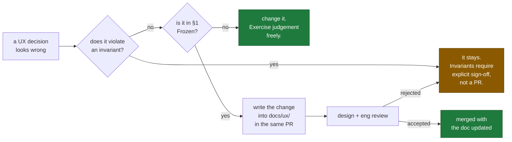

# UX Freeze

**Status:** PROPOSED — awaiting approval · **Phase:** 3.5 · **Date:** 2026-08-07

This document is the **single source of truth** for the CallScreen product
experience. Where anything else — a mockup, a screen, a comment, a
conversation — disagrees with this document or the UX documents it indexes, this
document wins and the other artefact is a bug.

It sits above [`docs/ux/`](docs/ux/README.md) exactly as
[`ARCHITECTURE_FREEZE.md`](ARCHITECTURE_FREEZE.md) sits above `docs/adr/`.

---

## 1 · What "frozen" means here

**Frozen.** The information architecture of each surface, the navigation graphs,
the screen inventory and identifiers, the twelve UX invariants, the interaction
language, the state taxonomy, the analytics naming scheme, and the security
posture of the interface.

**Not frozen.** Visual design, layout, copy wording, illustration, component
implementation, animation tuning within the token set, the order of rows inside
a settings list, and anything a designer or engineer should be exercising
judgement about in Phase 4.

**The distinction, concretely:**

| Frozen | Not frozen |
|---|---|
| Four tabs: Calls · Protection · Assistant · Settings | What the tab icons look like |
| `A21` is a full-screen takeover with no bottom nav | Where the transcript sits relative to the orb |
| Takeover has no confirmation (U3) | The button's label micro-copy |
| Every verdict renders its confidence (U4) | The badge's exact shape |
| Screen IDs `A20`, `C31`, `B34` | The screens' titles |
| The event naming scheme | Which optional dimensions an event carries |
| Break-glass is reason-required and time-boxed (U12) | The dialog's layout |
| Three surfaces never share navigation | How each surface's sidebar collapses |

---

## 2 · The surfaces

| # | Surface | Users | Screens | Documents |
|---|---|---|---|---|
| **1** | Android Consumer App | Subscribers | **76** | [`docs/ux/android/`](docs/ux/android/01-information-architecture.md) |
| **2** | Internal Operations Console | Support · Fraud · SRE · AI · Admin | **34** | [`docs/ux/console/`](docs/ux/console/01-ia-navigation-inventory.md) |
| **3** | Business Portal | Business administrators and members | **37** | [`docs/ux/business/`](docs/ux/business/01-ia-navigation-inventory.md) |

**147 screens across three surfaces**, sharing one design system
([`docs/design/`](docs/design/README.md)) and nothing else.

**Navigation never crosses a surface boundary.** No link from the app into the
console, no console view inside the portal, no shared shell. Merging their
navigation would merge their trust boundaries.

---

## 3 · UX invariants

The behavioural counterpart to
[`ARCHITECTURE_FREEZE.md §3`](ARCHITECTURE_FREEZE.md). **Violating one is a
defect regardless of what it achieves.** Full statements and rationale in
[`docs/ux/00-principles.md §0.3`](docs/ux/00-principles.md).

| # | Invariant | Gate |
|---|---|---|
| **U1** | Every blocking or degraded state states whether calls still ring normally | G4 |
| **U2** | Forwarding health is one tap from home; a broken configuration is never silent | G12 |
| **U3** | Takeover is one tap wherever a live screening is visible, with no confirmation | G1 |
| **U4** | Every model-generated string carries an `AiBadge`; every verdict carries its confidence | G1 |
| **U5** | The recording indicator is visible and assertively announced whenever recording, and is never suppressible | G1, G8 |
| **U6** | The transcript is complete and comprehensible without audio | G7 |
| **U7** | Emergency intent exits the AI flow immediately and hands over a dialer | G1 |
| **U8** | No surface implies the agent is listening, thinking or speaking unless it is | G1 |
| **U9** | Every consent has a visible state and one-tap withdrawal; no control collects two consents | G1 |
| **U10** | No caller-supplied string is ever rendered as interface chrome | G10 |
| **U11** | No personal data in any analytics event, crash report or log line | G9 |
| **U12** | The console reveals PII only through an audited, reason-required, time-boxed action | G1, G9 |

Gates are defined in
[`docs/ux/01-cross-surface-conventions.md §1.12`](docs/ux/01-cross-surface-conventions.md).

---

## 4 · Numbers that are fixed

| Metric | Value | Source |
|---|---|---|
| Android cold start to content | **≤ 500 ms** | Storyboard S1 |
| Loading indicator floor | **100 ms** | `07 §7.3` |
| Live transcript notification update rate | **1 Hz** | `01 §1.6` |
| Search debounce | **250 ms** | `01 §1.7` |
| Undo window | **5 s** | `01 §1.10` |
| Post-call summary auto-dismiss | **12 s**, never for a fraud verdict | `A27` |
| Takeover timeout | **8 s** | `A23` |
| Onboarding target | **≤ 3 min** | `F1` |
| Business setup target | **≤ 10 min** | `P1` |
| Console break-glass grant | **15 / 30 / 60 min**, expires in place | `C22` |
| Console session · idle timeout | **8 h · 30 min** | `C01` |
| Portal session · idle timeout | **12 h · 60 min** | `B01` |
| Webhook auto-disable | **24 h** of failure | `B72` |
| Paywall suppression | After **3** shows for one feature in 30 days | `A60` |
| Permission recovery banner | At most **once per feature per 30 days** | `01 §1.5` |
| Haptic budget | **< 20%** of interactions | `02 §2.10` |
| Product sounds | **Exactly 4** | `02 §2.9` |

---

## 5 · Where the architecture constrains the experience

Not preferences. Consequences of frozen ADRs, designed around rather than
against. Full table in [`docs/ux/README.md`](docs/ux/README.md).

| Architectural fact | Experience consequence |
|---|---|
| 5 s ring delay before forwarding (ADR-0002) | Screening always begins after a missed call. There is no "screen this?" prompt |
| Apps cannot access call audio (ADR-0002 §2) | The subscriber is a spectator with a barge-in control, not a participant. **And this limitation is stated to the user as the product's strongest trust claim** |
| Forwarding lapses (ADR-0002 §7, likelihood high) | Forwarding health is a destination with its own screen, banner, notification channel and recovery flow |
| Backend failure mode is "the phone rings" (ADR-0002 §6) | Invariant U1 |
| Audio off by default (ADR-0012) | The transcript is primary; audio is a conditional enhancement |
| Announcement is deterministic and model-free (I1) | Never editable, never skippable, never carries an `AiBadge`, always in the timeline |
| Caller speech is untrusted (I4) | Invariant U10; two-agent separation; routing never follows a caller's request |
| p50 900 ms / p95 1500 ms (ADR-0011) | Thinking is real, streaming is real, and > 2.5 s is treated as a fault |
| MSISDN identity, device-bound (ADR-0010) | No password exists anywhere in this product. Recovery is a device-trust flow |
| Kafka carries identifiers, not content (I7) | Erasure is achievable, so `A53d` can promise it — and webhooks default the same way |
| Degradation must fail safe (I11) | `A77` states degradation honestly; fraud scoring and safety are never presented as toggleable |

---

## 6 · Deliberate omissions

Recorded so they are not re-litigated or re-added by accident.

| Not built | Why |
|---|---|
| Dialer, contacts manager, voicemail inbox | Not a phone app. The system owns these |
| Home dashboard on Android | The Calls feed is the home |
| Weekly digest, streaks, badges, achievements | Engagement devices in a security tool (Principle 6) |
| Assistant persona — name, face, personality | We answer as the subscriber, not as a character |
| Social or community reputation layer | Invites brigading of legitimate numbers |
| Rating prompt | Never, and especially never after a screening |
| Global transcript search in the console | A surveillance capability |
| "Log in as" impersonation, any surface | The most-abused admin feature ever built |
| Live audio tap for operators | Invariant I9. It would be a wiretap |
| Per-member response-time leaderboards in the portal | A screen that reads as employee surveillance will be used as one |
| A full CRM | `B52` exports to a real one. Building half a CRM loses focus |
| Web push in the portal | An unrequested browser permission prompt |
| Paywall over a fraud verdict | The verdict is always free. We charge for depth, not for safety |

---

## 7 · Changing a frozen UX decision

The freeze is a **procedural gate**, not a prohibition.

**Rules.**

1. **A screen that contradicts a principle is wrong**, and the principle does
   not need re-justifying in review.
2. **An invariant violation is a blocking defect**, in the same class as a
   failing test.
3. **Documentation updates in the same pull request.** A UX document that
   outlives its screen is worse than no document.
4. **Screen identifiers are stable.** A screen may be renamed, redesigned or
   merged; its identifier persists in analytics, tests and bug reports.
5. **New surfaces inherit all twelve invariants.** A surface that cannot satisfy
   one needs a documented exception with an owner, not a quiet omission.
6. **Where a principle and a business goal conflict**, that is a product decision
   made explicitly and recorded — not resolved silently in a pull request.

---

## 8 · State of the work

| Aspect | Status |
|---|---|
| Principles and UX invariants | **Defined** — 10 principles, 12 invariants |
| Cross-surface conventions | **Defined** — loading, error, empty, offline, permissions, notifications, search, recovery, accessibility, analytics, security |
| Interaction language | **Defined** — orb, thinking, streaming, transcript, timeline, caller card, transfer, storyboard, sound, haptics, micro-interactions, conversation |
| Android IA · navigation · inventory | **Defined** — 4 sections, 76 screens |
| Android screen contracts | **Defined** — 13 attributes each |
| Android flows | **Defined** — 15 flows with failure branches |
| Android journey map | **Defined** — 7 stages, 4 situational personas |
| Console IA · navigation · inventory | **Defined** — 7 roles, 34 screens |
| Console screens, flows, journeys | **Defined** — 9 flows |
| Portal IA · navigation · inventory | **Defined** — 5 roles, 37 screens |
| Portal screens, flows, journeys | **Defined** — 10 flows |
| Verification gates | **Defined** — G1–G12 |
| Visual design | **Not started.** Phase 4 |
| Implementation | **Not started.** Phase 4 |

---

## 9 · Carried into Phase 4

Known, tracked, not silently ignored.

| # | Item | Owner |
|---|---|---|
| 1 | Copy is specified as intent and examples, not as final strings. A copy pass with an editor is required before implementation | Product / Design |
| 2 | Localisation: Hindi and one other Indic language at minimum, with Devanagari and Tamil fixtures. Copy length varies by up to 40% and layouts must be validated against it | Design / Eng |
| 3 | Illustration set for first-run empty states — the only place illustration is permitted | Design |
| 4 | The four product sounds must be designed and validated against the "distinguishable from another room" test | Design |
| 5 | Emergency-intent false-positive rate must be measured in `tests/eval` before `A72` ships. **Launch blocker** | AI |
| 6 | Per-carrier onboarding drop-off segmentation must exist before launch — it is the leading indicator for ADR-0002's 2% review trigger | Product / Telephony |
| 7 | Accessibility flows AF1–AF8 must be manually verified on a real device per release, not only by screenshot tests | QA |
| 8 | Console break-glass access review must have a named owner and a scheduled weekly slot before the console has any production access | Security |
| 9 | Business Portal is scoped for launch but is not on the critical path for the consumer launch; sequencing is a product decision | Product |
| 10 | The analytics event catalogue must be generated from, and validated against, `annotations.proto` — Gate G9 is not achievable by review alone | Data / Eng |

---

## 10 · Sign-off

| Aspect | Status |
|---|---|
| UX principles and invariants | **Proposed** |
| Three surface architectures | **Proposed** |
| 147 screen contracts | **Proposed** |
| 34 user flows | **Proposed** |
| Journey maps | **Proposed** |
| Verification gates | **Proposed** |
| Approval | **Pending** |

**This document is proposed, not frozen.** It becomes frozen on approval, and
from that point every pull request touching the experience is measured against
it. A change that contradicts it is either wrong, or it is an amendment under
§7 — and it must say which.
