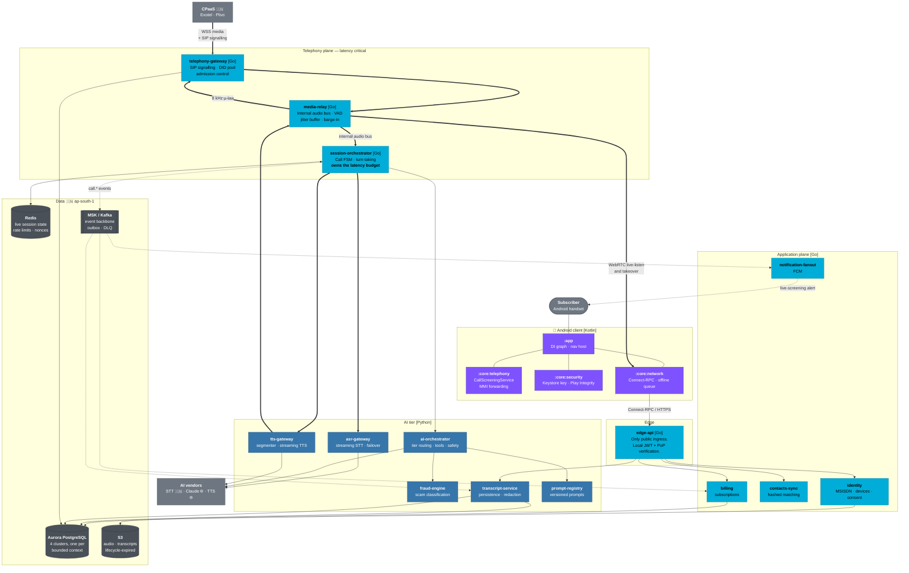

# C4 Level 2 — Containers

The deployable pieces and how they connect.

**Source ADRs:** 0004 (media), 0005–0007 (AI tier), 0008 (cloud), 0009 (data),
0010 (identity), 0011 (latency).

---

## Diagram

---

## Why the split is where it is

**Go for the telephony plane, Python for the AI tier.** This is not a taste
decision. The telephony plane holds thousands of long-lived stateful connections
under a hard latency budget with strict shutdown semantics — Go's concurrency and
memory profile fit that exactly. The AI tier is vendor-SDK-shaped, streaming, and
evolves fastest; Python is where those SDKs live and where the eval tooling is.

**`session-orchestrator` owns the latency budget.** It is the only service that
sees a whole turn end to end, so it is the only place the budget in ADR-0011 can
be enforced and attributed. It is also the reason the AI services do not call
each other directly — a mesh of AI-to-AI calls would make the budget
unattributable.

**`edge-api` is the only public ingress.** Everything else is in private subnets
(ADR-0008 §10). The one deliberate exception is the CPaaS media WebSocket into
`telephony-gateway`, which is authenticated and rate-limited (ADR-0002 §10).

**Kafka is off the hot path entirely.** Every dashed arrow in the diagram happens
after the turn or after the call. A producer that blocked a turn on a broker
acknowledgement would be a bug — which is why the transactional outbox exists
(ADR-0009 §5).

---

## Containers at a glance

| Container | Lang | Shape | On the latency budget? |
|---|---|---|---|
| `edge-api` | Go | Request/response | No |
| `telephony-gateway` | Go | Long-lived sessions | **Yes** — hops 2, 10 |
| `media-relay` | Go | Long-lived streams | **Yes** — hops 1, 3, 9 |
| `session-orchestrator` | Go | Stateful FSM | **Yes** — hop 5, owns the total |
| `asr-gateway` | Python | Streaming proxy | **Yes** — hop 4 |
| `ai-orchestrator` | Python | Streaming | **Yes** — hops 5, 6, 7 |
| `tts-gateway` | Python | Streaming | **Yes** — hop 8 |
| `fraud-engine` | Python | Request/response | Overlapped |
| `transcript-service` | Python | Event consumer | No |
| `prompt-registry` | Python | Request/response, cached | No |
| `identity` | Go | Request/response | No — auth is off the call path |
| `contacts-sync` | Go | Batch + request | No |
| `notification-fanout` | Go | Event consumer | No |
| `billing` | Go | Request/response | No |

Six of fourteen services are on the budget. The other eight can be slow without a
caller noticing — a distinction that should govern where optimisation effort goes.

---

## Two properties worth stating explicitly

**Auth is not on the call path.** A screened call is triggered by the carrier, not
by an authenticated client request. `identity` never appears in the voice
pipeline, and ADR-0011's budget contains no auth hop. This is deliberate: it means
an `identity` outage degrades app functionality without stopping call screening.

**The Android client is a thin shell over `core` modules.** `:app` holds the DI
graph, the nav host and the manifest, and nothing else. `:core:telephony` is the
only module that touches `CallScreeningService` and the MMI forwarding codes —
the two most dangerous surfaces in the client — and it is owned by both the
Android and telephony teams in CODEOWNERS.
