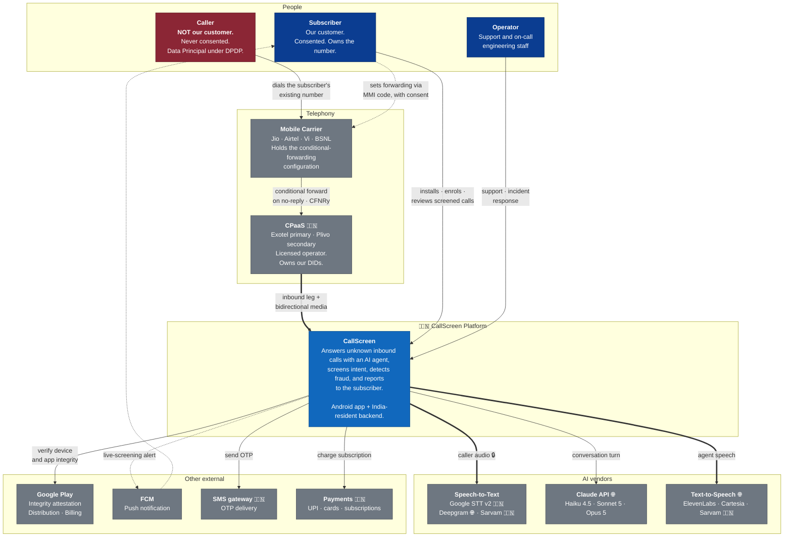

# C4 Level 1 — System Context

Who uses CallScreen, and what does it depend on.

**Source ADRs:** 0002 (telephony), 0003 (carrier), 0005–0007 (AI vendors),
0010 (identity), 0012 (privacy).

---

## Diagram

---

## The asymmetry that defines this system

The two humans in this diagram have completely different relationships with us,
and almost every non-obvious design decision follows from the gap between them.

| | Subscriber | Caller |
|---|---|---|
| Relationship | Customer | **None** |
| Consent | Explicit, layered, revocable | **Announcement + continuing the call** |
| Knows the platform exists | Yes | Only from the announcement |
| Data we hold | Account, devices, call history | **Voice, number, an AI's fraud judgement** |
| Rights under DPDP | Full | **Full — identical** |
| Can complain to the Board | Yes | **Yes** |

The caller is shown in red above because they are the party we are most likely to
harm and least likely to hear from. ADR-0012 exists primarily for them.

---

## Why the call path looks like a detour

The caller dials the subscriber's number. The call reaches the **carrier**, not
us. Only when the handset does not answer within the ring window does the
carrier forward it to a DID we control at the CPaaS — and only then do we see it
at all.

This is not a design preference. Android does not expose call audio to
third-party applications under any API level, permission, or role (ADR-0002 §2).
Carrier-side forwarding is the only mechanism by which an AI can converse with a
caller on a stock handset.

Two consequences visible in the diagram:

- **The subscriber configures their own carrier**, via an MMI code dialled with
  their consent. We never touch their carrier account.
- **Our failure mode is "the phone rings normally."** If the platform is
  unreachable, forwarding fails and the call completes as it always did.

---

## Residency at a glance

| Marker | Meaning |
|---|---|
| 🇮🇳 | Inside the India residency boundary. Default for all personal data. |
| 🌐 | Outside it. Permitted **only** under the consent-gated, audited exception in ADR-0012 §5.4. |

Claude and the default TTS providers sit outside the boundary today. Eliminating
that — by promoting in-country providers once they reach quality parity — is a
tracked Phase-2 goal (ADR-0012 §14), not a permanent accommodation.
