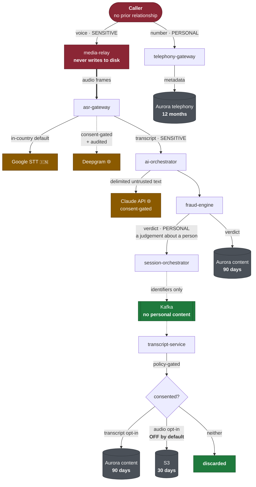
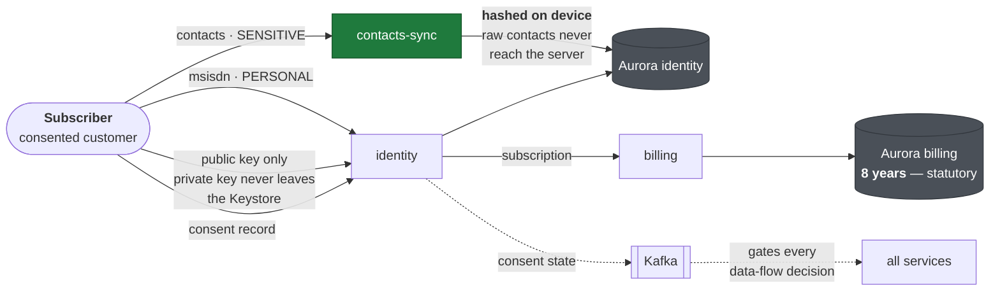
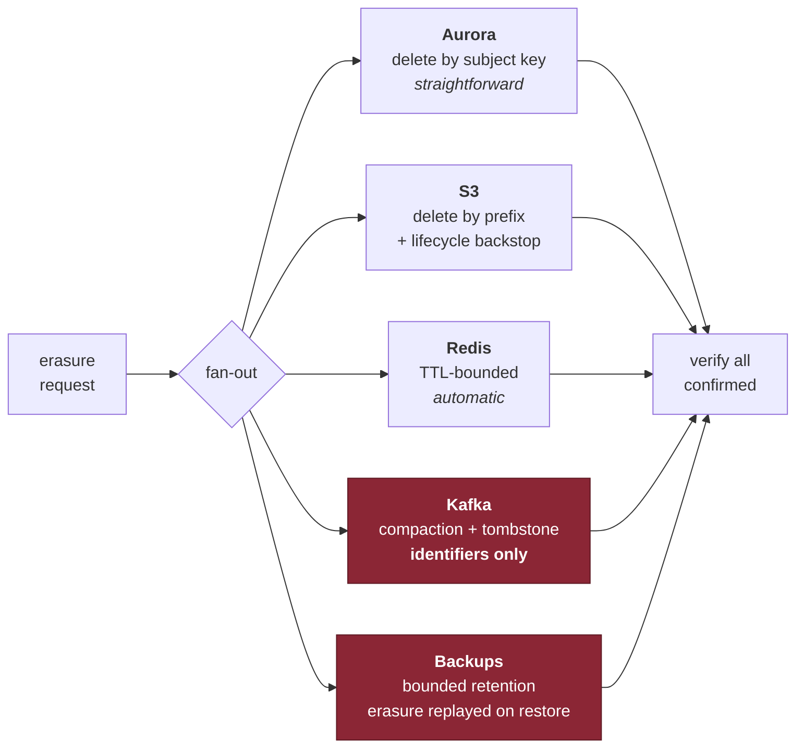
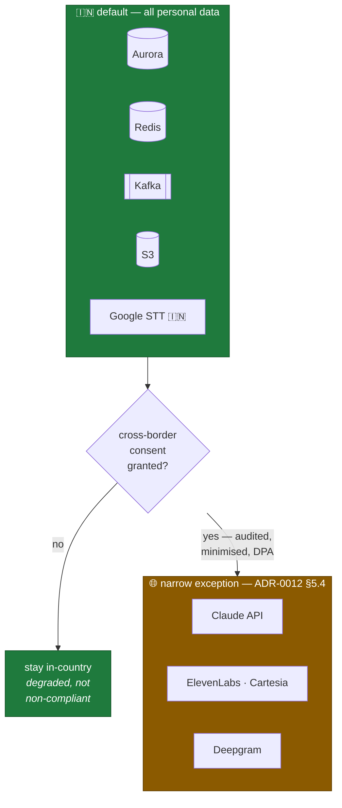

# Data Flow

Where personal data goes, under what classification, and for how long.

**Source ADRs:** 0009 (stores), 0012 (classification, retention, residency).
**Enforcement:** `contracts/proto/callscreen/common/v1/annotations.proto`.

---

## Classification

Every field in every contract carries a classification. **An unclassified field
fails closed** — it is treated as `PERSONAL`. That default is the most important
line in the annotations file.

| Class | Logging | At rest | Example |
|---|---|---|---|
| `PUBLIC` | Verbatim | Plain | Region code, duration |
| `INTERNAL` | Verbatim | Plain | Shard id, service name |
| `PERSONAL` | **Keyed HMAC** | Encrypted | Phone number, device id, IP |
| `SENSITIVE` | **Keyed HMAC** | Encrypted + access-audited | **Call audio, transcript, contacts** |
| `SECRET` | **Never** | Never persisted plain | Tokens, attestation nonces |

Classification is not documentation. It drives log redaction, retention jobs,
egress policy and analytics exclusion **automatically**, in the platform
libraries — so privacy is a property of the system rather than a discipline
engineers must remember.

---

## Flow of caller data

The caller never consented to us. Their data is the most sensitive thing in the
system.

**Three properties to notice.**

`media-relay` **never writes audio to disk**, regardless of consent. Persistence
is an explicit, policy-gated action by `transcript-service` — never a side effect
of relaying (ADR-0004 §10).

**Audio recording is off by default.** Both the subscriber's opt-in and the
caller having heard the announcement are required. Either absent, no audio is
persisted.

**Kafka carries identifiers, not content.** This is not a style preference — you
cannot delete a single record from a Kafka topic, so putting personal data there
would make erasure impossible. It constrains every event schema we will ever
write (ADR-0009 §10).

---

## Flow of subscriber data

**Contacts are hashed on the device.** The server never receives a raw contact
list — matching happens against hashes. This is the largest single data-minimisation
decision in the client, and it means a breach of `contacts-sync` does not disclose
anybody's address book.

**Consent state is an event, not a periodic refresh.** A revocation must take
effect within one call, which is why it propagates over Kafka rather than being
polled (ADR-0012 §9).

---

## Retention

| Data | Class | Default | User range | Basis |
|---|---|---:|---|---|
| Call audio | `SENSITIVE` | **30 d** | 7–90 d | Consent |
| Transcript | `SENSITIVE` | **90 d** | 7–180 d | Consent |
| Fraud verdict | `PERSONAL` | 90 d | Fixed | Legitimate use |
| Call metadata | `PERSONAL` | 12 mo | Fixed | Service provision |
| Consent records | `PERSONAL` | Account + 3 y | Fixed | Legal obligation |
| Audit logs | `PERSONAL` | `LEGAL_HOLD` | Fixed | Security |
| Billing | `PERSONAL` | 8 y | Fixed | Companies Act |
| Telemetry | `INTERNAL` | 30 d | Fixed | Operations |

Enforced by **S3 lifecycle rules and a scheduled deletion job driven by the
`Retention` annotation** — not by a hand-maintained list, which would drift within
a sprint.

Shorter retention is both cheaper and more compliant. That alignment is rare and
should be exploited.

---

## Erasure across five stores

The two red boxes are where erasure programmes actually fail. **Kafka** cannot
delete a record, so the schema constraint above is the only mitigation.
**Backups** are routinely forgotten, and a deleted subject reappearing from a
restore is a compliance failure.

Erasure is a **rehearsed runbook tested per release**, not an assumption.

---

## Residency

Four conditions, all required, for any cross-border call: subscriber consent, an
audit-trail entry naming the vendor and basis, a DPA prohibiting retention and
training, and a minimised payload.

Enforced in the **provider port**, not at the call site — a residency decision
made implicitly by a load balancer is a compliance failure.

**Eliminating this exception entirely** by promoting in-country ASR and TTS once
they reach quality parity is a tracked Phase-2 goal (ADR-0012 §14), not a
permanent accommodation.
