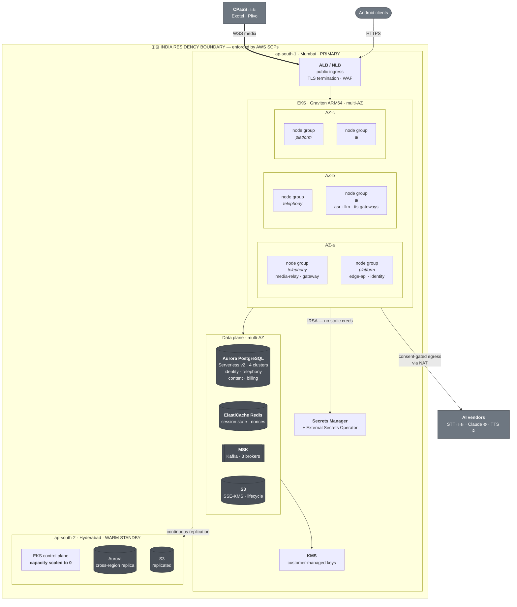

# Deployment

Where the containers physically run.

**Source ADRs:** 0008 (cloud, regions, DR), 0009 (data stores), 0012 (residency).

---

## Diagram

---

## Region posture

| | `ap-south-1` Mumbai | `ap-south-2` Hyderabad |
|---|---|---|
| Role | Primary — all production traffic | Warm standby |
| EKS | Full capacity, multi-AZ | Control plane up, **workloads at zero** |
| Aurora | Writer + readers | Cross-region replica |
| S3 | Primary | Replicated |
| MSK | 3 brokers | Rebuilt on failover |
| Cost | Full | Replication + control plane only |

**RTO is minutes, not seconds, and that is the deliberate choice.** Active-active
across two Indian regions would be faster and roughly doubles the bill for a
product that has not yet proven demand (ADR-0008 §7).

`ap-south-2` is a smaller region with a narrower service catalogue. The DR plan is
validated against **what actually exists there**, not against Mumbai's catalogue —
and re-validated at every quarterly game day.

---

## Node group separation

Three workload classes, deliberately not co-scheduled:

| Group | Runs | Why separate |
|---|---|---|
| `telephony` | `media-relay`, `telephony-gateway`, `session-orchestrator` | **Long-lived stateful sessions.** Needs long termination grace and PDBs sized so a rolling replacement cannot take out media capacity. A noisy neighbour here drops live calls. |
| `ai` | `asr-gateway`, `ai-orchestrator`, `tts-gateway`, `fraud-engine` | Network-bound streaming with vendor-shaped burstiness. Scales on a different signal. |
| `platform` | `edge-api`, `identity`, `billing`, `contacts-sync`, `notification-fanout` | Ordinary request/response. Cheapest to scale, safe to evict. |

**Graviton ARM64 by default** across all three; x86 only where a dependency
forces it, which is rare with Go and Python.

---

## The deployment property that matters most

**Draining, not terminating.**

A pod running `media-relay` holds live phone calls. Killing it drops them. The
whole deployment configuration for the `telephony` group exists to prevent that:

- **Termination grace period exceeds the longest expected screening session.**
- **Readiness goes false before the listener closes** — the graceful-shutdown
  sequence implemented in `packages/go/platform` and `packages/python/platform`.
- **PodDisruptionBudgets sized against peak concurrency**, not against replica
  count.
- **Cluster autoscaler headroom is pre-provisioned.** A call cannot wait for a
  node to boot, so capacity exists before the call arrives — which means running
  the hot path at deliberately low utilisation (ADR-0011 §13).

Autoscaling on CPU is wrong here. A media relay at 30% CPU can be at its
connection limit; HPA metrics are connection- and session-based.

---

## Residency enforcement

Three independent layers, because a single control that depends on people
remembering is not a control:

1. **Service Control Policies** deny resource creation outside approved Indian
   regions. Technical, account-wide, not bypassable by a deploy.
2. **Conftest / OPA policy in CI** (`infra/policy`) fails a Terraform plan that
   references a non-approved region.
3. **Schema-level classification** — the `residency_bound` annotation drives
   egress policy in the platform HTTP clients, so a cross-border call is refused
   at the library rather than discovered in an audit.

The single 🌐 egress path — Claude and the default TTS providers — is
consent-gated per subscriber, minimised in payload, and written to the audit
trail with the vendor and basis (ADR-0012 §5.4).

---

## Environments

| Environment | Region | Data | Purpose |
|---|---|---|---|
| `dev` | `ap-south-1` | Synthetic only | Integration |
| `staging` | `ap-south-1` | Synthetic only | Pre-production; same R8/minification as prod |
| `prod-in` | `ap-south-1` + `ap-south-2` | **Real personal data** | Production |
| `prod-global` | — | — | **Scaffold only.** Empty until international expansion. |

`prod-global` exists in the Terraform tree and stays empty. A half-configured
second residency boundary is worse than none — expansion gets its own analysis
(ADR-0008 §14, ADR-0012 §14), not an extension of `prod-in`.
