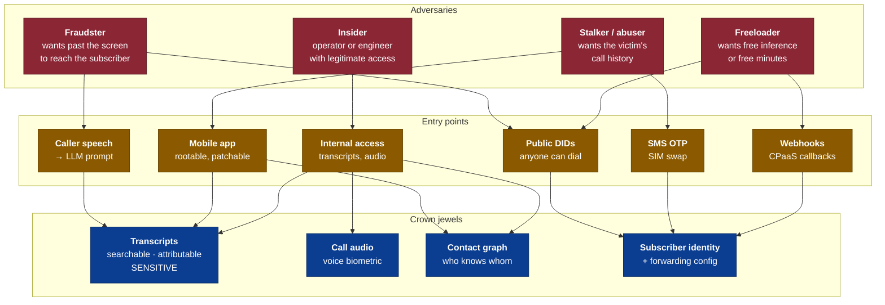
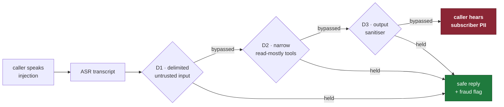
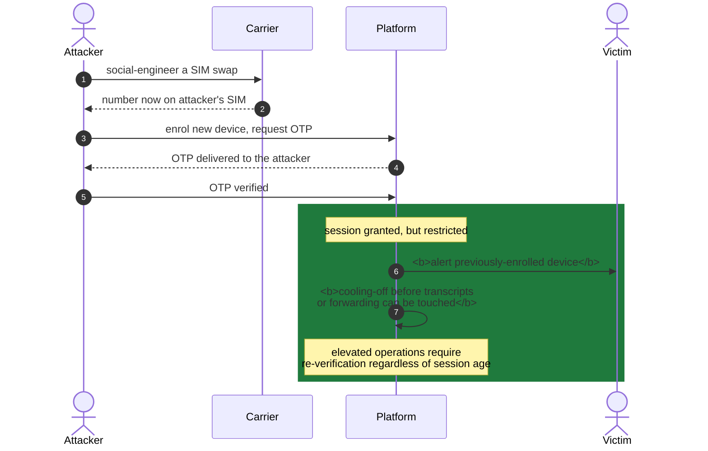

# Threat Model

What can go wrong deliberately, and what stops it.

**Method:** STRIDE per trust boundary, using the zones in
[trust-boundaries.md](trust-boundaries.md).
**Source ADRs:** 0002, 0004, 0006, 0010, 0012.

---

## Attack surface

**The stalker is the adversary this product must take most seriously.** A call
screening assistant holds a complete record of who contacts someone and when.
In an intimate-partner abuse scenario, that is a targeting tool. Every control
around account takeover exists primarily for this threat, not for financial
fraud.

---

## STRIDE by boundary

### B2 · CPaaS → `telephony-gateway`

| | Threat | Control |
|---|---|---|
| **S** | Attacker dials a DID directly, impersonating a forwarded call | **Diversion-header validation** — undiverted inbound is refused as hostile |
| **T** | Caller-supplied diversion header spoofs another subscriber | Contractual + tested guarantee that the CPaaS does not pass through caller-supplied values |
| **R** | Provider denies a call occurred | Call records in `telephony`; provider CDR reconciliation |
| **I** | Attacker enumerates DIDs to map subscribers | DIDs are non-sequential; quarantine before reuse; enumeration rate-limited |
| **D** | Toll fraud — mass-dial DIDs to exhaust minutes and inference | **Admission control** + per-DID and per-source rate limits + anomaly alerting |
| **E** | — | Gateway holds no subscriber-scoped privilege |

**Toll fraud is the highest-likelihood attack on this platform.** A publicly
dialable number attached to an expensive AI pipeline is an obvious target, and it
costs the attacker almost nothing to try.

### B3 · App → `edge-api`

| | Threat | Control |
|---|---|---|
| **S** | Stolen token replayed from another device | **Proof-of-possession** — token inert without the non-exportable Keystore key |
| **T** | Modified APK bypasses client checks | Play Integrity at issuance; server-side authorisation never trusts the client |
| **R** | Subscriber denies changing forwarding | Audit log with `LEGAL_HOLD` retention |
| **I** | IDOR — read another subscriber's transcripts | Per-subject authorisation on every access; subject key from the token, never the request |
| **D** | OTP flooding | Rate limits per number, per device, per source |
| **E** | Restricted-tier session escalates to full | Tier encoded in the token; re-verification for elevated operations |

### B6 · Service → AI vendor

| | Threat | Control |
|---|---|---|
| **S** | Vendor endpoint impersonated | TLS + pinned vendor certificates |
| **T** | **Prompt injection via caller speech** | Delimited untrusted input; narrow read-mostly tools; output sanitiser |
| **R** | Vendor denies receiving a request | Request ids logged; audit trail names vendor and basis |
| **I** | **Cross-border transfer without consent** | Consent gate **in the provider port**, not at the call site |
| **D** | Vendor quota exhausted by an attacker | Admission control upstream; per-subscriber inference budgets |
| **E** | Injection causes a tool call disclosing PII | Tools are read-mostly and narrowly scoped; none can disclose subscriber PII to a caller |

---

## The five threats that matter most

### 1 · Prompt injection → data disclosure over the phone

Three independent defences because any one can fail. **D2 is the load-bearing
one**: even a fully successful injection reaches no tool capable of disclosing
subscriber PII to a caller. Injection resistance is a **gated metric** in
`tests/eval`, not an aspiration.

### 2 · SIM swap → account takeover

The classic attack against phone-number identity, and the one the stalker
adversary will use.

An attacker who swaps a SIM gets an authenticated session — but **not immediate
access to call history**, and the legitimate subscriber is notified on their old
device immediately. The cooling-off window is what converts a silent takeover
into a detected one.

This is also the sharpest trade-off in ADR-0010: hardware-bound keys mean a
genuine handset change requires re-enrolment, which exercises exactly this
surface at the moment it is most dangerous.

### 3 · Toll fraud

Highest likelihood, purely financial. Mass-dialling public DIDs to burn carrier
minutes and inference spend. Controlled by admission control before `media-relay`
is ever reached, per-DID and per-source rate limits, and anomaly alerting on
per-DID call volume.

### 4 · Insider access to transcripts

The threat with the worst consequences and the least technical sophistication.
An operator with legitimate support access reading a subscriber's call history.

Controls: **individual access auditing** on every `SENSITIVE` record — not
sampled; least-privilege scoped to a support ticket; no bulk export path;
`LEGAL_HOLD` retention on the audit trail; and separation of key policy from
data-plane IAM so a compromised service role cannot rewrite its own access.

### 5 · Silent tool-call failure

Not an attacker — a **latency optimisation** that looks harmless.

Disabling model thinking to save time on hop 6 causes the model to occasionally
write a tool call into visible text rather than emitting a `tool_use` block. The
turn succeeds, no error is raised, **the tool never runs**, and the reply is
spoken to the caller with the tool output missing (ADR-0006 §2).

It is in the threat model because it is invisible: nothing fails, nothing alerts,
and it is discovered by users rather than by us. The control is architectural —
thinking stays enabled on tool-calling tiers, and `effort` is the latency lever
instead.

---

## Timing side channels

Response latency that varies with whether a caller is on a block list, or whether
fraud scoring escalated, **discloses that state to the caller**, who can probe it.

Tier-0 and Tier-1 paths are timing-normalised where the difference would reveal a
security decision (ADR-0011 §10). This is a real attack — a fraudster who learns
they are flagged simply calls from a different number.

---

## Residual risks

Accepted, not solved. Each is tracked in its ADR.

| Risk | Why accepted | Tracked |
|---|---|---|
| **SMS OTP is interceptable and phishable** | Only universally-available verification in this market | ADR-0010 §15 |
| **Caller ID is spoofable** | PSTN has no authentication; we cannot fix the network | ADR-0002 §15 |
| **CPaaS is inside the audio trust boundary** | We are not a licensed operator | ADR-0003 §15 |
| **Cross-border AI processing** | Latency budget requires it until in-country parity | ADR-0012 §5.4 |
| **Kafka cannot delete a record** | Mitigated by identifiers-not-content, never eliminated | ADR-0009 §10 |
| **Play Integrity unavailable on some devices** | Restricted tier rather than exclusion | ADR-0010 §15 |

---

## Review

This model is reviewed when:

- Any trust boundary in [trust-boundaries.md](trust-boundaries.md) changes
- A new external integration is added
- **After any security or privacy incident** — the model is part of the
  post-incident process, not only the code
- At each `/security-review` on a change touching `core/security`, `identity`,
  `telephony-gateway`, or `ai-orchestrator`
- Annually at minimum
