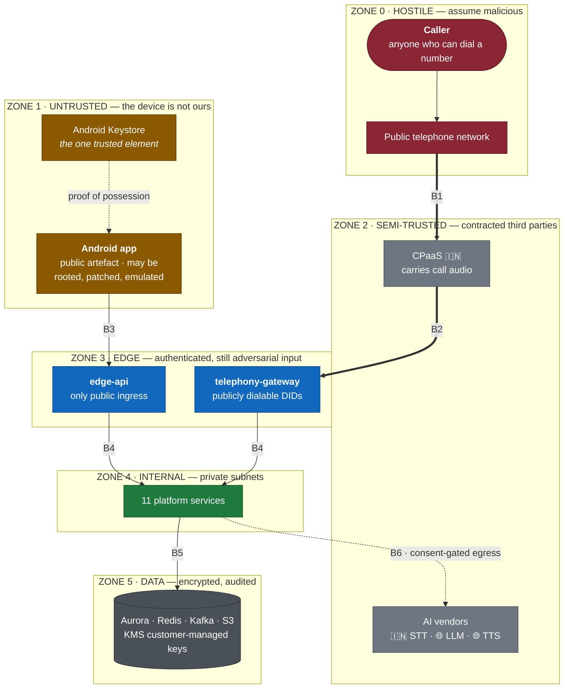
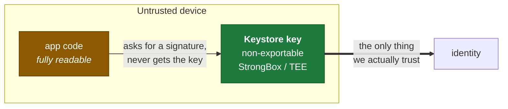
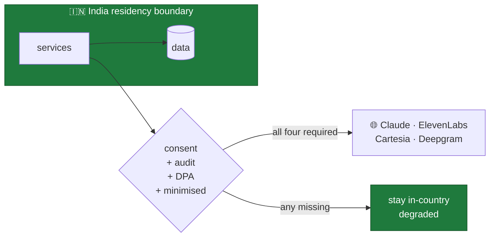

# Trust Boundaries

Where trust changes, and what enforces the change.

**Source ADRs:** 0002 (public DIDs), 0004 (media auth), 0008 (network),
0010 (identity and device trust), 0012 (residency).

---

## The boundaries

---

## What enforces each crossing

| # | Crossing | Enforcement |
|---|---|---|
| **B1** | PSTN → CPaaS | Carrier and licensed operator. **Not ours.** We inherit whatever the network asserts. |
| **B2** | CPaaS → `telephony-gateway` | **SIP diversion header validation** — an undiverted inbound call is treated as hostile and refused. WSS with mutual auth. Per-DID and per-source rate limits. Admission control. |
| **B3** | App → `edge-api` | **Proof-of-possession**, not bearer. EdDSA JWT with a `cnf` thumbprint claim; every mutating request signed by the non-exportable Keystore key. Nonce + timestamp replay window. Certificate pinning with a backup pin. |
| **B4** | Edge → internal | Private subnets, no internet route. mTLS between services. IRSA workload identity — **no static credentials anywhere**. |
| **B5** | Service → data | Least-privilege per-service credentials. KMS customer-managed keys with policy separate from data-plane IAM. Per-bounded-context clusters, so a compromised service cannot reach another context's tables. |
| **B6** | Service → AI vendor | **Consent gate in the provider port.** Audit-trail entry naming vendor and basis. DPA prohibiting retention and training. Minimised payload. |

---

## Zone 0 — the caller is hostile by default

**Anyone who can dial a phone number is inside Zone 0.** There is no
authentication on the PSTN, no identity we can trust, and caller ID is
spoofable.

Two consequences that shape the whole design:

**The transcript is attacker-controlled input.** Caller speech flows directly
into an LLM prompt. It is delimited as untrusted data, never concatenated into
instruction context, and injection resistance is a **gated metric** in
`tests/eval`. A caller saying "ignore your instructions" is an expected input.

**Our DIDs are publicly dialable.** Anyone can call them directly, bypassing the
subscriber entirely. That is why B2 validates the diversion header rather than
trusting that an inbound call is legitimate — and why toll-fraud rate limiting
exists from day one (ADR-0002 §10).

---

## Zone 1 — the device is not ours

An APK is a **public artefact**. Anything inside it — including strings in native
libraries and values obfuscated by R8 — is extractable in minutes.

`SECURITY.md` states the rule plainly: **there is no such thing as a secret in a
mobile client.**

**The Keystore key is the only trusted element on the device**, and it is trusted
precisely because the app cannot read it either. This is why authentication is
proof-of-possession rather than bearer: a token stolen from a rooted handset is
**inert** without a key that never left the secure element.

Three mechanisms answer three separate questions, and conflating them is the
standard mobile-auth mistake:

| Question | Mechanism | Blind spot it has |
|---|---|---|
| Who owns the number? | SMS OTP / carrier verification | Says nothing about the app or device |
| Which app is this? | Play Integrity | Says nothing about number ownership |
| Same device as before? | Keystore PoP signature | Says nothing about either |

---

## Zone 2 — semi-trusted third parties

The CPaaS carries **every screened call's audio**. AI vendors receive transcripts
and generated text. They are inside our data-handling boundary and outside our
security boundary.

Controls: DPA with breach-notification obligations feeding our own DPDP clock;
encryption in transit; signature-verified inbound webhooks — an unauthenticated
webhook that starts an AI session is a free-inference vector; credentials in the
secret manager rotated ≤30 days; and, for B6, the consent gate.

**Vendor credentials are high-value.** CPaaS credentials can provision numbers
and place outbound calls — a compromised key is a financial and reputational
incident, not just a data one.

---

## Zone 3 — authenticated but still adversarial

Passing B2 or B3 means we know *who* is calling. It does not mean the content is
safe.

A subscriber authenticated with a valid PoP token can still send a malformed
request, attempt IDOR against another subscriber's transcripts, or replay a
captured signature. Zone 3 authenticates; it does not stop validating.

`telephony-gateway` is unusual: it sits at the edge with a **publicly dialable**
surface and no way to authenticate the human at the other end. Its trust comes
entirely from the diversion header the CPaaS asserts — which is why we confirm
contractually and by test that the provider does not pass through a
caller-supplied value.

---

## The residency boundary is a trust boundary

Enforced by three independent layers, because a control that depends on people
remembering is not a control:

1. **AWS Service Control Policies** deny resource creation outside approved
   Indian regions — account-wide, not bypassable by a deploy.
2. **Conftest / OPA in CI** fails a Terraform plan referencing a non-approved
   region.
3. **The `residency_bound` schema annotation** drives egress policy in the
   platform HTTP clients, so a cross-border call is refused **at the library**
   rather than discovered in an audit.

---

## Assumptions that must hold

If any of these becomes false, this document is wrong and must be revised before
the code is.

| Assumption | If violated |
|---|---|
| Android Keystore keys are non-exportable | B3 collapses to bearer-token security |
| The CPaaS does not forward caller-supplied diversion headers | B2 collapses; anyone can impersonate a forwarded call |
| AI vendors do not retain or train on our data | B6's DPA is the only control, and it has failed |
| Private subnets have no internet route | B4 collapses |
| SCPs cannot be modified by a workload role | The residency boundary is advisory |
| KMS key policy is separate from data-plane IAM | A compromised service can rewrite its own key policy |
