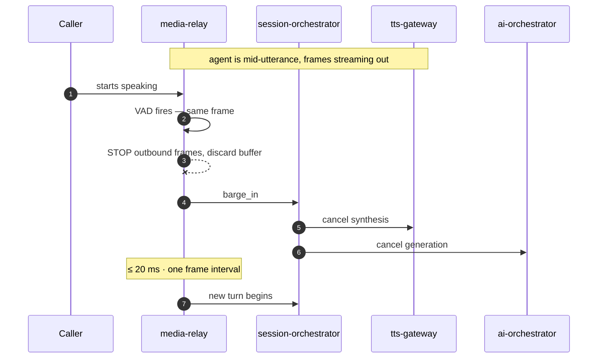
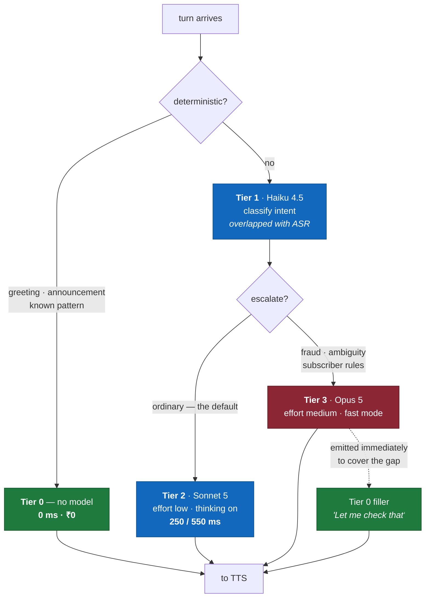

# Voice Pipeline

How caller audio becomes an agent reply, inside the latency budget.

**Source ADRs:** 0004 (media), 0005 (STT), 0006 (LLM), 0007 (TTS),
0011 (latency budget — this diagram is that budget rendered).

---

## The pipeline

```mermaid
flowchart LR
    CALLER(["<b>Caller</b>"])

    subgraph ingress["Ingress"]
        direction TB
        C1["<b>1 · Endpointing</b><br/>VAD silence window<br/><b>250 / 350 ms</b><br/><i>media-relay</i>"]
        C2["<b>2 · Carrier hop</b><br/>trailing frames<br/><b>25 / 60 ms</b><br/><i>telephony-gateway</i>"]
        C3["<b>3 · Relay ingress</b><br/>jitter · resample<br/><b>15 / 35 ms</b><br/><i>media-relay</i>"]
    end

    subgraph understand["Understand"]
        direction TB
        C4["<b>4 · STT final</b><br/>after end-of-speech<br/><b>120 / 250 ms</b><br/><i>asr-gateway</i>"]
        C5["<b>5 · Orchestration</b><br/>route · tools · prompt<br/><b>20 / 60 ms</b><br/><i>orchestrator</i>"]
    end

    subgraph generate["Generate"]
        direction TB
        C6["<b>6 · LLM TTFT</b><br/>Sonnet 5 · effort low<br/><b>250 / 550 ms</b><br/><i>ai-orchestrator</i>"]
        C7["<b>7 · Segment</b><br/>first speakable clause<br/><b>15 / 40 ms</b><br/><i>ai-orchestrator</i>"]
        C8["<b>8 · TTS TTFB</b><br/>streaming synthesis<br/><b>90 / 180 ms</b><br/><i>tts-gateway</i>"]
    end

    subgraph egress["Egress"]
        direction TB
        C9["<b>9 · Relay egress</b><br/>frame · 8 kHz µ-law<br/><b>15 / 35 ms</b><br/><i>media-relay</i>"]
        C10["<b>10 · Carrier hop</b><br/><b>25 / 60 ms</b><br/><i>telephony-gateway</i>"]
        C11["<b>11 · Playback</b><br/>handset jitter buffer<br/><b>60 / 100 ms</b><br/><i>not ours</i>"]
    end

    CALLER ==>|"speech"| C1
    C1 ==> C2 ==> C3 ==> C4 ==> C5 ==> C6 ==> C7 ==> C8 ==> C9 ==> C10 ==> C11
    C11 ==>|"agent reply"| CALLER

    classDef ours fill:#1168BD,stroke:#0b4c8c,color:#fff
    classDef vendor fill:#8B5A00,stroke:#5e3d00,color:#fff
    classDef notours fill:#6E7781,stroke:#4a5058,color:#fff
    class C1,C3,C5,C7,C9 ours
    class C4,C6,C8 vendor
    class C2,C10,C11 notours
```

**Legend** — blue: our code · amber: vendor call · grey: outside our control.
Values are **p50 / p95** in milliseconds.

---

## Targets

| Metric | Target |
|---|---|
| **p50** | **≤ 900 ms** |
| **p95** | **≤ 1 500 ms** |
| **p99** | **≤ 2 500 ms** — hard ceiling |
| **Barge-in** | **≤ 20 ms** — one frame interval |
| Serial sum of hops | 885 / 1 720 ms — pessimistic bound, **not** the target |

The p95 target is **below** the sum of per-hop p95s. That is not arithmetic
sleight of hand: the p95 of a sum is not the sum of the p95s, because hops rarely
have their bad day simultaneously. ADR-0011 §5.3 sets this out in full.

---

## The two overlaps that make the budget close

Without these, the pipeline is serial and misses the budget by roughly 400 ms.

```mermaid
gantt
    title A typical turn — where hops overlap
    dateFormat X
    axisFormat %Lms

    section Caller
    speaking                     :done, sp, 0, 400

    section Ingress
    1 endpointing window         :active, ep, 400, 250

    section Understand
    STT partials streaming       :crit, pa, 100, 550
    4 STT finalisation           :f4, 650, 120
    5 routing + prompt  OVERLAPPED :done, f5, 500, 150

    section Generate
    6 LLM first token            :f6, 770, 250
    LLM still generating         :g6, 1020, 300
    7 first clause               :f7, 1020, 15
    8 TTS first byte  OVERLAPPED :f8, 1035, 90

    section Egress
    9-11 egress + playback       :f9, 1125, 100

    section Result
    caller hears reply           :milestone, m1, 1225, 0
```

**Overlap A — understanding runs while the caller is still talking.** Interim ASR
results stream continuously (ADR-0005 §12), so Tier-1 classification, tool
pre-checks and prompt assembly are usually *finished* before the endpointing
window even closes. On a typical turn hop 5 contributes approximately zero.

**Overlap B — speech starts before generation finishes.** TTS begins synthesising
the first clause while the LLM is still producing the rest (ADR-0007 §5). We wait
for the first *clause*, never the first *response*.

**Any change that serialises these breaks the budget** regardless of how fast the
individual components get. `tests/eval` asserts the overlap, and hop 5's measured
contribution is monitored as the regression signal.

---

## Barge-in

The caller interrupts. Everything must stop within one 20 ms frame.

Two invariants make this work:

- **No queue between VAD and the output writer.** A buffer between them is added
  interruption latency, and it is the most common way this is implemented wrongly.
- **The frame writer checks cancellation before every write**, so a cancel cannot
  lose a race with an in-flight frame.

Cancelled synthesis is often still billed (ADR-0007 §11). That is an accepted cost
of responsiveness, bounded by segmenting at clause rather than paragraph
granularity.

---

## Tier routing

Not every turn costs the same, and the first one costs nothing.

**Tier 0 answers the opening utterance**, which is also the DPDP announcement
(ADR-0012 §5.1). That single decision removes the LLM from the most
latency-visible moment of the call, makes the announcement immune to prompt
injection, and covers pipeline warm-up while connections establish.

**Tier 3 exceeds hop 6's allocation and is masked, not optimised.** A short filler
utterance from Tier 0 is emitted the instant escalation is chosen, so the caller
hears a response inside the normal budget while the escalated turn generates
behind it. Filler is a latency mechanism governed by ADR-0011 §5.4 — confined to
escalation, and its rate is monitored so it cannot quietly become a way to hide
ordinary slowness.

---

## What must never be traded for latency

The most tempting optimisation in this pipeline is disabling model thinking to
save hop 6. **It silently breaks tool calling** — the model occasionally writes a
tool call into visible text instead of emitting a `tool_use` block, the turn
succeeds, no error is raised, and the tool never runs (ADR-0006 §2).

In a voice agent that means the reply is spoken to the caller with the tool output
missing, and nothing anywhere reports a failure. We use `effort: "low"` with
thinking **on** instead, which recovers most of the latency without the hazard.

Likewise, under load the correct response is to shed at admission or downgrade a
tier — never to skip fraud scoring or the safety layer to save milliseconds
(ADR-0011 §10).
