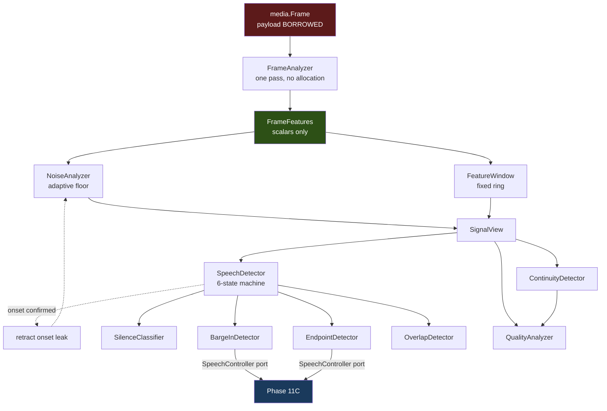

# Audio Intelligence Architecture

**Phase 11D** · `packages/go/audiointel`

---

## 1. The pipeline

One frame in, one `Analysis` out, on the caller's goroutine.



The payload is red because it is borrowed storage; the features are green
because they are the first thing safe to keep.

## 2. The ordering is the design

Three couplings are subtle enough that reversing one degrades the engine
silently rather than breaking it.

**The noise gate lags by one frame.** The floor must not observe speech, and
whether a frame is speech is decided by comparing it against the floor. That is
circular. It is broken with a one-frame lag: the floor adapts using the
*previous* frame's verdict. The alternative — decide speech first, update the
floor after — moves the circularity without removing it, because the decision
is then made against a floor that is one frame stale.

**The onset leak is retracted.** The frames between where an utterance begins
and where the detector confirms it reach the estimator labelled as background.
There are exactly `MinOnsetFrames` of them. Leaving them in was measurably
wrong: two loud frames in a hundred-frame ring dropped the floor's stability
score from **1.000 to 0.246**, and that score multiplies into every downstream
confidence. The fix retracts exactly those frames. See
[ENGINEERING_AUDIT.md](ENGINEERING_AUDIT.md) D-2.

**The floor updates before the window.** So a frame is judged against the most
recent background estimate rather than one that is a frame stale.

## 3. Synchronous, caller-driven, no goroutines

`Session.Analyze` runs inline and returns. There is no channel, no queue and no
background worker anywhere in this module.

That is a requirement, not a simplification. ADR-0004 §247:

> Any queue between the VAD and the output is added interruption latency.

ADR-0004 §12 budgets barge-in at one frame interval. A per-session goroutine
would insert exactly the queue that budget forbids, and would make
deterministic replay depend on goroutine scheduling — the difference between a
test that proves something and one that usually passes.

Phase 11B established the same convention: its runtime pump is off by default
in tests and the consumer drives at its own cadence.

**The consequence, stated plainly:** nothing here expires a session on its own.
A caller that opens sessions and never closes them will reach `MaxSessions` and
stay there. A sweeper would need a goroutine and a policy about what "idle"
means, and the caller already knows when its call ended.
`SessionRegistry.Each` is exported so a supervising service can implement
whatever expiry policy it wants.

## 4. The dependency rule

```
audiointel  →  media, metrics, runtime  →  stdlib
audiobridge →  audiointel, speech
```

Verified by `go list -deps`, and by `TestDependencies_NoForbiddenImports`, which
names each forbidden module and why:

| Forbidden | Why |
|---|---|
| `packages/go/speech` | would invert the layering; signals reach 11C through a port |
| `packages/go/conversation` | dialogue vocabulary does not belong in an audio pipeline |
| `packages/go/governance`, `memory`, `toolruntime` | different planes |
| `packages/go/telephony` | two layers down; this engine does not know what a call is |
| `packages/go/eventbus` | the event port is an interface; a broker adapter is a service's job |
| pion, livekit, agora, deepgram, assemblyai, elevenlabs, silero | §26 |

### Why §29's arrow is not an import edge

The brief specifies `Media → Audio Intelligence → Speech`. In this repository
the higher layer imports the lower, and `speech` already imports `media`.
Placing `audiointel` between them as an *import* would require `speech` to
import `audiointel` — and `speech` is frozen.

So the data flows exactly as specified and the import edge is never created.
`audiointel` declares `SpeechController`; `audiobridge` implements it over
`*speech.SpeechSession`. A compile-time assertion in that module proves the
frozen Phase 11C session satisfies the interface with no adapter on the speech
side, so a signature change there breaks this build rather than surfacing as a
barge-in that quietly stopped working.

## 5. Components

| Type | Responsibility |
|---|---|
| `AudioIntelligenceRuntime` | Owns sessions, configuration, instruments. Starts nothing. |
| `Session` | One direction of one call. Owns an analyser, publishes events, records metrics. |
| `AudioAnalyzer` | The detector chain, unsynchronised. |
| `FrameAnalyzer` | PCM → `FrameFeatures`. Stateless, one pass, zero allocation. |
| `SignalAnalyzer` | Owns the window and the floor; enforces the gate ordering. |
| `FeatureWindow` | Fixed ring of features. Allocated once, never grows. |
| `NoiseAnalyzer` | Adaptive floor with three anti-contamination mechanisms. |
| `SpeechDetector` | Six-state voice activity machine. |
| `EndpointDetector` | Turn boundaries behind configurable gates. |
| `BargeInDetector` | Interruption, debounced and staleness-checked. |
| `OverlapDetector` | Double-talk, confidence-based. |
| `QualityAnalyzer` | Four classes with hysteresis. |
| `ContinuityDetector` | Consumes Phase 11B's transport signals. |
| `SilenceClassifier` | Six timing classes. |
| `AudioIntelligenceMetrics` | Instruments over `packages/go/metrics`. |

## 6. Memory

Every window is a fixed-size array sized at construction. A session that runs
for six hours holds exactly what one that has run for six frames holds.

Measured: **0 B/op, 0 allocs/op** for `Session.Analyze` with a non-retaining
event publisher. See [PERFORMANCE.md](PERFORMANCE.md).

The one deliberate exception is `Reset`, which rebuilds the two FSM-backed
detectors and allocates a map each. It is a recovery operation, never on the
frame path.

## 7. Configuration

Every tunable lives in `config.go` and every default in `defaults.go`, each with
its reasoning beside it. `TestConfig_NoDurationLiteralsInDetectors` fails the
build if a duration literal appears in a detector file.

Validation reports **every** problem rather than the first, and an invalid
configuration fails closed — a detector built from nonsense produces nonsense
confidently.

Cross-section invariants are checked too, because two individually valid
settings can contradict each other. For example `Silence.InterSentenceMax` may
not exceed `Endpoint.SilenceWindow`: a pause longer than the endpoint window
*is* an endpoint, and two names for one event make the signal ambiguous.

## 8. The learned-model boundary

`SpeechLikelihoodModel` is declared, documented, and deliberately not
implemented. `TestPorts_NoLearnedModelIsWiredIn` proves nothing implements it,
no result type holds one, and no detector file so much as mentions it.

A future phase adopting it must also decide what happens to `Explanation`: a
score from a model is not an explanation, and §14's requirement that every
decision be explainable does not lapse because the decision got better.
