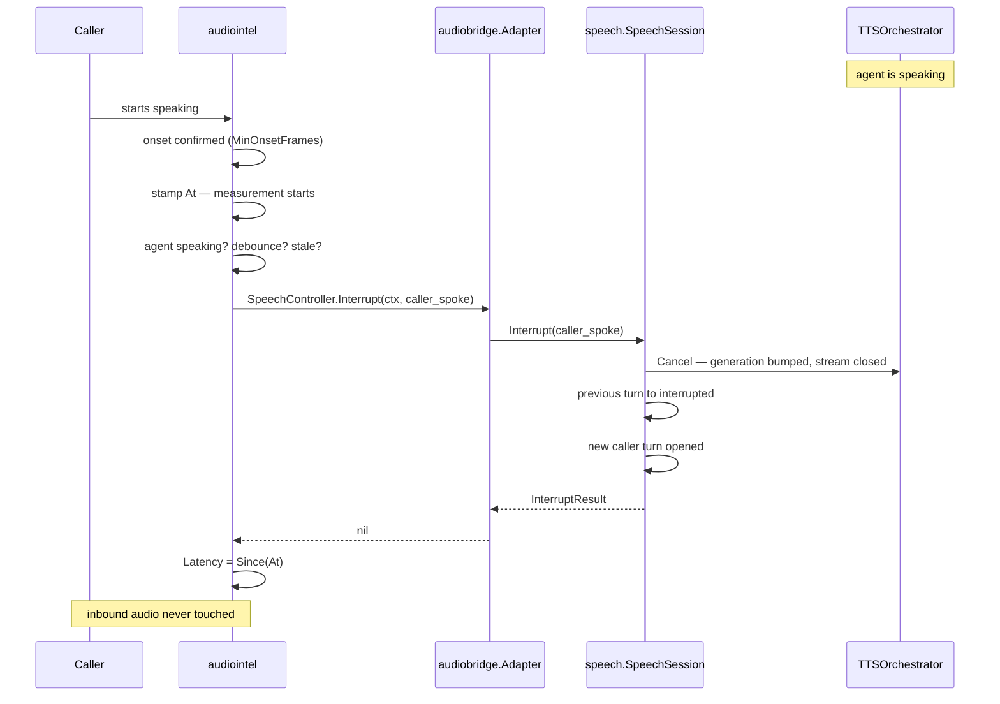

# Barge-In

**Phase 11D** · `packages/go/audiointel/bargein.go`, `packages/go/audiobridge`

The caller starts talking while the agent is speaking. Phase 11C calls this
"the most load-bearing interaction in the whole pipeline"; this is the layer
that decides it happened.

---

## 1. The frozen budget

ADR-0004 §12 and ADR-0011 §5.1: **≤ 20 ms, one frame interval**, from the
detection signal to outbound silence. ADR-0004 §247 adds the structural
constraint:

> Any queue between the VAD and the output is added interruption latency.

This engine has no queue. `Session.Analyze` runs inline, the detector calls the
port inline, and the port calls Phase 11C inline.

**Read the budget precisely: it runs from the DETECTION, not from acoustic
onset.** The `MinOnsetFrames` the voice activity detector spends confirming an
onset are upstream of it. `BargeInDecision` carries both numbers separately —
`Latency` and `OnsetLatency` — so they cannot be conflated.

## 2. The path



The timestamp is taken **first**, so the measurement includes everything after
it. Phase 11C's `Interrupt` does the same thing for the same reason, and the two
measurements meet at the port.

## 3. Inbound audio is never touched

Satisfied by not doing anything. The caller's new speech is already arriving —
it is the reason the interruption fired — and flushing it would discard the very
words that caused the barge-in.

`BargeInDetector` has **no path to the input at all**, which is the strongest
form of that guarantee. Phase 11C's requirements 4 and 6 are satisfied the same
way.

## 4. Every detection produces exactly one outcome

Including the ones deliberately not delivered. A detection that vanished without
a counter is a barge-in nobody can explain the absence of, and "the agent talked
over me" is the hardest complaint to investigate after the fact.

| Outcome | Meaning |
|---|---|
| `delivered` | Reached the controller and it accepted |
| `debounced` | Within `MinInterval` (500 ms) of the previous one |
| `stale` | Older than `MaxAge` (200 ms) against the injected clock |
| `not_speaking` | The agent did not hold the floor |
| `refused` | Phase 11C declined — most often the turn had moved on |
| `no_controller` | No port wired. A configuration fault, counted not swallowed |
| `disabled` | The policy is off. Still counted |

**Debounce**: a caller who interrupts is usually still talking a moment later
and the detector may legitimately re-confirm. Without it, one interruption
becomes several, each cancelling the turn the previous one opened.

**Staleness**: cancelling speech the agent finished half a second ago cuts off
whatever it started next. To the caller that is the agent interrupting itself —
worse than the missed interruption.

**Not speaking**: mirrors Phase 11C exactly. A caller talking while we are
listening is not interrupting; their audio already belongs to the live turn, and
firing would throw away a transcript in progress.

## 5. It never touches a TTS provider

Cancellation goes through `SpeechController`, which `packages/go/audiobridge`
implements over `speech.SpeechSession.Interrupt`. §8 requires exactly that and
§29 forbids this module from importing anything that would let it do otherwise.

`audiobridge` carries a compile-time assertion:

```go
var _ SpeechSession = (*speech.SpeechSession)(nil)
```

If Phase 11C changes either signature, **that line fails to compile** — a
contract mismatch stops a build rather than surfacing as a barge-in that quietly
stopped working.

## 6. Measured

`TestBridge_BargeInCancelsRealPhase11CSynthesis` drives synthetic caller audio
through `audiointel`, through the adapter, into a **real, unmodified**
`speech.SpeechSession`, and asserts that Phase 11C's synthesis stream actually
closed and a new caller turn opened.

| Measurement | Result |
|---|---|
| Orchestration latency, worst of 10 runs, real clock | **0 s** (below the clock's resolution) |
| Phase 11C's own cancellation, same run | **0 µs** (same) |
| ADR-0004 §12 budget | 20 ms |

Read that precisely. **0 s means below measurable resolution on this machine**,
not instant. Windows clock granularity is roughly 520 µs (Phase 10F). And it
measures *orchestration only* — the detection stamp, the policy checks, the call
through the port, and Phase 11C's generation bump and stream close. It does
**not** include the media relay or the carrier leg, neither of which this
package implements or measures.

`ConfirmFrames` is the one knob that spends this budget directly: measured, a
setting of 3 delays detection by **60 ms** against a 20 ms budget. It defaults
to 0 for that reason.

## 7. A note on testing this against Phase 11C

Phase 11C's fake synthesiser, driven by a fake clock, finishes a short reply
instantly, and its outbound frame queue holds 100 frames. A test that brings the
session to "speaking" and then interrupts a three-sentence reply finds nothing
to cancel — `TTSOrchestrator.Cancel` returns immediately because `speaking` is
already false.

That is not a defect in either engine; it is an artefact of a synthesiser that
takes no time. The integration test uses a thirty-sentence reply so the pump
blocks and the agent is genuinely still speaking. Recorded here because the
first version of that test reported "Phase 11C did not cancel" and was wrong.
