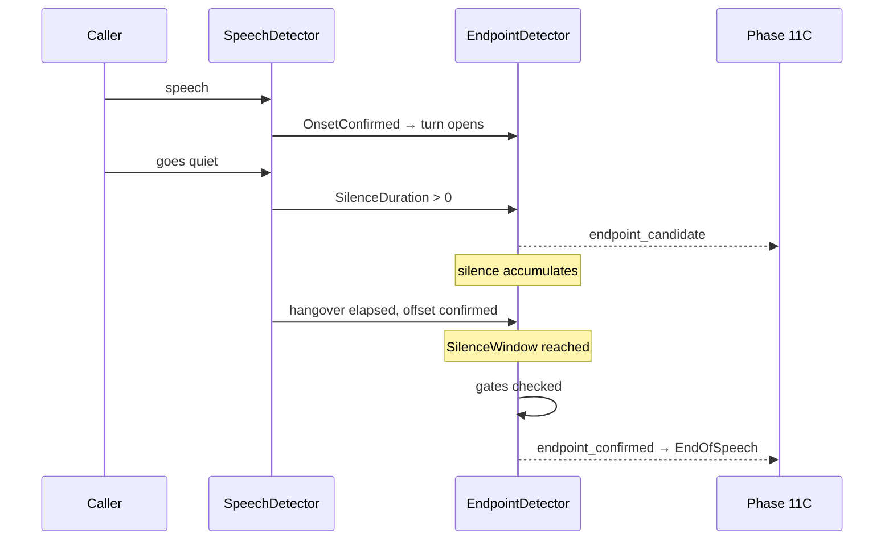

# Endpointing

**Phase 11D** · `packages/go/audiointel/endpoint.go`, `silence.go`

When to treat the caller's turn as over.

---

## 1. Endpointing is a policy decision, and it is not acoustic offset

The voice activity detector answers "is the caller making a sound". The
endpointer answers "should we act as though the turn ended". Different
questions, different costs: ending early cuts a caller off mid-thought, ending
late leaves dead air.

ADR-0011 §7 records that the window is tuned by measuring **false-endpoint
rate**, not by minimising latency. `EndpointConfirmRate` and
`audiointel_endpoint_suppressed_total` exist so that is measurable.

## 2. The frozen budget

ADR-0011 §5.2 hop 1 — **250 ms p50 / 350 ms p95** — described there as
"Ours, and a product decision" and as the largest single item in the end-to-end
budget. ADR-0005 C6 adds that we own endpointing and vendor endpointing is
disabled or ignored.

`DefaultEndpointSilenceWindow` is that 250 ms. It is the only value in
`defaults.go` taken from a frozen document rather than chosen for this phase,
and `TestConfig_FrozenBudgetsMatchTheADRs` pins it so a revision has to be
deliberate.

## 3. The sequence

`endpoint_candidate` fires the moment the audio goes quiet, so a consumer may
start preparing a response before the endpoint is certain. `endpoint_confirmed`
fires when the window has elapsed and every gate passes.

**The window is measured from the first sub-threshold frame**, not from the
moment the hangover expired. Measuring from the hangover would silently add
`MinSilence` — 200 ms, most of the budget — and make the ADR-0011 comparison
wrong.

Measured across ten turns: **worst 260 ms of silence held** against a 250 ms
window. The 10 ms is one frame of overshoot, which is the granularity of a
20 ms cadence.

## 4. The gates

Each blocks confirmation, each has its own suppression reason, and each has a
test that proves it blocks.

| Gate | Default | Why |
|---|---|---|
| `SilenceWindow` | 250 ms | ADR-0011 hop 1 |
| `MinSpeechDuration` | 200 ms | A cough is not a turn |
| `MaxTurnDuration` | 60 s | Forced endpoint — see below |
| `SuppressWhileAgentSpeaking` | on | What the caller says while the agent talks is a barge-in, and barge-in opens its own turn |
| `SuppressDuringBargeIn` | on | An unresolved interruption already replaced the turn |
| `RequireFallingEnergy` | **off** | Defers an endpoint on a caller winding up to say more — and also on a rising noise floor |

`RequireFallingEnergy` is off by default deliberately. Simple behaviour first; a
deployment that measures a benefit turns it on.

### The forced endpoint

A caller on a noisy line can hold the detector in speech indefinitely. Without
`MaxTurnDuration` the conversation never advances, and the symptom is an agent
that has apparently stopped listening. It is checked **before** the gates,
because a turn that will not end is exactly the case the gates would keep
suppressing.

## 5. There is no English pause model here

Every threshold is configuration. Nothing in `endpoint.go` encodes an assumption
about any language's phonology — it counts milliseconds of silence.

The 250 ms default was set by ADR-0011 for this platform's traffic. A deployment
serving a language whose speakers pause differently changes
`EndpointPolicy.SilenceWindow` and accepts the latency, which is a configuration
change and not a code change.

The Hinglish scenario exercises the case that actually matters: code-switch
pauses land between an inter-word gap and an endpoint, and an engine that
treated one as a turn boundary would cut a code-mixing speaker off mid-sentence.
Measured: one code-mixed utterance with four switches produces **one onset and
one endpoint**.

## 6. Silence classification

Six classes, all threshold-driven:

| Class | When |
|---|---|
| `initial` | Before any speech in the session, however long |
| `inter_word` | ≤ `InterWordMax` (120 ms) |
| `inter_sentence` | ≤ `InterSentenceMax` (250 ms) |
| `thinking` | ≥ `ThinkingMin` after the agent stopped, with no reply yet |
| `endpoint` | ≥ the endpoint window |
| `long` | ≥ `LongSilenceMin` (3 s) |

**These are timing signals, not language understanding.**
`inter_sentence` means "a pause of a certain length in a certain position". It
does not mean a sentence ended — a speaker pausing to think mid-clause and one
finishing a sentence produce the same silence, and nothing measurable separates
them. `thinking` is positional: it says the caller has not started responding,
not that they are thinking.

### A consequence worth reading before tuning

Configuration validation refuses an `InterSentenceMax` above the endpoint
window, because a pause longer than the window *is* an endpoint. At the defaults
the two are equal, so **this engine cannot distinguish a clause boundary from a
turn end**. Anything long enough to be one is long enough to be the other.

That is a property of a 250 ms window, not a defect in the classifier. A
deployment needing the distinction must lengthen the window and accept the
latency. `TestSilence_DocumentedLimitationHolds` pins it so a change to either
value has to confront it.
