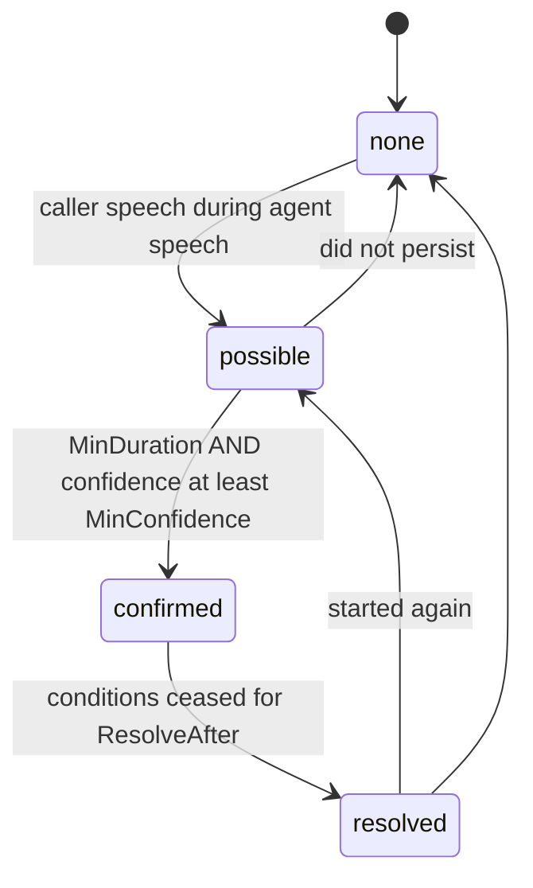

# Overlap Detection

**Phase 11D** · `packages/go/audiointel/overlap.go`

---

## 1. Read this before anything else

**This engine cannot separate echo from genuine double-talk, and it does not
claim to.**

Doing so requires an acoustic echo canceller and an outbound reference signal
aligned to the inbound one at the sample level. Neither exists here: Phase 11B
moves frames and does not align them across directions, and no echo canceller is
in scope for this phase or implied by it.

What the detector reports is: *the caller's audio shows speech while the agent
holds the floor, sustained for `MinDuration`*. On a handset with poor isolation,
or a speakerphone, that condition is also met by the agent hearing itself.

**Act on `OverlapDecision.Confidence`, not on the state.**

## 2. What it does exclude

Short acoustic artifacts. A click, a handset bump, a codec transient and a door
closing all reach `possible` and none reaches `confirmed`, because confirmation
needs `MinDuration` (200 ms) of sustained caller speech.

`TestOverlap_ShortArtifactsNeverConfirm` drives each of those and asserts the
state never reaches `confirmed`.

## 3. The state machine



`resolved` is a distinct state rather than a return to `none`, so a consumer can
tell an overlap that **ended** from one that never happened. It leads back to
`possible` directly because two people talking over each other rarely stop
cleanly once.

`confirmed` to `none` is deliberately not declared: a confirmed overlap must
pass through `resolved` so its ending is observable.

## 4. Confidence, and why it gates the transition

```
base       = the voice activity detector's own confidence
sustained  = clamp01(duration / MinDuration)
score      = base * sustained * (1 - EchoCorrelationPenalty * max(0, r))
```

The **sustained** factor excludes short artifacts without a hard cutoff: a 40 ms
click scores low rather than being silently discarded, so a consumer watching
the distribution can see how often it happens.

The **base** term carries the noise floor's confidence through, because an
overlap judgement is built on a speech judgement and cannot be surer than it.
Early in a call that keeps overlap confidence low — correctly, and it means a
deployment tuning `MinConfidence` is also deciding how much of a call's opening
to stay quiet about.

`MinConfidence` gates the *promotion to confirmed*, not the reported value. An
earlier implementation promoted first and downgraded the reported state when
confidence came out low, which left `State` disagreeing with `Previous` and
`Changed`. Gating the transition keeps them the same thing. See
[ENGINEERING_AUDIT.md](ENGINEERING_AUDIT.md) D-3.

## 5. The echo term only ever lowers

When an `OutboundEnvelope` is supplied, the detector correlates the inbound
level against the agent's own output over a 16-frame window (Pearson).

Positive correlation **reduces** confidence. It never raises it, and its absence
is never read as proof of genuine double-talk — a caller can perfectly well
speak in the same rhythm as the agent.

Negative correlation is clamped away: the caller getting quieter as the agent
gets louder is not evidence of anything, and the honest reading is that the two
signals are unrelated, which is what the base score already assumed.

A constant envelope yields zero correlation, because a constant has no variance
and the coefficient is undefined. Zero — "no evidence" — is the honest answer
rather than a division by zero.

Measured: confidence **0.320** without an envelope, **0.292** with an echo-like
one the inbound signal genuinely tracked.

`TestOverlap_EchoCorrelationOnlyLowersConfidence` fails if supplying an envelope
ever raises the score.

## 6. The window is 16 frames and is not configurable

Echo tracks the outbound signal within milliseconds. A longer window would
average across the caller's own speech and wash the correlation out. That is a
property of what echo *is* rather than a policy a deployment would tune, which
is why it is a constant in `overlap.go` and not a field in `OverlapPolicy`.

## 7. What a consumer should do with this

- Treat `confirmed` with high confidence as a strong hint that both parties are
  talking, useful for shortening the agent's turn.
- Treat `confirmed` with confidence near `MinConfidence` as a coin flip.
- Do **not** use this to decide whether to cancel synthesis. That is barge-in's
  job, it has its own detector with its own guards, and it fires on onset rather
  than waiting 200 ms for overlap confirmation.
