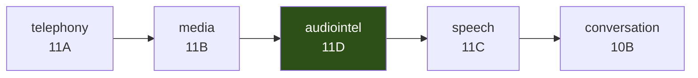

# Audio Intelligence

**Phase 11D** · `packages/go/audiointel`, `packages/go/audiobridge`

The layer between media transport and speech orchestration. It receives frames
from Phase 11B, measures bounded acoustic features, and tells Phase 11C when
somebody is talking, when they stopped, and whether the audio is any good.

---

## Documents

| Document | What it covers |
|---|---|
| [AUDIO_INTELLIGENCE_ARCHITECTURE.md](AUDIO_INTELLIGENCE_ARCHITECTURE.md) | The engine's shape, the dependency rule, and why it runs inline |
| [VAD_ARCHITECTURE.md](VAD_ARCHITECTURE.md) | Voice activity detection: three features, six states, and what it cannot do |
| [ENDPOINTING.md](ENDPOINTING.md) | Turn boundaries, the ADR-0011 budget, and why there is no English pause model |
| [BARGE_IN.md](BARGE_IN.md) | Interruption detection and the Phase 11C contract |
| [OVERLAP_DETECTION.md](OVERLAP_DETECTION.md) | Double-talk, and the limitation you should read first |
| [NOISE_AND_QUALITY.md](NOISE_AND_QUALITY.md) | The adaptive floor and the four quality classes |
| [STATE_TRANSITIONS.md](STATE_TRANSITIONS.md) | Every state machine, declared |
| [PERFORMANCE.md](PERFORMANCE.md) | Measured latency and allocation |
| [SECURITY_REVIEW.md](SECURITY_REVIEW.md) | Where audio goes, and where it provably does not |
| [EVALUATION_REPORT.md](EVALUATION_REPORT.md) | Quality gates, the 25 scenarios, and what the results do not mean |
| [ENGINEERING_AUDIT.md](ENGINEERING_AUDIT.md) | Defects found during the build, and deviations from the plan |

---

## Where it sits



Audio flows left to right. **Imports run the other way**, and only as far as
media: `audiointel` imports `media`, `runtime` and `metrics`, and nothing else.

It does not import `speech`. It cannot — `speech` is frozen and already imports
`media`, so making it depend on `audiointel` is not available, and importing it
here would invert the layering. Instead `audiointel` declares a port,
`SpeechController`, and `packages/go/audiobridge` implements that port over a
real `*speech.SpeechSession`. That module is the only place the two meet.

`go list -deps` on `audiointel` returns three first-party modules and the
standard library. Nothing else.

## What it decides

| Signal | Question it answers |
|---|---|
| Voice activity | Is the caller making a sound, and is that sound speech |
| Speech onset / offset | When did this utterance begin and end |
| Endpoint | Should we treat the turn as over |
| Barge-in | Did the caller interrupt the agent |
| Overlap | Are both talking at once — *and how sure are we* |
| Silence class | How long has this pause run, and where does it fall |
| Noise class | What is the caller speaking against |
| Audio quality | Is this usable, and if not, what should be fixed first |
| Frame continuity | What did the transport do to this stream |

## What it is not

No speech recognition, no synthesis, no transport, no language understanding.
No SIP, RTP, WebRTC or carrier. No STT or TTS provider, no LLM. No fraud
detection, emergency detection, call screening, memory retrieval or governance
policy. Nothing here writes audio to disk.

And no third-party voice activity detector — not WebRTC VAD, Silero, Pion,
LiveKit, Agora, Deepgram, Google, AssemblyAI or ElevenLabs, wrapped, vendored or
ported. The algorithms are written out in arithmetic you can check against
[VAD_ARCHITECTURE.md](VAD_ARCHITECTURE.md).

## Two properties worth knowing before you use it

**Every decision is explainable.** Each `VADDecision` carries an `Explanation`
naming which measured feature crossed which configured threshold and by how
much. A voice agent that cannot say why it decided somebody stopped talking
cannot be debugged when it is wrong, and it will be wrong.

**Silence classes are timing signals, not language understanding.**
`InterSentencePause` means "a pause of a certain length in a certain position".
It does not mean a sentence ended. This engine has no access to words.

## Getting started

```go
runtime, err := audiointel.New(audiointel.DefaultConfig(media.PCM16Mono8k()))

session, err := runtime.Open(ctx, audiointel.SessionContext{
    Call:      "call-abc",
    Direction: audiointel.DirectionInbound,
    Language:  audiointel.LangHinglish, // carried, never interpreted
    Format:    media.PCM16Mono8k(),
})

// On every inbound frame, inline on your own goroutine.
analysis, err := session.Analyze(ctx, frame,
    audiointel.ConversationState{AgentSpeaking: agentHoldsFloor},
    controller, // audiobridge.Adapter over a speech.SpeechSession
    nil,        // optional outbound envelope for overlap confidence
)
```

There is no goroutine to start and no pump to drive. `Analyze` runs inline and
returns — see [AUDIO_INTELLIGENCE_ARCHITECTURE.md](AUDIO_INTELLIGENCE_ARCHITECTURE.md)
for why that is a requirement rather than a simplification.
