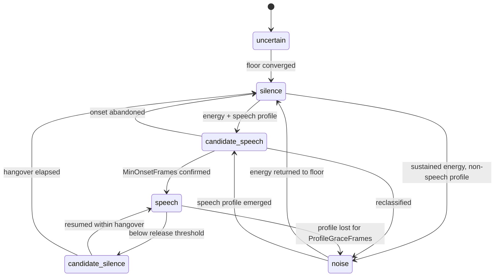
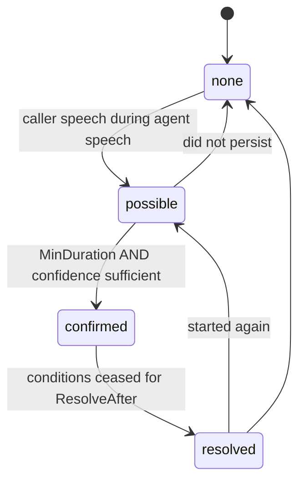
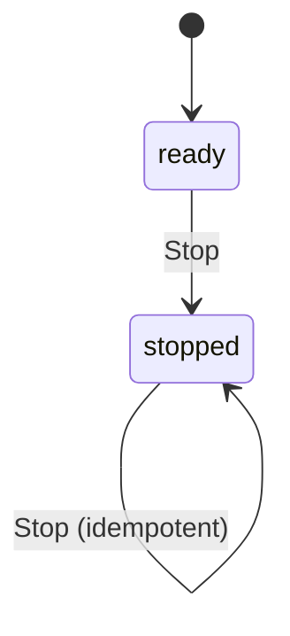

# State Transitions

**Phase 11D** · `packages/go/audiointel/vad.go`, `overlap.go`

Two state machines, both declared as `runtime.FSM` transition tables. Nothing
assigns a state directly; a move absent from the table is refused, and a
malformed table is refused at construction.

---

## 1. Voice activity

Source of truth: `vadTransitions()` in `vad.go`.

| From | To | Trigger | Emits |
|---|---|---|---|
| `uncertain` | `silence` | Noise floor converged | — |
| `silence` | `candidate_speech` | Above onset threshold, speech profile | — |
| `silence` | `noise` | Above onset for `NoiseHoldFrames`, no profile | — |
| `candidate_speech` | `speech` | `MinOnsetFrames` consecutive | **onset**, backdated |
| `candidate_speech` | `silence` | Evidence gone | false trigger |
| `candidate_speech` | `noise` | Non-profile for `NoiseHoldFrames` | false trigger |
| `speech` | `candidate_silence` | Below release threshold | — |
| `speech` | `noise` | Profile lost for `ProfileGraceFrames` | **offset** |
| `candidate_silence` | `speech` | Resumed | — (same run) |
| `candidate_silence` | `silence` | `MinSilence` elapsed | **offset** |
| `noise` | `silence` | Below release | — |
| `noise` | `candidate_speech` | Profile emerged | — |

### Deliberately absent

**`speech → silence`.** The hangover, expressed structurally: no code path can
end an utterance on one quiet frame because the machine has no edge for it.

**`silence → speech`.** Speech must be confirmed through `candidate_speech`, or
one loud frame starts a turn.

**Any edge back into `uncertain`.** Floor convergence latches, so such an edge
would be unreachable. An unreachable declared edge is worse than an absent one:
the state machine test would have to fabricate a way to exercise it.

### Onset and offset are not state entries

`speech` is re-entered after every stop closure. During connected speech over a
noisy line the machine can oscillate between `speech` and `candidate_silence`
several times a second — every one of those is the *same* utterance.

`OnsetConfirmed` is set only on the `candidate_speech → speech` promotion, and
`OffsetConfirmed` only where a run actually ends. A consumer keying on state
entry would emit one `speech_started` per syllable.

## 2. Overlap

Source of truth: `overlapTransitions()` in `overlap.go`.

`confirmed → none` is absent deliberately: a confirmed overlap must pass through
`resolved` so a consumer can tell an overlap that ended from one that never
happened.

## 3. Runtime and session lifecycle

Not an FSM — two booleans, because there are two states and no interesting
transitions between them.

A session is open or closed. `Close` is idempotent, frees the registry slot, and
there is no goroutine to stop because this engine starts none.

## 4. How the tables are enforced

- `runtime.NewFSM` refuses a self-transition and a transition out of a declared
  terminal state, at construction.
- `FSM.To` refuses any move absent from the table, at runtime.
- `TestVAD_TransitionTableIsComplete` checks every state has outgoing
  transitions, every target is declared, and every state is reachable from the
  initial one.
- `TestVAD_EveryDeclaredEdgeIsReachedByRealAudio` drives synthetic signals until
  all twelve edges have fired. A declared edge nothing can reach is dead code
  that looks like a feature.
- `TestOverlap_TransitionTableIsWellFormed` does the same for the four-state
  machine.

If the switch in `Observe` ever attempts an undeclared move, the FSM refuses,
the verdict becomes `transition_refused`, and the detector holds its previous
state. It does not panic: crashing a live call to report an internal
inconsistency is worse than holding state and saying so.
