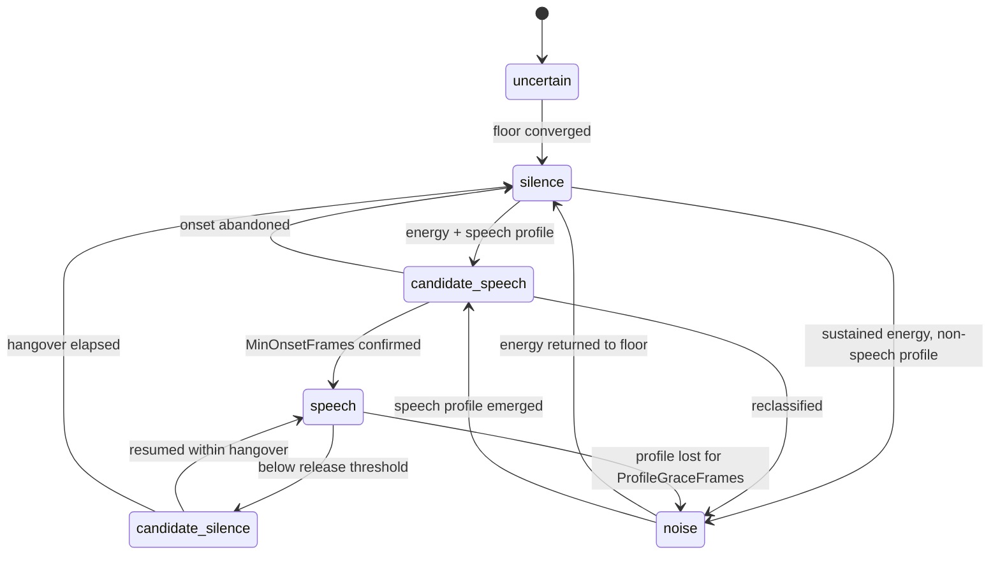

# Voice Activity Detection

**Phase 11D** · `packages/go/audiointel/vad.go`, `noise.go`, `frame.go`

Written from scratch. No WebRTC VAD, no Silero, no Pion, no LiveKit, no Agora,
no vendor voice-activity code wrapped, vendored or ported. Every number below is
arithmetic you can check.

---

## 1. Three features, and why one is not enough

A detector built on energy alone is wrong on every line whose noise floor
differs from the one it was tuned on — which is all of them. This one measures
three things and each rejects something the others cannot.

| Feature | What it is | What it rejects |
|---|---|---|
| **Energy excess** | `20·log₁₀(RMS / noiseFloor)`, in dB | Anything at the background level. Relative to the *adaptive* floor, never absolute. |
| **Zero-crossing band** | sign changes / (n−1) | A rumble below the speech band; the worst of broadband hiss |
| **Energy modulation** | stddev/mean of energy over a short window | A steady tone, a fan, line hiss — anything unmodulated |

Plus one absolute gate: **`AbsoluteSilenceRMS`**. On a digitally silent line the
floor sits at its clamp, and a frame at twice that clamp is +6 dB — enough to
look like speech to a purely relative test, and inaudible in fact.

### The measured ranges these thresholds sit between

Against this package's fixtures at 8 kHz:

| Signal | ZCR mean | ZCR range |
|---|---|---|
| Speech (all levels) | 0.247 | 0.157 – 0.346 |
| White noise | 0.499 | 0.384 – 0.610 |
| 30 Hz tone | 0.006 | — |
| 400 Hz tone | 0.094 | — |
| 1 kHz tone | 0.245 | — |

`ZCRMin = 0.01`, `ZCRMax = 0.45`.

**Read the 1 kHz row.** A 1 kHz tone measures 0.245 — indistinguishable from
speech by this feature. ZCR does not identify speech and is not expected to; it
excludes a rumble and the worst of hiss. What rejects a tone is modulation. The
features are complementary, which is why there are three.

## 2. The state machine

Six states. Every legal move is declared in `vadTransitions()`; anything absent
is refused by `runtime.FSM`.



Every one of those twelve edges is reached by a synthetic signal in
`TestVAD_EveryDeclaredEdgeIsReachedByRealAudio`. A declared edge nothing can
reach is dead code that looks like a feature.

### Two structural properties

**`speech → silence` does not exist.** Speech leaves toward quiet only through
`candidate_silence`. That is the hangover expressed structurally: no code path
can end an utterance on one quiet frame, because the machine has no edge for it.

**`uncertain` has one exit.** Floor convergence latches, so an edge back would be
unreachable — and an unreachable declared edge is worse than an absent one,
because the state machine test would have to fabricate a way to exercise it.

## 3. Three features to enter, one to stay

The asymmetry is the most consequential decision in the detector.

**Entering** costs a false trigger if wrong, so entering is strict: audible in
absolute terms, above the onset threshold, inside the ZCR band, and modulated —
for `MinOnsetFrames` consecutive frames.

**Staying** costs a clipped word if wrong, and a clipped word makes the caller
repeat themselves. So once speech is confirmed only the energy test applies, at
the lower release threshold, with the hangover behind it. A speaker who goes
briefly monotone is not cut off by a rejector designed to keep fans out.

**The escape hatch.** Steady noise that began during silence passes the onset
test — because at that instant nothing has had time to look steady — and would
otherwise hold the detector in speech indefinitely. A profile failure sustained
for `ProfileGraceFrames` reclassifies to `noise`. Measured: a 1 kHz tone is
treated as speech for **340 ms** before reclassification, against a structural
bound of 440 ms.

## 4. The limitation, stated plainly

**At 40 ms after onset, a burst of broadband noise and the start of a word are
not distinguishable by energy modulation, because neither has had time to
modulate.** Any detector claiming otherwise is wrong.

What can be guaranteed is that the mistake is caught quickly and the window is
bounded: `ModulationWindowFrames` (200 ms) for the short window to fill with the
new sound, then `ProfileGraceFrames` (200 ms) of grace. The 340 ms measured
above is that bound in practice.

## 5. Hysteresis, confirmation, hangover

Three independent anti-flapping mechanisms, all required:

- **Hysteresis** — `OnsetThresholdDB` 9 dB, `ReleaseThresholdDB` 5 dB. The 4 dB
  gap is what stops a detector flapping on frames sitting on the line.
- **Consecutive confirmation** — `MinOnsetFrames` = 2. One frame is a door slam.
  Each frame costs one frame interval of onset latency, so this is as low as it
  can usefully be.
- **Hangover** — `MinSilence` = 200 ms. Ordinary speech contains stop closures
  of 50–150 ms; a shorter hangover reports a new utterance per syllable.

A `speech → silence → speech` cycle therefore cannot complete in fewer than
`MinOnsetFrames + frames(MinSilence)` frames. Measured against 60 ms
alternation: **1 onset in 136 frames**, against a structural bound of 11.

### Flapping is measured in onsets, not state entries

The machine legitimately re-enters `speech` after every stop closure. On a noisy
line it can do so several times a second, and every one of those is the *same*
utterance. `OnsetConfirmed` is set only on the `candidate_speech → speech`
promotion, so exactly one onset is reported per run — §5's no-duplicate-onsets
requirement satisfied structurally rather than by a deduplication somebody has
to remember to write.

## 6. Onset is backdated

The detector becomes sure at the confirming frame, but speech began
`MinOnsetFrames` earlier. `SpeechStart` reports the **first** frame of the run.

Reporting the confirming frame would place every onset late by the confirmation
window and make every measured utterance short by the same amount — an error
that propagates into the endpoint measurement and then into the ADR-0011
comparison.

Symmetrically, `RunDuration` **excludes** the hangover: the hangover is silence
the detector waited through, not speech the caller produced, and including it
would overstate every utterance by `MinSilence`.

## 7. Synthesised frames are no evidence

`FlagSilence` means Phase 11B invented a frame to cover a gap. The obvious
handling — treat it as quiet audio — costs a conversation: a burst of packet
loss would run the hangover down and end the caller's turn mid-sentence, and to
the caller the agent simply interrupts them whenever the network hiccups.

Treating them as speech would be worse. So the machine **holds**: no transition,
no timer advanced, no onset or offset reported. The detector does not know what
happened during the gap and says so. Bounded by Phase 11B's `MaxGapFill`
(200 ms default); a longer outage produces no frames at all and the continuity
detector reports starvation instead.

## 8. Confidence

```
evidence   = clamp01(0.5 + (excessDB − onsetDB) / (2 × onsetDB))
confidence = evidence × floorConfidence      (speech states)
           = (1 − evidence) × floorConfidence (silence states)
```

At exactly the onset threshold, evidence is 0.5 — the detector is on the line
and says so. At twice the threshold above the floor it saturates.

The multiplication by floor confidence is the important part: **a confident
comparison against an uncertain reference is not a confident decision.** A
detector reporting 0.95 while its floor rested on four frames of a building site
would be lying with precision.

One consequence, found by measurement: floor confidence *dominates* the reported
value early in a call, and a loud talker's session legitimately carries lower
floor stability than a quiet one. Comparing confidence across sessions therefore
measures the floor, not the evidence — which is why
`TestVAD_ConfidenceRisesWithEvidenceWithinASession` compares pairs of frames
that share a floor confidence. Measured: **4,901 comparable pairs, 1,334 showing
confidence rising with evidence, none falling.**

## 9. Every decision is explained

`Explanation` carries every measurement and the threshold it was compared
against, plus a bounded verdict code:

```
excess=24.6dB (onset 9.0, release 5.0) audible=true zcr=0.247/true
mod=0.51/true profile=true onset_frames=2 silence=0s floor_conf=0.96
verdict=onset_confirmed
```

`TestVAD_EveryDecisionIsExplained` checks that every decision carries a verdict
from the declared vocabulary, that the carried thresholds match the
configuration, and that each boolean agrees with the measurement it claims to
summarise.
