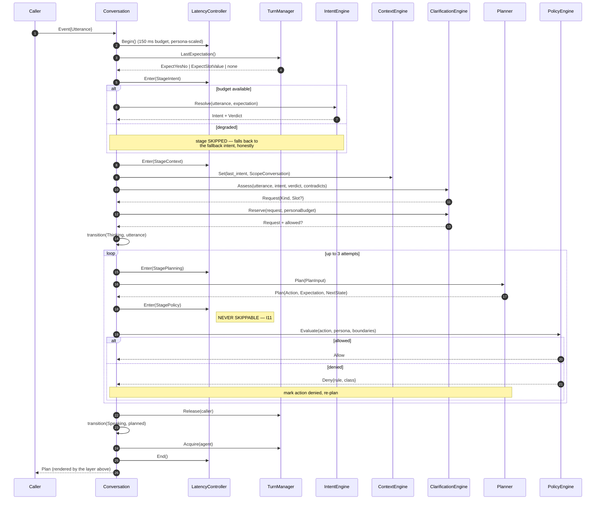
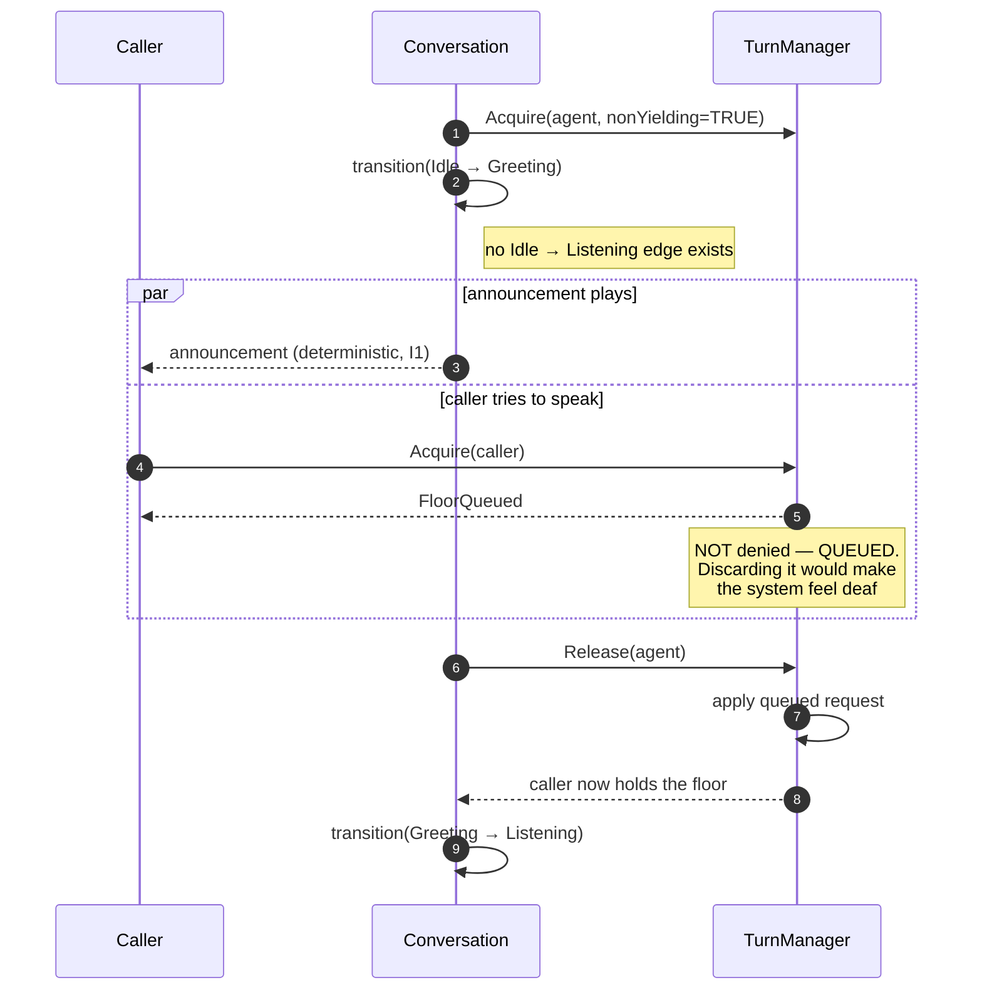
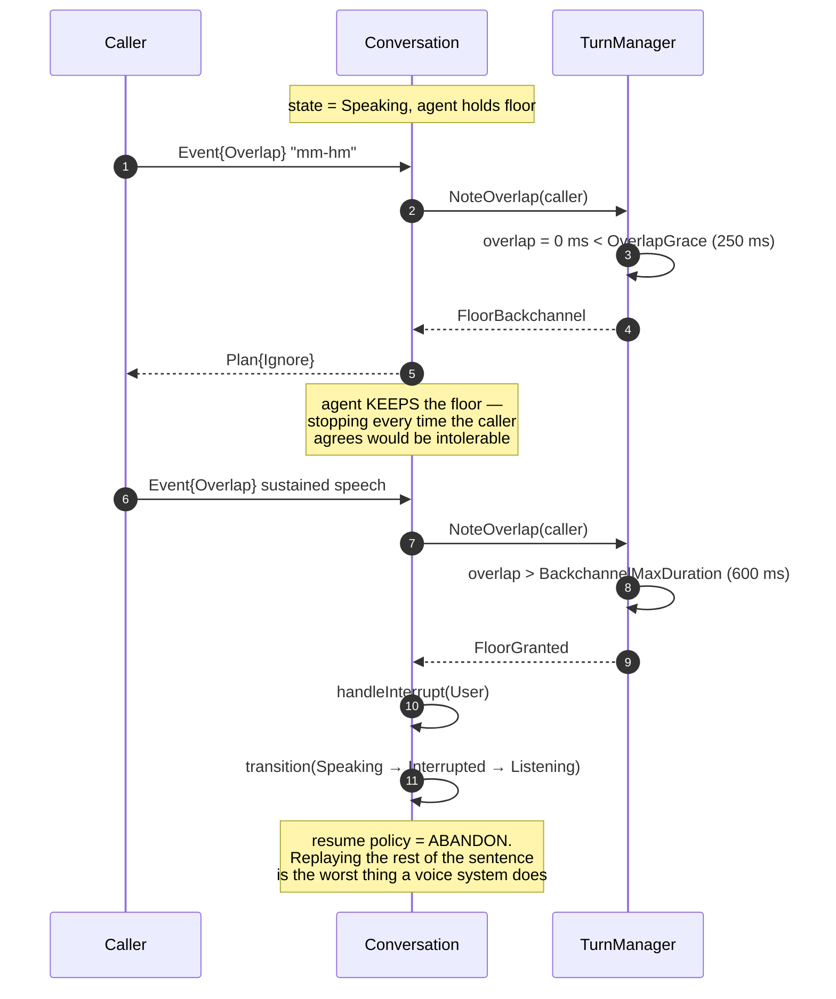
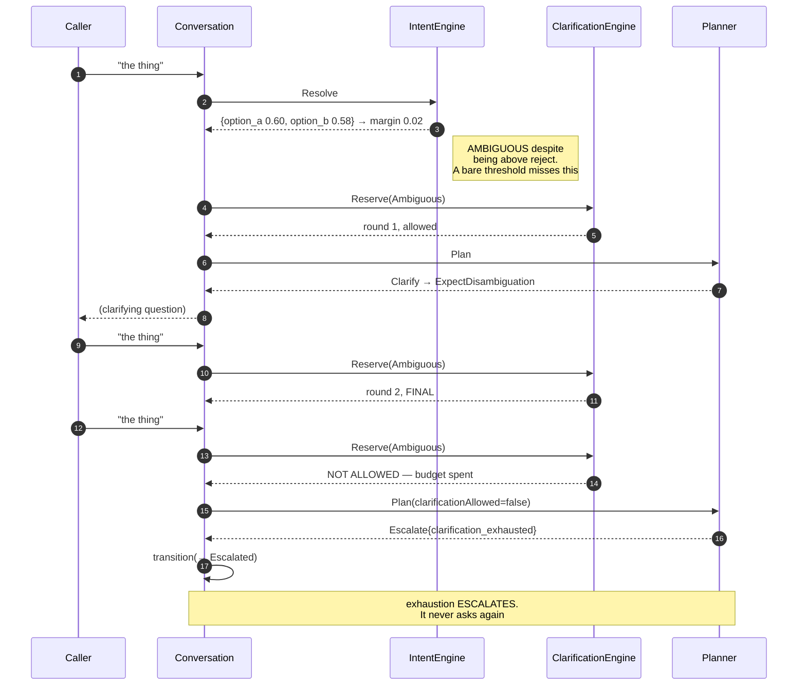
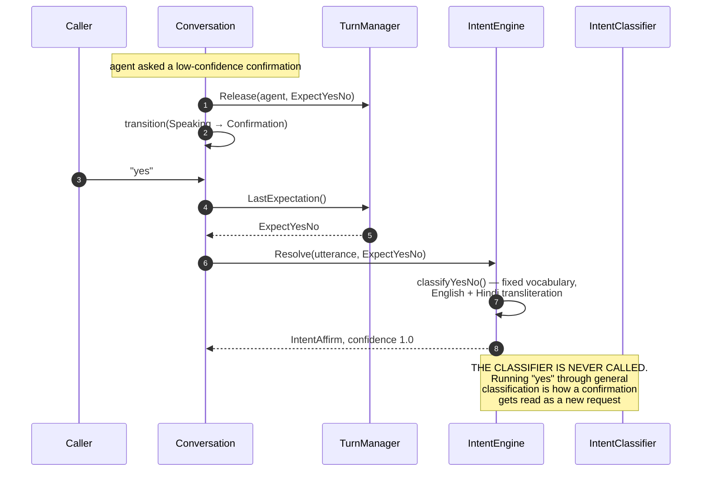
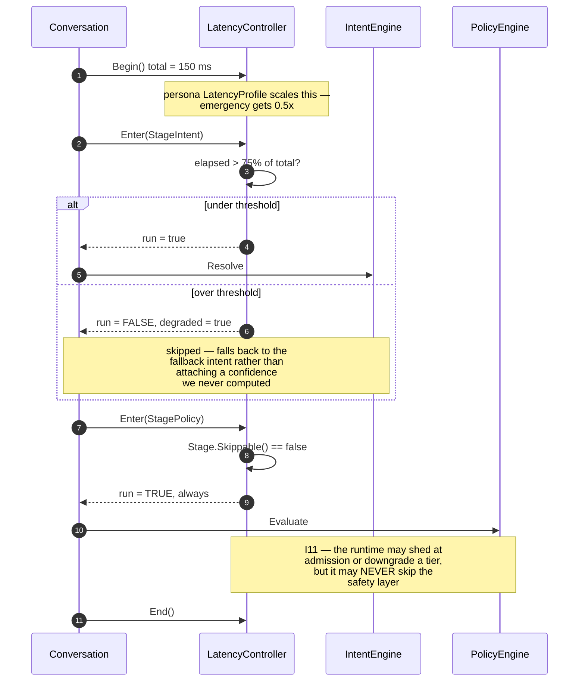
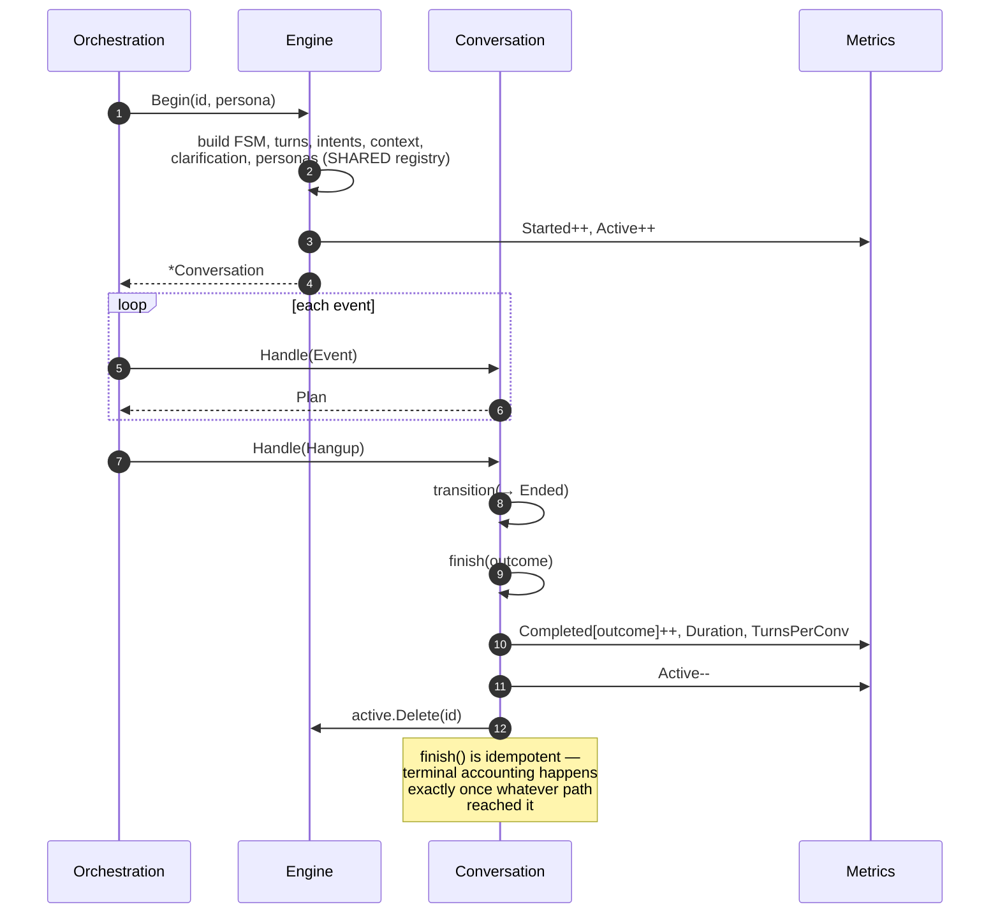

# Conversation Engine — Sequence Diagrams

**Phase 10B** · The decision cycle and the seven scenarios that define it.

Every diagram below corresponds to a passing test, named beneath it.

---

## 1 · The decision cycle

The shape every caller utterance takes. Its order is fixed and each step is
budgeted.



**Planning precedes policy deliberately.** Policy is a veto over a concrete
proposal; evaluating every possible action against policy before choosing would
be slower and far less explicable. The bounded re-plan loop turns a veto into a
different decision rather than a failure — and after three refusals the engine
escalates rather than looping, because looping spends the caller's time
producing nothing.

*Tests:* `TestSim_HappyPath`, `TestPlanner_DecisionTable`

---

## 2 · Opening — the announcement cannot be skipped



*Tests:* `TestTurnManager_GreetingIsNonYieldingButQueues`,
`TestSim_GreetingAlwaysPrecedesConversation`,
`TestStateMachine_GreetingCannotBeBypassed`

---

## 3 · Backchannel versus barge-in

The same physical event — the caller producing audio while the agent speaks —
resolving two different ways.



*Tests:* `TestTurnManager_BackchannelDoesNotStealFloor`,
`TestSim_BackchannelDoesNotDerailTheAgent`, `TestSim_BargeInYieldsTheFloor`

---

## 4 · Clarification ladder, ending in escalation

A caller whose request is permanently ambiguous. The budget is what stops this
becoming the classic voice-bot loop.



*Tests:* `TestSim_ClarificationLadderThenEscalation`,
`TestClarification_BudgetExhaustionStopsAsking`

---

## 5 · Confirmation — why "yes" bypasses the classifier



The test asserts `Classifier.Calls()` is unchanged — it fails if the model is
consulted at all.

*Tests:* `TestIntent_YesNoShortCircuitsClassification`,
`TestSim_ConfirmationYesIsInterpretedAsAnswer`, `TestIntent_YesNoRecognisesHindi`

---

## 6 · Emergency — the product gets out of the way

```mermaid
sequenceDiagram
    autonumber
    participant C as Caller
    participant CV as Conversation
    participant IN as InterruptionEngine
    participant PR as PersonaRuntime
    participant TM as TurnManager
    participant PO as PolicyEngine

    C->>CV: Event{Interrupt, Emergency}
    CV->>IN: Raise(Emergency)
    IN->>IN: emergencyAt = now (MONOTONIC — never cleared)
    IN-->>CV: Interruption{Resume: Never}

    CV->>PR: Switch(EmergencyAssistant)
    Note right of PR: always permitted from any persona;<br/>one-way, and locks
    PR-->>CV: switched

    CV->>TM: ForceYield(system, Emergency)
    Note right of TM: preempts even a<br/>NON-YIELDING greeting.<br/>U7 outranks I1 here

    CV->>CV: transition(→ Interrupted → Escalated)
    CV-->>C: Plan{Escalate}

    C->>CV: any further event
    CV-->>C: ErrTerminal

    Note over PO: every subsequent policy check<br/>denies everything but<br/>Escalate / End / Ignore
```

*Tests:* `TestSim_EmergencyEndsTheConversationImmediately`,
`TestInterruption_EmergencyIsIrreversible`,
`TestTurnManager_EmergencyPreemptsNonYielding`,
`TestPolicy_SafetyDeniesEverythingButExitDuringEmergency`

---

## 7 · Provider failure and recovery

```mermaid
sequenceDiagram
    autonumber
    participant P as Provider
    participant CV as Conversation
    participant IN as InterruptionEngine
    participant CX as ContextEngine

    Note over CV: state = Speaking
    CV->>IN: Checkpoint{turn, offset}

    P--xCV: stream died
    CV->>IN: Raise(Provider)
    alt checkpoint older than 400 ms
        IN-->>CV: ResumeFromCheckpoint
        Note right of IN: the caller heard a legitimate<br/>partial answer; the rest is wanted
    else checkpoint very recent
        IN-->>CV: ResumeRestart
        Note right of IN: resuming from two words in<br/>is incoherent
    end

    CV->>CV: transition(→ Interrupted → Error)
    Note over CV: Error is NOT terminal — that is<br/>the difference between an error<br/>and a failure

    CV->>CV: Recover()
    CV->>CV: transition(Error → Recovery)
    CV->>CX: LatestSnapshot()
    alt snapshot exists
        CX-->>CV: snapshot
        CV->>CX: Restore(id)
        Note right of CX: Conversation + Session roll back.<br/>Business reference data does NOT —<br/>restoring stale opening hours is<br/>worse than the error
        CV->>CV: transition(Recovery → Listening)
    else no snapshot
        CX-->>CV: none
        CV->>CV: transition(Recovery → Escalated)
        Note right of CV: continuing on half-written<br/>context is worse than a handover
    end
```

*Tests:* `TestFailure_ProviderInterruptionEntersRecoverableError`,
`TestFailure_RecoveryWithSnapshotResumes`,
`TestFailure_RecoveryWithoutSnapshotEscalates`,
`TestInterruption_ProviderFailureEarlyRestarts`

---

## 8 · Latency degradation under pressure



*Tests:* `TestLatency_PolicyIsNeverSkippable`,
`TestLatency_DegradesSkippableStagesOnly`

---

## 9 · Conversation lifetime



*Tests:* `TestMetrics_ConversationAccounting`,
`TestStress_ManyConcurrentConversations` (asserts the Active gauge returns to
zero across 200 concurrent conversations)
