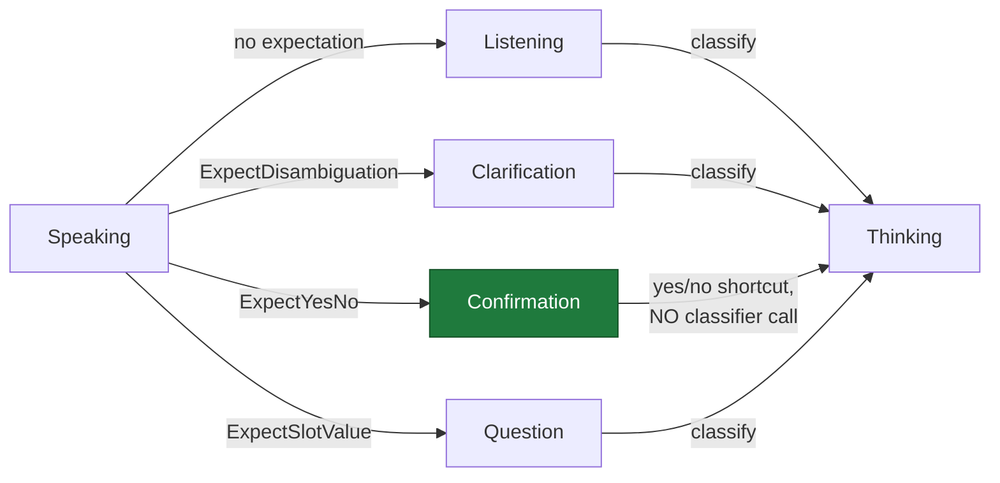
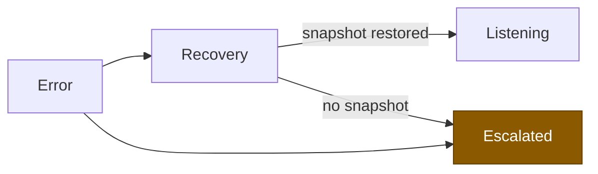
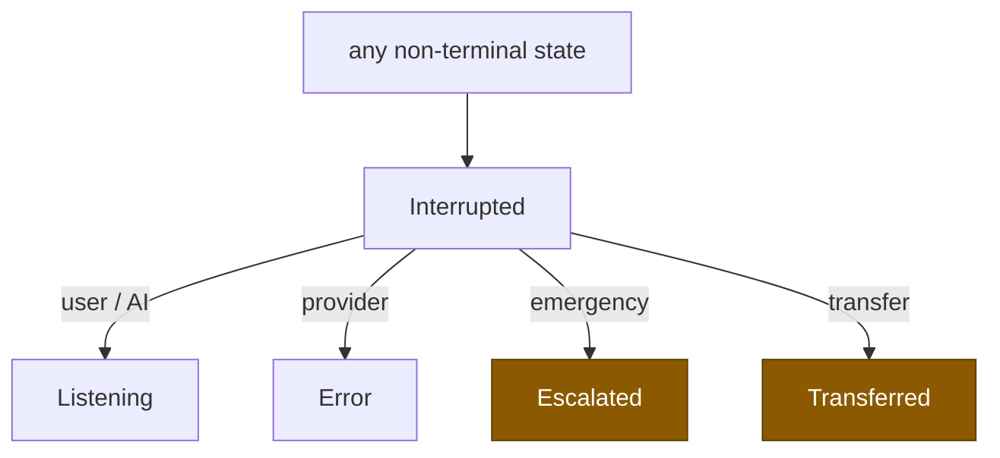

# Conversation State Transition Diagram

**Phase 10B** · Generated from
[`state.go`](../../packages/go/conversation/state.go) `transitionTable()`

Seventeen states. Every edge below is declared in the table and enforced by
`runtime.FSM`; an undeclared transition returns `ErrInvalidTransition` rather
than happening.

---

## 1 · Full machine

```mermaid
stateDiagram-v2
    [*] --> Idle

    Idle --> Greeting : start
    Idle --> Ended : hangup
    Idle --> Error : fault

    Greeting --> Listening : greeting_complete
    Greeting --> Ended : hangup
    Greeting --> Error : fault
    Greeting --> Escalated : escalate

    Listening --> Thinking : utterance
    Listening --> Interrupted : interruption
    Listening --> Waiting : silence
    Listening --> Timeout : timeout
    Listening --> Ended : hangup
    Listening --> Error : fault
    Listening --> Escalated : escalate
    Listening --> Transferred : transfer

    Thinking --> Speaking : planned
    Thinking --> ToolExecution : tool_started
    Thinking --> Waiting : planned
    Thinking --> Transferred : transfer
    Thinking --> Escalated : escalate
    Thinking --> Ended : planned
    Thinking --> Error : fault
    Thinking --> Interrupted : interruption

    Speaking --> Listening : speech_complete
    Speaking --> Clarification : speech_complete
    Speaking --> Confirmation : speech_complete
    Speaking --> Question : speech_complete
    Speaking --> Waiting : speech_complete
    Speaking --> Interrupted : interruption
    Speaking --> Ended : speech_complete
    Speaking --> Error : fault
    Speaking --> Transferred : transfer
    Speaking --> Escalated : escalate

    Clarification --> Thinking : utterance
    Clarification --> Interrupted : interruption
    Clarification --> Timeout : timeout
    Clarification --> Ended : hangup
    Clarification --> Error : fault
    Clarification --> Escalated : escalate
    Clarification --> Transferred : transfer

    Confirmation --> Thinking : utterance
    Confirmation --> Interrupted : interruption
    Confirmation --> Timeout : timeout
    Confirmation --> Ended : hangup
    Confirmation --> Error : fault
    Confirmation --> Escalated : escalate
    Confirmation --> Transferred : transfer

    Question --> Thinking : utterance
    Question --> Interrupted : interruption
    Question --> Timeout : timeout
    Question --> Ended : hangup
    Question --> Error : fault
    Question --> Escalated : escalate
    Question --> Transferred : transfer

    ToolExecution --> Thinking : tool_complete
    ToolExecution --> Speaking : tool_complete
    ToolExecution --> Error : fault
    ToolExecution --> Timeout : timeout
    ToolExecution --> Ended : hangup
    ToolExecution --> Escalated : escalate

    Waiting --> Listening : utterance
    Waiting --> Thinking : planned
    Waiting --> Timeout : timeout
    Waiting --> Ended : hangup
    Waiting --> Error : fault
    Waiting --> Escalated : escalate
    Waiting --> Transferred : transfer

    Interrupted --> Listening : arbitrated
    Interrupted --> Speaking : arbitrated
    Interrupted --> Thinking : arbitrated
    Interrupted --> Ended : hangup
    Interrupted --> Error : fault
    Interrupted --> Escalated : arbitrated
    Interrupted --> Transferred : arbitrated

    Error --> Recovery : recover
    Error --> Ended : hangup
    Error --> Escalated : escalate

    Recovery --> Listening : recovered
    Recovery --> Greeting : recovered
    Recovery --> Ended : hangup
    Recovery --> Escalated : escalate
    Recovery --> Error : fault

    Transferred --> [*]
    Escalated --> [*]
    Ended --> [*]
    Timeout --> [*]
```



---

## 2 · The four awaiting states

The distinction that carries the design. All four await the caller; three carry
an expectation that changes how the next utterance is read.



**"Yes" in `Confirmation` is an answer. "Yes" in `Listening` is an utterance to
classify.** A system with one awaiting state cannot tell them apart, and
mishandles every confirmation. `Confirmation` deliberately bypasses the
classifier entirely — asserted by a test that fails if the classifier is called
at all.

---

## 3 · Structural guarantees

Asserted by `TestStateMachine_TableIsWellFormed`, not by inspection.

| # | Property | Consequence if violated |
|---|---|---|
| 1 | Every state is reachable from `Idle` | An unreachable state is dead code pretending to be behaviour |
| 2 | Every non-terminal state can reach a terminal state | A call that can never hang up |
| 3 | Terminal states have no outgoing edges | "Ended" that continues |

### The absence that enforces the announcement

```
   Idle ──▶ Greeting ──▶ Listening        ✅ the only path into dialogue
   Idle ──▶ Listening                     ❌ NO SUCH EDGE
```

Frozen invariant **I1** requires every screened call to open with a
deterministic announcement. Rather than a runtime check, the machine simply has
no edge that skips it — asserted by `TestStateMachine_GreetingCannotBeBypassed`.

Likewise there is **no `Thinking → Listening` edge**: deciding to do nothing
while the caller waits in silence is the dead-air failure, so `Thinking` must
resolve into an action.

---

## 4 · Terminal states and outcomes

| State | Outcome | Reversible |
|---|---|---|
| `Ended` | `completed` | No |
| `Transferred` | `transferred` | No |
| `Escalated` | `escalated` | No |
| `Timeout` | `timeout` | No |

`Error` is **not terminal** — that is the difference between an error and a
failure. It leads to `Recovery`, which either restores the conversation from a
context snapshot or escalates honestly.



Recovery with no snapshot escalates rather than continuing on context that may
be half-written — a recovery leaving the agent with partial state is worse than
a handover.

---

## 5 · Interruption paths

Every interruption enters `Interrupted` first, so a trace never shows the floor
changing hands without a contested moment.



| Kind | Destination | Resume |
|---|---|---|
| User (barge-in) | `Listening` | Abandon |
| AI (self-stop) | `Listening` | Abandon |
| Provider | `Error` → recoverable | Checkpoint or restart |
| Emergency | `Escalated` | **Never** |
| Transfer | `Transferred` | Never |

---

## 6 · Trigger vocabulary

Every transition records why. A machine that logs where it went but not why
produces a trace nobody can debug — and on a voice call, "why did it stop
listening" is the only question anyone asks.

| Trigger | Raised by |
|---|---|
| `start` · `greeting_complete` | Conversation opening |
| `utterance` | A completed caller turn |
| `planned` | The planner producing an action |
| `speech_complete` | The agent finishing output |
| `interruption` · `arbitrated` | The interruption engine and floor arbitration |
| `tool_started` · `tool_complete` | External action boundaries |
| `silence` · `timeout` | Inactivity |
| `fault` · `recovered` | Error and recovery |
| `hangup` · `transfer` · `escalate` | Terminal moves |

---

## 7 · Reading the table in code

The diagram above is generated from one literal. To verify the diagram matches
the machine:

```
cd packages/go/conversation
go test -run TestStateMachine_TableIsWellFormed -v
```

If an edge is added to `transitionTable()` and not to this document, the
document is the stale artefact — the table is the source of truth.
