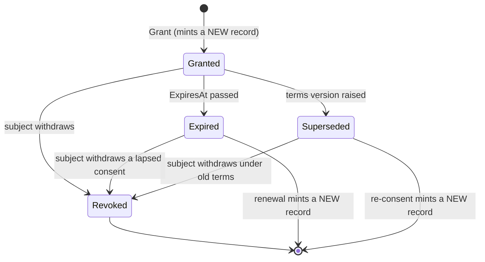
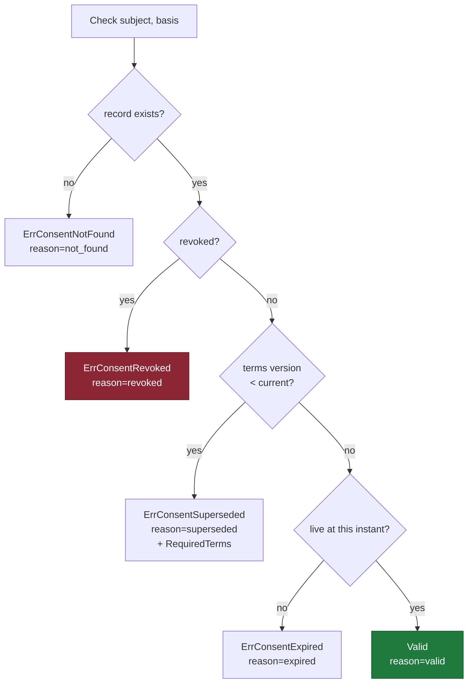
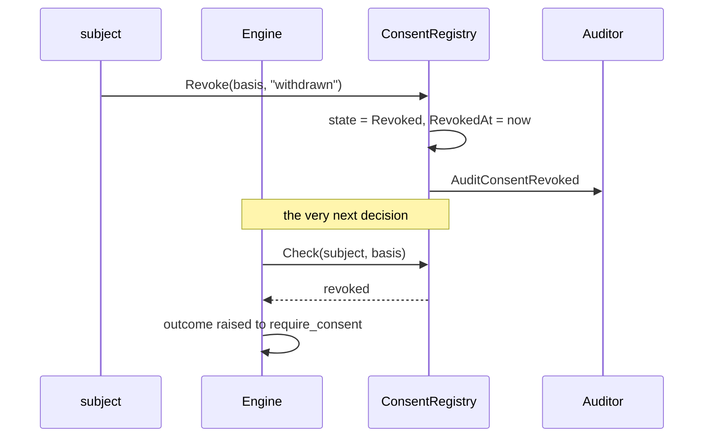
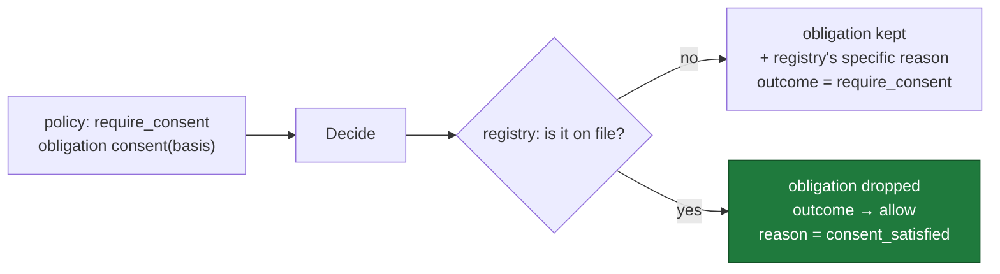
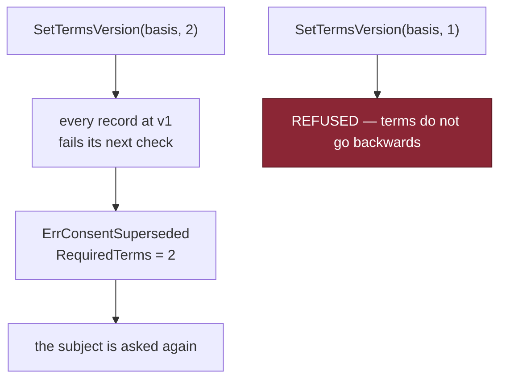
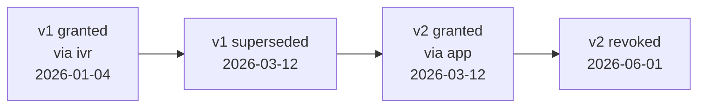

# Consent Lifecycle

**Phase 10E** · Generated from
[`consent.go`](../../packages/go/governance/consent.go) `consentTransitions()`

Four states. Every edge below is declared in the table; an undeclared transition
is refused by `canTransition` rather than happening.

---

## 1 · State machine



| State | Processing permitted | Meaning |
|---|---|---|
| **Granted** | **Yes** | Live and valid |
| **Expired** | No | Agreed, and it lapsed |
| **Revoked** | No | **They said no** |
| **Superseded** | No | Agreed to terms that have since changed |

---

## 2 · The three absent edges

```
   Revoked    ──▶ Granted   ❌ NO SUCH EDGE
   Expired    ──▶ Granted   ❌ NO SUCH EDGE
   Superseded ──▶ Granted   ❌ NO SUCH EDGE
```

**None of the three ends states is revivable.** Re-consenting always mints a
**new** record with a new identifier; the old one moves to history.

That is not tidiness. **A revocation a later grant can erase is a revocation
nobody can prove happened** — and "when did they consent, and when did they
withdraw" is precisely what a DPDP request asks. Reviving the record in place
would overwrite the answer.

The same reasoning covers expiry (renewal is a new agreement, so "when did they
consent" stays answerable) and supersession (new terms are a different thing
that happens to share a name).

`Revoked` is terminal in the strictest sense: nothing follows it.
`Expired → Revoked` and `Superseded → Revoked` **do** exist, because a subject
withdrawing a consent that had already lapsed is making a statement the record
should carry.

---

## 3 · Four negative outcomes, and why the distinction is legal



| Outcome | What the platform should do next |
|---|---|
| **not_found** | Ask |
| **expired** | Ask again |
| **revoked** | **Do not ask again casually** |
| **superseded** | Ask about the new terms — `RequiredTerms` says which |

Collapsing these into "no consent" produces a platform that asks a subject who
already refused to consent again. That is the behaviour that turns a privacy
control into a nuisance, and then into a complaint.

The check order is deliberate: **revoked is tested before expiry**, because a
subject who withdrew and whose record then lapsed said no, and "expired" would
invite exactly the wrong follow-up.

Measured: **5 of 5 states distinguishable to a caller** —
GOVERNANCE_EVALUATION §E4.

---

## 4 · Revocation is immediate



**No cache. No grace period. No TTL on the answer.**

A subject who withdraws consent has withdrawn it, and a system that keeps
processing for another five minutes is processing without a basis for five
minutes. Asserted by `TestIntegration_RevocationClosesTheGateImmediately`.

**Revoking twice is not an error.** A subject repeating themselves is not a
fault condition, and returning one would push callers into checking first, which
is a race.

---

## 5 · The gate opens when consent arrives



**A policy states WHICH consent is needed; only the registry knows whether it is
on file.** Resolving in the engine rather than the evaluator is the single
reason consent lookup is not inside the pure function.

The gate opening is not free behaviour — it is a fix. The first version only
ever *raised* the outcome, so obtaining consent dropped the obligation and left
`require_consent` in place forever: **the gate could never open and the caller
looped**. ENGINEERING_AUDIT §F4.

Obligations from every matching policy accumulate, so a decision can legitimately
carry several consent requirements and **all of them must be satisfied**.
Satisfying one does not open the gate.

---

## 6 · Terms versions



**Supersession is detected at check time, not by a batch job**, so the
transition is visible at the moment it matters rather than whenever a sweep
happened to run.

**It is deliberately disruptive.** A platform that could quietly carry old
consent forward across changed terms would have no reason ever to ask again —
which is exactly the failure the terms-version field exists to prevent.

**Terms cannot go backwards.** Lowering a version would revalidate consent that
was superseded, which is the same as forging it.

---

## 7 · History is the DPDP answer



`History(subject, basis)` returns every record, oldest first, live record last.

Each carries the fields an access request asks for: **what** (basis, purpose),
**when** (granted, expires, revoked), **under which terms** (version), **how**
(method), and **evidence** — as a **fingerprint**.

**The evidence is a fingerprint, not the artefact.** A recording or a signed form
is personal data and belongs in the system that captured it, under that system's
retention. A governance engine holding a second copy would be an unmanaged
personal-data store — the exact finding this design exists to avoid. The
limitation is stated plainly in SECURITY_REVIEW §R6: a fingerprint proves two
records reference the same artefact, not that the artefact says what anybody
claims.

`RevokeAll` withdraws every basis at once, because **a subject must not have to
enumerate bases they never knew existed**. It is the governance half of an
erasure request; Phase 10C's coordinator does the deletion.

---

## 8 · Expiry: detected twice, on purpose

| Path | When | Produces |
|---|---|---|
| `Check` | The moment somebody asks | The correct answer |
| `Sweep` | Every 30 s | An **audit entry** and a **metric** |

Correctness needs only the first. The sweep exists so that expiry produces a
record at roughly the time it happens, rather than only when somebody next asks.

**A consent that lapsed three weeks ago and was never checked is still a fact
worth recording** — and a consent registry whose expiries only appear when
convenient is one whose metrics understate how much consent has quietly gone
stale.

---

## 9 · What validation refuses

| Refusal | Why |
|---|---|
| No subject, no basis | Cannot be checked or attributed |
| `TermsVersion < 1` | Consent to something nobody can reconstruct |
| No `Method` | **How consent was obtained is the first thing a regulator asks** |
| Expiry not after grant | A record that was never valid |
| Terms version going backwards | Revalidates superseded consent |

---

## 10 · Reading the table in code

The diagram in §1 is generated from one literal:

```
cd packages/go/governance
go test -run TestConsent -v .
```

If an edge is added to `consentTransitions()` and not to this document, **the
document is the stale artefact** — the table is the source of truth.
