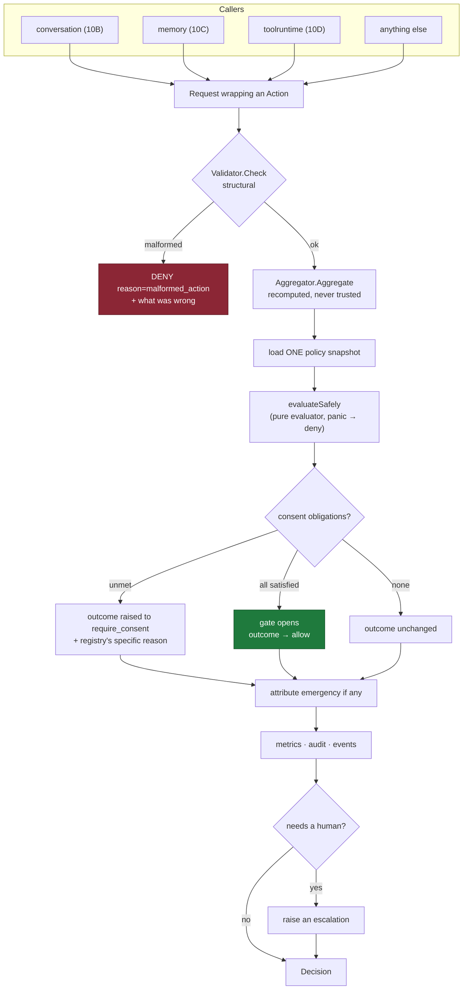
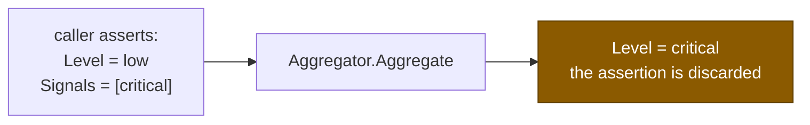
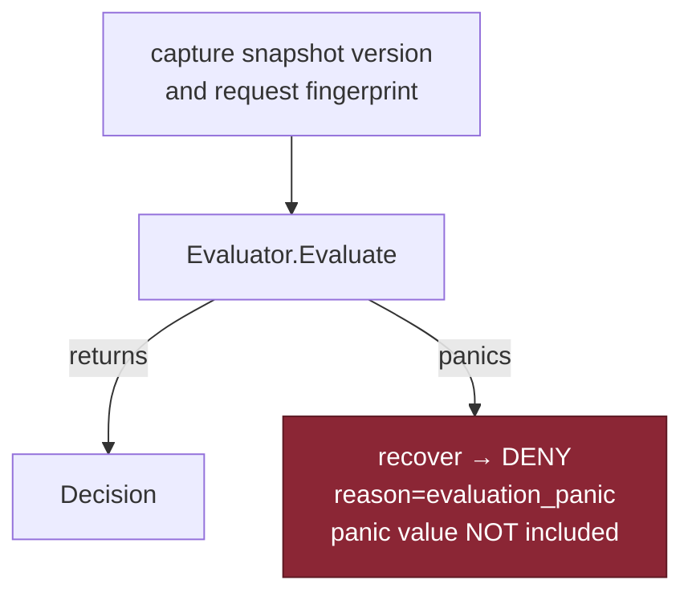
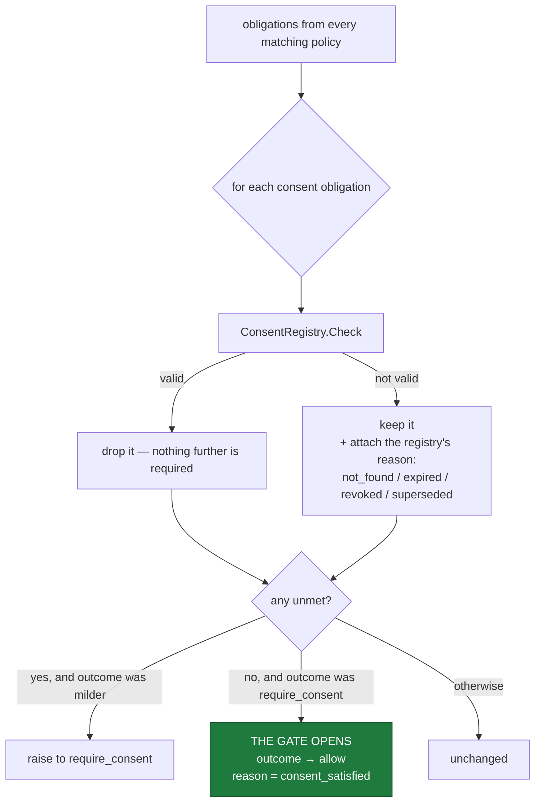
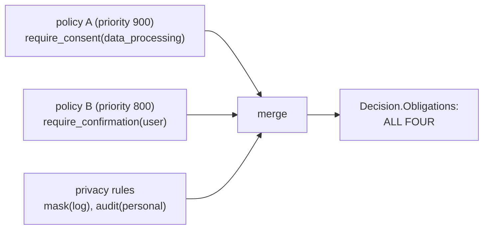
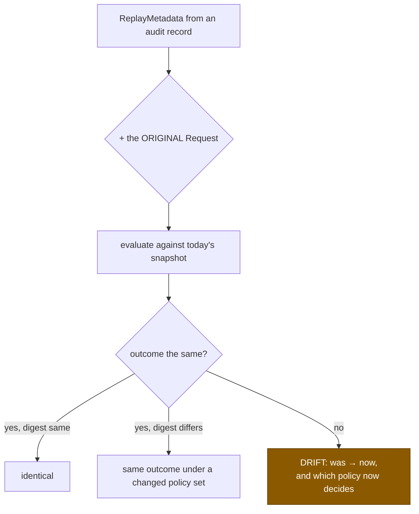

# Decision Flow

**Phase 10E** · Sourced from
[`runtime.go`](../../packages/go/governance/runtime.go),
[`decision.go`](../../packages/go/governance/decision.go)

---

## 1 · One door, end to end



---

## 2 · Why validation comes before policy

**"This action is malformed" and "this action is refused" are different facts.**

A subsystem with a typo in an operation name that sees a plain denial concludes
the platform is over-restrictive and starts arguing with the policy team. One
that sees `malformed_action` with the specific problem fixes the typo.

The validator refuses:

| Refusal | Example |
|---|---|
| Unenumerated operation | `obliterate` where the vocabulary is read/write/update/delete |
| Missing required attribute | a tool action with no `capability` |
| Missing subject where policies need one | a memory action with no subject |
| A mutating operation claiming `reversibility: none` | `delete` that changes nothing |
| **An attribute over 256 characters** | somebody passing the whole utterance |
| **An attribute containing a line break** | no identifier has one; every transcript does |

The last two are the **one mechanical defence of INV-GOV-7**. Attributes are
fingerprinted into decisions, rendered into traces and written to a durable
audit store; they carry references and codes, never content. A length bound does
not prove an attribute is not content, but it removes the failure that actually
happens. Stated as partial in SECURITY_REVIEW §R1.

---

## 3 · Risk is recomputed, never accepted



`Decide` recomputes the aggregate from the signals. A caller-asserted level would
let a compromised subsystem declare itself low-risk and walk past every
risk-aware policy in the registry.

Asserted by `TestIntegration_CallerCannotAssertALowRiskLevel`.

---

## 4 · The panic path



**Everything the recovery path needs is captured before evaluation begins.**

The first version built the fallback decision inside the deferred handler and
read `snap.Version` there. When the panic was a nil snapshot — exactly the shape
of bug this exists to survive — the handler dereferenced the same nil and
panicked again, **taking the process down at the precise moment it was supposed
to fail closed**. ENGINEERING_AUDIT §F1.

A recovery path that can fail the same way as the thing it recovers from is not
a recovery path.

The panic value is deliberately **not** put in the decision: it can contain
caller content, and a decision travels into logs, events and a durable audit
store.

`Config.FailClosedOnPanic` exists to document the choice, and validation refuses
`false`. **A panic means the engine does not know what the policies say, and "we
do not know" resolves to deny.**

---

## 5 · Consent resolution



Two asymmetries worth stating.

**Raising happens whenever any consent is unmet**, whatever the policy decided,
so a policy that forgot to demand consent still cannot write personal data
without one.

**The gate opens only from `require_consent` exactly.** If risk raised the
outcome to `require_supervisor`, satisfying consent does not lower it — a more
severe outcome came from somewhere else and consent has nothing to say about it.

The gate resolves to `Allow` rather than to whatever the next-most-severe policy
wanted, because the evaluator keeps one winner rather than a ranking. A policy
that wants something further *after* consent states it as its own rule, which is
clearer than a runner-up nobody can see in the trace. Recorded as a decision a
reviewer might challenge in ENGINEERING_AUDIT §5.

---

## 6 · Obligations accumulate



**Every matching policy's obligations survive, not just the winner's.**

An obligation is a precondition somebody wrote down. Dropping one because a
different policy happened to have a higher priority means an action proceeds
having satisfied half of what was asked — and the half it skipped is invisible,
because the losing policy sits in the trace as matched-but-not-decisive.

The concrete case that exposed this: a personal, irreversible notification
matches both *"irreversible actions require confirmation"* and *"personal data
requires consent"*. They sit at different priorities in one scope, so the
winner-takes-all version **silently discarded the confirmation requirement**.
ENGINEERING_AUDIT §F5.

A policy that must *remove* an obligation does so from a higher scope with
`Override`, where the relaxation is visible and attributed.

Merging deduplicates on kind and target and **keeps the earliest deadline** — the
tighter constraint is the one that must actually be met.

---

## 7 · What a decision carries

```
Decision{
    Outcome, Reason, Explanation
    Obligations []Obligation        ← what must be true before proceeding
    DecidedBy PolicyID, Scope       ← who decided
    Trace []TraceEntry              ← every policy consulted
    PolicyVersion uint64            ← THE REPLAY ANCHOR
    RequestPrint Fingerprint        ← inputs, without containing them
    Risk RiskAssessment
    Emergency string                ← the incident, if one applied
    Correlation, Session, Actor, Subject
    ActionLabel string              ← kind:operation — never the resource
    DecidedAt, Duration, RetryAfter
}
```

`Decision.Explain()` renders it as a readable tree. **A decision that can only
be understood by reading Go structs is a decision that will be argued about
rather than understood.**

```
decision dec_...: require_consent (personal_data_retention) by baseline.personal-data [global] snapshot=6
  retaining or sharing personal data requires a lawful basis
  obligation: consent(call_recording) not_found [org.recording]
  obligation: mask(log) classification_personal [<privacy>]
  - baseline.secrets              compliance   no rule matched
  - legal.no-export               compliance   skipped: match_kind
  * baseline.personal-data        global       rule=personal-write-needs-consent → require_consent
    baseline.irreversible         global       no rule matched
    baseline.reads                global       rule=<default> → deny
```

---

## 8 · Escalation

```mermaid
sequenceDiagram
    participant E as Engine
    participant H as HumanRuntime
    participant P as person
    participant A as Auditor

    E->>E: outcome needs a human
    E->>H: Raise(decision, kind, timeout)
    Note over H: idempotent per decision —<br/>two entries means two humans<br/>asked to approve one thing
    H->>A: AuditEscalated

    alt somebody acts
        P->>H: Approve / Reject / TakeOver (named)
        H->>A: AuditEscalationResolved
        Note over H: the FIRST resolution wins;<br/>a second gets ErrAlreadyResolved
    else nobody acts
        H->>H: Sweep → ResolutionExpired
        Note over H: expiry does NOT permit.<br/>Silence is not consent.
    end
```

`AutoEscalate` is **on by default**: a decision that says "a human must approve
this" and does not put it in front of a human is a decision that quietly becomes
a denial when the caller gives up.

An escalation carries `ActionLabel` — kind and operation — and **not the
resource**. An escalation queue is read by humans and rendered in consoles, and
a resource identifier in it is a resource identifier in a screenshot. Asserted
by `TestIntegration_EscalationCarriesNoResourceIdentifier`.

---

## 9 · Replay



**Replay needs the original request.** A fingerprint identifies inputs without
containing them, so replay from an audit record alone is impossible **by
construction** — a privacy property rather than a gap, stated here rather than
discovered by somebody expecting otherwise.

What it answers: *"would today's policies decide the same way?"* — the question a
policy change review actually has.

**A replay has no side effects.** It goes through the pure evaluator, not
`Decide`: no events, no escalations, no decision count. A replay that changed the
system would make reviewing a policy change a thing that changes the system.

---

## 10 · Failure behaviour

| Failure | Behaviour | Why |
|---|---|---|
| Audit write fails | Decision **proceeds**, failure counted | Failing would deny an action the policies permit, turning an audit-store outage into a platform outage |
| Publisher fails | Decision proceeds, drop counted | One broken subscriber must not stop the platform deciding |
| Evaluation panics | **Deny**, counted | Not knowing what the policies say resolves to deny |
| Two policies conflict | **More severe** wins, conflict reported | The platform stays safe; the operator finds out |
| Engine stopped | **Deny**, `reason=engine_closed` | |

**The audit asymmetry is deliberate and is the opposite of Phase 10D's.** A tool
execution that cannot be audited has already changed the world, so 10D proceeds
and counts. A governance decision has not yet changed anything — but failing it
would refuse something lawful. Both proceed, for different reasons, and
`RequireAuditor` ensures somebody is listening at boot.
