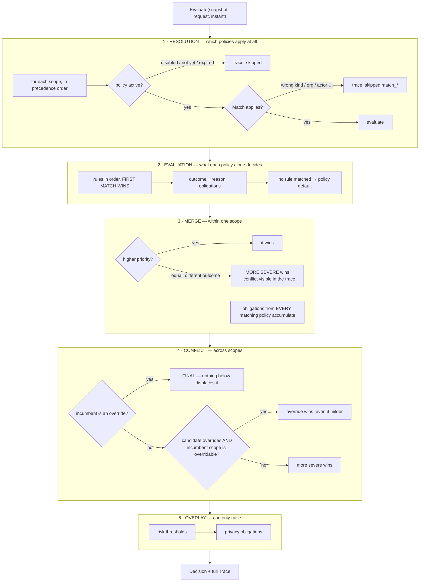

# Policy Evaluation

**Phase 10E** · Sourced from
[`evaluator.go`](../../packages/go/governance/evaluator.go)

The five-stage pipeline that turns a policy snapshot and a request into one
decision. **Pure**: no I/O, no mutation, no clock — the instant is a parameter.

---

## 1 · The pipeline



---

## 2 · Stage order is load-bearing

**Stage 5 is last and can only raise.** A risk signal that could lower an
outcome would let a detector overrule a written policy, inverting the entire
precedence model. `Thresholds.Apply` returns a candidate outcome and the
evaluator adopts it only when it is more severe.

**Stage 4 is the only place a milder outcome can win**, and only through an
override in an overridable position.

**Stage 3 accumulates obligations even from policies that lost.** See §5.

---

## 3 · Within a scope: priority, then severity

| Situation | Resolution |
|---|---|
| Different priorities | **Higher priority wins** |
| Same priority, same outcome | First wins; obligations merge |
| Same priority, **different outcome** | **More severe wins**, conflict left in the trace |

The last row is the interesting one. Rather than picking one and calling it
resolved, the engine takes the safer outcome and records both matches. **The
platform stays safe and the operator finds out.**

Silently picking by alphabetical order would be deterministic and would hide a
real configuration mistake — and `ConflictsIn` reports the same pair statically
so it can be fixed before it ever decides anything.

---

## 4 · Across scopes: three rules, in this order

```go
switch {
case winner.override:
    // An override from a higher scope is FINAL for everything below it.
case result.override && winner.scope.Overridable():
    winner = result          // milder outcome may win — the emergency path
case result.outcome.severity() > winner.outcome.severity():
    winner = result          // otherwise the safer outcome wins
}
```

### Rule 1 exists because the first version got it exactly backwards

The original code let a lower scope re-strengthen an override, on the reasoning
that an override *"relaxes a rule rather than disabling every rule beneath it"*.

That reasoning is wrong, and it **made every emergency override a no-op**: the
global denial the emergency existed to relax simply won again one scope later.
An override that anything below it can undo is not an override.
ENGINEERING_AUDIT §F3.

### Rule 2 is the entire emergency containment story

`winner.scope.Overridable()` is false only for compliance. Since compliance is
evaluated **first**, a compliance winner is already in place when the emergency
scope is reached, and the guard refuses to displace it.

That is why containment needs no special case, no flag and no configuration: it
falls out of the scope order plus one method.

### Rule 3 is the safety floor

Absent an override, **the safer outcome wins wherever it came from**. A business
policy cannot permit what the platform forbids merely by being more specific.

Measured: **36 of 36 ordered scope pairs resolved to the safer outcome; 7 of 7
overridable scopes relaxed by an emergency; compliance held** —
GOVERNANCE_EVALUATION §E3.

---

## 5 · Obligations accumulate; outcomes do not

```
outcome      ← ONE winner per scope, then one winner overall
obligations  ← the UNION of every matching policy, everywhere
```

An outcome is an answer to "may I". Obligations are answers to "what must be
true first", and there is no reason two policies cannot each have one.

Dropping a loser's obligation means an action proceeds having satisfied half of
what was asked, with the other half invisible in the trace as
matched-but-not-decisive. ENGINEERING_AUDIT §F5.

---

## 6 · The trace records everything consulted

```
  - baseline.secrets       compliance   no rule matched
  - legal.no-export        compliance   skipped: match_kind
  * baseline.personal-data global       rule=personal-write-needs-consent → require_consent
    baseline.irreversible  global       rule=irreversible-confirm → require_confirmation
    baseline.reads         global       rule=<default> → deny
```

| Trace state | Meaning |
|---|---|
| `skipped: disabled` / `not_yet_effective` / `expired` | Not in force |
| `skipped: match_kind` / `match_org` / `match_actor` … | Out of scope for this request |
| `no rule matched` | **Evaluated**, nothing fired, default applied |
| `rule=X → outcome` | Fired |
| `*` | Decisive |

**Every policy consulted appears, including the ones that did not match**
(INV-GOV-6). A trace that shows only the winner answers "what happened" but not
"why did the rule I wrote do nothing" — which is the question an operator
actually has.

The distinction between *skipped* and *evaluated-but-no-rule-matched* is why
`Match` and `Rule.When` are separate concepts: they produce different trace
entries and lead to different fixes.

---

## 7 · Cost

Evaluation visits **every policy** in order to produce a complete trace.

| Policies | Per decision | Per policy |
|---:|---:|---:|
| 10 | 12.0 µs | 1.20 µs |
| 50 | 29.6 µs | 592 ns |
| 100 | 48.2 µs | 482 ns |
| 200 | 80.7 µs | 403 ns |

**Linear, with a fixed overhead of roughly 7 µs** (validation, fingerprinting,
risk, metrics, audit, events).

The obvious optimisation — index policies by action kind so out-of-kind policies
are never visited — **would make the trace incomplete**, and the trace is the
thing that makes a denial explainable. Recorded as a documented, not-yet-taken
option in PERFORMANCE §5; the honest position is that at 200 policies this costs
0.014% of a conversational turn.

---

## 8 · Purity, and the one thing that is not pure

`Evaluate` performs no I/O, mutates nothing and reads no clock. Asserted by
`TestEvaluator_IsPureAndTakesNoClock`: 100 identical evaluations, and afterwards
zero events published and zero decisions counted.

**Consent lookup is the exception, and it lives outside.** A policy states *which*
consent is needed; only the registry knows whether it is on file. Resolving it
inside `Evaluate` would make the function stateful and would put a lock on the
pure path.

`Engine.resolveConsent` runs after evaluation, in the engine, where impurity is
expected — which keeps the evaluator exportable for a what-if console that must
not touch anything.

---

## 9 · Determinism

| Source | Closed by |
|---|---|
| Scope order | `AllScopes()` — a fixed slice |
| Policy order within a scope | Pre-sorted at registration by priority then ID |
| Rule order | Declaration order; first match wins |
| Obligation order | Sorted by kind, target, policy |
| Attribute reads | Sorted keys in canonical encoding |
| Time | A parameter |

Measured: **50 runs, 0 outcome / 0 trace / 0 obligation divergences** —
GOVERNANCE_EVALUATION §E5.

---

## 10 · Static conflict detection

`ConflictsIn(snapshot)` compares, for each same-scope same-priority pair, the
**set of outcomes each policy can produce**. Two policies that can only ever say
Deny agree, however differently they reach it; anything else is reported.

Conservative by design — it over-reports — and over-reporting a possible conflict
is the right direction to be wrong in when the alternative is a production
decision going the wrong way.

Measured at **135 µs for 200 policies, zero allocations**. Run at boot and after
every policy load, never on the request path.
