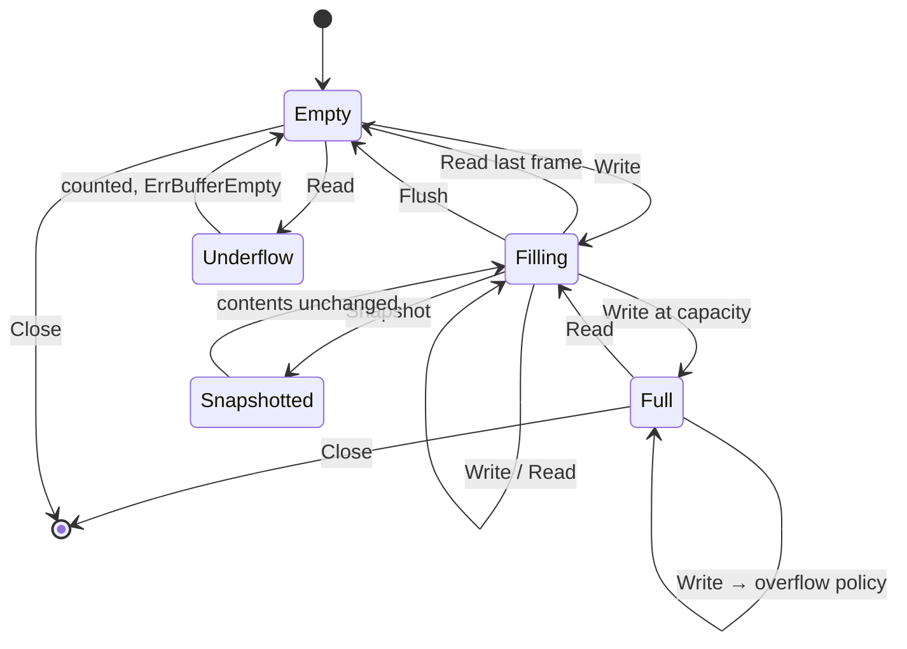

# Buffer Lifecycle

**Phase 11B** · `packages/go/media/buffer.go`, `packages/go/media/jitter.go`

The engine holds audio in **two** stages. Confusing them is the single easiest
mistake to make in this subsystem, so they are documented together.

| | Jitter buffer | Ring buffer |
|---|---|---|
| Purpose | Absorb arrival variation, reorder | Hand delivered audio to a consumer |
| Timeline | Media time (playout position) | None — it is a queue |
| Owns payloads | No — **clones** on `Put` | Yes — single backing array |
| Bounded by | `JitterConfig.Capacity` (32) | `BufferConfig.Capacity` (50) |
| Frames leave via | `Get`, when due | `Read`, immediately |

---

## Ring buffer lifecycle

### Two rings, not one

A ring of frame **metadata** and a single backing array for **payloads**. The
obvious alternative — a ring of `[]byte`, one allocation per frame — allocates
fifty thousand times a second at a thousand streams.

The cost is that payload storage is contiguous and a frame's bytes may not wrap,
so a frame that would straddle the end of the array is placed at the start
instead and the tail is left unused until the read pointer passes it. That wastes
at most one frame's worth of space and removes an entire class of allocation.

**Measured: ring write 37 ns, read+write 56 ns, peek 22 ns — all 0 allocs/op.**
`TestZeroAllocation_SteadyState` fails if that changes.

### Overflow policies

| Policy | Behaviour | When it is right |
|---|---|---|
| `DropNewest` | **Default.** Refuse the incoming frame, keep what is buffered | Real-time audio. Buffered frames are older, so closer to being played; discarding them to make room for newer audio creates a gap in what the consumer is about to read |
| `DropOldest` | Evict the oldest to make room | Freshness beats continuity — a live monitoring feed. **Wrong for transcription**, which needs continuity |
| `Block` | Refuse with `ErrBufferFull`, let the caller decide | When the caller has its own policy |

`Block` never blocks internally. A blocking write inside a media engine holds a
producer goroutine that is usually a network reader, and a stalled network reader
backs up into the carrier. The caller blocks if it chooses to.

### Underflow

A read on an empty buffer returns `ErrBufferEmpty` and increments the underflow
counter. **This is normal, not a fault** — it is what a consumer that has caught
up looks like. It is counted because a rising underflow rate is how a starving
consumer becomes visible.

---

## Jitter buffer lifecycle

The jitter buffer works in **media time**, not wall time. A frame is released
when the playout position reaches it, and the playout position advances by the
audio consumed. This is what makes the buffer deterministic: the same input
sequence produces the same output sequence regardless of how fast the test ran.

### Three positions, and why there are three

| Position | Advances on | Answers |
|---|---|---|
| `playout` | Release (`Get`) | What media has already been consumed |
| `frontier` | Arrival (`Put`) | How far ahead the *data* has reached |
| `releaseFrontier` | Monotonic max of `playout + current` | Up to where frames are due |

`frontier` exists because the too-early bound must mean "far ahead of the data",
not "far ahead of a reader that stopped". Anchoring it on `playout` meant a
stalled consumer froze the bound while the adaptive delay shrank it from both
ends, and a **perfectly clean 50 fps sequence** was refused at frame 9.

`releaseFrontier` is monotonic because `current` shrinks as the estimator learns
the line is clean. Reading `playout + current` directly meant a frame that was due
a moment ago stopped being due, and the buffer walked its own release limit
backwards until it stalled.

### Adaptive delay

Target is **twice** the measured jitter, bounded by `[MinDelay, MaxDelay]` =
`[20 ms, 200 ms]`. Twice because jitter is a mean deviation and a buffer sized at
exactly the mean absorbs only half the variation; 2× covers the great majority
without paying for the tail, which is what `MaxDelay` is for.

It moves in 5 ms steps rather than jumping. A buffer that resized abruptly would
either discard audio (shrinking) or insert a gap (growing), both audible.

### Playout always makes progress

`playout` advances only on release, and a frame is released only once `playout`
reaches it. When a sequence goes missing, the head sits at a timestamp beyond
where `playout` can reach and **neither will ever move**: the buffer holds audio
it has decided is not due, forever. One lost packet would end the stream.

The buffer therefore steps over the hole — moves `playout` to the head and
releases it — and the pipeline synthesises bounded silence for the gap. Waiting
longer cannot help: the missing sequences are older than audio already held, so
if they arrive at all they arrive late and are refused as late, which is the same
outcome minus the stall.

Holes stepped over are counted (`skipped`). A rising value is packet loss.

---

## Backpressure — measured

A producer offering 500 frames at 50 fps against a consumer that never reads:

| Measure | Value |
|---|---|
| Frames offered | 500 |
| Accepted | 82 |
| **Refused (reported to the producer)** | **418** |
| Jitter buffer held, final | ≤ 32 (capacity) |
| Ring held, final | ≤ 50 (capacity) |
| Stream state after overload | `active` |

Source: `TestBackpressure_StalledConsumerIsBoundedByCapacity`.

The property that matters is not that frames were dropped — under sustained
overload that is unavoidable — but that the drop was **reported to the producer**
rather than absorbed silently, and that memory stayed bounded throughout.
Dropping under overload is designed behaviour, not a fault, so the stream stays
`active`.

---

## Snapshots capture both stages

A snapshot taken for recovery captures the ring **and** the jitter buffer, in
playout order, because audio held in the jitter buffer is in flight. Capturing
only the ring — as an earlier revision did — routinely captured nothing, since a
frame reaches the ring only when pumped.

Ring frames always precede held frames in the capture: a frame reaches the ring
only by being released from the jitter buffer, and release is strictly in playout
order.

The capture is bounded by `MaxAudioFrames` applied to the **union**, keeping the
newest — oldest audio is closest to having been played already; the newest is
what a resumed consumer still needs. `BufferedDropped` records what was omitted,
so a reader can distinguish a partial capture from a complete one.

**This is PCM, and it is governed by MEDIA-PCM-1** — see
[SECURITY_REVIEW.md](SECURITY_REVIEW.md).
