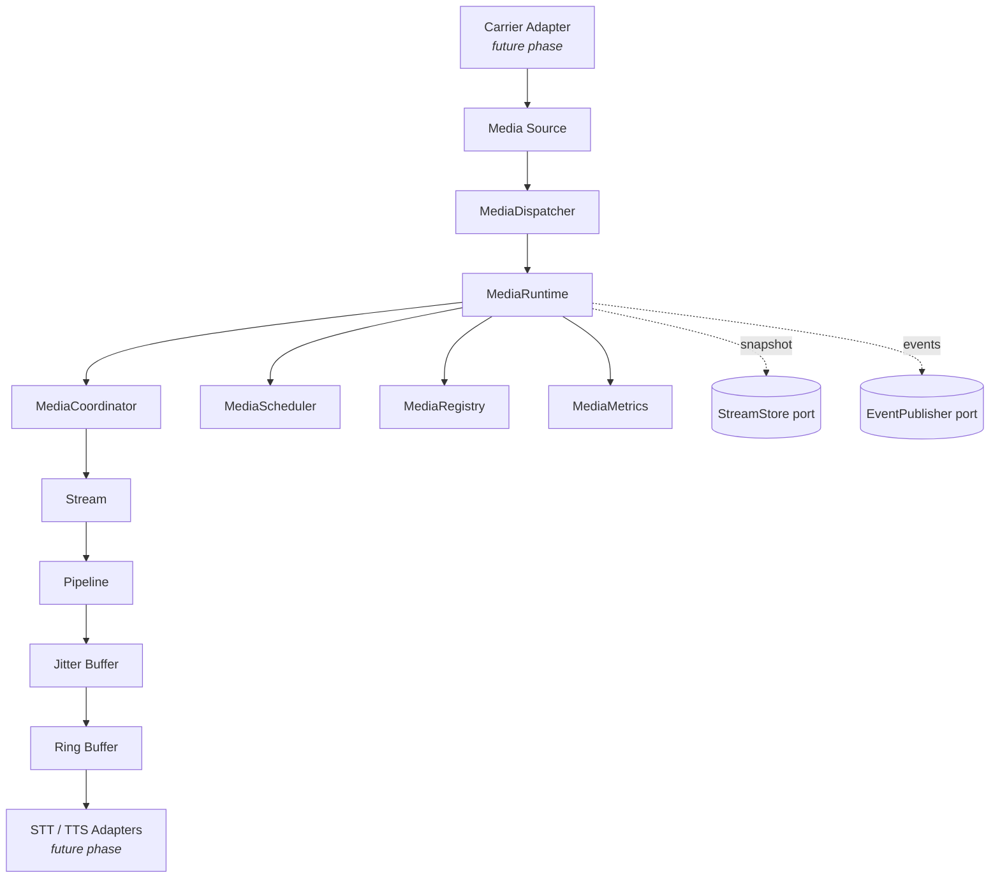

# Media Streaming Architecture

**Phase 11B** · `packages/go/media`

---

## 1. What this subsystem is

Real-time audio transport. A `MediaRuntime` owns `Stream` instances; each stream
carries `Frame` values through a `Pipeline` that validates, orders and delivers
them into a `RingBuffer` a consumer reads.

```
Carrier Adapter → Media Source → MEDIA STREAMING ENGINE → Audio Buffer → Pipeline → STT/TTS
   (future)                            (this)                                        (future)
```

## 2. What it is not

No speech recognition. No speech synthesis. No AI reasoning. No carrier
integration. No SIP, no RTP networking, no WebRTC, no microphone or speaker APIs,
no voice activity detection, no codecs, no resamplers, no DSP.

The distinction that matters: this package moves a frame of PCM from one side to
the other, on time, in order, under backpressure. It does not know what a packet
looks like on a wire, and it does not know what the samples mean.

## 3. The six runtime components

| Component | Owns | Source |
|---|---|---|
| `MediaRuntime` | Lifecycle of the engine itself; the sweep and pump loops; recovery on start | `runtime.go` |
| `MediaCoordinator` | The stream lifecycle verbs — Open, Pause, Resume, Drain, Close | `runtime.go` |
| `MediaScheduler` | Admission. Refuses beyond capacity; never queues | `runtime.go` |
| `MediaDispatcher` | The frame entry point — routes a frame to its stream | `runtime.go` |
| `MediaRegistry` | The set of live streams, sharded | `registry.go` |
| `MediaMetrics` | Runtime-scoped instruments | `metrics.go` |



### The scheduler refuses, it does not queue

Each stream pre-allocates its ring buffer, so admitting beyond capacity does not
degrade gracefully — it allocates memory the process does not have. A refusal is
immediate and the caller can fail the call cleanly; a queue would hold a carrier
waiting for memory that is not coming.

Reservation and decision are **one atomic step**. Checking and then reserving
lets N goroutines observe capacity for one slot and all take it, precisely under
the burst where it matters.

## 4. Ports, not drivers

Nothing in this module opens a connection.

| Port | Satisfied later by | Source |
|---|---|---|
| `StreamStore` | Redis (hot path, short TTL) or Aurora (audit trail) | `recovery.go:25` |
| `EventPublisher` | The Kafka adapter in `packages/go/eventbus` | `events.go` |
| `SourceCheck` | The carrier adapter's reattachment probe | `recovery.go` |

`StreamStore` names no database — no Redis, no SQL, no connection, no driver.
That is what lets the entire recovery path be tested with no infrastructure. The
only implementation that ships in Phase 11B is `MemoryStreamStore`, which is
in-process and dies with the process.

`EventPublisher` has one method and no Kafka vocabulary. Topic naming follows the
`eventbus` shape `<domain>.<entity>.<event>.v<major>` — `media.stream.<event>.v1`
— but no broker client exists in this module.

## 5. Dependencies

```
packages/go/media
  ├── packages/go/runtime   (Phase 10A — Clock, FSM)
  └── packages/go/metrics   (Phase 10.5 — Counter, Gauge, Histogram)
```

Both are dependency-free, so the transitive closure is the Go standard library.
There is deliberately **no dependency on `packages/go/telephony`**: a media stream
is created *for* a call, but the streaming engine does not need to know what a
call is. Coupling the two would make the media engine untestable without a
telephony runtime and would put call-lifecycle vocabulary into a buffer.

## 6. Ordering rules

1. A frame is **validated** before it is timed.
2. It is **timed** before it is reordered.
3. It is **reordered** before it is sequenced.
4. It is **sequenced** before it is delivered.

Each stage's guarantee depends on the previous one having held. Timestamp
validation against a poisoned media position is meaningless, so the format and
shape checks come first; reordering against an unvalidated timestamp would let
one corrupt frame move the playout position permanently.

## 7. Ten invariants

| # | Invariant | Enforced by |
|---|---|---|
| 1 | A stream is in exactly one of nine states | `runtime.FSM` over `transitionSpec()` |
| 2 | No code path assigns a state directly | Only `Stream.Transition` exists; no setter |
| 3 | Only `StateActive` accepts frames | `StreamState.AcceptsFrames()` |
| 4 | A stream's audio format never changes | `StreamContext` is immutable; `INV-MED-4` at construction |
| 5 | Neither buffer exceeds its configured capacity | `RingBuffer` fixed slots; `JitterConfig.Capacity` |
| 6 | Frame payloads are borrowed, never owned by the reader | `RingBuffer` single backing array; documented on `Frame` |
| 7 | The jitter buffer holds cloned frames | `JitterBuffer.Put` clones; `Peek` clones |
| 8 | Every deadline measures against the injected clock | `runtime.Clock`; one documented exception (drain) |
| 9 | Playout always makes progress | Hole-skipping in `JitterBuffer.Get` |
| 10 | Events and metrics carry no PCM | `TestMediaEvent_CarriesNoAudio` by reflection |

## 8. Concurrency model

Each `Stream` carries its own lock, and two streams share nothing — a thousand
concurrent streams contend only when they land on the same registry shard.

**Lock ordering:** the FSM lock is taken before the stream lock, never the
reverse. The natural way to write the reverse is to hold the stream lock while
asking the FSM whether a move is legal, and that deadlocks against any hook that
reads the stream.

`MediaMetrics` is runtime-scoped, not global: two runtimes in one process share
nothing, which is what makes the test suite parallel-safe.
