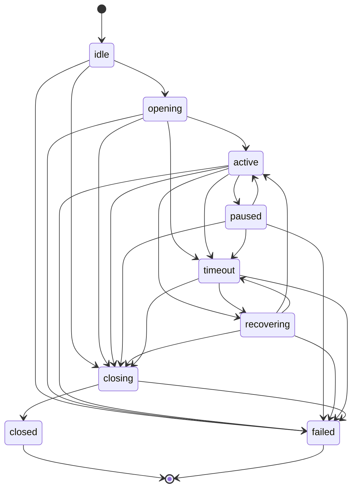

# State Transitions

**Phase 11B** · `packages/go/media/state.go`

A stream is in exactly one of **nine** states. Every legal move is declared in
`transitionSpec()`. A transition not declared there is refused at run time; a
malformed table is refused at construction by `runtime.NewFSM`. **Nothing assigns
a state directly** — there is no setter, only `Stream.Transition`.

---

## The diagram

## The nine states

| State | Meaning | Terminal |
|---|---|---|
| `idle` | Created, not started. The initial state | no |
| `opening` | Acquiring resources — buffer allocation, source attachment | no |
| `active` | Carrying frames. The only state a write is accepted in | no |
| `paused` | Stopped accepting frames, buffer retained | no |
| `recovering` | Reattaching a source after a fault or restart | no |
| `closing` | Draining. Writes refused, reads continue until empty | no |
| `closed` | Normally terminated | **yes** |
| `failed` | Abnormally terminated | **yes** |
| `timeout` | The source stopped producing | **no** — see below |

## The declared table

Transcribed from `transitionSpec()`:

| From | May go to |
|---|---|
| `idle` | `opening`, `closing`, `failed` |
| `opening` | `active`, `closing`, `failed`, `timeout` |
| `active` | `paused`, `recovering`, `closing`, `failed`, `timeout` |
| `paused` | `active`, `closing`, `failed`, `timeout` |
| `recovering` | `active`, `closing`, `failed`, `timeout` |
| `timeout` | `recovering`, `closing`, `failed` |
| `closing` | `closed`, `failed` |
| `closed` | — |
| `failed` | — |

## The three predicates

| Predicate | True for | Why |
|---|---|---|
| `AcceptsFrames()` | `active` only | Not `opening` — resources are not ready. Not `paused` — that is what a pause means. Not `closing` — that is what draining means. Not `recovering` — the source is being reattached and its sequence numbers are not yet trusted |
| `DeliversFrames()` | `active`, `paused`, `closing` | A paused stream's consumer may drain what was already buffered, and a closing stream delivering nothing would discard exactly the audio the drain exists to save |
| `HoldsResources()` | everything except `idle`, `closed`, `failed` | The predicate a capacity check uses — including `timeout`, because a timed-out stream's buffer is not freed until it concludes |

---

## The sharp cases

### `timeout` is not terminal

A source that stalled for two seconds may come back. A timed-out stream also
still holds a buffer that must be released. Making `timeout` terminal would leave
that release unmodelled — the buffer would be freed by something outside the
state machine, which is exactly the kind of hidden state this design refuses.

### `paused` cannot go straight to `recovering`

Recovery reattaches a source. A paused stream's source is still attached. Routing
through `active` makes the reattachment explicit rather than implying it.

### `closing` cannot return to `active`

A drain is a commitment. A stream that resumed mid-drain would deliver frames to
a consumer that had already been told the previous ones were the last.

### A stream may begin only at `idle` or `recovering`

Those are the only two ways a stream legitimately begins — new, or restored from
a snapshot. Allowing an arbitrary start would let a caller fabricate an active
stream that never opened.

### A restored stream starts in `recovering`, not its snapshotted state

The same rule Phase 11A applies to calls, for the same reason. The snapshot says
`active`; the process that believed it is gone, and no source is attached. A
stream restored directly into `active` would accept frames from a producer that
does not exist and report a healthy stream carrying nothing.

`recovering` says what is true: this stream existed, and its source must be
reattached before it can carry audio.

### Close from `active` passes through `closing`

Going straight from `active` to `closed` is not declared. It would discard
buffered audio without the drain that makes the discard deliberate.

---

## What enforces this

| Property | Test |
|---|---|
| Nine states exist | `TestState_NineStatesExist` |
| The table is complete | `TestState_TransitionTableIsComplete` |
| Every state is reachable | `TestState_EveryStateIsReachable` |
| Undeclared transitions are refused | `TestState_FSMRefusesUndeclaredTransition` |
| Only `active` accepts frames | `TestState_OnlyActiveAcceptsFrames` |
| `paused` and `closing` still deliver | `TestState_PausedAndClosingStillDeliver` |
| `paused` cannot reach `recovering` directly | `TestState_PausedCannotGoDirectlyToRecovering` |
| `closing` cannot return to `active` | `TestState_ClosingCannotReturnToActive` |
| A stream begins only at `idle` or `recovering` | `TestState_StreamMayOnlyBeginIdleOrRecovering` |
| `timeout` is not terminal | `TestState_TerminalAndTimeout` |
| A restored stream starts `recovering` | `TestRestore_StartsInRecoveringNotTheSnapshottedState` |
| Close passes through `closing` | `TestLifecycle_CloseFromActivePassesThroughClosing` |

All twelve pass.
