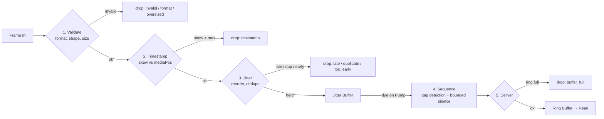

# Streaming Pipeline

**Phase 11B** · `packages/go/media/pipeline.go`

Every frame that enters the engine passes through five stages. The stages are
ordered, and each one's guarantee depends on the previous having held.

---

## The pipeline

Stages 1–3 run on `Push`, synchronously with the producer. Stages 4–5 run on
`Pump`, which is driven by the runtime's pump loop and by a read-through in
`Stream.Read`.

---

## Stage 1 — Validate

Checks the frame's format matches the pipeline's, that the frame is internally
well-formed, and that its payload fits `MaxFrameBytes`.

| Drop reason | Meaning |
|---|---|
| `format` | The frame's `AudioFormat` is not the pipeline's |
| `invalid` | `Frame.Validate()` failed — malformed shape |
| `oversized` | Payload exceeds `MaxFrameBytes` |

A frame larger than the bound is **refused, not truncated**. Truncating audio
produces a frame that is valid to every downstream check and wrong to a listener.

## Stage 2 — Timestamp

The frame's timestamp is compared against the pipeline's own media position, and
refused if the skew exceeds `MaxTimestampSkew` (default five minutes).

| Drop reason | Meaning |
|---|---|
| `timestamp` | Skew from the pipeline's media position exceeds the bound |

**This is the guard against one bad frame stalling a stream forever.** A source
whose timestamps jump hours ahead — a clock bug, a corrupted header, a replayed
session — would otherwise poison the jitter buffer's playout position
permanently. The check runs against the pipeline's own position, which one bad
frame cannot move, rather than against the jitter buffer's playout.

## Stage 3 — Jitter and reordering

The frame is offered to the jitter buffer, which measures arrival variation,
holds the frame on a delayed media timeline, and inserts it in timestamp order.

| Drop reason | Disposition | Meaning |
|---|---|---|
| `late` | `FrameLate` | Its playout moment has already passed |
| `duplicate` | `FrameDuplicate` | Sequence already held or already released |
| `too_early` | `FrameTooEarly` | Beyond the window, or the buffer is at capacity |

`too_early` carries **two** meanings, and the distinction matters operationally:
a frame far ahead of the data frontier is a source fault, while a frame refused
because the buffer is at capacity is **backpressure** — the producer outrunning
the consumer. See [BUFFER_LIFECYCLE.md](BUFFER_LIFECYCLE.md).

Reordering is measured, not merely tolerated: a frame inserted anywhere other
than the tail is counted as `Reordered`.

## Stage 4 — Sequence and gap fill

When a frame is released from the jitter buffer, the pipeline compares its
sequence against the one it expected. A discontinuity is a gap.

Silence is synthesised for the missing sequences, **bounded by `MaxGapFill`**
(default 200 ms). A source that vanished for a minute must not produce a minute
of invented audio: that would delay real audio behind it and tell a transcriber
there was a minute of silence rather than a minute of nothing.

Synthesised frames carry `FlagSilence`, so a consumer can always distinguish
invented audio from received audio.

## Stage 5 — Deliver

The frame is written to the output ring.

| Drop reason | Meaning |
|---|---|
| `buffer_full` | The output ring had no room |

### Pump does not drain into a full ring

Taking a frame out of the jitter buffer to hand it to a full ring **destroys**
it: the ring refuses, the frame is gone, and the producer is never told. The pump
therefore stops when the ring is full and leaves frames held, so the jitter
buffer fills to its capacity and `Put` begins refusing — which the producer sees.

One frame's worth of loss, reported, instead of an unbounded silent stream of it.

`DropOldest` is exempt: that policy is a deliberate statement that the newest
audio matters more than continuity, so the ring is always willing to make room
and holding frames back would defeat it.

---

## The complete drop reason set

`AllDropReasons()` — nine, all bounded enum values safe as metric labels:

`invalid` · `format` · `late` · `duplicate` · `too_early` · `buffer_full` ·
`not_accepting` · `timestamp` · `oversized`

`not_accepting` is produced by the stream rather than the pipeline: a write to a
paused, draining or closed stream.

---

## Errors versus drops

`Push` returns an error only for a frame the pipeline could not evaluate at all.
An ordinary drop is reported in the `PipelineResult`, because **dropping frames
is normal operation** and returning an error for it would train callers to ignore
errors.
