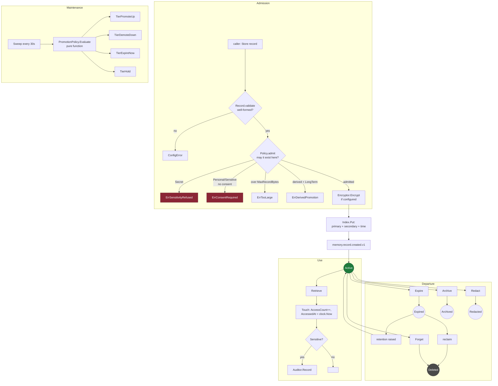
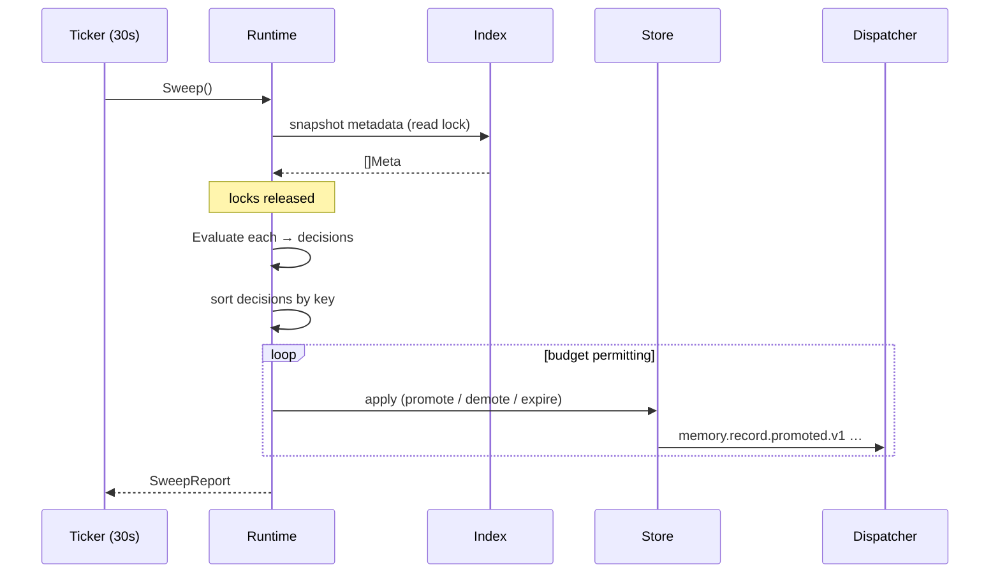
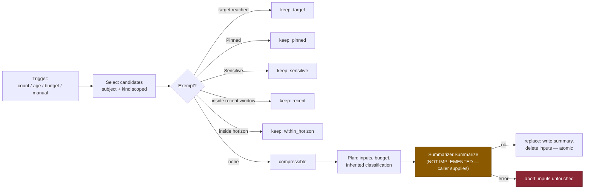
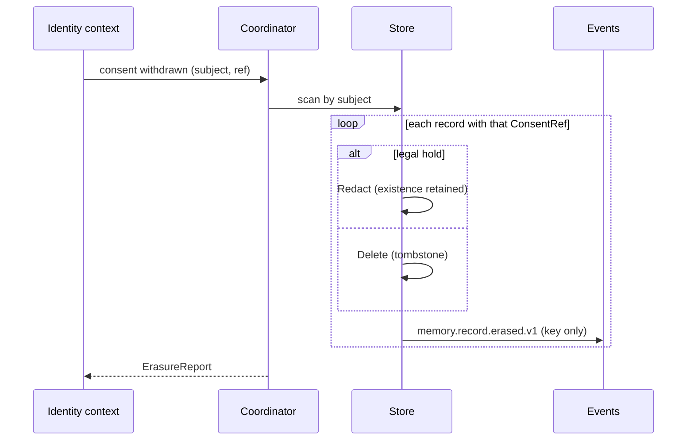

# Memory Lifecycle

**Phase 10C** · Sourced from
[`lifecycle.go`](../../packages/go/memory/lifecycle.go),
[`store.go`](../../packages/go/memory/store.go),
[`runtime.go`](../../packages/go/memory/runtime.go)

How a memory comes into existence, moves between tiers, is compressed, and
leaves. The *state machine* is in
[MEMORY_STATE_DIAGRAM.md](MEMORY_STATE_DIAGRAM.md); this document is the
lifetime it traverses.

---

## 1 · End-to-end



---

## 2 · Admission — two gates, one authority each

| Gate | Question | Failure |
|---|---|---|
| `Record.validate` | **Is this record well-formed?** | `*ConfigError` |
| `Policy.admit` | **May this record exist here?** | Typed sentinel |

The split matters. A missing name is a programming error; a missing consent
reference is a *policy outcome a caller must be able to branch on*. When the
consent check briefly lived in both, the structural error shadowed the typed
sentinel and callers could not distinguish them — ENGINEERING_AUDIT §F1.

**Two paths enforcing one rule is how the wrong one wins.**

### What admission refuses

| Refusal | Sentinel |
|---|---|
| Secret classification | `ErrSensitivityRefused` |
| Personal/Sensitive without valid consent | `ErrConsentRequired` |
| Payload over `MaxRecordBytes` (256 KiB) | `ErrTooLarge` |
| Derived record written straight to long term | `ErrDerivedPromotion` |
| Scratchpad above the working tier | `*ConfigError` |
| Legal hold with a duration | `*ConfigError` |

**Refusal is at write.** An unlawful memory is never created and then found by
an audit; it never exists.

---

## 3 · Timestamps come from the engine's clock

```
CreatedAt   ← clock.Now()   at first Store
UpdatedAt   ← clock.Now()   at every successful Update
AccessedAt  ← clock.Now()   at every successful Retrieve
ExpiresAt   ← CreatedAt + Retention.Duration()
```

**A caller-supplied timestamp is overwritten.** A caller could otherwise set
`CreatedAt` in the past and skip the retention window, or set it in the future
and become immortal. Retention is not a field a caller fills in.

Everything goes through `rt.Clock`, so a 90-day retention window is testable in
microseconds — the reason `TestEvaluation_RetentionIsNeverEarly` exists at all.

---

## 4 · Promotion ladder

`PromotionPolicy.Evaluate(record, now) → Decision`

```
                    ┌─────────────────────────────────┐
                    │ Pinned?          → TierHold     │
                    │ State != Active? → TierHold     │
                    └──────────────┬──────────────────┘
                                   │ neither
                    ┌──────────────▼──────────────────┐
   idle > IdleToDemote (10 min)?  → TierDemoteDown    │
   working tier & idle > 30s?     → TierExpireNow     │
   AccessCount >= 3 &&                                │
     age >= 5s &&                                     │
     not (derived && next == LongTerm) → TierPromoteUp│
   otherwise                      → TierHold          │
                    └─────────────────────────────────┘
```

| Threshold | Default | Why this number |
|---|---|---|
| `AccessesToPromote` | 3 | A record read three times inside one 20–40 s screening call is load-bearing, not incidental |
| `MinAgeToPromote` | 5 s | Stops a burst of reads in one turn promoting something never read again |
| `IdleToDemote` | 10 min | Longer than any single call, shorter than a session |
| `IdleToExpire` | 30 s | Spans a whole conversation, so working memory survives the call it serves |

**`Evaluate` is a pure function** of record, policy and instant. No I/O, no
locks, no hidden state. That is what makes the ladder exhaustively
table-testable (`TestPromotion_DecisionTable`) and what makes a memory's history
reproducible: given the same record and the same instant, the same decision,
forever.

Measured at **7.8 ns, zero allocations** — which is why `Sweep` can evaluate
10,000 records in 429 µs.

### Demotion is not deletion

A demoted record still exists, still retrievable, just cheaper to hold. Only the
working tier expires on idleness, because there is no tier beneath it.

---

## 5 · Sweep — collect, then apply



Three properties, each deliberate:

**Decisions are collected before any is applied.** Mutating while iterating
means a promotion changes what the next evaluation sees, and the outcome of one
sweep depends on map iteration order — the same 10,000 records producing
different results on different runs.

**Decisions are applied in sorted key order.** Determinism, asserted by
`TestRuntime_SweepIsDeterministic`.

**`SweepBudget` caps work per pass.** A sweep that finds 400,000 expired records
after an outage must not take the process down with it. It does what fits and
reports what it left; the next tick continues.

---

## 6 · Compression — framework only

**No summarisation is implemented.** `Summarizer` is an interface with no
implementation in this module; `ConcatSummarizer` in the harness concatenates
and is named so nobody mistakes it for one. Per the brief: *"Only framework. No
LLM summarisation yet."*

What *is* implemented is everything around the model:



### Exemption precedence — durable before incidental

Order: **target → pinned → sensitive → recent → within_horizon**

A pinned record inside the recent window is reported `pinned`, not `recent`.
"Pinned" is a property of the record; "recent" is a property of where the window
happens to fall today. An operator reading a compression report needs the reason
that will still be true tomorrow. This was a real defect — ENGINEERING_AUDIT §F3.

### Sensitive records are never compressed

Summarisation would mean sending Sensitive content to a model. **The engine does
not decide that.** A deployment that wants it configures it explicitly.

### Replacement is atomic

Summary written, then inputs deleted, in one operation. A failure between the
two would either lose the originals with no summary, or leave both and
double-count the history. On summariser error, **nothing is touched** —
`TestIntegration_FailedSummarisationLeavesInputsIntact`.

### Classification inheritance

A summary inherits the **strictest** sensitivity and the **longest** retention
of its inputs. Summarising three Internal records and one Personal record
produces a Personal record. The alternative — a summary classified more loosely
than its sources — is a laundering path.

---

## 7 · Departure

| Route | Trigger | Result |
|---|---|---|
| **Expire** | Retention elapsed, or working-tier idleness | `Expired`; revivable until reclaimed |
| **Archive** | Cold-storage policy | `Archived`; `ColdStore` is not implemented here |
| **Redact** | Consent withdrawn; forgetting one fact | Payload **and attributes** destroyed, existence retained |
| **Forget** | Subject erasure right | Deleted, or Redacted under legal hold |
| **Reclaim** | Sweep after expiry | `Deleted` + tombstone |

### Tombstones

A deleted key leaves a tombstone. Without one, a key could be silently reused
and a stale reader could not tell "deleted" from "never existed" — the exact
ambiguity §5 of the architecture doc exists to remove.

### Erasure spans every namespace

`Coordinator.Forget` walks all four namespaces. A subject's memories are spread
across assistant, receptionist, fraud and telephony; an erasure reaching only one
is a compliance failure that reports success. No caller has to remember the list.

`ErasureReport.Complete` is false whenever anything survived, and the surviving
keys are named per namespace. **An erasure that silently retains is worse than
one that refuses.**

Measured: **135 µs for 100 records** across all namespaces, including the
unindexed subject scans.

---

## 8 · Consent withdrawal



Withdrawal is not a flag consulted at read time. **The records go.** A record
retained after withdrawal and merely filtered out at read is still personal data
being processed without a basis.

---

## 9 · Lifecycle timings

| Event | Interval | Source |
|---|---|---|
| Sweep | 30 s | `Config.SweepInterval` |
| Working-tier expiry | 30 s idle | `IdleToExpire` |
| Demotion | 10 min idle | `IdleToDemote` |
| Short-term retention | 24 h | `RetentionShort` |
| Standard retention | **90 days** | `RetentionStandard`, matching ADR-0012 transcripts |
| Legal hold | **No duration** | Refused if configured with one |

Standard retention is **not chosen independently**. A memory layer outliving the
transcripts it summarises would be a second, unregulated copy of the same
personal data with a different deletion date.

---

## 10 · Tests covering this document

| Property | Test |
|---|---|
| Consent refused at write | `TestPolicy_PersonalDataRequiresConsent` |
| Secret never stored | `TestPolicy_SecretIsNeverStored` |
| Timestamps from the clock | `TestIntegration_IdleWorkingMemoryExpires` |
| Promotion ladder | `TestPromotion_DecisionTable`, `TestIntegration_PromotionLadder` |
| Derived never auto-promotes | `TestPolicy_DerivedLongTermIsRefusedByDefault` |
| Sweep deterministic | `TestRuntime_SweepIsDeterministic` |
| Sweep respects budget | `TestLoad_SweepStaysWithinBudget` |
| Compression atomic on failure | `TestIntegration_FailedSummarisationLeavesInputsIntact` |
| Exemption precedence | `TestIntegration_CompressionPreservesWhatMatters` |
| Classification inheritance | `TestIntegration_CompressionWithSummarizer` |
| Erasure spans namespaces | `TestIntegration_ForgetSpansEveryNamespace` |
| Legal hold survives and is reported | `TestIntegration_LegalHoldSurvivesErasureAndIsReported` |
| Retention horizon | `TestEvaluation_RetentionIsNeverEarly` |
