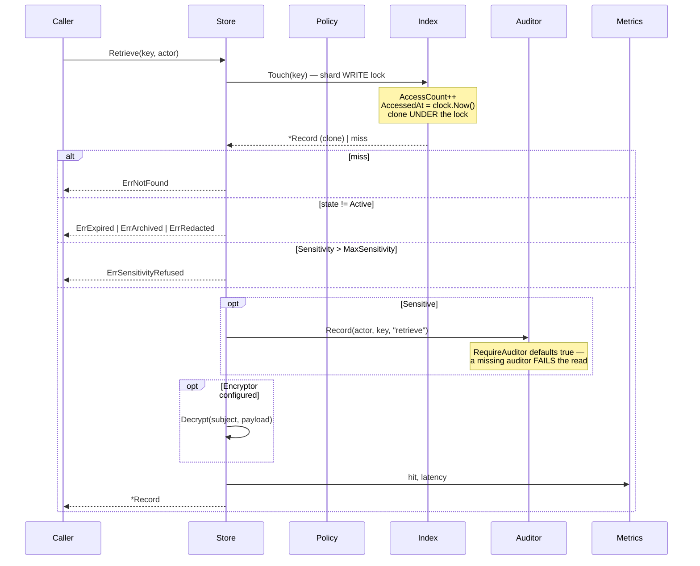
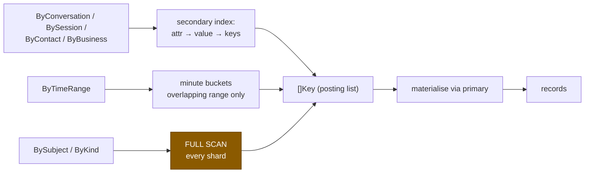
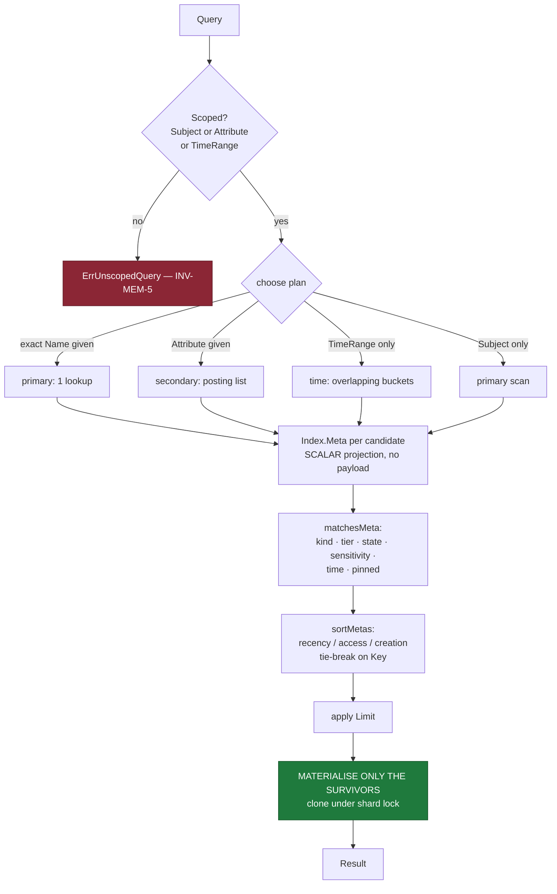
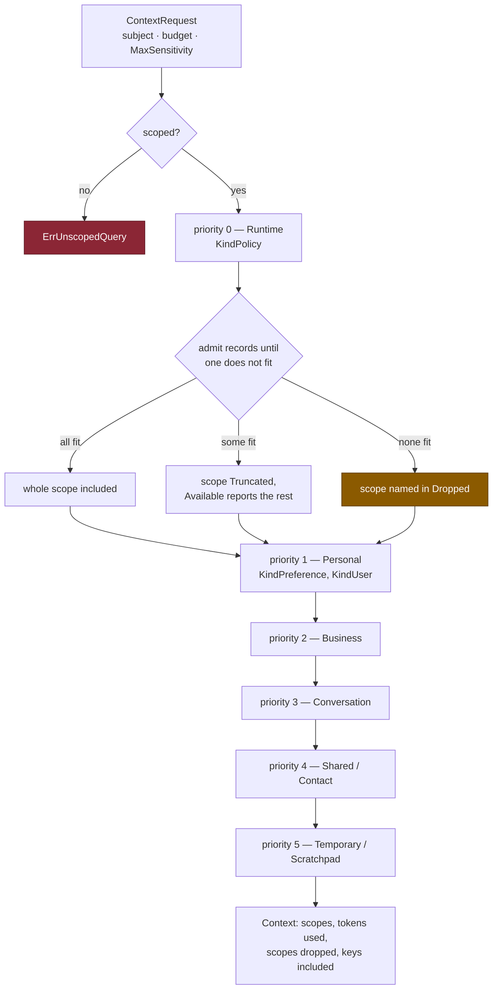

# Memory Retrieval Flow

**Phase 10C** · Sourced from
[`retrieval.go`](../../packages/go/memory/retrieval.go),
[`index.go`](../../packages/go/memory/index.go),
[`contextbuilder.go`](../../packages/go/memory/contextbuilder.go)

Three read paths, in ascending cost: **point retrieve** (287 ns), **indexed
lookup** (682 ns), **scoped search** (77 µs). There is no fourth path, and in
particular there is no similarity search — the engine has no vectors, no
embeddings and no distance function anywhere in it.

---

## 1 · Point retrieve



### Four distinct failures, never one nil

`ErrNotFound` · `ErrExpired` · `ErrArchived` · `ErrRedacted`

"Never existed", "aged out", "in cold storage" and "destroyed on purpose" are
four different facts about the world. Collapsing them into one nil is the most
common way a memory layer becomes impossible to operate: a caller cannot tell a
bug from a policy outcome, and neither can the person reading the logs at 3 a.m.

### The clone happens under the lock

```go
// Get returns a CLONE of the stored record.
// It clones UNDER the read lock, and that is a correctness requirement...
// Returning a pointer out of a lock is returning a promise the lock cannot keep.
```

Cloning after release leaves a window in which a concurrent writer mutates the
record being copied. It also lets a caller mutate a stored record without a
version bump, which defeats optimistic locking and every audit guarantee resting
on it. This was a real latent race — ENGINEERING_AUDIT §F2.

### The read path takes a write lock

`Touch` updates `AccessCount` and `AccessedAt`, so the "read" path is a write.
That is not an oversight: **access statistics are what drive promotion**, and
promotion is what makes the memory ladder explainable rather than heuristic.

Measured cost of that decision:

| | ns/op |
|---|---|
| Serial | 287 |
| Parallel, 256 keys across 16 shards | 487 |
| Parallel, **all goroutines on one key** | 388 |

~1.7× under contention, and the pathological single-key case is *cheaper* than
the spread case because it stays in one core's cache. Moving the counters to
atomics is a documented, deliberately-not-taken option —
PERFORMANCE §3.

---

## 2 · Indexed lookup



**The four "dedicated" indexes are one index with four reserved attribute
names** — `AttrConversation`, `AttrSession`, `AttrContact`, `AttrBusiness`.
Four bespoke structures would mean four sets of maintenance bugs and four places
to forget a removal. A record joins an index by carrying an attribute.

**Nothing is inferred.** The engine never parses a payload to discover a
reference. A memory belongs to a conversation because a caller said so.

| Lookup | Cost | Structure |
|---|---|---|
| `ByConversation` (100 records) | 682 ns, 1 alloc | posting list |
| `ByTimeRange` (500 records / 500 buckets) | 7.0 µs | bucket scan |
| `BySubject` (1,000 records) | 29.8 µs | **full scan** |

### Why subject lookup is a full scan

A subject index must be maintained on **every write**, to serve a query used
only by erasure and diagnostics — neither latency-sensitive. Paying on every
write for a query that runs on erasure is the wrong trade. The cost is measured,
reported, and revisitable if the access pattern changes.

---

## 3 · Scoped search



### An unscoped query is refused — INV-MEM-5

A query with no subject, no attribute and no time range is "give me everything".
Serving it means an accidental full-store dump, and the first time it happens in
production it is either a latency incident or a privacy one. `ErrUnscopedQuery`
makes it a compile-time-adjacent mistake instead.

### Filter on metadata, materialise the survivors

```go
// FILTER AND SORT ON METADATA, MATERIALISE ONLY THE SURVIVORS.
// The first version cloned every candidate, sorted the clones and threw most
// away — 910 allocations to return 20 records out of 200.
```

`Index.Meta` projects the scalars a filter and a comparator need — key, tier,
sensitivity, state, timestamps, access count, one attribute — without touching a
payload.

| | ns/op | allocs |
|---|---|---|
| Clone-everything (first version) | 87,684 | 910 |
| **Meta projection** | **77,477** | **549** |
| | −11.6% | **−40%** |

The allocation reduction is the real result; the time saving is modest because
this benchmark is dominated by the unindexed kind scan, not by cloning. Stated
plainly rather than rounded up — PERFORMANCE §5.

### Plan selection order

| Condition | Plan | Why first |
|---|---|---|
| Exact `Name` | primary | One lookup beats any scan |
| `Attribute` set | secondary | Posting list is already the answer set |
| `TimeRange` only | time buckets | Scans only overlapping buckets |
| `Subject` only | primary scan | Last resort, and the reason §2 explains the trade |

### Deterministic ordering

Every comparator falls back to the key. Two records created in the same clock
tick would otherwise order by map iteration, and the same query would return
different pages on different calls. `TestRetrieval_OrderIsDeterministic`.

---

## 4 · Context assembly



### Priority is the load-bearing column

Under budget pressure, what survives is what a caller can **least afford to
lose**:

| Priority | Scope | Losing it means |
|---|---|---|
| 0 | Runtime (policy, limits) | The assistant is **dangerous** |
| 1 | Personal (preferences) | The assistant is **rude** |
| 2 | Business | The assistant is **wrong about the business** |
| 3 | Conversation | The assistant is **forgetful** |
| 4 | Shared (contacts) | Mild |
| 5 | Temporary (scratchpad) | Nothing |

An assistant that forgets an operating limit is worse than one that forgets the
last three exchanges. That ordering is a product decision expressed as a
constant, not an emergent property of a scoring function.

### Truncation is permitted; silence about it is not

A scope admits records until one does not fit, then stops. It does **not** skip
ahead to find a smaller record that would fit — a context whose contents depend
on payload size rather than on relevance is worse than one that is visibly
short, and it would leave a caller unable to explain why turn 7 is present and
turn 6 is not.

Every cut is legible: `ContextSlice.Truncated` with `Available` says how many
records the scope could have carried, and `AssembledContext.Dropped` names scopes
omitted entirely. A caller can tell a short context from a complete one, and
decide whether to re-request with a larger budget or a narrower window.

Measured under a starved budget — [MEMORY_EVALUATION.md](MEMORY_EVALUATION.md)
§E6 — the runtime, personal and business scopes survived whole at 25% of demand
and conversation history absorbed the entire cut. The stricter rule asserted by
test is that **runtime and personal must never be truncated**: a context
confidently wrong about the subject is worse than one short of history.

### The builder writes nothing

Assembling context is a **pure read**. If it mutated — promoted what it
included, say — two concurrent builds on one subject would each change what the
other sees, and a context would stop being reproducible from the store's state.
`TestContext_DoesNotMutateWhatItReads`.

Measured: **62 µs, 237 allocs** for a 2,048-token context over 52 records. Well
inside a per-turn budget in a 900 ms p50 conversational loop (ADR-0011).

---

## 5 · Token estimation

No tokenizer is vendored — that would bind the engine to one provider, and the
brief requires provider agnosticism. `DefaultTokenEstimator` counts bytes by
script class:

| Script | Bytes/token | ns/op |
|---|---|---|
| Latin | ~4 | 25.5 |
| Devanagari and other Indic | ~2 | 41.5 |

Devanagari costs roughly twice as many tokens per byte across every major
tokenizer. A single ratio would over-fill Hindi contexts by ~2× and silently
truncate them — an India-first platform cannot use a Latin-only heuristic.

**The estimate is deliberately conservative.** Under-filling a context wastes
budget; over-filling it truncates a prompt at the provider, which is a failure
the engine cannot see or recover from.

`TokenBudget.Estimator` is swappable, so a deployment that knows its provider's
tokenizer can supply an exact one without touching this module.

---

## 6 · Cost summary

| Path | Cost | Notes |
|---|---|---|
| `Retrieve` | 287 ns / 3 allocs | Includes clone and Touch |
| `Retrieve` parallel | 487 ns | 1.7× contention |
| `ByConversation` | 682 ns / 1 alloc | Posting list |
| `ByTimeRange` | 7.0 µs | 500 buckets |
| `BySubject` | 29.8 µs | Unindexed, deliberate |
| `Search` (200 → 20) | 77 µs / 549 allocs | Dominated by kind scan |
| `ContextBuild` | 62 µs / 237 allocs | 2,048 tokens, 52 records |
| Token estimate | 25–42 ns / 0 allocs | |

Full method and machine details: [PERFORMANCE.md](PERFORMANCE.md).
