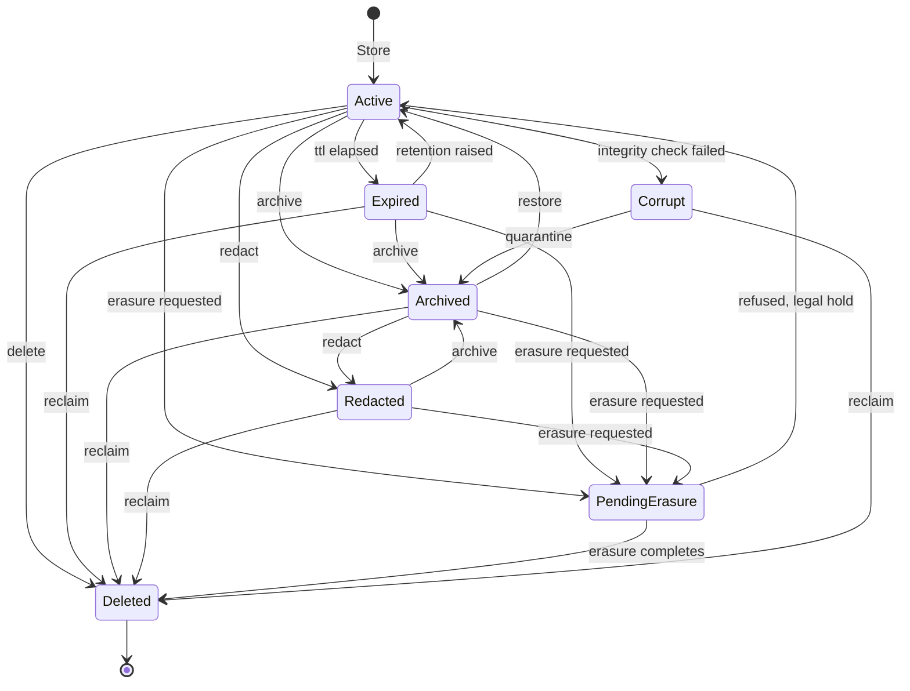
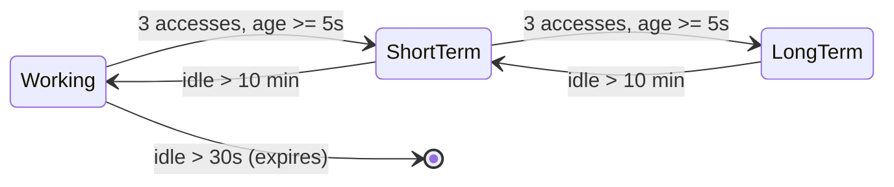
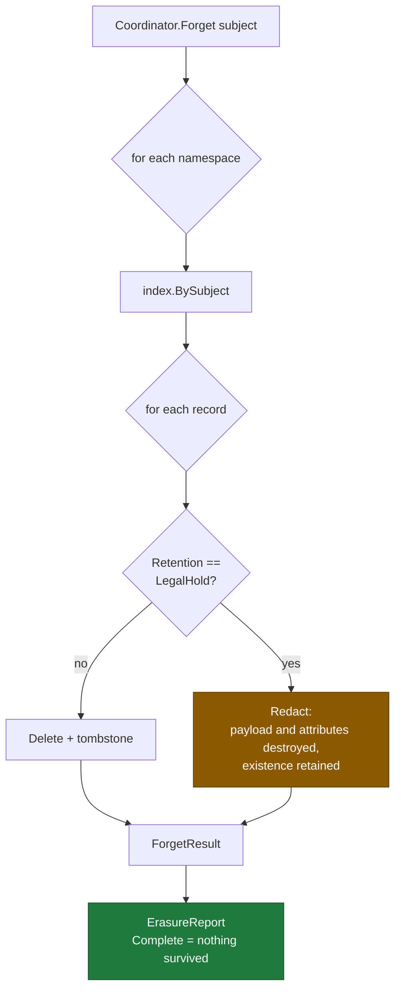

# Memory State Diagram

**Phase 10C** · Generated from
[`lifecycle.go`](../../packages/go/memory/lifecycle.go) `lifecycleTable()`

Seven states. Every edge below is declared in the table; an undeclared
transition is refused by `canTransition` rather than happening.

---

## 1 · Record lifecycle



---

## 2 · The two absences that carry weight

```
   Redacted ──▶ Active     ❌ NO SUCH EDGE
   Corrupt  ──▶ Active     ❌ NO SUCH EDGE
```

**`Redacted → Active` does not exist.** A redacted record has had its payload
destroyed on purpose, usually because a subject asked or a consent was
withdrawn. Reviving it would mean recovering content the engine was instructed
to destroy. The record can still be archived or reclaimed — its *existence* is
retained, which is frequently the obligation — but the content does not come
back.

**`Corrupt → Active` does not exist.** Silently repairing a record that failed
an integrity check makes corruption indistinguishable from truth. A corrupt
record is quarantined or reclaimed, never healed.

Both are asserted by test (`TestLifecycle_RedactedNeverReturnsToActive`,
`TestLifecycle_CorruptIsNeverRepaired`).

---

## 3 · The one presence that carries weight

```
   Expired ──▶ Active      ✅ DELIBERATE
```

A subscriber raising their retention preference should not discover that data
was destroyed while it was merely *marked* expired and had not yet been
reclaimed. Expiry and deletion are separate states precisely so this revival is
possible.

*Test:* `TestLifecycle_ExpiredCanRevive`

---

## 4 · Deletion versus redaction

The distinction most memory systems collapse, and the one DPDP work depends on.

| | Deleted | Redacted |
|---|---|---|
| Payload | Gone | Gone |
| Indexed attributes | Gone | **Gone** |
| Record's existence | Gone (tombstone only) | **Retained and provable** |
| Retrieve returns | `ErrNotFound` | `ErrRedacted` |
| Used for | Ordinary erasure | Legal hold; forgetting one fact rather than disappearing |

**Redaction destroys indexed attributes too.** Leaving them would keep the
record discoverable by content that was supposed to be gone — a searchable ghost.

*Test:* `TestIntegration_RedactDestroysIndexableAttributes`

---

## 5 · Tier movement is independent of state

State and tier are **orthogonal**. A record is promoted while remaining Active;
it can be Archived at any tier.



| Guard | Effect |
|---|---|
| `Pinned` | Never moves, never expires |
| `State != Active` | Never moves |
| `Provenance.Derived` | Never reaches LongTerm unless `PromoteDerived` |

**Promotion is single-step.** A record cannot jump from working to long term in
one move, so the promotion record stays legible — which is what makes "why does
it remember that" answerable.

There is **no tier below Working**, so an idle working record expires rather
than demoting.

*Tests:* `TestPromotion_DecisionTable`, `TestIntegration_PromotionLadder`

---

## 6 · Erasure decision



**An erasure that retains anything does not report itself complete.** A subject
exercising an erasure right is entitled to know what was kept and on what basis,
so `ErasureReport` names the surviving keys per namespace. An erasure that
silently retains is worse than one that refuses.

*Tests:* `TestIntegration_ForgetSpansEveryNamespace`,
`TestIntegration_LegalHoldSurvivesErasureAndIsReported`

---

## 7 · Structural guarantees

Asserted by `TestLifecycle_TableIsWellFormed`:

| # | Property | Consequence if violated |
|---|---|---|
| 1 | Every state reachable from Active | A state that is dead code pretending to be behaviour |
| 2 | Every non-terminal state can reach Deleted | A record that can never be reclaimed — a leak with a legal name |
| 3 | Deleted has no outgoing edges | A "deleted" record that continues |

The table is additionally validated by `runtime.FSM` at construction
(`TestLifecycle_FSMValidatesTheTable`), which rejects self-transitions and edges
out of terminal states — so the frozen Phase 10A machine checks the shape and
`canTransition` serves the hot path without building one FSM per record.

---

## 8 · Reading the table in code

The diagram above is generated from one literal. To verify it matches:

```
cd packages/go/memory
go test -run TestLifecycle_TableIsWellFormed -v
```

If an edge is added to `lifecycleTable()` and not to this document, **the
document is the stale artefact** — the table is the source of truth.
