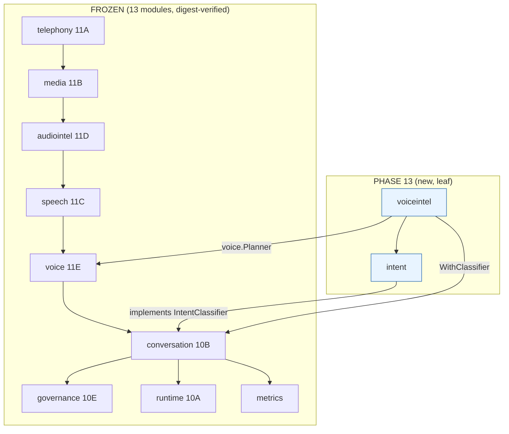

# Phase 13 — Architecture

**Status legend used throughout Phase 13 docs:** IMPLEMENTED · VERIFIED LOCALLY ·
MEASURED · CI-PENDING · NOT RUN · BLOCKED · OUT OF SCOPE.

## The central claim

**Phase 13 does NOT introduce a second intelligence engine.**

The intelligence machinery — intent resolution, confidence thresholds,
clarification budgets, turn-taking, context, planning — already existed, frozen,
inside `packages/go/conversation`. What was missing was an implementation of the
one extension port that engine already declared, and anybody calling it.

`packages/go/intent` implements the existing
`conversation.IntentClassifier` contract. `packages/go/voiceintel` calls the
existing `conversation.WithClassifier` option and hands the result to `voice`
through the `voice.Planner` interface `voice` already declares
`*conversation.Conversation` satisfies.

Before Phase 13, `conversation.NewEngine` appeared exactly once in the
repository — in `voice/e2e_test.go`, without a classifier — so
`intent.go:277` applied to every production utterance: *"an engine with no
classifier resolves every utterance to the fallback intent."*

**A future model-backed classifier may implement the same port. No model-backed
implementation exists in this phase.** There is no runtime model inference
anywhere in Phase 13.

## Dependency direction



`intent` depends on `conversation` only (plus `runtime` and `metrics`
transitively). `voiceintel` is a leaf: imported by nothing, importing
`conversation`, `intent`, `voice`, `runtime`.

VERIFIED LOCALLY — `go list -deps -test ./...`:

| Module | third-party | governance | toolruntime | memory |
|---|---|---|---|---|
| `intent` | 0 | absent | absent | absent |
| `voiceintel` | 0 | **present** (pre-existing, transitive via `voice`; declared `// indirect` in `go.mod` since T6) | absent | absent |

## Components

### `conversation.IntentClassifier` — the port
```go
Classify(u Utterance, expect Expectation) ([]Candidate, []Slot, error)
```
Frozen. `intent.Classifier` satisfies it with a compile-time assertion.

### `packages/go/intent` — the deterministic classifier
4 non-test files (`classifier.go`, `lexicon.go`, `slots.go`, `turn.go`), 7 test
files. Closed 11-name vocabulary, rule/lexicon matching, bounded input
(`maxTokens = 512`, `lexicon.go:217`), canonical candidate and slot ordering,
no clock read, no randomness, no package-level mutable state beyond one
read-only lookup table.

### `packages/go/voiceintel` — the composition root
1 non-test file (`bridge.go`), 7 test files. Its entire job:

```go
engineOpts := []conversation.Option{conversation.WithClassifier(classifier)}
eng, err := conversation.NewEngine(o.convCfg, engineOpts...)
```

`Bridge.Planner(id, persona)` returns a `voice.Planner`. `Bridge.Conversation(id)`
exposes the frozen `*conversation.Conversation`, which is how callers reach
`Context()` — necessary because `conversation.Slot` carries no value field, so
slot *values* cannot cross the classifier port.

`Bridge` holds exactly one field, `*conversation.Engine`. Structurally guarded
(`TestT10_BridgeHoldsNoCrossSessionState`): a map, slice or `sync` field would
be a cross-session registry and fails the build's tests.

### Reused frozen machinery — none of it reimplemented
`ContextEngine` (per-session, bounded), `TurnManager` (floor control,
backchannel classification by *duration*), `InterruptionEngine`,
`ClarificationEngine`, `IntentEngine` (thresholds, verdicts), `Planner`
(response strategy), the conversation FSM, and `voice`'s session FSM.

## Turn / interruption classification

`intent.ClassifyTurn(TurnInput) TurnSignal` is a pure function. **Every field of
both structs is a frozen `conversation.*` type** — guarded by
`TestT11`/`TestTurn_EveryTurnSignalFieldIsAFrozenType`. It cannot express a
`conversation.State` or `Trigger`, so it cannot drive the FSM.

Three of the eight semantic categories are *decided* by frozen components and
arrive as inputs, never recomputed: acknowledgement (`TurnManager.NoteOverlap`
→ `FloorBackchannel`, by overlap duration), interruption (floor arbitration),
clarification (`IntentEngine.Resolve` → `IntentVerdict`). See
[TURN_SEMANTICS.md](TURN_SEMANTICS.md).

## Boundaries

**Governance** — Phase 13 makes no governance decision and bypasses none.
`intent` cannot reference governance (import guard). The frozen refusal
vocabulary (`voice.OutcomeDenied`, `conversation.ErrNotAllowed`) stays
authoritative and distinct from failure.

**Provider/model** — no provider abstraction, no model, no network. `net/http`,
`net`, `crypto/tls`, `os/exec`, `database/sql` are all absent from the
dependency closure.

**Tools** — `intent` has no `toolruntime` dependency and no
persistence/execution-shaped exported API (guarded since T5).

**Memory** — no `memory` dependency; no second context or memory system.

## Session isolation

One `Bridge`, one immutable classifier, one config, shared across sessions.
Per-session state lives only in the per-conversation engines `conversation`
itself creates. VERIFIED LOCALLY across T7, T9, T10, T13.

## CI integration

`pr-go.yml` auto-discovers all 45 workspace modules from `go.work` — Phase 13
included, no workflow edit needed. `hardening.yml`'s hard-coded `AI_MODULES` was
extended by exactly two lines (T14), placing `intent` and `voiceintel` into the
race, coverage and benchmark loops. **CI has not executed** — see
[FINAL_REPORT.md](FINAL_REPORT.md) §11.

## Related documents

[INTENT_MODEL](INTENT_MODEL.md) · [CONTEXT_MODEL](CONTEXT_MODEL.md) ·
[CONFIDENCE_MODEL](CONFIDENCE_MODEL.md) ·
[CLARIFICATION_POLICY](CLARIFICATION_POLICY.md) ·
[RESPONSE_STRATEGY](RESPONSE_STRATEGY.md) · [SECURITY](SECURITY.md) ·
[CONCURRENCY](CONCURRENCY.md) · [EVALUATION](EVALUATION.md) ·
[PERFORMANCE](PERFORMANCE.md) · [LIMITATIONS](LIMITATIONS.md) ·
[ENGINEERING_AUDIT](ENGINEERING_AUDIT.md) · [FINAL_REPORT](FINAL_REPORT.md) ·
[DEPENDENCY_MAP](DEPENDENCY_MAP.md) · [TURN_SEMANTICS](TURN_SEMANTICS.md) ·
[EVALUATION_FIXTURES](EVALUATION_FIXTURES.md) ·
[ADR-0016](../adr/0016-intent-classification.md)
