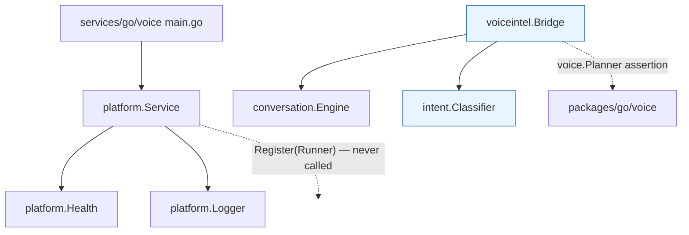
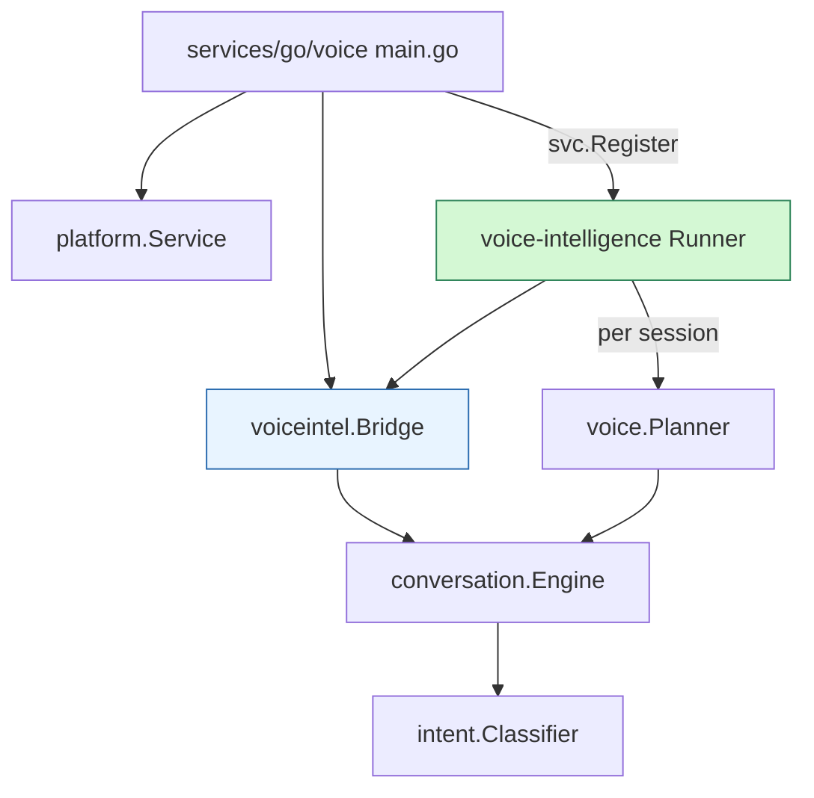

# Phase 14 — T1 Service Dependency / Wiring Audit

Inspection only. No production code was written for T1.

Status labels: IMPLEMENTED · VERIFIED · MEASURED · CI-VERIFIED · NOT RUN ·
BLOCKED.

## 1. Service entrypoints — all 16 are lifecycle scaffolds

Every service is `services/go/<name>/cmd/server/main.go`, either 45 or 78 lines,
and every one does exactly the same thing: load config, build logger, build
health, build `platform.Service`, call `Run(ctx)`.

| Lines | Services |
|---|---|
| 45 | analytics, cognitive-reasoning, compliance, consumer, family, fraud-detection, speech-streaming, **voice** |
| 78 | billing, contacts-sync, edge-api, identity, media-relay, notification-fanout, session-orchestrator, telephony-gateway |

VERIFIED by inspection:

- **No service calls `svc.Register(...)`.** Zero `Runner` implementations are
  registered anywhere.
- **No service imports `packages/go/voice`, `packages/go/conversation` or
  `packages/go/speech`.** Confirms Phase 12 T8's finding, still true.
- Even the two services with an `internal/app` package (`identity`,
  `media-relay`) **do not import it from `main.go`** — verified, count 0.

`identity/cmd/server/main.go` states it plainly: *"PHASE 2 SCOPE: this wires
configuration, logging, health and the lifecycle. The domain behaviour described
above is implemented in a later phase."*

**`services/go/voice/cmd/server/main.go` is 45 lines and contains no voice
pipeline, no session, no planner and no conversation engine.**

## 2. Current voice construction path

`packages/go/voice` provides `NewPipeline` (pipeline.go:363) and `NewSessionFSM`
(fsm.go:241).

**Neither is constructed anywhere in production.** VERIFIED: the only
non-test construction sites in the entire repository are inside `voice`'s own
tests.

## 3. Current Planner construction

`voice.Planner` (pipeline.go:96) is the seam:

```go
Handle(e conversation.Event) (conversation.Plan, error)
```

`voice` asserts `var _ Planner = (*conversation.Conversation)(nil)` at
pipeline.go:123. **No production code constructs a Planner.**

## 4. Current `conversation.Engine` construction

`conversation.NewEngine` appears in exactly two places repo-wide:

| Site | Nature |
|---|---|
| `packages/go/voice/e2e_test.go:328` | test, **without** a classifier |
| `packages/go/voiceintel/bridge.go:120` | **Phase 13 production code, with `WithClassifier`** |

So the only production construction of a conversation engine anywhere is the one
Phase 13 added.

## 5. Current classifier construction

`intent.New(intent.DefaultConfig())` is constructed inside
`voiceintel.New(...)` (bridge.go). Nothing else constructs a classifier.

## 6. Current `voiceintel` availability

Built, CI-verified, and **imported by nothing**. `voiceintel` is a leaf module.
It is in `go.work` (45 modules) and in `hardening.yml`'s `AI_MODULES` (16
entries).

## 7. Exact dependency graph

### BEFORE (today)



`voiceintel` is verified but unreachable: no arrow enters it from a service.

### AFTER (Phase 14 target)



The single new edge is `main.go → Bridge` plus a `Runner` that owns its
lifecycle. Everything below the Bridge already exists and is unchanged.

## 8. Correct injection point

**`platform.Service.Register(r Runner)`** (server.go:77) — the sanctioned
extension seam, with `Runner` defined at server.go:24:

```go
Name() string
Run(ctx context.Context) error
Shutdown(ctx context.Context) error
```

Its doc comment states the intent exactly: *"Components that manage their own
goroutines outside this contract are invisible to shutdown and are the usual
reason a process has to be killed rather than draining."*

So Phase 14 wires by **constructing the Bridge in `run()` and registering a
Runner that owns it** — no global, no singleton, no init().

## 9. Lifecycle ownership

| Concern | Owner |
|---|---|
| Process lifecycle | `platform.Service` |
| Runner start/stop ordering | `platform.Service.Run` |
| Bridge construction | service `run()`, injected into the Runner |
| Engine lifecycle | `conversation.Engine`, owned by the Bridge |
| Per-session conversation | `conversation.Engine` (`sync.Map`, `Begin`/`Get`) |
| Session termination | frozen engine — deletes from its active map (engine.go:450) |

No new lifecycle policy is required. **No ambiguity** → stop-condition 5 not
triggered.

## 10. Session ownership

Session identity is `conversation.ConversationID` (a string), passed to
`Bridge.Planner(id, persona)`. Per-session state lives only in the
per-conversation engines `conversation` itself creates; `Bridge` holds one
field, `*conversation.Engine` (structurally guarded by
`TestT10_BridgeHoldsNoCrossSessionState`).

Isolation is already VERIFIED across T7/T9/T10/T13. **No new registry is needed**
→ stop-condition 6 not triggered.

## 11. Metrics / observability boundary

`platform.Service.SetMetricsHandler(h)` (server.go:92) mounts exposition on the
existing health listener (ADR-0013) — no new listener, no second metrics system.
`conversation.Metrics` already instruments the engine. Phase 12's
`metricsexport` is the existing exposition boundary.

Phase 14 adds **no metric of its own** in T2; T9 audits that the wiring
introduces no sensitive label.

## 12. Security boundary

Unchanged from Phase 13: no credential, no network, no model, no third-party
dependency. `intent` has no governance/toolruntime/memory dependency;
`voiceintel` reaches `governance` only transitively via `voice` (pre-existing,
`// indirect` since T6, never called).

Adding `voiceintel` to `services/go/voice` widens **that service's** graph to
include voice/conversation/intent + their transitive set. That is the intended
consequence of wiring and introduces no third party.

## 13. Frozen-module impact — NONE REQUIRED

Baseline recorded and equal to the Phase 13 verified digest: **13/13**.

| Module | Change needed |
|---|---|
| All 13 frozen | **none** |
| `packages/go/voice` (Phase 11E, not in the Phase 14 frozen 13) | **none** — the `Planner` seam already exists and already asserts `*conversation.Conversation` satisfies it |
| `packages/go/platform` (not frozen) | **none** — `Register`/`Runner` already provide the seam |
| `services/go/voice` (not frozen) | **this is the only file Phase 14 needs to change** |

→ stop-conditions 1, 2, 3, 10 **not triggered**.

## 14. THE ONE REAL CONSTRAINT — provider dependency

`voice.PipelineConfig` (pipeline.go:135-170) requires: `Session`, `Call`,
`Language`, `Format`, **`Registry *ProviderRegistry`**, `Intel`, **`Planner`**,
`Governor`, `Generator`, `Output FrameSink`, `Tools *ToolGateway`.

VERIFIED: every shipped provider — `ollama`, `piper`, `process`, `whispercli`,
`whispercpp` — shells out to an external binary or model via `exec.Command`.
**There is no in-process deterministic provider in non-test `voice` code.**

**Consequence:** a full `voice.Pipeline` cannot be constructed inside a running
service under Phase 14's constraints (no model download, no external service, no
API key). The audio-bearing half of the chain — `audio → STT → … → TTS → audio`
— stays out of reach until providers are provisioned.

**What IS reachable, and is genuine production wiring:**

```
service run() → voiceintel.Bridge → voice.Planner → conversation.Engine
              → intent.Classifier → deterministic intent → Plan
```

That is the whole intelligence path, including the `voice.Planner` seam. Only the
provider-fed pipeline stages are deferred.

This is **not** a stop condition: the `Planner` seam is sufficient, the
classifier injects cleanly, and no frozen change is required. It is a scope
boundary, and it is stated plainly rather than papered over.

## 15. CI impact

- `pr-go` discovers modules from `go.work`; **`services/go/voice` is already
  listed (go.work:85)**, so it is already built/vetted/tested per push. No CI
  change needed for T2.
- `hardening`'s `AI_MODULES` contains **no `services/` entry** at all (16
  entries, all `packages/`). Adding one would be a **new** CI decision.
  **T13 will assess it and STOP for approval rather than editing CI.**

## 16. Alternatives considered

| Option | Verdict |
|---|---|
| **A. Register a Runner in `services/go/voice` that owns a `voiceintel.Bridge`** | **CHOSEN.** Uses the existing `platform.Runner` seam, DI not globals, lifecycle owned by `platform.Service`, one file changed, no frozen change. |
| B. Construct a full `voice.Pipeline` in the service | **Rejected for this phase.** Requires a `ProviderRegistry`; every provider needs an external binary/model — forbidden by the API/credential policy. |
| C. Add an in-process fake provider to non-test `voice` code | **Rejected.** Puts test doubles in production and edits Phase 11E code with no need. |
| D. Package-level Bridge singleton / `init()` | **Rejected.** Explicitly forbidden; also defeats `TestT10_BridgeHoldsNoCrossSessionState`. |
| E. New HTTP endpoint / listener for intent | **Rejected.** No requirement; `SetMetricsHandler` already shares the health listener, and a new listener is forbidden. |
| F. Wire into a different service (`session-orchestrator`, `speech-streaming`) | **Rejected for T2.** All are equally bare; `voice` is the name-matched owner of this path. |

## 17. Stop-condition assessment — none triggered

| # | Condition | Assessment |
|---|---|---|
| 1 | `voice.Planner` insufficient | **No** — exists, and `voice` already asserts conversation satisfies it |
| 2 | `IntentClassifier` not injectable | **No** — `WithClassifier` used in production since T6 |
| 3 | Service constructor needs frozen change | **No** — `services/go/voice` and `platform` are not frozen |
| 4 | Session identity unsafe | **No** — `ConversationID` string, per-session engines, isolation verified |
| 5 | Lifecycle ambiguous | **No** — `platform.Runner` defines it |
| 6 | Needs global mutable registry | **No** — DI through the Runner |
| 7 | Third-party dependency | **No** |
| 8 | CI modification required | **Not for T2.** `pr-go` already covers the service. `hardening` may want it — **T13 will stop for approval** |
| 9 | Security boundary ambiguous | **No** |
| 10 | Frozen modification necessary | **No** |

**Noted, not a stop condition:** the provider constraint in §14 bounds how much
of the pipeline T4 can execute end to end.
