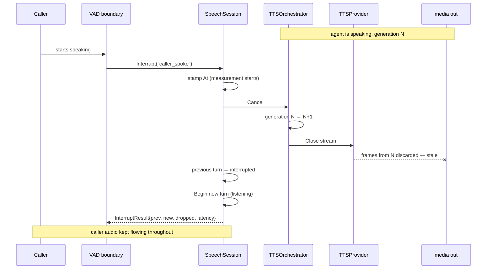

# Barge-In

**Phase 11C** · `packages/go/speech/session.go`, `tts.go`

The caller starts speaking while the agent is talking. This is the most
load-bearing interaction in the whole pipeline: get it wrong and the agent talks
over somebody who just interrupted it.

---

## The contract

`SpeechSession.Interrupt(reason)` satisfies seven requirements, in this order:

| # | Requirement | How |
|---|---|---|
| 1 | Detect the interruption signal from the media/speech boundary | `Interrupt` is the seam. **No VAD is implemented here** |
| 2 | Cancel active TTS generation | `TTSOrchestrator.Cancel` |
| 3 | Stop accepting unnecessary outbound audio | Generation counter — stale frames discarded at the output adapter |
| 4 | Preserve the caller's new speech | The input path is **never touched** |
| 5 | Create a new turn | `SpeechTurnManager.Begin` |
| 6 | Do not lose already-arrived inbound audio | Same as 4 — no flush, no reset |
| 7 | Do not let stale TTS chunks leak after cancellation | Generation counter, bumped before any blocking work |



## Ordering is the contract

**The timestamp is taken first**, so the measurement includes everything that
follows.

**The generation is bumped second**, before any blocking work — before closing
the provider stream, before the turn transition, before allocating the new turn.
That is what bounds the window in which the agent could still be heard: from the
instant the generation moves, every frame already inside the provider stream is
stale and will be discarded at the output boundary.

Closing the stream first would leave a window in which in-flight audio still
counted as current. That window is small, and it is exactly the window in which
the caller is talking.

## Inbound audio is never flushed

Requirements 4 and 6 are satisfied by *not doing something*. The caller's new
speech is already arriving into the input queue — it is the reason the
interruption fired. Flushing it would discard the very words that caused the
barge-in.

The finalised transcript of the interrupted turn also survives:
`TestBargeIn_CancelsTTSAndOpensANewTurn` asserts it is still retrievable
afterwards.

## Interrupting when nothing is being said is refused

An interruption is only meaningful once the agent has something to be
interrupted **from**. A caller talking while the turn is still `listening` is
not barging in — they are just talking, and their audio already belongs to the
live turn.

`Interrupt` therefore refuses unless the turn is `responding` or `speaking`.
Silently treating it as a barge-in would cancel a turn that was recognising
speech perfectly well and throw away the transcript in progress.

**This was found by a benchmark, not by inspection** — see
[ENGINEERING_AUDIT.md](ENGINEERING_AUDIT.md) D-1.

## The interrupted turn is terminal

`interrupted` goes nowhere. Barge-in creates a **new** turn rather than resuming
the old one, because a resumed turn would have two beginnings and no single
point at which the caller took the floor — which makes the conversation record
ambiguous about who said what, when.

Resumption *policy* — whether the agent should repeat what it was saying — is
`conversation.InterruptionEngine`'s `ResumePolicy`, a layer above this one.

## The latency budget

ADR-0011 and ADR-0004 §12: **≤ 20 ms, one frame interval**, from the
interruption signal to silence.

Measured in `TestBargeIn_LatencyIsWithinFrozenBudget`, which runs on the **real
clock** — every other test injects a `FakeClock`, and barge-in latency is a
wall-clock claim, so measuring it on a fake clock would assert nothing.

**Measured: 0s worst case across 10 runs, below the clock's resolution.**

Read that precisely. It means the *orchestration* cost of an interruption —
cancel, generation bump, turn transition — is below measurable resolution on
this machine. It does **not** mean end-to-end barge-in is instant: the real path
includes endpoint detection, the media relay, and the carrier leg, none of which
this package implements or measures. See
[PERFORMANCE.md](PERFORMANCE.md).

## What is returned

```go
type InterruptResult struct {
    PreviousTurn  TurnID
    NewTurn       TurnID
    ChunksDropped int        // text chunks that never reached the synthesiser
    At            time.Time
    Latency       time.Duration
}
```

`ChunksDropped` is what the agent was *about* to say and did not. A caller that
wants to log or resume can, without this package deciding for it.
