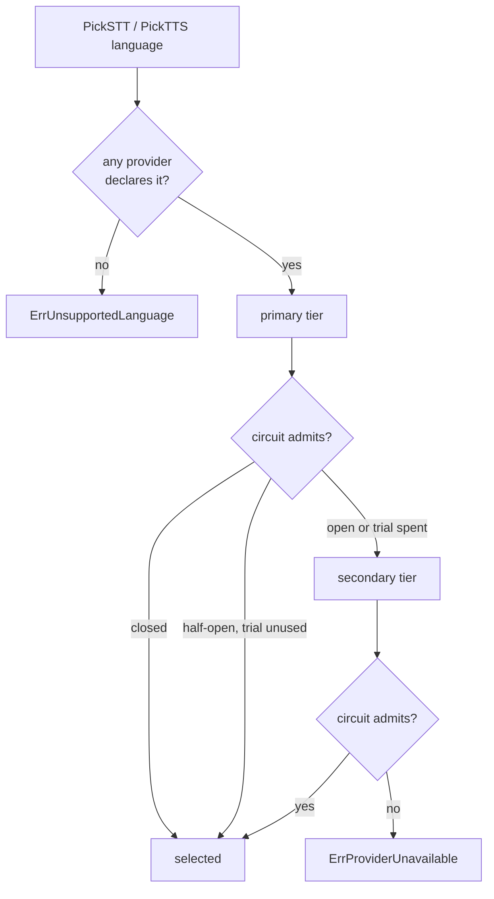
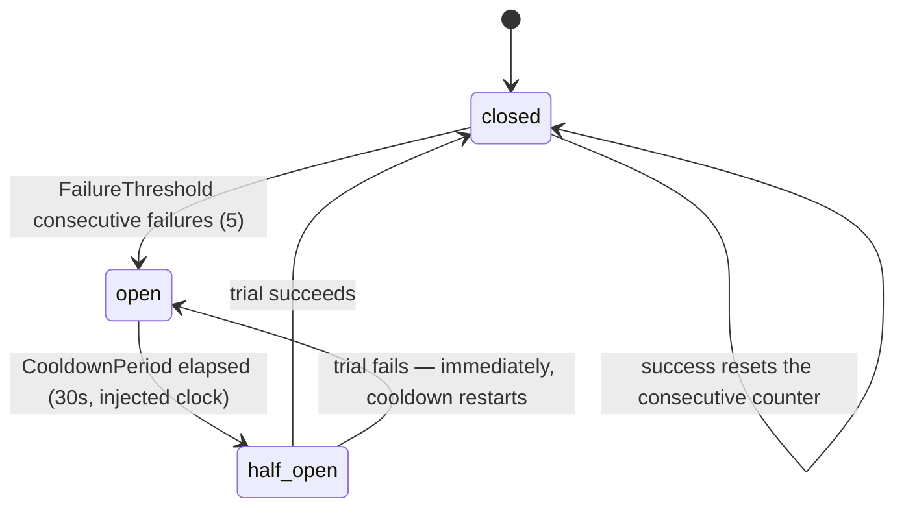

# Provider Routing

**Phase 11C** · `packages/go/speech/router.go`, `provider.go`

---

## Selection

Primary tier first, then secondary; within a tier, registration order. A
provider is selected only if it **declares the language** and its circuit
admits it.

**The router asks capabilities, never identity.** "Is this Deepgram?" is a
question this type cannot ask and cannot answer, which is what makes a provider
swap a configuration change rather than a code change.

## Two errors that look alike and are not

| Error | Meaning | What an operator does |
|---|---|---|
| `ErrUnsupportedLanguage` | No registered provider declares the language | Add a provider that supports it |
| `ErrProviderUnavailable` | Some declare it; none is healthy | Fix the providers that are down |

Collapsing them would send an operator to the wrong runbook.
`TestRouter_UnsupportedLanguageIsDistinctFromUnavailable` asserts the
distinction.

## The circuit breaker

| Parameter | Default | Why |
|---|---|---|
| `FailureThreshold` | 5 | Not 1: a single failed stream is ordinary on a real network, and a breaker that opened on it would flap between providers on background noise |
| `CooldownPeriod` | 30 s | Long enough that a restarting provider has come back; short enough that a transient blip does not cost minutes of degraded routing |

**Half-open allows exactly one trial.** A half-open circuit that admitted
everything would hand a recovering provider the full load the instant it came
back. `TestRouter_HalfOpenAllowsExactlyOneTrial` asserts the second caller is
routed elsewhere.

**A failure during the trial reopens immediately** — the provider was given one
chance and used it to fail.

### Why open fails fast

`CircuitOpen` refuses with `ErrProviderCircuitOpen` *without attempting the
call*. A provider known to be down still costs a full timeout to rediscover
that, and in a budget where the whole turn is 900 ms, spending 250 ms
rediscovering a dead provider is most of the failover's cost.

## Health

`ProviderHealth` reports circuit state, consecutive failures, and cumulative
successes, failures, timeouts, rate limits, plus how many times the circuit has
opened. Health changes **only** through `Report` — a router that inferred health
from its own selection would never learn that a provider it picked then failed.

Outcomes: `success`, `failure`, `timeout`, `rate_limited`. All four are bounded
enum values, safe as metric labels.

## Adapter boundaries

The interfaces in `provider.go` are the whole boundary. An adapter for any of
the following is written against exactly those four types and lives **outside**
this module:

| Provider | Kind | Status in Phase 11C |
|---|---|---|
| Google STT | STT | Boundary defined. **No integration, no credentials, no calls.** |
| Deepgram | STT | Boundary defined. No integration. |
| Sarvam | STT / TTS | Boundary defined. No integration. |
| Whisper-compatible (local) | STT | Boundary defined. No integration; a local adapter would use an external process or service boundary, never an embedded ML runtime in the Go core. |
| ElevenLabs | TTS | Boundary defined. No integration. |
| Cartesia | TTS | Boundary defined. No integration. |
| Piper-compatible (local) | TTS | Boundary defined. No integration; same process-boundary rule as Whisper. |

### No quality claim is made about any of them

**No provider was called during this phase.** Nothing here establishes that
Whisper, Piper, Google, Deepgram, Sarvam, ElevenLabs or Cartesia produces
accurate speech results, in any language. Provider quality is evidence-driven
and belongs to an evaluation phase that actually runs them against a corpus.

Declaring a language in `Capabilities` is a **routing assertion by the adapter
author**, not a measured quality claim. A provider that declares `hi-IN` will be
routed Hindi traffic; whether it transcribes it well is unknown until measured.

## What the router does not do

- It does not retry. A caller that wants a retry picks again and gets the next
  healthy provider.
- It does not load-balance. Tier order is deterministic, which keeps failover
  behaviour reproducible in tests.
- It does not know what a transcript is. It hands back a provider and records
  outcomes.
