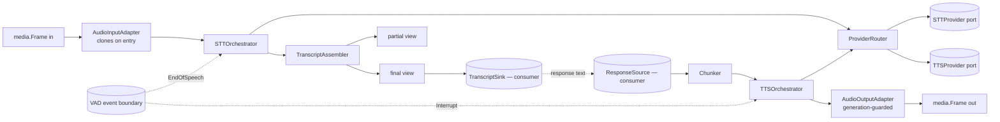

# Speech Architecture

**Phase 11C** · `packages/go/speech`

---

## 1. What this subsystem is

The layer between media transport and language. A `SpeechRuntime` owns
`SpeechSession`s; each session turns inbound audio frames into an ordered
transcript and response text into outbound audio frames.

```
Inbound media.Frame → STT → partial → final → [TranscriptSink]
                                                    ↓
        [ResponseSource] → chunk → TTS → outbound media.Frame
```

## 2. What it is not

No speech recognition. No speech synthesis. No model, no inference runtime, no
acoustic code, no resampler. No voice activity detection — VAD is an **event
boundary** here (`EndOfSpeech`, `Interrupt`), never an implementation. No LLM.
No SIP, no RTP, no WebRTC, no carrier. No fraud or emergency detection.

## 3. The pipeline



## 4. The fifteen subsystems

| # | Subsystem | Where |
|---|---|---|
| 1 | `SpeechRuntime` | `runtime.go` |
| 2 | `SpeechSession` | `session.go` |
| 3 | `STTOrchestrator` | `stt.go` |
| 4 | `TTSOrchestrator` | `tts.go` |
| 5 | `TranscriptAssembler` | `assembler.go` |
| 6 | PartialTranscriptManager | `assembler.go` — `Partial()` view |
| 7 | FinalTranscriptManager | `assembler.go` — `Final()` view |
| 8 | `SpeechTurnManager` | `turn.go` |
| 9 | `ProviderRouter` | `router.go` |
| 10 | `ProviderHealth` | `router.go` |
| 11 | ProviderFallback | `router.go` — tiers and circuit |
| 12 | AudioInputAdapter | `stt.go` — `Push` |
| 13 | AudioOutputAdapter | `tts.go` — `Frames` |
| 14 | `SpeechMetrics` | `metrics.go` |
| 15 | SpeechEventPublisher | `events.go` — `EventPublisher` |

**On 6 and 7:** the brief names them as separate subsystems. They are
implemented as two views on `TranscriptAssembler` rather than separate structs,
because they are two readings of one piece of state. Splitting that state across
three objects would let them disagree about whether a turn is final, and the
entire point of the assembler is that exactly one answer to that question
exists.

## 5. Ports, not drivers

| Port | Satisfied later by | Where |
|---|---|---|
| `STTProvider` / `STTStream` | Google, Deepgram, Sarvam, Whisper adapters | `provider.go` |
| `TTSProvider` / `TTSStream` | ElevenLabs, Cartesia, Piper adapters | `provider.go` |
| `EventPublisher` | The Kafka adapter in `packages/go/eventbus` | `events.go` |

No port names a vendor. No type crossing a port holds a vendor request, a vendor
response, a raw JSON blob, a `map[string]any` or an API key. That rule is what
makes a provider swap a configuration change rather than a code change, and it
is checkable: see the vendor scan in
[ENGINEERING_AUDIT.md](ENGINEERING_AUDIT.md).

## 6. Dependencies

```
packages/go/speech
  ├── packages/go/runtime   (Phase 10A — Clock, FSM)
  ├── packages/go/metrics   (Phase 10.5 — Counter, Gauge, Histogram)
  └── packages/go/media     (Phase 11B — Frame, AudioFormat)
```

All three are dependency-free, so the transitive closure is the Go standard
library. Verified with `go list -deps`.

### Why `packages/go/conversation` is absent

A speech session is created *for* a conversation, but the speech layer does not
need to know what a conversation is — it needs somewhere to send a final
transcript and somewhere to get response text. Coupling them would make the
speech core untestable without a conversation engine and would put dialogue
vocabulary into an audio pipeline.

This matters more here than it looks, because `conversation` **already owns**
turn-taking and interruption:

| Concern | Owner | Vocabulary |
|---|---|---|
| Dialogue floor — who is expected to speak | `conversation.TurnManager` | `Party`, `Expectation`, `FloorDecision` |
| Interruption semantics and resumption | `conversation.InterruptionEngine` | `InterruptionKind`, `ResumePolicy`, `Checkpoint` |
| **Audio lifecycle of one utterance** | **`speech.SpeechTurnManager`** | `listening`, `partial`, `finalizing`, `final`, `speaking` |

They are different layers answering different questions. This package emits the
signals — a final transcript, an interruption — that a dialogue floor decides
what to do about. A service composes them; neither imports the other.

## 7. Invariants

| # | Invariant | Enforced by |
|---|---|---|
| 1 | A speech turn is in exactly one of nine states | `runtime.FSM` over `turnTransitions()` |
| 2 | No code path assigns a turn state directly | Only `SpeechTurnManager.Transition` exists |
| 3 | One live turn per session | `Begin` refuses while a non-terminal turn exists |
| 4 | A final transcript is never rewritten | `TranscriptAssembler.Apply` |
| 5 | A segment from another session is refused | `Apply` compares session identity |
| 6 | Frames are cloned before retention | `STTOrchestrator.Push` |
| 7 | No stale audio escapes a cancellation | `TTSOrchestrator` generation counter |
| 8 | Every queue is bounded with declared full-behaviour | `stt.go`, `tts.go` |
| 9 | Every deadline measures against the injected clock | `runtime.Clock` throughout |
| 10 | Events and metric labels carry no content | `TestSpeechEvent_CarriesNoContent` |

## 8. Concurrency model

Each session owns its turn manager, assembler and both orchestrators. Two
sessions share no state, which makes cross-session contamination structural
rather than conventional.

Each orchestrator runs exactly one goroutine — the consumer/pump — which exits
on context cancellation or on the provider closing its channel. Those are the
only two exits, and `Cancel` waits for it. `TestSession_CloseWithActiveSTT` and
`TestSession_CloseWithActiveTTS` assert the goroutine count returns to baseline.

`SpeechMetrics` and `ProviderRouter` are runtime-scoped, never global.

## 9. Error model

Thirteen typed sentinels in `errors.go`, matched with `errors.Is`. Nothing in
this package branches on an error string.

Two pairs are deliberately distinguished because they send an operator to
different runbooks:

- `ErrUnsupportedLanguage` (nobody declares it) vs `ErrProviderUnavailable`
  (some do, none is healthy).
- `ErrProviderCircuitOpen` (we chose not to try) vs `ErrProviderUnavailable`
  (we tried and there was nothing left).

`ErrBackpressure` is **not a fault** — it is a queue telling a producer to slow
down.
