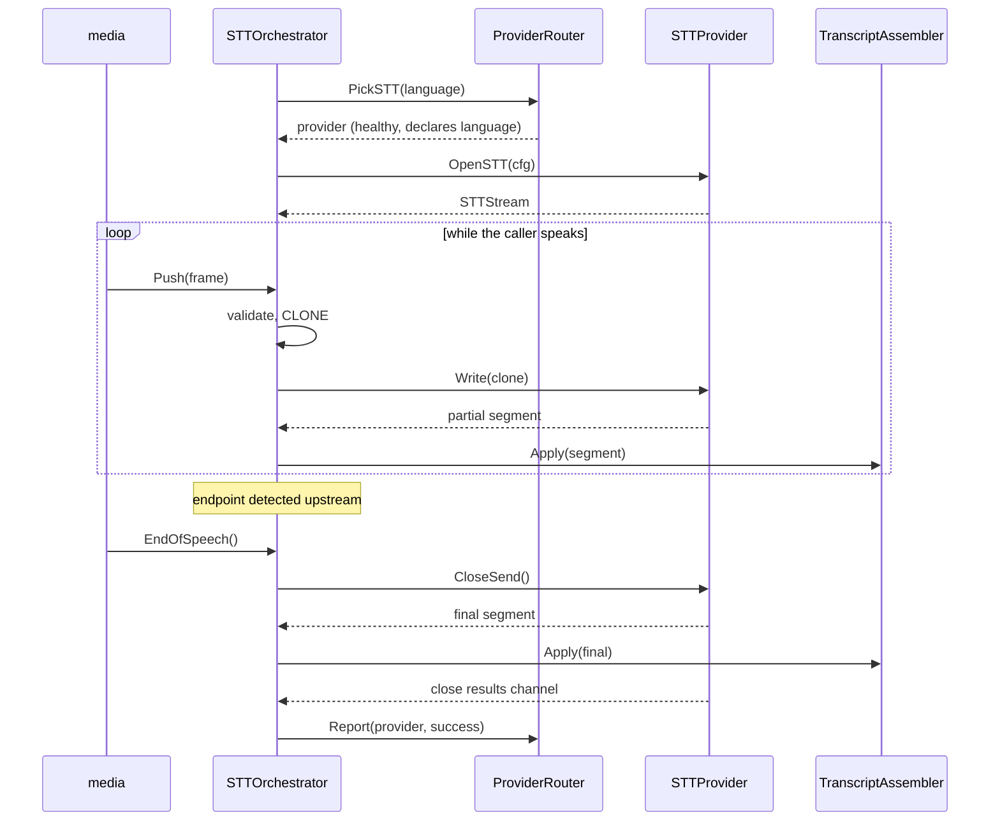

# STT Architecture

**Phase 11C** · `packages/go/speech/stt.go`, `provider.go`

---

## The contract

```go
type STTProvider interface {
    ID() ProviderID
    Capabilities() Capabilities
    OpenSTT(ctx context.Context, cfg STTConfig) (STTStream, error)
}

type STTStream interface {
    Write(f media.Frame) error
    Results() <-chan TranscriptSegment
    CloseSend() error
    Close() error
}
```

`STTConfig` carries session, turn, language, audio format and a timeout.
**Nothing else.** There is no request struct, no JSON blob, no `map[string]any`
and no credential. An adapter translates this into whatever its vendor wants;
the vendor shape never travels back up.

## The stream lifecycle



## We own endpointing

ADR-0005 C6 is explicit: **"We own endpointing, which means we own its failure
modes. Vendor endpointing is easier and worse."** Vendor endpointing is disabled
or ignored.

`EndOfSpeech()` is therefore a **seam, not a detector**. Whatever performs
endpoint detection — a VAD in the media layer, a future phase — calls it. No
voice activity detection is implemented in this package, and the brief forbids
implementing one here.

The endpoint is also where the ADR-0005 budget starts counting: **120 ms p50 /
250 ms p95 from end-of-speech to final transcript**. `FinalTranscriptLatency` is
measured from the `EndOfSpeech` timestamp, not from stream open — measuring from
stream open would include however long the caller spoke and make the number
meaningless.

## Frames are cloned at the boundary

`media.Frame` payloads are **borrowed** from a ring buffer that is overwritten
as it wraps (Phase 11B). `STTOrchestrator.Push` is where retention begins,
because the provider stream outlives the call that delivered the frame.

Without the clone, a provider receives audio from a *later* point in the stream
than the one it was handed. `TestSTT_ClonesFramesOnEntry` proves it: the test
writes `0xAA`, pushes, then scribbles `0xFF` over the caller's payload and
asserts the provider still holds `0xAA`.

## Bounded queues and their declared behaviour

| Queue | Bound | When full | Why |
|---|---|---|---|
| Audio in | 50 frames (1 s at 20 ms) | `ErrBackpressure` to the caller | The caller is `packages/go/media`, which already expresses backpressure to its own producer. Propagating is honest and bounded |
| Transcript out | 256 segments | Counted, **never dropped from the transcript** | The channel is a *notification*; the assembler is the *record*. A segment that cannot be delivered on the channel is still retrievable, so nothing accepted is ever lost |

**Nothing already accepted is silently discarded.** A dropped frame is audio the
caller spoke that nobody will ever hear; a dropped transcript is a sentence that
vanishes between recognition and the conversation engine. Refusing is
recoverable; discarding is not, and it is undetectable downstream.

## Ordering and staleness

Three defences, in order:

1. **Turn identity.** A result whose `Turn` is not the live turn is discarded —
   the provider is answering a question we stopped asking.
2. **Session identity.** `TranscriptAssembler.Apply` refuses a segment belonging
   to another session, structurally.
3. **Sequence.** The assembler rejects anything behind the committed sequence,
   duplicated, or arriving after a final. See
   [TRANSCRIPT_LIFECYCLE.md](TRANSCRIPT_LIFECYCLE.md).

## Failure handling

| Situation | Behaviour |
|---|---|
| Provider open fails | Reported to the router as `failure`/`timeout`/`rate_limited`, error returned |
| No healthy provider | `ErrProviderUnavailable` |
| No provider declares the language | `ErrUnsupportedLanguage` — a different problem with a different fix |
| Circuit open | `ErrProviderCircuitOpen`, no attempt made |
| Cancellation | Stream closed, consumer goroutine joined before return |

`Cancel` blocks on the consumer goroutine's exit, so returning at all proves no
goroutine survived.
