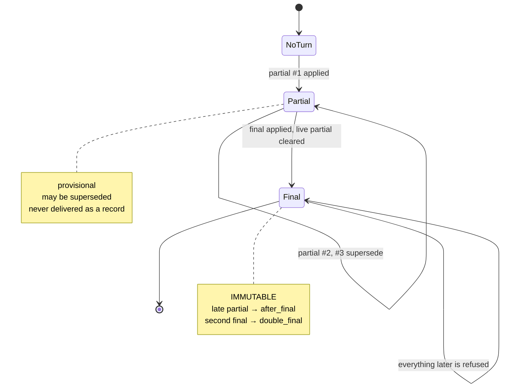

# Transcript Lifecycle

**Phase 11C** · `packages/go/speech/transcript.go`, `assembler.go`

---

## The lifecycle



```
audio → partial #1 → partial #2 → partial #3 → final #3 → immutable segment
```

## The segment model

| Field | Purpose |
|---|---|
| `Session`, `Turn`, `Segment` | Identity. Session identity is the isolation boundary |
| `Sequence` | Monotonic per turn. A provider that repeats or reorders is detected by this alone |
| `Text` | What was recognised — **content, and treated as such** |
| `IsFinal` | Marks a segment that will not be revised |
| `Confidence` | 0..1, or `ConfidenceUnknown` (−1) |
| `StartTime`, `EndTime` | Position on the media timeline |
| `Language`, `Role` | Classification |
| `Meta` | `ProviderMeta` — provider, model, latency. **Three bounded fields** |

### `ConfidenceUnknown` is not zero

A provider reporting zero confidence and a provider reporting nothing at all are
different situations. Collapsing them would make a router treat silence as
certainty of failure.

### `ProviderMeta` is deliberately not a map

A provider response carries fields whose shape is the vendor's to change.
Admitting them — as `map[string]any`, `json.RawMessage` or an embedded SDK type
— would put a vendor schema into the core contract, which is the one thing this
phase exists to prevent. Three bounded fields cover what a router and an
operator actually act on.

### There is no audio field, and there will not be one

A transcript event carrying the audio it was derived from would turn every
transcript store into a recording system — the obligation MEDIA-PCM-1 (Phase
11B) was written to bound.

## The five assembly outcomes

`AssemblyReason` is a bounded enum, so it is safe as a metric label and every
rejection is attributable to exactly one cause.

| Reason | Meaning | Mandatory case |
|---|---|---|
| `applied` | Became the live partial or the final | 1 |
| `duplicate` | This sequence was already seen for this turn | — |
| `out_of_order` | Sequence is behind what has been committed | 4 |
| `after_final` | A non-final segment arrived for a finalised turn | 2 |
| `double_final` | A second final arrived for a finalised turn | 3 |

Evaluation order in `Apply`: validate → session identity → finalised? → duplicate
→ out of order → apply.

An **error** is returned only for a segment that could not be evaluated at all —
malformed, or belonging to another session. An ordinary rejection is reported in
the result, because rejecting stale provider output is normal operation and
returning an error for it would train callers to ignore errors.

## Why a final is immutable

Providers legitimately emit results after a stream closes: a network round trip
does not stop because we stopped listening. If a late partial could rewrite a
final, the transcript could change **after the conversation engine had already
acted on it** — the engine would have replied to something the record no longer
says.

Losing a word is bad. A record that disagrees with the reply that was given is
worse, and it is undetectable.

## Finalisation clears the live partial

A consumer rendering the partial alongside the final would show the caller's
words twice, once provisionally and once for real.

## Retention is bounded

`maxTurnsRetained` = 256 turns per assembler; the oldest finalised turns are
evicted. A long call is hundreds of turns, and retaining every one forever makes
the assembler a transcript archive living in process memory — both an unbounded
allocation and an unbounded retention of conversation content.

`Reset()` discards everything and is called when a session ends. **Durable
transcript retention is a downstream concern with its own policy (ADR-0012);
this type does not become an archive by accident.**

## Content handling

`Redacted()` renders a segment without its text — identifiers, character count,
confidence, provider. That is the form every log line and event uses.

`String()` is deliberately the redacted form too, because the commonest way
transcript content reaches a log is somebody printing the struct with `%v` while
debugging something else. `TestTranscriptSegment_RedactedOmitsText` asserts
both.

## Session isolation

An assembler belongs to **one** session and refuses segments from any other.
That is the structural half of cross-session isolation: a provider callback
carrying the wrong session identifier cannot contaminate a transcript, it
errors. `TestAssembler_RefusesForeignSession` and
`TestSession_CrossSessionIsolation` assert it.
