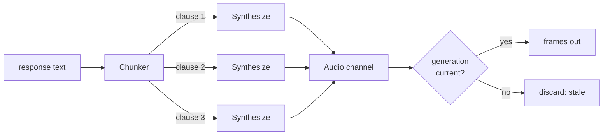

# TTS Architecture

**Phase 11C** · `packages/go/speech/tts.go`, `chunker.go`, `provider.go`

---

## The contract

```go
type TTSProvider interface {
    ID() ProviderID
    Capabilities() Capabilities
    OpenTTS(ctx context.Context, cfg TTSConfig) (TTSStream, error)
}

type TTSStream interface {
    Synthesize(c Chunk) error
    Audio() <-chan media.Frame
    CloseSend() error
    Close() error
}
```

`TTSConfig` carries session, turn, language, format, `VoiceID`, `Prosody` and a
timeout. `Prosody` is three normalised scalars — rate, pitch, volume, 1.0
neutral — **not SSML**. SSML is a vendor-dialect swamp, and a core that passed it
through would be passing a vendor schema.

## Sentence-level streaming, because the budget requires it

Synthesis begins on the **first complete clause**, not on the whole reply.

ADR-0007 is explicit about why: with this structure perceived latency is
time-to-first-*clause* — roughly LLM first token plus TTS time-to-first-byte —
and without it perceived latency is full generation plus full synthesis. *"The
same providers with the wrong pipeline structure would miss the budget by a wide
margin."*



Clause one is already producing audio while clause three is still being
submitted. That overlap is the point.

## The chunker

A deterministic boundary detector, rune-based throughout because Devanagari is
multi-byte and byte indexing would split a grapheme.

**Terminators:** `.` `?` `!` `।` (danda, U+0964) `॥` (double danda, U+0965).

Only the period is ambiguous. It ends a sentence when **all** hold:

1. The next rune is whitespace, or genuine end of stream.
2. The preceding token is not a known abbreviation.
3. The preceding token is not a single letter (an initial).
4. The accumulated text has at least `MinChars` non-space runes.

Rule 1 alone protects decimals (`1234.56`), URLs (`example.co.in`) and dotted
phone numbers (`022.2222.3333`) — in all three the period is followed
immediately by a digit or letter. Spaced digit runs (`4 8 2 9 1 6`) contain no
period at all.

### Streaming equals one-shot

Feeding text one rune at a time produces exactly the chunks that feeding it
whole would. Without that property, TTS output would depend on network packet
boundaries.

The mechanism: a period at the *end of the buffer* is **undecidable** while text
is still streaming — `1234.` looks terminated until `56` arrives. Only `Flush`
knows the stream is over, so only `Flush` decides trailing periods. `?`, `!` and
the dandas are unambiguous and cut immediately, so a question never waits an
extra generator round trip.

`TestChunker_StreamingMatchesOneShot` feeds a mixed Hinglish/Devanagari string
one rune at a time and asserts the output is identical.

### `MaxChars` is a latency guard, not a formatting rule

240 runes forces a break in text that never terminates. Without it a single
unterminated clause holds *all* audio until the generator finishes — the failure
ADR-0007 describes as "well over a second of dead air".

### `No` is deliberately not an abbreviation

It abbreviates "number", but a voice agent says `No.` as a complete answer far
more often than it says `No. 5`. Suppressing the boundary there merges a refusal
into the following sentence, which is both wrong and the more audible error.
This was found by a failing test, not by inspection.

## The generation counter is what makes barge-in safe

Cancellation increments a generation. Every frame is tagged with the generation
it was produced under, and the output adapter discards any frame whose
generation is stale.

Without it, frames already in flight inside the provider stream leak out **after**
the caller interrupted — the agent talking over somebody who just interrupted
it, which is the single most damaging audible failure this layer can produce.

**Ordering is the contract.** `Cancel` bumps the generation **first**, before any
blocking work, so in-flight audio is stale from the earliest possible instant.
Closing the stream first would leave a window in which in-flight audio still
counted as current.

`TestTTS_NoStaleChunksLeakAfterCancellation` asserts no frame escapes after a
cancel.

## The two queues behave differently, deliberately

| Queue | Bound | When full | Why |
|---|---|---|---|
| Chunk in | 32 chunks | `ErrBackpressure` | A reply longer than 32 clauses is a product bug, not a load condition |
| Frame out | 100 frames (2 s) | **Blocks on the context — never drops** | A dropped output frame is a glitch inside a word the caller is already hearing |

The asymmetry is the point: **the input side sheds load, the output side does
not.** A dropped input chunk costs a clause the caller never hears. A dropped
output frame is audible corruption of a word already in progress, and it is
undetectable downstream. Blocking is bounded by the session context, which
cancellation closes.

## Failure handling

| Situation | Behaviour |
|---|---|
| Provider open fails | Reported to the router, error returned, `Speaking()` stays false |
| Mid-stream chunk failure | Remaining chunks abandoned, `CloseSend` issued, error returned |
| Cancellation | Generation bumped, stream closed, pump joined, output drained |
| Empty or whitespace text | No provider stream is opened at all |
