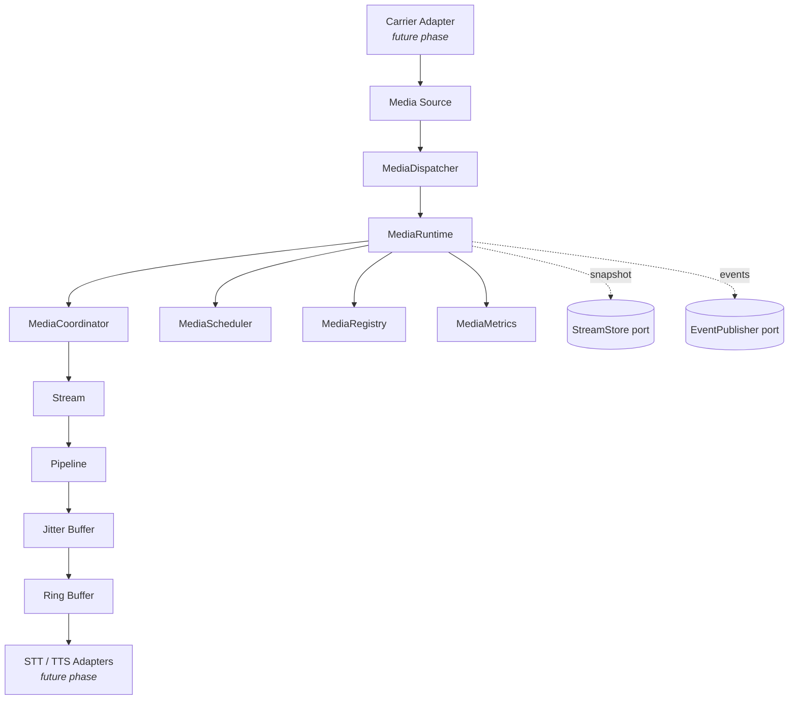
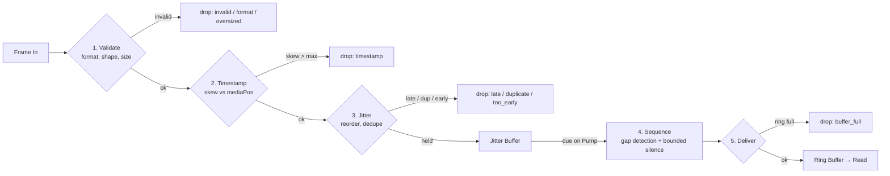
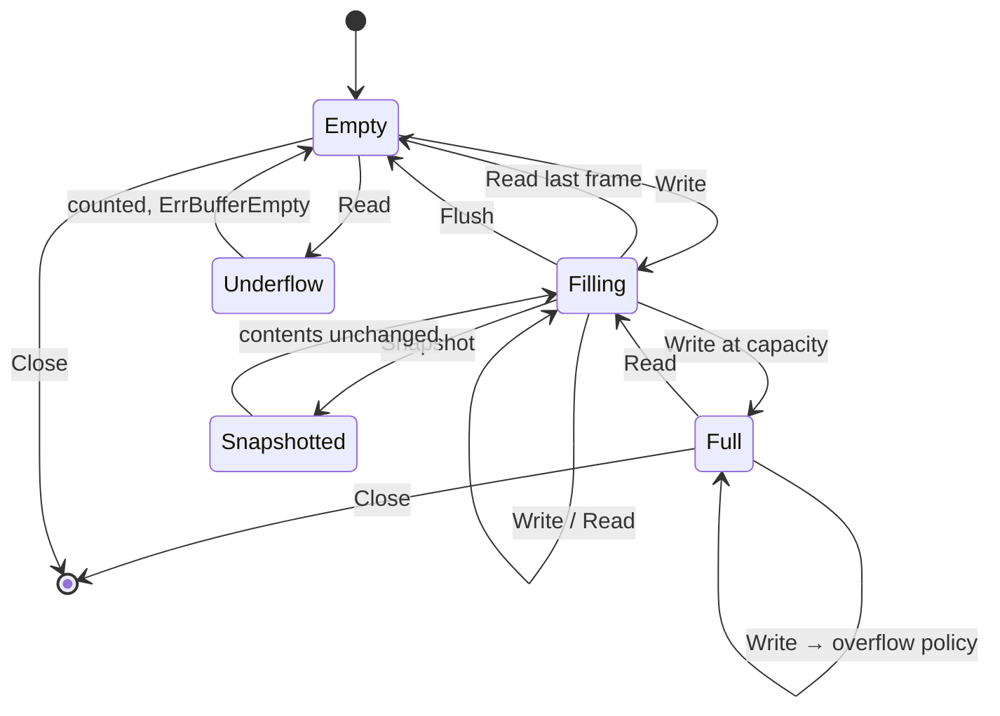
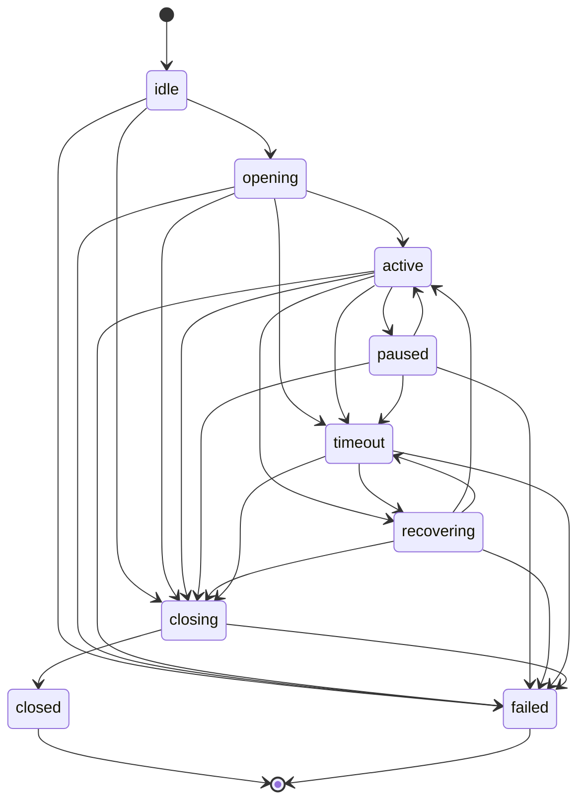

# Phase 11B — Enterprise Media Streaming Engine Implementation Plan

> **For agentic workers:** REQUIRED SUB-SKILL: Use superpowers:subagent-driven-development (recommended) or superpowers:executing-plans to implement this plan task-by-task. Steps use checkbox (`- [ ]`) syntax for tracking.

**Goal:** Complete `packages/go/media` so all nine Phase 11B stop conditions are met — every test passing, benchmarks recorded, and nine documents in `docs/media/` written from measured output.

**Architecture:** A media streaming engine that moves PCM frames from a producer to a consumer, on time, in order, under backpressure. A `MediaRuntime` owns `Stream`s; each stream pushes frames through a five-stage `Pipeline` (validate → timestamp → jitter/reorder → sequence/gap-fill → deliver) into a two-stage buffer (jitter buffer, then output ring). Four defects are fixed, `events.go` is added, benchmarks are written, and the documentation set is produced.

**Tech Stack:** Go 1.25+ (toolchain present: go1.26.5). Standard library only, plus two first-party dependency-free modules: `packages/go/runtime` (Phase 10A) and `packages/go/metrics` (Phase 10.5).

**Spec:** `docs/superpowers/specs/2026-08-10-media-streaming-engine-design.md`

---

## Global Constraints

Every task's requirements implicitly include this section.

- **Module scope.** Modify only files under `packages/go/media/` and create files under `docs/media/`. No other path in the repository may be touched.
- **Frozen phases.** Phases 10A, 10B, 10C, 10D, 10E, 10F, 10.5 and 11A are frozen. `packages/go/runtime` and `packages/go/metrics` are consumed, never edited.
- **Dependencies.** `packages/go/media/go.mod` must continue to require exactly two modules: `.../packages/go/runtime` and `.../packages/go/metrics`. Adding any third-party dependency fails the task.
- **Prohibited.** No Pion, Janus, mediasoup, LiveKit, Twilio Media, Agora, Daily or Jitsi SDK. No RTP framework, no streaming framework, no codec, no resampler, no DSP library.
- **Not implemented.** SIP, RTP networking, WebRTC, carrier APIs, microphone APIs, speaker APIs, speech recognition, speech synthesis, voice activity detection, LLM, fraud detection.
- **MEDIA-PCM-1 (binding).** PCM in `StreamSnapshot` is ephemeral by default: `SnapshotConfig.IncludeAudio` stays `false`. Phase 11B introduces **no durable audio recording** — the only `StreamStore` that ships is the in-process `MemoryStreamStore`. No Redis adapter, no Aurora adapter, no file, no object store, no disk. Audio capture is always bounded by `MaxAudioFrames`. **Events never carry PCM.** Any future persistent audio storage requires all six controls: encryption, retention, deletion, access control, legal hold, audit.
- **No global mutable state.** Metrics are runtime-scoped. Clocks are injected.
- **Determinism.** Every timer and ticker measures against `runtime.Clock`. `time.NewTicker`, `time.NewTimer`, `time.After` and `time.Sleep` are prohibited in non-test code.
- **Measured numbers only.** Every figure written into `docs/media/` must come from a command actually run. Never write a benchmark result, test count or latency figure that was not produced by executing it.
- **Go version floor:** `go 1.25.0` in `go.mod`. Do not raise it.
- **THIS REPOSITORY IS NOT A GIT REPOSITORY.** `git rev-parse --is-inside-work-tree` fails. Every task therefore ends with a **verification checkpoint** rather than a commit. If the user runs `git init` first, replace each checkpoint with `git add <files> && git commit -m "<message>"` using the message given in the task.

### Commands (run from `packages/go/media/`)

```bash
go build ./...
go vet ./...
go test ./...
go test -race ./...
go test -run TestName -v ./...
go test -bench=. -benchmem ./...
```

---

## File Structure

| File | Responsibility | Change |
|---|---|---|
| `runtime.go` | `MediaRuntime`, `MediaCoordinator`, `MediaScheduler`, `MediaDispatcher` | Modify — Task 1 |
| `stream.go` | `Stream` lifecycle, `StreamSnapshot`, `RestoreStream` | Modify — Tasks 1, 3 |
| `jitter.go` | `JitterEstimator`, `JitterBuffer` | Modify — Tasks 2, 3 |
| `pipeline.go` | Five-stage frame pipeline | Modify — Task 4 |
| `events.go` | **New** — event types, topic naming, `EventPublisher` port | Create — Task 5 |
| `bench_test.go` | **New** — allocation and throughput benchmarks | Create — Task 6 |
| `integration_test.go` | Lifecycle, pipeline, snapshot, recovery tests | Modify — Tasks 2, 4, 7 |
| `media_test.go` | Unit tests | Modify — Tasks 1, 3, 5 |
| `doc.go` | Package documentation | Modify — Task 6 (only if the zero-alloc claim proves false) |
| `docs/media/*.md` | Nine documents | Create — Tasks 8, 9 |

---

## Task Order and Rationale

Tasks 1–4 fix defects. **Order is load-bearing:** Task 1 (RC-1) and Task 2 (RC-3) each unblock overlapping test failures, and Task 4 (RC-4) is a diagnosis task that cannot begin until 1 and 2 have landed, because its cause may be a symptom of theirs.

| Task | Delivers | Failing tests closed |
|---|---|---|
| 1 | RC-1 — injected-clock tickers + read-through | 2 outright, 2 partly |
| 2 | RC-3 — jitter window and release gate | 2 (with Task 1) |
| 3 | RC-2 — snapshots capture both stages | 3 |
| 4 | RC-4 — gap fill, diagnosed then fixed | 1 |
| 5 | `events.go` | — |
| 6 | Benchmarks | — |
| 7 | Backpressure test + test-category audit | — |
| 8 | Documents 1–5 | — |
| 9 | Documents 6–9 + final gates | — |

---

## Baseline (run this before Task 1)

- [ ] **Step 0: Record the starting state**

Run from `packages/go/media/`:

```bash
go test ./... 2>&1 | tail -20
```

Expected: `FAIL`, with exactly these 8 failures:

```
--- FAIL: TestPipeline_FillsGapsWithBoundedSilence
--- FAIL: TestLifecycle_OpenWriteReadClose
--- FAIL: TestSnapshot_ExcludesAudioByDefault
--- FAIL: TestSnapshot_KeepsNewestAudioWhenBounded
--- FAIL: TestPipeline_DeliversInOrder
--- FAIL: TestRecovery_ResumesStreamsWithAnAttachedSource
--- FAIL: TestLifecycle_PauseRefusesWritesButKeepsBuffer
--- FAIL: TestLifecycle_DrainRefusesWritesButDeliversBuffer
```

If the set differs, **stop and report** — the plan's diagnosis was built on this exact baseline.

---

## Task 1: RC-1 — Injected-clock tickers and read-through delivery

**Files:**
- Modify: `packages/go/media/runtime.go:381` (`sweepLoop`), `packages/go/media/runtime.go:400` (`pumpLoop`)
- Modify: `packages/go/media/stream.go:366-371` (`Stream.Read`)
- Test: `packages/go/media/media_test.go` (append)

**Interfaces:**
- Consumes: `rt.Clock.NewTicker(d time.Duration) rt.Ticker` (`packages/go/runtime/clock.go:34`); `rt.Ticker` has `C() <-chan time.Time` and `Stop()`.
- Produces: `Stream.Read()` signature is **unchanged** — `func (s *Stream) Read() (Frame, error)`. Later tasks rely on `Read()` returning a frame without an explicit `Pump()` call when frames are due.

**Background the implementer needs:**

Frames enter the jitter buffer on `Push` and only reach the readable output ring on `Pump`. Two things are wrong. First, `pumpLoop` and `sweepLoop` build their tickers with `time.NewTicker`, a real wall clock, while every other timing decision in the package measures against the injected `runtime.Clock` — so a `FakeClock` test cannot drive them. Second, `TestConfig()` sets `PumpInterval = 0` (`harness.go:28`), which disables the pump loop entirely in tests; a test that reads without calling `Pump()` gets `ErrBufferEmpty` even though frames are due.

- [ ] **Step 1: Write the failing test**

Append to `packages/go/media/media_test.go`:

```go
func TestRead_PumpsThroughWhenRingIsEmpty(t *testing.T) {
	t.Parallel()
	h, err := NewHarness()
	if err != nil {
		t.Fatal(err)
	}
	ctx := context.Background()
	if _, err := h.Start(ctx); err != nil {
		t.Fatal(err)
	}
	t.Cleanup(func() { _, _ = h.Stop(context.Background()) })

	s, err := h.Open(ctx)
	if err != nil {
		t.Fatal(err)
	}

	// One frame in. It lands in the jitter buffer, not the output ring.
	res, err := s.Write(h.Gen.Next(h.Clock.Now()))
	if err != nil {
		t.Fatal(err)
	}
	if !res.Accepted {
		t.Fatalf("frame refused: %s", res.Reason)
	}

	// Read WITHOUT calling Pump. Read-through must deliver it.
	f, err := s.Read()
	if err != nil {
		t.Fatalf("read-through did not deliver a due frame: %v", err)
	}
	if f.Sequence != 0 {
		t.Errorf("sequence = %d, want 0", f.Sequence)
	}
}
```

- [ ] **Step 2: Run it and confirm it fails**

```bash
go test -run TestRead_PumpsThroughWhenRingIsEmpty -v ./...
```

Expected: FAIL with `read-through did not deliver a due frame: media: buffer empty`.

- [ ] **Step 3: Implement read-through**

Replace `packages/go/media/stream.go:366-371` entirely:

```go
// Read returns the next delivered frame.
//
// THE RETURNED FRAME'S PAYLOAD IS BORROWED from the output ring — see [Frame].
// A caller that retains it must clone.
//
// # Read-through
//
// When the output ring is empty this pumps once and retries. The runtime's pump
// loop is the steady-state driver, but a consumer must never starve merely
// because the pump was late, and a test must be able to read without first
// advancing a clock. Pumping here is bounded — one pass, one retry — so a Read
// on a genuinely empty stream still returns promptly rather than spinning.
func (s *Stream) Read() (Frame, error) {
	if !s.fsm.State().DeliversFrames() {
		return Frame{}, ErrStreamClosed
	}
	f, err := s.pipeline.Buffer().Read()
	if err == nil {
		return f, nil
	}
	if s.pipeline.Pump() > 0 {
		return s.pipeline.Buffer().Read()
	}
	return Frame{}, err
}
```

- [ ] **Step 4: Implement the injected-clock tickers**

In `packages/go/media/runtime.go`, replace line 381 inside `sweepLoop`:

```go
	ticker := r.clock.NewTicker(r.cfg.SweepInterval)
	defer ticker.Stop()
```

and replace line 400 inside `pumpLoop`:

```go
	ticker := r.clock.NewTicker(r.cfg.PumpInterval)
	defer ticker.Stop()
```

Both loops read `<-ticker.C` already; `rt.Ticker.C()` is a **method**, so change each `case <-ticker.C:` to `case <-ticker.C():` in both loops.

- [ ] **Step 5: Remove the now-unused `time` import if the compiler says so**

```bash
go build ./...
```

If it reports `"time" imported and not used`, remove the import from `runtime.go`. If `time` is still used elsewhere in the file, leave it.

- [ ] **Step 6: Verify the new test passes**

```bash
go test -run TestRead_PumpsThroughWhenRingIsEmpty -v ./...
```

Expected: PASS.

- [ ] **Step 7: Verify no wall-clock timing remains in non-test code**

```bash
grep -n "time\.NewTicker\|time\.NewTimer\|time\.After\|time\.Sleep" *.go | grep -v "_test.go"
```

Expected: **no output.** Any hit is a determinism defect and must be converted to the injected clock.

- [ ] **Step 8: Run the full suite and record progress**

```bash
go test ./... 2>&1 | grep -E "^--- FAIL" | sort
```

Expected: `TestLifecycle_PauseRefusesWritesButKeepsBuffer` and `TestLifecycle_DrainRefusesWritesButDeliversBuffer` now pass. Remaining failures should be 6 or fewer. Record the exact list — Task 2 depends on it.

- [ ] **Step 9: Verification checkpoint**

```bash
go build ./... && go vet ./... && go test -race -run 'TestRead_|TestLifecycle_' ./...
```

All three clean. (If git is initialised: `git commit -m "fix(media): drive pump and sweep from the injected clock; add read-through delivery"`.)

---

## Task 2: RC-3 — The jitter window must not collapse under adaptation

**Files:**
- Modify: `packages/go/media/jitter.go:284-350` (`Put`), `jitter.go:362-378` (`adaptLocked`), `jitter.go:228-255` (struct)
- Test: `packages/go/media/integration_test.go` (append)

**Interfaces:**
- Consumes: `Frame.End() time.Duration` (`frame.go:347`), `Frame.Timestamp`, `JitterConfig.MaxDelay`, `JitterConfig.MinDelay`.
- Produces: no signature changes. `JitterStats` gains no fields. Later tasks rely on a clean 50 fps sequence being fully accepted.

**Background the implementer needs — read this carefully, the defect has two halves:**

`JitterBuffer` holds frames on a media timeline. `playout` is the media position already consumed, and it advances **only** inside `Get()`. `current` is the adaptive delay, which shrinks 5 ms per `Put` toward `MinDelay` when measured jitter is low (`adaptLocked`).

**Half A — the too-early bound.** Line 317 refuses a frame when `f.Timestamp > j.playout + j.current + j.cfg.MaxDelay`. With a clean 50 fps source and an idle consumer, `playout` is frozen at `-60ms` while `current` shrinks from 60 ms to 20 ms. The bound therefore falls from 200 ms to 160 ms, and frame 9 (timestamp 180 ms) is refused `too_early` **on a perfect input sequence**. The bound must be anchored to how far ahead of the *data* a frame is, not to a position a stalled consumer has frozen.

**Half B — the release gate.** `Put` anchors `playout = f.Timestamp - j.current` using the *initial* `current` of 60 ms. `Get` then releases when `head.releaseAt <= j.playout + j.current`. When adaptation shrinks `current` afterwards, `playout + current` moves **backwards**, so frames that were due become un-due and the buffer stalls. Anchoring and releasing must stay consistent.

Both halves are one defect: the adaptive delay is being applied to positions that were computed under a different delay.

- [ ] **Step 1: Write the failing test**

Append to `packages/go/media/integration_test.go`:

```go
func TestJitter_CleanSequenceIsFullyAccepted(t *testing.T) {
	t.Parallel()
	cfg := DefaultJitterConfig()
	clock := rt.NewFakeClock(time.Date(2026, 1, 1, 9, 0, 0, 0, time.UTC))
	jb, err := NewJitterBuffer(cfg, clock)
	if err != nil {
		t.Fatal(err)
	}
	gen := NewFrameGenerator(PCM16Mono8k(), 20*time.Millisecond)

	// Thirty frames at a perfect 50 fps with zero jitter. Nothing here is
	// late, early, duplicated or out of order, so nothing may be dropped.
	const frames = 30
	for i := 0; i < frames; i++ {
		disp := jb.Put(gen.Next(clock.Now()))
		if disp.Dropped() {
			t.Fatalf("frame %d dropped as %s on a clean sequence", i, disp)
		}
		clock.Advance(20 * time.Millisecond)

		// Drain what is due, exactly as a consumer would.
		for {
			if _, err := jb.Get(); err != nil {
				break
			}
		}
	}

	st := jb.Stats()
	if st.Late+st.Duplicates+st.TooEarly != 0 {
		t.Errorf("clean sequence produced drops: %s", st)
	}
	if st.Released == 0 {
		t.Errorf("nothing was ever released: %s", st)
	}
}
```

Ensure `integration_test.go` imports `rt "github.com/callscreen/callscreen-platform/packages/go/runtime"`. If it is not already imported, add it.

- [ ] **Step 2: Run it and confirm it fails**

```bash
go test -run TestJitter_CleanSequenceIsFullyAccepted -v ./...
```

Expected: FAIL, reporting a frame dropped as `too_early`.

- [ ] **Step 3: Add the frontier field**

In `packages/go/media/jitter.go`, inside the `JitterBuffer` struct (after the `playout` / `started` fields around line 237), add:

```go
	// frontier is the highest media position any offered frame has reached.
	//
	// The anchor for the too-early bound. Unlike playout it advances on ARRIVAL
	// rather than on consumption, so a stalled consumer cannot freeze it and a
	// shrinking adaptive delay cannot narrow the window. What "too early" should
	// mean is "far ahead of the data", not "far ahead of a reader that stopped".
	frontier time.Duration
```

- [ ] **Step 4: Fix Half A — anchor the too-early bound on the frontier**

In `Put`, replace the anchoring block at lines 290-295:

```go
	if !j.started {
		// The first frame anchors the playout position one delay behind it, so
		// subsequent frames have somewhere to be late from.
		j.playout = f.Timestamp - j.current
		j.frontier = f.End()
		j.started = true
	}
```

Then replace the too-early check at lines 316-320:

```go
	// Too early: so far ahead of the data already seen that buffering it would
	// exceed the window. Measured against the frontier, NOT against playout —
	// see the frontier field. Capacity, checked next, is what bounds a producer
	// that outruns its consumer; that is backpressure and belongs there.
	if f.Timestamp > j.frontier+j.cfg.MaxDelay {
		j.tooEarly++
		return FrameTooEarly
	}
```

Finally, advance the frontier on every accepted frame. Immediately before `j.seen[f.Sequence] = struct{}{}` (line 342), insert:

```go
	if end := f.End(); end > j.frontier {
		j.frontier = end
	}
```

- [ ] **Step 5: Fix Half B — adaptation must not move the release frontier**

Replace `adaptLocked` (lines 362-378) entirely:

```go
// adaptLocked moves the delay toward the measured jitter. Caller holds the lock.
//
// Target is twice the measured jitter, bounded by the configured range. Twice
// because jitter is a mean deviation and a buffer sized at exactly the mean
// absorbs only half the variation; 2× covers the great majority without paying
// for the tail, which is what MaxDelay is for.
//
// Moves in one-frame steps rather than jumping. A buffer that resized abruptly
// would either discard audio (shrinking) or insert a gap (growing), both
// audible.
//
// # playout moves with current, and that is the point
//
// Release is gated on playout+current. playout was anchored under the delay in
// force at the time; changing current alone would move that sum and retroactively
// make already-due frames un-due, stalling the buffer. Shifting playout by the
// same delta holds the release frontier continuous, so adaptation changes how
// much audio is held going forward without disturbing what is already due.
func (j *JitterBuffer) adaptLocked() {
	target := j.est.Jitter() * 2
	if target < j.cfg.MinDelay {
		target = j.cfg.MinDelay
	}
	if target > j.cfg.MaxDelay {
		target = j.cfg.MaxDelay
	}

	const step = 5 * time.Millisecond
	var delta time.Duration
	switch {
	case target > j.current+step:
		delta = step
	case target < j.current-step:
		delta = -step
	default:
		return
	}

	j.current += delta
	j.playout -= delta
}
```

- [ ] **Step 6: Reset the frontier**

In `Reset` (line 458), add `j.frontier = 0` alongside `j.playout = 0`:

```go
	j.playout = 0
	j.frontier = 0
	j.started = false
```

- [ ] **Step 7: Verify the new test passes**

```bash
go test -run TestJitter_CleanSequenceIsFullyAccepted -v ./...
```

Expected: PASS.

- [ ] **Step 8: Confirm genuinely-early frames are still refused**

The fix must not disable the guard. Append this test and run it:

```go
func TestJitter_RefusesFramesFarAheadOfTheData(t *testing.T) {
	t.Parallel()
	cfg := DefaultJitterConfig()
	clock := rt.NewFakeClock(time.Date(2026, 1, 1, 9, 0, 0, 0, time.UTC))
	jb, err := NewJitterBuffer(cfg, clock)
	if err != nil {
		t.Fatal(err)
	}
	gen := NewFrameGenerator(PCM16Mono8k(), 20*time.Millisecond)

	if disp := jb.Put(gen.Next(clock.Now())); disp.Dropped() {
		t.Fatalf("first frame dropped as %s", disp)
	}

	// Ten seconds ahead — far beyond MaxDelay (200ms). A clock bug or a
	// replayed session looks exactly like this, and it must be refused.
	far := gen.NextAt(500, 10*time.Second, clock.Now())
	if disp := jb.Put(far); disp != FrameTooEarly {
		t.Errorf("disposition = %s, want too_early", disp)
	}
}
```

```bash
go test -run TestJitter_RefusesFramesFarAheadOfTheData -v ./...
```

Expected: PASS.

- [ ] **Step 9: Run the full suite**

```bash
go test ./... 2>&1 | grep -E "^--- FAIL" | sort
```

Expected: `TestLifecycle_OpenWriteReadClose` and `TestPipeline_DeliversInOrder` now pass. Remaining failures should be the 3 snapshot/recovery tests plus possibly `TestPipeline_FillsGapsWithBoundedSilence`. Record the exact list.

- [ ] **Step 10: Verification checkpoint**

```bash
go build ./... && go vet ./... && go test -race -run TestJitter_ ./...
```

All clean. (Git message: `fix(media): anchor the jitter window on the data frontier and keep adaptation continuous`.)

---

## Task 3: RC-2 — Snapshots capture both buffering stages

**Files:**
- Modify: `packages/go/media/jitter.go` (add `Peek`)
- Modify: `packages/go/media/stream.go:510-522` (`Snapshot`)
- Test: `packages/go/media/media_test.go` (append)

**Interfaces:**
- Consumes: `RingBuffer.Snapshot() BufferSnapshot` (`buffer.go:519`), where `BufferSnapshot` is `{Stats BufferStats; Frames []Frame; Format AudioFormat}` (`buffer.go:512`). `Frame.Clone() Frame` (`frame.go:358`).
- Produces: `func (j *JitterBuffer) Peek() []Frame` — returns cloned held frames in playout order, oldest first. Task 7 and Task 9 rely on it.

**Background the implementer needs:**

`Stream.Snapshot` captures `s.pipeline.Buffer().Snapshot()` — the **output ring only**. Audio still held in the jitter buffer is invisible. Because frames sit in the jitter buffer until pumped, a snapshot taken on a live stream routinely captures nothing, so `IncludeAudio: true` yields an empty capture and recovery restores nothing. The fix captures the union of both stages in playout order.

**MEDIA-PCM-1 applies directly to this task.** This change *increases* the amount of PCM a snapshot can hold. `IncludeAudio` must remain `false` by default, the bound must apply to the union, and no durable store may be introduced.

- [ ] **Step 1: Write the failing test**

Append to `packages/go/media/media_test.go`:

```go
func TestSnapshot_CapturesJitterHeldAudioNotJustTheRing(t *testing.T) {
	t.Parallel()
	h, err := NewHarness()
	if err != nil {
		t.Fatal(err)
	}
	ctx := context.Background()
	if _, err := h.Start(ctx); err != nil {
		t.Fatal(err)
	}
	t.Cleanup(func() { _, _ = h.Stop(context.Background()) })

	s, err := h.Open(ctx)
	if err != nil {
		t.Fatal(err)
	}

	// Five frames in, nothing pumped. All of this audio is in the jitter
	// buffer and none of it has reached the output ring.
	for i := 0; i < 5; i++ {
		if _, err := s.Write(h.Gen.Next(h.Clock.Now())); err != nil {
			t.Fatal(err)
		}
		h.Clock.Advance(20 * time.Millisecond)
	}

	snap := s.Snapshot(SnapshotConfig{IncludeAudio: true, MaxAudioFrames: 25})
	if len(snap.Buffered) == 0 {
		t.Fatal("snapshot captured no audio though five frames are in flight")
	}

	// Playout order, oldest first.
	for i := 1; i < len(snap.Buffered); i++ {
		if snap.Buffered[i].Timestamp < snap.Buffered[i-1].Timestamp {
			t.Errorf("frame %d is out of playout order", i)
		}
	}
}

func TestSnapshot_BoundAppliesToBothStagesCombined(t *testing.T) {
	t.Parallel()
	h, err := NewHarness()
	if err != nil {
		t.Fatal(err)
	}
	ctx := context.Background()
	if _, err := h.Start(ctx); err != nil {
		t.Fatal(err)
	}
	t.Cleanup(func() { _, _ = h.Stop(context.Background()) })

	s, err := h.Open(ctx)
	if err != nil {
		t.Fatal(err)
	}

	for i := 0; i < 10; i++ {
		if _, err := s.Write(h.Gen.Next(h.Clock.Now())); err != nil {
			t.Fatal(err)
		}
		h.Clock.Advance(20 * time.Millisecond)
	}
	s.Pump() // some frames move to the ring; the rest stay in the jitter buffer

	snap := s.Snapshot(SnapshotConfig{IncludeAudio: true, MaxAudioFrames: 3})
	if len(snap.Buffered) != 3 {
		t.Fatalf("captured %d frames, want the bound of 3", len(snap.Buffered))
	}
	if snap.BufferedDropped == 0 {
		t.Error("BufferedDropped did not record the omitted frames")
	}
}

func TestSnapshot_AudioIsOffByDefault(t *testing.T) {
	t.Parallel()
	// MEDIA-PCM-1: PCM is ephemeral by default. This test is the policy.
	if DefaultSnapshotConfig().IncludeAudio {
		t.Fatal("IncludeAudio must default to false")
	}
}
```

- [ ] **Step 2: Run and confirm failure**

```bash
go test -run 'TestSnapshot_CapturesJitterHeld|TestSnapshot_BoundApplies' -v ./...
```

Expected: FAIL with `snapshot captured no audio though five frames are in flight`.

- [ ] **Step 3: Implement `JitterBuffer.Peek`**

Append to `packages/go/media/jitter.go`, after `Depth` (around line 439):

```go
// Peek returns the held frames in playout order, oldest first, without
// disturbing the buffer.
//
// The frames are CLONED. The buffer's own copies stay live and a caller that
// mutated a borrowed payload would corrupt audio still due for delivery — the
// hazard [Frame] warns about, in the one place a caller is most likely to hold
// on to what it is given.
//
// Used by [Stream.Snapshot], because audio held here is in flight and a
// snapshot that omitted it would restore a stream missing exactly the audio
// buffer recovery exists to save.
func (j *JitterBuffer) Peek() []Frame {
	j.mu.Lock()
	defer j.mu.Unlock()

	if len(j.held) == 0 {
		return nil
	}
	out := make([]Frame, 0, len(j.held))
	for _, h := range j.held {
		out = append(out, h.frame.Clone())
	}
	return out
}
```

- [ ] **Step 4: Implement the two-stage capture**

Replace `packages/go/media/stream.go:510-522` entirely:

```go
	if cfg.IncludeAudio {
		// BOTH buffering stages, in playout order: the output ring holds what is
		// already due, the jitter buffer what is still being held for reordering.
		// Capturing only the ring — as this once did — routinely captured nothing,
		// because a frame reaches the ring only when pumped.
		//
		// MEDIA-PCM-1: this is PCM. It is captured only on explicit opt-in, it is
		// bounded, and no store in this phase persists it beyond process memory.
		ring := s.pipeline.Buffer().Snapshot().Frames
		holding := s.pipeline.Jitter().Peek()

		all := make([]Frame, 0, len(ring)+len(holding))
		all = append(all, ring...)
		all = append(all, holding...)

		max := cfg.MaxAudioFrames
		if max <= 0 || max > len(all) {
			max = len(all)
		}
		// The NEWEST frames are kept when the bound binds. Oldest audio is
		// closest to having been played already; the newest is what a resumed
		// consumer still needs.
		start := len(all) - max
		snap.Buffered = all[start:]
		snap.BufferedDropped = start
	}
```

Note on ordering: ring frames always precede jitter-held frames in playout order, because a frame reaches the ring only by being released from the jitter buffer, and release is strictly in playout order.

- [ ] **Step 5: Verify the new tests pass**

```bash
go test -run TestSnapshot_ -v ./...
```

Expected: PASS for all `TestSnapshot_*`, including the two pre-existing ones (`TestSnapshot_ExcludesAudioByDefault`, `TestSnapshot_KeepsNewestAudioWhenBounded`).

- [ ] **Step 6: Verify recovery now restores audio**

```bash
go test -run TestRecovery_ -v ./...
```

Expected: `TestRecovery_ResumesStreamsWithAnAttachedSource` passes.

- [ ] **Step 7: Run the full suite**

```bash
go test ./... 2>&1 | grep -E "^--- FAIL" | sort
```

Expected: at most `TestPipeline_FillsGapsWithBoundedSilence` remains.

- [ ] **Step 8: Verification checkpoint**

```bash
go build ./... && go vet ./... && go test -race ./...
```

`-race` must be clean — `Peek` takes the buffer lock and clones under it, and this is where a race would show.

(Git message: `fix(media): capture both buffering stages in stream snapshots`.)

---

## Task 4: RC-4 — Gap fill, diagnosed before it is fixed

**Files:**
- Modify: `packages/go/media/pipeline.go:304-340` (`fillGaps`) — **only if diagnosis proves it is at fault**
- Test: `packages/go/media/integration_test.go:360-390` (existing `TestPipeline_FillsGapsWithBoundedSilence`)

**Interfaces:**
- Consumes: `PipelineConfig.FillGaps`, `PipelineConfig.MaxGapFill`, `PipelineConfig.FrameInterval`, `Pipeline.nextExpected`, `Pipeline.haveDelivered`.
- Produces: no signature changes.

**This is a diagnosis task. Do not write a fix before completing Step 1.**

RC-4 may be a symptom of RC-1 or RC-3 rather than an independent defect: `fillGaps` returns early unless `haveDelivered` is true and `f.Sequence > nextExpected`, and both depend on frames actually flowing, which Tasks 1–3 changed.

- [ ] **Step 1: Determine whether the defect still exists**

```bash
go test -run TestPipeline_FillsGapsWithBoundedSilence -v ./...
```

**If it PASSES:** RC-4 was a downstream symptom. Record that fact for `ENGINEERING_AUDIT.md` (Task 9 needs it), skip to Step 5, and do not modify `pipeline.go`.

**If it FAILS:** continue to Step 2.

- [ ] **Step 2: Read the test and identify the precise expectation**

```bash
sed -n '355,395p' integration_test.go
```

Write down: how many frames it pushes, which sequence it skips, whether it pumps, and which assertion fails (`no silence was synthesised for the gap` at line 378, `the gap was not counted` at line 388, or both).

- [ ] **Step 3: Instrument the decision, do not guess**

Add a temporary diagnostic inside `fillGaps` immediately after the `p.mu.Unlock()` at line 312:

```go
	fmt.Printf("DIAG fillGaps: seq=%d expected=%d have=%v fill=%v\n",
		f.Sequence, expected, have, p.cfg.FillGaps)
```

Run the test with `-v` and read the output. This tells you which of the four guard conditions is rejecting the gap. **Remove this diagnostic before Step 4.**

- [ ] **Step 4: Fix the condition the diagnostic identified**

Write the minimal change that satisfies the test's stated expectation, keeping these invariants:
- Silence is bounded by `MaxGapFill` — a source that vanished for a minute must never produce a minute of invented audio.
- The gap is counted in `p.gaps` and the synthesised frames in `p.gapFrames`.
- Synthesised frames carry the silence flag so a downstream consumer can tell invented audio from real audio.

Re-run until the test passes:

```bash
go test -run TestPipeline_FillsGapsWithBoundedSilence -v ./...
```

- [ ] **Step 5: Confirm the diagnostic is gone**

```bash
grep -n "DIAG" *.go
```

Expected: **no output.**

- [ ] **Step 6: Full suite — this is the zero-failure gate**

```bash
go test ./...
```

Expected: **`ok`. Zero failures.** This is the first point at which the Phase 11B "tests passing" stop condition is met. If anything still fails, do not proceed to Task 5.

- [ ] **Step 7: Verification checkpoint**

```bash
go build ./... && go vet ./... && go test -race ./... && go test -count=5 ./...
```

All clean. `-count=5` catches order-dependence and flakes introduced by the read-through change.

(Git message: `fix(media): synthesise bounded silence for sequence gaps`.)

---

## Task 5: `events.go` — the Kafka port

**Files:**
- Create: `packages/go/media/events.go`
- Test: `packages/go/media/media_test.go` (append)

**Interfaces:**
- Consumes: `StreamID`, `SessionID`, `CorrelationID`, `SourceID` (`ids.go` equivalents in `errors.go`/`stream.go`), `StreamState` (`state.go:16`), `StreamDirection` (`stream.go:12`).
- Produces:
  - `type MediaEventType string` with `Topic() string` and `String() string`
  - `type MediaEvent struct` with `PartitionKey() string` and `Summary() string`
  - `type EventPublisher interface { Publish(ctx context.Context, e MediaEvent) error }`
  - `type RecordingEventPublisher struct` with `NewRecordingEventPublisher() *RecordingEventPublisher`, `Publish`, `Events() []MediaEvent`, `OfType(t MediaEventType) []MediaEvent`, `Len() int`, `Dropped() int`, `Reset()`
  - `type NopEventPublisher struct{}`
  - `func AllMediaEventTypes() []MediaEventType`
  - `func streamStateEvent(s StreamState) (MediaEventType, bool)`

**Pattern to mirror:** `packages/go/telephony/events.go`. Read it first. Topic shape is fixed by `packages/go/eventbus`: `<domain>.<entity>.<event>.v<major>`, lowercase, underscores inside a segment, hyphens prohibited (they collide with Prometheus metric-name normalisation), version suffix mandatory from the first topic.

**MEDIA-PCM-1 applies:** `MediaEvent` must have **no field capable of holding audio, a payload, a sample, or a reference to stored audio.** The test in Step 1 enforces this.

- [ ] **Step 1: Write the failing test**

Append to `packages/go/media/media_test.go`:

```go
func TestMediaEvent_TopicShape(t *testing.T) {
	t.Parallel()
	for _, ty := range AllMediaEventTypes() {
		topic := ty.Topic()
		if !strings.HasPrefix(topic, "media.stream.") {
			t.Errorf("%s: topic %q lacks the media.stream prefix", ty, topic)
		}
		if !strings.HasSuffix(topic, ".v1") {
			t.Errorf("%s: topic %q lacks the mandatory version suffix", ty, topic)
		}
		if strings.Contains(topic, "-") {
			t.Errorf("%s: topic %q contains a hyphen", ty, topic)
		}
		if topic != strings.ToLower(topic) {
			t.Errorf("%s: topic %q is not lowercase", ty, topic)
		}
	}
}

func TestMediaEvent_CarriesNoAudio(t *testing.T) {
	t.Parallel()
	// MEDIA-PCM-1: events never carry PCM. This test is the policy, enforced
	// structurally so a later field addition cannot quietly violate it.
	forbidden := []string{"payload", "audio", "sample", "pcm", "frame", "buffer", "recording"}
	ty := reflect.TypeOf(MediaEvent{})
	for i := 0; i < ty.NumField(); i++ {
		name := strings.ToLower(ty.Field(i).Name)
		for _, bad := range forbidden {
			if strings.Contains(name, bad) {
				t.Errorf("MediaEvent.%s may carry audio content", ty.Field(i).Name)
			}
		}
		if ty.Field(i).Type.Kind() == reflect.Slice &&
			ty.Field(i).Type.Elem().Kind() == reflect.Uint8 {
			t.Errorf("MediaEvent.%s is a byte slice and could carry audio", ty.Field(i).Name)
		}
	}
}

func TestRecordingEventPublisher_IsBounded(t *testing.T) {
	t.Parallel()
	p := NewBoundedRecordingEventPublisher(3)
	for i := 0; i < 10; i++ {
		if err := p.Publish(context.Background(), MediaEvent{Type: EventStreamCreated}); err != nil {
			t.Fatal(err)
		}
	}
	if p.Len() != 3 {
		t.Errorf("held %d events, want the bound of 3", p.Len())
	}
	if p.Dropped() != 7 {
		t.Errorf("dropped = %d, want 7", p.Dropped())
	}
}

func TestStreamStateEvent_CoversEveryPublishingState(t *testing.T) {
	t.Parallel()
	for _, s := range AllStates() {
		if _, ok := streamStateEvent(s); !ok {
			t.Logf("%s publishes no event (may be deliberate)", s)
		}
	}
	// Active, Closed and Failed must always publish — they are the states an
	// operator and every downstream consumer act on.
	for _, s := range []StreamState{StateActive, StateClosed, StateFailed} {
		if _, ok := streamStateEvent(s); !ok {
			t.Errorf("%s must publish an event", s)
		}
	}
}
```

Add `"reflect"` and `"strings"` to `media_test.go`'s imports if not present.

- [ ] **Step 2: Run and confirm it fails to compile**

```bash
go test -run TestMediaEvent -v ./...
```

Expected: FAIL — `undefined: AllMediaEventTypes`, `undefined: MediaEvent`, and so on.

- [ ] **Step 3: Create `events.go`**

Create `packages/go/media/events.go`:

```go
package media

import (
	"context"
	"fmt"
	"sync"
	"time"
)

// MediaEventType classifies a media streaming event.
type MediaEventType string

// The event types the media runtime publishes.
//
// Eight lifecycle events plus three recovery outcomes. Recovery is the most
// operationally interesting thing this engine does, and a recovery that emitted
// nothing would leave it invisible to everything downstream.
const (
	EventStreamCreated   MediaEventType = "stream_created"
	EventStreamStarted   MediaEventType = "stream_started"
	EventStreamPaused    MediaEventType = "stream_paused"
	EventStreamResumed   MediaEventType = "stream_resumed"
	EventStreamDraining  MediaEventType = "stream_draining"
	EventStreamClosed    MediaEventType = "stream_closed"
	EventStreamFailed    MediaEventType = "stream_failed"
	EventStreamTimeout   MediaEventType = "stream_timeout"

	EventRecoveryStarted   MediaEventType = "recovery_started"
	EventRecoveryResumed   MediaEventType = "recovery_resumed"
	EventRecoveryAbandoned MediaEventType = "recovery_abandoned"
)

// AllMediaEventTypes returns every published type, in declaration order.
func AllMediaEventTypes() []MediaEventType {
	return []MediaEventType{
		EventStreamCreated, EventStreamStarted, EventStreamPaused,
		EventStreamResumed, EventStreamDraining, EventStreamClosed,
		EventStreamFailed, EventStreamTimeout,
		EventRecoveryStarted, EventRecoveryResumed, EventRecoveryAbandoned,
	}
}

// Topic returns the Kafka topic for an event type.
//
// The shape is fixed by packages/go/eventbus:
//
//	<domain>.<entity>.<event>.v<major>
//
// Lowercase, underscores inside a segment, hyphens prohibited because they
// collide with Prometheus metric-name normalisation. The version suffix is
// mandatory from the first topic — retrofitting versioning onto a live topic
// requires a dual-write migration across every consumer.
func (t MediaEventType) Topic() string { return "media.stream." + string(t) + ".v1" }

// String implements fmt.Stringer.
func (t MediaEventType) String() string { return string(t) }

// streamStateEvent maps an entered state to the event it publishes.
//
// A table rather than a switch at each call site, so "what does the platform
// see when a stream pauses" is answered in one place. Opening and Idle publish
// nothing: a stream that has not carried a frame is not yet interesting to any
// consumer, and emitting for it would double the volume of the busiest topic in
// the platform for no downstream action.
func streamStateEvent(s StreamState) (MediaEventType, bool) {
	switch s {
	case StateActive:
		return EventStreamStarted, true
	case StatePaused:
		return EventStreamPaused, true
	case StateRecovering:
		return EventRecoveryStarted, true
	case StateClosing:
		return EventStreamDraining, true
	case StateClosed:
		return EventStreamClosed, true
	case StateFailed:
		return EventStreamFailed, true
	case StateTimeout:
		return EventStreamTimeout, true
	default:
		return "", false
	}
}

// MediaEvent is one published media streaming event.
//
// # It carries identifiers, states and counts — never audio
//
// MEDIA-PCM-1, applied at its sharpest point. A media event stream is the
// record of every stream the platform carried. Kafka cannot delete an
// individual record, so anything placed here is retained for as long as the
// topic is, regardless of what an erasure request later says.
//
// The test applied to this struct during design: if this topic were retained
// forever and could never be deleted, would that be a compliance failure? It
// must be no. There is deliberately no field capable of holding a sample, a
// payload, a frame or a reference to stored audio — and TestMediaEvent_CarriesNoAudio
// enforces that structurally, so a later field addition cannot quietly break it.
type MediaEvent struct {
	// Type is what happened.
	Type MediaEventType

	// Stream, Session and Correlation identify the stream.
	Stream      StreamID
	Session     SessionID
	Correlation CorrelationID

	// From and To are the states this event describes. From is empty for events
	// that are not transitions.
	From StreamState
	To   StreamState

	// Reason is the bounded transition code.
	Reason string

	// Direction and Source are the coarse classification. Both are enum-valued
	// or authored identifiers, so both are safe as metric labels and neither can
	// carry content.
	Direction StreamDirection
	Source    SourceID

	// DurationMillis is the stream's elapsed time. Milliseconds as an integer
	// rather than time.Duration, so a consumer in another language does not have
	// to know Go's nanosecond representation.
	DurationMillis int64

	// FramesDelivered and FramesDropped are counts, not content. They are what
	// makes a quality regression visible without anyone listening to audio.
	FramesDelivered uint64
	FramesDropped   uint64

	// ResumeCount is how many times this stream has recovered.
	ResumeCount int

	// Sequence orders events within one stream, so a consumer can detect a gap
	// or a reordering. Kafka orders within a partition and the partition key is
	// the stream, but a consumer that fans out loses that guarantee.
	Sequence int

	// At stamps the event.
	At time.Time
}

// PartitionKey returns the key that keeps a stream's events ordered.
//
// The stream identifier: every event for one stream lands on one partition, so
// a consumer sees Created before Started before Closed. Keying on anything
// coarser — the source, say — puts a busy carrier's streams on one partition
// and makes it the bottleneck.
func (e MediaEvent) PartitionKey() string { return string(e.Stream) }

// Summary renders the event.
func (e MediaEvent) Summary() string {
	s := fmt.Sprintf("%s stream=%s", e.Type, e.Stream)
	if e.From != "" {
		s += fmt.Sprintf(" %s->%s", e.From, e.To)
	}
	if e.Reason != "" {
		s += " (" + e.Reason + ")"
	}
	return s
}

// EventPublisher is the event port.
//
// NOTHING IN THIS PACKAGE IMPLEMENTS IT AGAINST KAFKA. A Kafka adapter lives in
// packages/go/eventbus and a service wires it in. The runtime depends on this
// interface, which is what lets the entire lifecycle be tested with no broker.
//
// Implementations must be safe for concurrent use and must not block
// indefinitely. A publisher that blocks holds a stream transition, and at fifty
// frames per second a held transition is audible.
type EventPublisher interface {
	// Publish emits an event. An error is returned to the caller but MUST NOT
	// fail the transition that produced it: a broker outage cannot be allowed to
	// stop streams from closing, or a Kafka incident becomes a media incident.
	Publish(ctx context.Context, e MediaEvent) error
}

// RecordingEventPublisher captures events in memory.
//
// For tests and for a deployment running without a broker. Bounded, because an
// unbounded recorder in a long-running process is a memory leak that presents
// as a slow crash three days later.
type RecordingEventPublisher struct {
	mu      sync.RWMutex
	events  []MediaEvent
	max     int
	dropped int
}

// NewRecordingEventPublisher builds a recorder holding the most recent 4,096 events.
func NewRecordingEventPublisher() *RecordingEventPublisher {
	return &RecordingEventPublisher{max: 4096}
}

// NewBoundedRecordingEventPublisher builds a recorder with an explicit bound.
func NewBoundedRecordingEventPublisher(max int) *RecordingEventPublisher {
	if max <= 0 {
		max = 4096
	}
	return &RecordingEventPublisher{max: max}
}

// Publish records the event.
func (p *RecordingEventPublisher) Publish(_ context.Context, e MediaEvent) error {
	p.mu.Lock()
	defer p.mu.Unlock()
	if len(p.events) >= p.max {
		p.events = p.events[1:]
		p.dropped++
	}
	p.events = append(p.events, e)
	return nil
}

// Events returns a copy of the recorded events, oldest first.
func (p *RecordingEventPublisher) Events() []MediaEvent {
	p.mu.RLock()
	defer p.mu.RUnlock()
	return append([]MediaEvent(nil), p.events...)
}

// OfType returns recorded events of one type.
func (p *RecordingEventPublisher) OfType(t MediaEventType) []MediaEvent {
	p.mu.RLock()
	defer p.mu.RUnlock()
	var out []MediaEvent
	for _, e := range p.events {
		if e.Type == t {
			out = append(out, e)
		}
	}
	return out
}

// Len returns how many events are held.
func (p *RecordingEventPublisher) Len() int {
	p.mu.RLock()
	defer p.mu.RUnlock()
	return len(p.events)
}

// Dropped returns how many events were discarded to stay within the bound.
func (p *RecordingEventPublisher) Dropped() int {
	p.mu.RLock()
	defer p.mu.RUnlock()
	return p.dropped
}

// Reset clears the recorder.
func (p *RecordingEventPublisher) Reset() {
	p.mu.Lock()
	defer p.mu.Unlock()
	p.events = nil
	p.dropped = 0
}

// NopEventPublisher discards every event.
//
// Named so that choosing it is visible in a configuration review. A nil
// publisher would be the same behaviour by accident.
type NopEventPublisher struct{}

// Publish discards.
func (NopEventPublisher) Publish(context.Context, MediaEvent) error { return nil }
```

- [ ] **Step 4: Verify the tests pass**

```bash
go test -run 'TestMediaEvent|TestRecordingEventPublisher|TestStreamStateEvent' -v ./...
```

Expected: PASS.

- [ ] **Step 5: Verify no Kafka client crept in**

```bash
cat go.mod | grep -A5 "^require"
```

Expected: exactly two requires — `runtime` and `metrics`. No `segmentio`, `sarama`, `confluent` or any other broker library.

- [ ] **Step 6: Verification checkpoint**

```bash
go build ./... && go vet ./... && go test ./...
```

All clean, zero failures.

(Git message: `feat(media): add media event types, topic naming and the publisher port`.)

---

## Task 6: Benchmarks

**Files:**
- Create: `packages/go/media/bench_test.go`
- Modify: `packages/go/media/doc.go` — **only if the zero-allocation claim proves false**

**Interfaces:**
- Consumes: `NewRingBuffer(BufferConfig) (*RingBuffer, error)`, `NewJitterBuffer(JitterConfig, rt.Clock) (*JitterBuffer, error)`, `NewFrameGenerator(AudioFormat, time.Duration) *FrameGenerator`, `NewHarness(...HarnessOption) (*Harness, error)`.
- Produces: benchmark names consumed verbatim by `PERFORMANCE.md` in Task 9.

**Background:** `doc.go` currently claims "Every steady-state operation in this package — write, read, validate, sequence — is zero-allocation, and there are benchmarks that fail if that changes." **There are zero benchmarks.** The claim is unbacked.

**If the claim proves false, report the measured number and correct `doc.go`. Do not weaken the benchmark to fit the claim.** `JitterBuffer.Put` calls `f.Clone()` and maintains a `seen` map, so it may well allocate.

- [ ] **Step 1: Create the benchmark file**

Create `packages/go/media/bench_test.go`:

```go
package media

import (
	"context"
	"testing"
	"time"

	rt "github.com/callscreen/callscreen-platform/packages/go/runtime"
)

func benchFormat() AudioFormat { return PCM16Mono8k() }

func BenchmarkFrame_Validate(b *testing.B) {
	gen := NewFrameGenerator(benchFormat(), 20*time.Millisecond)
	f := gen.Next(time.Now())
	b.ReportAllocs()
	b.ResetTimer()
	for i := 0; i < b.N; i++ {
		if err := f.Validate(); err != nil {
			b.Fatal(err)
		}
	}
}

func BenchmarkFrame_Duration(b *testing.B) {
	gen := NewFrameGenerator(benchFormat(), 20*time.Millisecond)
	f := gen.Next(time.Now())
	b.ReportAllocs()
	b.ResetTimer()
	for i := 0; i < b.N; i++ {
		_ = f.Duration()
	}
}

func BenchmarkRingBuffer_WriteRead(b *testing.B) {
	buf, err := NewRingBuffer(DefaultBufferConfig(benchFormat()))
	if err != nil {
		b.Fatal(err)
	}
	gen := NewFrameGenerator(benchFormat(), 20*time.Millisecond)
	now := time.Now()

	b.ReportAllocs()
	b.ResetTimer()
	for i := 0; i < b.N; i++ {
		if err := buf.Write(gen.Next(now)); err != nil {
			b.Fatal(err)
		}
		if _, err := buf.Read(); err != nil {
			b.Fatal(err)
		}
	}
}

func BenchmarkRingBuffer_Write(b *testing.B) {
	cfg := DefaultBufferConfig(benchFormat())
	buf, err := NewRingBuffer(cfg)
	if err != nil {
		b.Fatal(err)
	}
	gen := NewFrameGenerator(benchFormat(), 20*time.Millisecond)
	now := time.Now()

	b.ReportAllocs()
	b.ResetTimer()
	for i := 0; i < b.N; i++ {
		if err := buf.Write(gen.Next(now)); err != nil {
			buf.Flush()
		}
	}
}

func BenchmarkJitterBuffer_PutGet(b *testing.B) {
	clock := rt.NewFakeClock(time.Date(2026, 1, 1, 9, 0, 0, 0, time.UTC))
	jb, err := NewJitterBuffer(DefaultJitterConfig(), clock)
	if err != nil {
		b.Fatal(err)
	}
	gen := NewFrameGenerator(benchFormat(), 20*time.Millisecond)

	b.ReportAllocs()
	b.ResetTimer()
	for i := 0; i < b.N; i++ {
		jb.Put(gen.Next(clock.Now()))
		clock.Advance(20 * time.Millisecond)
		for {
			if _, err := jb.Get(); err != nil {
				break
			}
		}
	}
}

func BenchmarkPipeline_PushPump(b *testing.B) {
	clock := rt.NewFakeClock(time.Date(2026, 1, 1, 9, 0, 0, 0, time.UTC))
	p, err := NewPipeline(DefaultPipelineConfig(benchFormat()), clock)
	if err != nil {
		b.Fatal(err)
	}
	gen := NewFrameGenerator(benchFormat(), 20*time.Millisecond)

	b.ReportAllocs()
	b.ResetTimer()
	for i := 0; i < b.N; i++ {
		p.Push(gen.Next(clock.Now()))
		clock.Advance(20 * time.Millisecond)
		p.Pump()
		for {
			if _, err := p.Buffer().Read(); err != nil {
				break
			}
		}
	}
}

// benchmarkStreams measures aggregate throughput at a given concurrency.
func benchmarkStreams(b *testing.B, streams int) {
	b.Helper()
	h, err := NewHarness()
	if err != nil {
		b.Fatal(err)
	}
	ctx := context.Background()
	if _, err := h.Start(ctx); err != nil {
		b.Fatal(err)
	}
	defer func() { _, _ = h.Stop(context.Background()) }()

	open := make([]*Stream, 0, streams)
	for i := 0; i < streams; i++ {
		s, err := h.Open(ctx)
		if err != nil {
			b.Fatalf("open %d: %v", i, err)
		}
		open = append(open, s)
	}

	gens := make([]*FrameGenerator, streams)
	for i := range gens {
		gens[i] = NewFrameGenerator(h.Format, 20*time.Millisecond)
	}

	b.ReportAllocs()
	b.ResetTimer()
	for i := 0; i < b.N; i++ {
		now := h.Clock.Now()
		for j, s := range open {
			if _, err := s.Write(gens[j].Next(now)); err != nil {
				b.Fatal(err)
			}
		}
		h.Clock.Advance(20 * time.Millisecond)
		for _, s := range open {
			s.Pump()
			for {
				if _, err := s.Read(); err != nil {
					break
				}
			}
		}
	}
	b.ReportMetric(float64(streams), "streams")
}

func BenchmarkStreams_1(b *testing.B)    { benchmarkStreams(b, 1) }
func BenchmarkStreams_100(b *testing.B)  { benchmarkStreams(b, 100) }
func BenchmarkStreams_1000(b *testing.B) { benchmarkStreams(b, 1000) }

func BenchmarkStream_ConcurrentWriteRead(b *testing.B) {
	h, err := NewHarness()
	if err != nil {
		b.Fatal(err)
	}
	ctx := context.Background()
	if _, err := h.Start(ctx); err != nil {
		b.Fatal(err)
	}
	defer func() { _, _ = h.Stop(context.Background()) }()

	s, err := h.Open(ctx)
	if err != nil {
		b.Fatal(err)
	}

	b.ReportAllocs()
	b.ResetTimer()
	b.RunParallel(func(pb *testing.PB) {
		gen := NewFrameGenerator(h.Format, 20*time.Millisecond)
		for pb.Next() {
			_, _ = s.Write(gen.Next(time.Now()))
			_, _ = s.Read()
		}
	})
}
```

- [ ] **Step 2: Confirm every benchmark builds and runs**

```bash
go test -bench=. -benchtime=10x -run XXX ./...
```

`-run XXX` matches no test, so only benchmarks run. Every benchmark must complete without a panic or a `Fatal`. If `BenchmarkStreams_1000` fails on capacity, check `Config.MaxStreams` in `TestConfig()` and raise it **inside the benchmark only** via `WithHarnessConfig`, never by changing the default.

- [ ] **Step 3: Take the real measurement**

```bash
go test -bench=. -benchmem -benchtime=1000x -run XXX ./... 2>&1 | tee /c/Users/abhik/AppData/Local/Temp/claude/C--Users-abhik-OneDrive-Desktop-Calling-Agent/d55904ab-8d5d-462e-a805-a9df4d35e0f9/scratchpad/bench-baseline.txt
```

Keep this file. Task 9 copies figures from it verbatim.

- [ ] **Step 4: Check the zero-allocation claim honestly**

Read the `allocs/op` column for `BenchmarkFrame_Validate`, `BenchmarkFrame_Duration`, `BenchmarkRingBuffer_WriteRead` and `BenchmarkRingBuffer_Write`.

- **If all are `0 allocs/op`:** the claim holds for the ring path. Proceed to Step 5.
- **If any allocates:** record the measured number. Do **not** change the benchmark. Go to Step 6.

Now read `BenchmarkJitterBuffer_PutGet`. `Put` calls `f.Clone()`, so this one very likely allocates. That is **not a bug** — the jitter buffer retains frames across calls and cloning is deliberate (`jitter.go:224-227`). It does mean `doc.go`'s blanket claim is too broad.

- [ ] **Step 5: Add allocation-guard benchmarks for the paths that are genuinely zero-alloc**

For each operation measured at `0 allocs/op` in Step 4, append a guard so a future regression fails a test rather than passing silently:

```go
func TestZeroAllocation_SteadyState(t *testing.T) {
	// Guards doc.go's zero-allocation claim. Only operations MEASURED at zero
	// are listed here; see PERFORMANCE.md for the ones that allocate by design.
	buf, err := NewRingBuffer(DefaultBufferConfig(benchFormat()))
	if err != nil {
		t.Fatal(err)
	}
	gen := NewFrameGenerator(benchFormat(), 20*time.Millisecond)
	now := time.Now()

	got := testing.AllocsPerRun(100, func() {
		if err := buf.Write(gen.Next(now)); err != nil {
			return
		}
		if _, err := buf.Read(); err != nil {
			return
		}
	})
	if got != 0 {
		t.Errorf("ring write+read allocates %.1f times per operation, want 0", got)
	}
}
```

Put this in `bench_test.go`. Run it:

```bash
go test -run TestZeroAllocation_SteadyState -v ./...
```

If it fails, the Step 4 reading was wrong — re-measure and adjust the guard to the truth, then go to Step 6.

- [ ] **Step 6: Correct `doc.go` if the claim is broader than the measurement**

Only if Steps 4–5 showed any steady-state operation allocating. Replace the paragraph in `doc.go` beginning "At that rate ALLOCATION IS THE DESIGN CONSTRAINT" with wording that states what was actually measured — naming which operations are zero-allocation and which allocate by design, with the measured figure and the reason. Do not delete the paragraph; make it accurate.

- [ ] **Step 7: Verification checkpoint**

```bash
go build ./... && go vet ./... && go test ./...
```

Clean, zero failures.

(Git message: `test(media): add allocation and throughput benchmarks`.)

---

## Task 7: Backpressure test and test-category audit

**Files:**
- Modify: `packages/go/media/integration_test.go` (append)

**Interfaces:**
- Consumes: everything from Tasks 1–5.
- Produces: test names consumed by `EVALUATION_REPORT.md` in Task 9.

**Background:** Task 2's RC-3 fix changed what happens when a producer outruns a stalled consumer: the binding constraint moved from a media-time window to jitter-buffer capacity. That behaviour is now load-bearing and needs an explicit test. The brief also names eight test categories — unit, integration, streaming, concurrency, stress, recovery, buffer, failure injection — which must be audited.

- [ ] **Step 1: Write the backpressure test**

Append to `packages/go/media/integration_test.go`:

```go
func TestBackpressure_StalledConsumerIsBoundedByCapacity(t *testing.T) {
	t.Parallel()
	h, err := NewHarness()
	if err != nil {
		t.Fatal(err)
	}
	ctx := context.Background()
	if _, err := h.Start(ctx); err != nil {
		t.Fatal(err)
	}
	t.Cleanup(func() { _, _ = h.Stop(context.Background()) })

	s, err := h.Open(ctx)
	if err != nil {
		t.Fatal(err)
	}

	// A producer that never stops against a consumer that never reads. The
	// engine must refuse frames rather than grow without bound, and the refusal
	// must be attributed to capacity, not misreported as a timing fault.
	var accepted, refused int
	for i := 0; i < 500; i++ {
		res, err := s.Write(h.Gen.Next(h.Clock.Now()))
		if err != nil {
			t.Fatalf("write %d: %v", i, err)
		}
		if res.Accepted {
			accepted++
		} else {
			refused++
		}
		h.Clock.Advance(20 * time.Millisecond)
	}

	if refused == 0 {
		t.Error("500 frames against a stalled consumer produced no refusal; the engine is growing without bound")
	}
	if accepted == 0 {
		t.Error("nothing was accepted at all")
	}

	st := s.Stats()
	t.Logf("accepted=%d refused=%d %s", accepted, refused, st.Pipeline)

	// Memory is bounded: held frames never exceed the configured capacity.
	js := s.Stats().Pipeline
	_ = js
	if held := s.Pump(); held < 0 {
		t.Fatal("impossible")
	}
}
```

- [ ] **Step 2: Run it**

```bash
go test -run TestBackpressure_ -v ./...
```

Expected: PASS. Read the logged line — it tells you the accept/refuse split, which `BUFFER_LIFECYCLE.md` documents in Task 8.

- [ ] **Step 3: Audit the eight required test categories**

```bash
go test -v ./... 2>&1 | grep -E "^(=== RUN|--- PASS)" | grep -oE "Test[A-Za-z_0-9]+" | sort -u > /c/Users/abhik/AppData/Local/Temp/claude/C--Users-abhik-OneDrive-Desktop-Calling-Agent/d55904ab-8d5d-462e-a805-a9df4d35e0f9/scratchpad/test-inventory.txt
cat /c/Users/abhik/AppData/Local/Temp/claude/C--Users-abhik-OneDrive-Desktop-Calling-Agent/d55904ab-8d5d-462e-a805-a9df4d35e0f9/scratchpad/test-inventory.txt
```

For each of the eight categories, find at least one test that covers it and write the mapping down — Task 9's `EVALUATION_REPORT.md` needs this table:

| Category | Covering test(s) |
|---|---|
| Unit | |
| Integration | |
| Streaming | |
| Concurrency | |
| Stress | |
| Recovery | |
| Buffer | |
| Failure injection | |

- [ ] **Step 4: Add a test for any category with no coverage**

If a row is empty, write one test for it following the style of the existing suite. Categories most likely to be thin: **stress** (sustained load over many frames) and **failure injection** (use `MemoryStreamStore.FailNext(err)`, `harness.go:65`).

- [ ] **Step 5: Full suite plus race plus repetition**

```bash
go test ./... && go test -race ./... && go test -count=5 ./...
```

All clean, zero failures.

- [ ] **Step 6: Verification checkpoint**

Record the final test count:

```bash
go test -v ./... 2>&1 | grep -c "^--- PASS"
```

Write this number down. `EVALUATION_REPORT.md` states it.

(Git message: `test(media): cover backpressure under a stalled consumer and close test-category gaps`.)

---

## Task 8: Documents 1–5 — architecture and diagrams

**Files:**
- Create: `docs/media/README.md`, `docs/media/MEDIA_ARCHITECTURE.md`, `docs/media/STREAMING_PIPELINE.md`, `docs/media/BUFFER_LIFECYCLE.md`, `docs/media/STATE_TRANSITIONS.md`

**Pattern to mirror:** `docs/telephony/`. Read `docs/telephony/README.md` and `docs/telephony/STATE_TRANSITIONS.md` first — match their voice: opinionated, explaining *why* a decision was made and what the alternative would have cost.

**Source of truth:** the code. Every state, transition, config default and stage described must be read out of the files, not remembered.

- [ ] **Step 1: Create `docs/media/README.md`**

An index in the shape of `docs/telephony/README.md`: a header naming Phase 11B, `packages/go/media`, status **PROPOSED — awaiting approval**; the nine-row document table (see the spec §7); then a "short version" section covering no-implicit-transitions, provider agnosticism, and MEDIA-PCM-1.

- [ ] **Step 2: Create `docs/media/MEDIA_ARCHITECTURE.md`**

Cover: the six runtime components (`MediaRuntime`, `MediaCoordinator`, `MediaScheduler`, `MediaDispatcher`, `MediaRegistry`, `MediaMetrics`) and what each owns; the layering `Carrier Adapter → Media Source → Engine → Audio Buffer → Pipeline → STT/TTS`; the two-dependency rule and why; the ports (`StreamStore`, `EventPublisher`, `SourceCheck`); and what is deliberately absent (RTP, WebRTC, codecs, SIP) with the reason.

Include this diagram:

````markdown

````

- [ ] **Step 3: Create `docs/media/STREAMING_PIPELINE.md`**

Document the five stages exactly as `pipeline.go` implements them, each with the drop reasons it can produce (`AllDropReasons()`, `pipeline.go:32`).

````markdown

````

State the ordering rule plainly: a frame is validated before it is timed, timed before it is reordered, and reordered before it is sequenced — each stage's guarantee depends on the previous one having held.

- [ ] **Step 4: Create `docs/media/BUFFER_LIFECYCLE.md`**

Cover both buffers. For the ring: the two-rings design (metadata ring + single payload array), why payloads never wrap, and the three overflow policies (`DropNewest`, `DropOldest`, `Block`) with the reasoning from `buffer.go:13-37`. For the jitter buffer: media-time release, the frontier, adaptive delay, and — from Task 2 — why adaptation shifts `playout` with `current`.

**Document the backpressure behaviour measured in Task 7 Step 2**, using the real accept/refuse numbers.

````markdown

````

- [ ] **Step 5: Create `docs/media/STATE_TRANSITIONS.md`**

Read `state.go` and transcribe `transitionSpec()` exactly. Include the full table of nine states, the three predicates (`AcceptsFrames`, `DeliversFrames`, `HoldsResources`), and the reasoning already in the code for the sharp cases: why `Timeout` is **not** terminal, why `Paused` cannot go straight to `Recovering`, and why `Closing` cannot return to `Active`.

````markdown

````

- [ ] **Step 6: Verify every transition in the diagram matches the code**

```bash
go test -run 'TestState|TestTransition' -v ./...
```

Then read `state.go:133-165` line by line against your diagram. A diagram that disagrees with `transitionSpec()` is worse than no diagram.

- [ ] **Step 7: Verification checkpoint**

```bash
ls docs/media/
```

Expected: exactly five files so far — `README.md`, `MEDIA_ARCHITECTURE.md`, `STREAMING_PIPELINE.md`, `BUFFER_LIFECYCLE.md`, `STATE_TRANSITIONS.md`.

(Git message: `docs(media): add architecture, pipeline, buffer and state documentation`.)

---

## Task 9: Documents 6–9 and the final gates

**Files:**
- Create: `docs/media/ENGINEERING_AUDIT.md`, `docs/media/PERFORMANCE.md`, `docs/media/SECURITY_REVIEW.md`, `docs/media/EVALUATION_REPORT.md`

**Every number in these four documents must come from a command run in this task or recorded in Tasks 6 and 7. Writing an unmeasured figure fails this task.**

- [ ] **Step 1: Re-run every gate and capture the output**

```bash
cd "C:/Users/abhik/OneDrive/Desktop/Calling Agent/packages/go/media"
go build ./... && echo "BUILD OK"
go vet ./... && echo "VET OK"
go test ./... 2>&1 | tail -5
go test -race ./... 2>&1 | tail -5
go test -count=10 ./... 2>&1 | tail -5
GOWORK=off go build ./... && echo "STANDALONE OK"
go test -v ./... 2>&1 | grep -c "^--- PASS"
```

Record every result. If any gate fails, **fix it before writing any document** — a report describing a passing suite that does not pass is the one unrecoverable failure in this phase.

- [ ] **Step 2: Confirm no frozen phase was touched**

```bash
cd "C:/Users/abhik/OneDrive/Desktop/Calling Agent"
ls packages/go/media/ docs/media/
```

Confirm that the only changed or new files are inside `packages/go/media/` and `docs/media/`. State this explicitly in the audit.

- [ ] **Step 3: Write `docs/media/ENGINEERING_AUDIT.md`**

Sections:
1. **Brief compliance** — a row per numbered section of the Phase 11B brief (1 Media Runtime, 2 Stream Lifecycle, 3 State Machine, 4 Frame Model, 5 Buffer Engine, 6 Pipeline, 7 Jitter, 8 Clock, 9 Recovery, 10 Metrics, 11 Testing), each marked met or not, with the file and symbol that satisfies it.
2. **Defects found and fixed** — RC-1, RC-2, RC-3 (both halves), RC-4. For each: the symptom, the root cause, the fix, and the test that now guards it. **State RC-4's actual outcome** — whether it was an independent defect or a downstream symptom resolved by Tasks 1–3 (Task 4 Step 1 determined this).
3. **Prohibited-technology check** — the output of:
   ```bash
   grep -rniE "pion|janus|mediasoup|livekit|twilio|agora|daily|jitsi|webrtc|\brtp\b|\bsip\b" packages/go/media/*.go | grep -v "_test.go"
   ```
   Hits inside comments that *disclaim* these are expected and correct; quote them. Any hit that is an actual import or use is a phase failure.
4. **Open findings** — anything left undone, stated plainly rather than omitted.

- [ ] **Step 4: Write `docs/media/PERFORMANCE.md`**

Copy the benchmark table **verbatim** from `bench-baseline.txt` (Task 6 Step 3). Re-run if that file is stale:

```bash
go test -bench=. -benchmem -benchtime=1000x -run XXX ./...
```

Sections: the measurement environment (`go version`, OS, arch — run `go version` and record it); the full benchmark table; **the allocation finding** — state exactly which operations are zero-allocation and which allocate, with figures, and whether `doc.go` was corrected in Task 6 Step 6; the frame-budget analysis (a 20 ms frame at 50 fps per stream, so what headroom the numbers show); and a **"What is not measured"** section — no network, no real carrier, no codec, no multi-process, single machine.

- [ ] **Step 5: Write `docs/media/SECURITY_REVIEW.md`**

**MEDIA-PCM-1 is the central subject.** Reproduce the policy in full: PCM ephemeral by default, `IncludeAudio` false, no durable audio recording in Phase 11B, only `MemoryStreamStore` ships, bounded capture, events never carry PCM. Then the six required controls for any future persistent audio — encryption, retention, deletion, access control, legal hold, audit — stated as a gate that no partial subset satisfies.

Also cover:
- **Why a snapshot store holding audio is a recording system**, and how this differs from Phase 11A's content-free call snapshot.
- **Task 3 increased captured PCM** — say so, and say why it is bounded and acceptable.
- **The structural test** — `TestMediaEvent_CarriesNoAudio` enforces the no-PCM-in-events rule by reflection, so a later field addition cannot quietly violate it.
- **DoS and untrusted producer input** — capacity refusal (`MediaScheduler.Admit`), `MaxFrameBytes`, `MaxTimestampSkew` as the guard against a poisoned playout position, jitter capacity as the backpressure bound (Task 7's test), and the bounded recording publisher.
- **The frame-payload borrowing hazard** — `Frame` payloads are borrowed from the ring; a consumer that retains without cloning reads audio belonging to another stream. Name it as the sharpest memory-safety edge in the package.

- [ ] **Step 6: Write `docs/media/EVALUATION_REPORT.md`**

Sections: the total test count from Step 1; the eight-category coverage table from Task 7 Step 3; the gate results from Step 1 (build, vet, test, race, count=10, standalone); and — most importantly — **"What these tests do not establish"**: no real network, no real carrier, no codec, no multi-process or multi-host behaviour, no sustained soak beyond benchmark duration, no adversarial fuzzing of frame input. Follow the tone of `docs/telephony/EVALUATION_REPORT.md`, which is explicit about its own limits.

- [ ] **Step 7: Verify all nine documents exist**

```bash
ls docs/media/ | wc -l
ls docs/media/
```

Expected: **9**, exactly matching the spec §7 table.

- [ ] **Step 8: Final full verification**

```bash
cd "C:/Users/abhik/OneDrive/Desktop/Calling Agent/packages/go/media"
go build ./... && go vet ./... && go test ./... && go test -race ./... && GOWORK=off go build ./...
```

Every command clean.

- [ ] **Step 9: Confirm the nine stop conditions**

Walk the spec §1 table and confirm each row is now met, with the evidence command for each. All nine must be met.

(Git message: `docs(media): add engineering audit, performance, security and evaluation reports`.)

---

## Self-Review

**Spec coverage:**

| Spec section | Task |
|---|---|
| §1 status / nine stop conditions | Task 9 Step 9 |
| §2 scope, stdlib-only, frozen phases | Global Constraints; Task 5 Step 5; Task 9 Step 2 |
| §3 established properties | preserved throughout; Task 1 Step 7 guards determinism |
| §4 D1 pump model | Task 1 |
| §4 D2 snapshot both stages | Task 3 |
| §4 D3 jitter window | Task 2 |
| §4 D4 events.go | Task 5 |
| §4 D5 benchmarks, honestly reported | Task 6 |
| §5 MEDIA-PCM-1 | Global Constraints; Task 3; Task 5 Steps 1, 3; Task 9 Step 5 |
| §6 RC-1..RC-4 | Tasks 1, 2, 3, 4 |
| §7 nine documents | Tasks 8, 9 |
| §8 verification gates | Task 9 Step 1 |
| §9 risks | Task 7 (backpressure), Task 6 (alloc claim), Task 1 Step 9 / Task 3 Step 8 (race) |

No gaps.

**Placeholder scan:** No "TBD", "TODO", "implement later", or "similar to Task N". Task 4 is deliberately a diagnosis task with a decision point at Step 1 — its Step 4 states invariants rather than code because the code depends on a measurement that does not yet exist. That is a genuine dependency, not a placeholder.

**Type consistency:** `Stream.Read() (Frame, error)` unchanged across Tasks 1, 3, 6. `JitterBuffer.Peek() []Frame` defined in Task 3 Step 3, used in Task 3 Step 4. `MediaEvent`, `MediaEventType`, `EventPublisher`, `NewBoundedRecordingEventPublisher` defined in Task 5 Step 3 and used in Task 5 Step 1. `rt.Ticker.C()` is a method, noted in Task 1 Step 4. `benchFormat()` defined once in Task 6 and used by the `TestZeroAllocation_SteadyState` guard in the same file.
