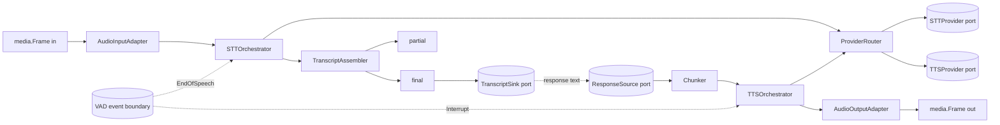

# Phase 11C — Enterprise Speech Pipeline & STT/TTS Orchestration — Implementation Plan

> **For agentic workers:** REQUIRED SUB-SKILL: Use superpowers:subagent-driven-development (recommended) or superpowers:executing-plans to implement this plan task-by-task. Steps use checkbox (`- [ ]`) syntax for tracking.

**Goal:** Build `packages/go/speech` — a provider-agnostic speech orchestration layer that turns inbound media frames into transcripts and response text back into outbound media frames, in real time, with deterministic barge-in.

**Architecture:** A `SpeechRuntime` owns `SpeechSession`s. Each session runs an `STTOrchestrator` (frames → partials → final transcript) and a `TTSOrchestrator` (text → sentence chunks → frames), both behind provider-neutral interfaces selected by a `ProviderRouter` with health, circuit breaking and fallback. A `SpeechTurnManager` sequences one utterance through nine declared states. Nothing in the core imports a vendor SDK, a conversation engine, or a telephony runtime.

**Tech Stack:** Go 1.25+ (toolchain go1.26.5). Standard library plus exactly three first-party dependency-free modules: `packages/go/runtime`, `packages/go/metrics`, `packages/go/media`.

---

## Global Constraints

Every task's requirements implicitly include this section.

### Scope

- **Create only** under `packages/go/speech/` and `docs/speech/`. No other repository path may be modified.
- **Frozen and untouchable:** Phases 10A, 10B, 10C, 10D, 10E, 10F, 10.5, 11A, 11B. `packages/go/runtime`, `packages/go/metrics`, `packages/go/media`, `packages/go/conversation`, `packages/go/governance`, `packages/go/telephony` are consumed or ignored, never edited.
- **No service wiring, no Python.** `services/python/asr-gateway` and `tts-gateway` stay as they are. This matches Phase 11A and 11B, which each shipped a Go package plus docs and wired nothing.

### Dependencies

- `go.mod` requires **exactly three** modules: `packages/go/runtime`, `packages/go/metrics`, `packages/go/media`. All three are first-party and dependency-free, so the transitive closure stays the Go standard library.
- **`packages/go/speech` MUST NOT import `packages/go/conversation`.** A speech session is created *for* a conversation, but the speech layer does not need to know what a conversation is. This is the same reasoning `packages/go/media` used to avoid importing `packages/go/telephony`. The handoff is a port (`TranscriptSink`, `ResponseSource`), and the reason is recorded in `doc.go`.
- **Prohibited in core:** Google Speech SDK, Deepgram SDK, OpenAI SDK, Anthropic SDK, ElevenLabs SDK, Cartesia SDK, Sarvam SDK, Whisper SDK, Piper runtime, or any other speech/ML SDK. No cloud credentials, no API keys, no network calls to a provider.

### Not implemented in this phase

SIP · RTP · WebRTC · carrier integrations · VAD implementation · fraud detection · emergency detection · LLM · a new conversation/memory/governance engine · persistent raw audio recording · vendor SDK integrations.

### Frozen latency budget — do not invent targets

Copied from ADR-0011 and `docs/architecture/voice-pipeline.md`. These are the numbers measurements are compared against.

| Hop | Budget p50 / p95 | Owner | Source |
|---|---|---|---|
| STT final after end-of-speech | **120 / 250 ms** | asr-gateway | ADR-0005 C1 |
| Sentence segmentation — first speakable clause | **15 / 40 ms** | ai-orchestrator | ADR-0011 hop 7 |
| TTS time-to-first-byte | **90 / 180 ms** | tts-gateway | ADR-0007 C1 |
| **Barge-in** | **≤ 20 ms** (one frame interval) | media/speech | ADR-0011, ADR-0004 §12 |
| End to end | 900 p50 / 1 500 p95 / 2 500 p99 | session-orchestrator | ADR-0011 |

**Only two of these are hops this module owns end to end: segmentation (15/40 ms) and barge-in (≤ 20 ms).** STT-final and TTS-TTFB are dominated by a vendor network call this phase does not make, so what is measurable here is *orchestration overhead*, which must be reported separately and never presented as the hop total.

### Privacy and security

- **No raw audio in logs.** No `Frame.Payload` reaches a log, an event, or a metric.
- **No transcript content in metric labels.** Labels are bounded enums or authored identifiers only.
- **No durable audio storage.** Consistent with MEDIA-PCM-1 (Phase 11B).
- **No transcript content in events** beyond bounded metadata; events carry identifiers, counts and states.
- **No credentials in source or tests.**
- Transcript retention is bounded per session; retention *hooks* are defined, no permanent policy is invented (ADR-0012 owns that).

### Determinism

- Every timer, ticker and deadline measures against `runtime.Clock`. `time.NewTicker`, `time.NewTimer`, `time.After`, `time.Sleep` are prohibited in non-test code.
- No global mutable state. Metrics are runtime-scoped.
- No goroutine may outlive its session.

### Repository facts the implementer needs

- **This repository is NOT a git repository** (`git rev-parse` fails). Every task ends with a **verification checkpoint**, not a commit. If the user runs `git init`, replace each checkpoint with the commit message given in the task.
- **`go test -race` cannot run here** — no C compiler is installed (`gcc` absent; `CGO_ENABLED=1` fails). Every task that would use it must run `-count=10 -shuffle=on` instead and **report the race gate as NOT RUN**, never as passed.
- **`golangci-lint` is not installed.** `gofmt` and `go vet` are the available static gates.

### Signatures from frozen modules

```go
// packages/go/runtime
type Clock interface {
    Now() time.Time
    Since(t time.Time) time.Duration
    NewTimer(d time.Duration) Timer
    NewTicker(d time.Duration) Ticker
    Sleep(ctx context.Context, d time.Duration) error
}
type Ticker interface { C() <-chan time.Time; Stop() }
type Timer  interface { C() <-chan time.Time; Stop() bool; Reset(d time.Duration) bool }
func NewFakeClock(t time.Time) *FakeClock          // .Advance(d)
func NewFSM[S comparable](spec FSMSpec[S], c Clock) (*FSM[S], error)
type FSMSpec[S comparable] struct {
    Initial     S
    Transitions map[S][]S
    Terminal    []S
}

// packages/go/metrics
func NewCounter(name string, labels ...string) *Counter
func NewGauge(name string) *Gauge
func NewHistogram(name string, bounds []float64, labels ...string) *Histogram

// packages/go/media
type Frame struct {
    Sequence  uint64
    Timestamp time.Duration
    Arrival   time.Time
    Format    AudioFormat
    Payload   []byte
    Flags     FrameFlags
}
func (f Frame) Duration() time.Duration
func (f Frame) Clone() Frame
func (f Frame) Validate() error
func PCM16Mono8k() AudioFormat
func PCM16Mono16k() AudioFormat
```

**`media.Frame` payloads are BORROWED** from the ring buffer and are overwritten as it wraps. Any speech component that retains a frame past the call that received it **must** `Clone()`. This is the sharpest edge inherited from Phase 11B.

### Commands (run from `packages/go/speech/`)

```bash
gofmt -l .                      # must print nothing
go build ./...
go vet ./...
go test ./...
go test -count=10 -shuffle=on ./...
go test -bench=. -benchmem -run XXX ./...
go list -deps ./... | grep -v callscreen | grep -v "^internal/" | grep "\." | sort -u
```

---

## File Structure

| File | Responsibility | Task |
|---|---|---|
| `go.mod` | Three first-party requires, nothing else | 1 |
| `doc.go` | Package doc: what this is, what it is not, why no conversation import | 1 |
| `ids.go` | `SessionID`, `TurnID`, `SegmentID`, `ProviderID`, validation | 1 |
| `errors.go` | 13 typed sentinels | 1 |
| `transcript.go` | `TranscriptSegment` model, `Language`, `Role` | 2 |
| `assembler.go` | `TranscriptAssembler`, `PartialTranscriptManager`, `FinalTranscriptManager` | 2 |
| `chunker.go` | Deterministic sentence/chunk boundary detector | 3 |
| `turn.go` | Nine speech-turn states, `SpeechTurnManager` | 4 |
| `provider.go` | `STTProvider`, `TTSProvider`, capability metadata | 5 |
| `router.go` | `ProviderRouter`, `ProviderHealth`, `ProviderFallback`, circuit state | 6 |
| `stt.go` | `STTOrchestrator`, `AudioInputAdapter`, bounded transcript queue | 7 |
| `tts.go` | `TTSOrchestrator`, `AudioOutputAdapter`, bounded chunk queue | 8 |
| `session.go` | `SpeechSession`, cancellation, barge-in contract | 9 |
| `runtime.go` | `SpeechRuntime`, session registry, admission, shutdown | 9 |
| `metrics.go` | `SpeechMetrics` over `packages/go/metrics` | 1 |
| `events.go` | Event types, topic naming, `SpeechEventPublisher` port | 10 |
| `harness.go` | Test harness, `FakeSTTProvider`, `FakeTTSProvider` | 5 |
| `speech_test.go` | Unit tests | 2–10 |
| `integration_test.go` | Integration, concurrency, failover, barge-in | 6–9 |
| `chunker_test.go` | Hinglish, Devanagari, mixed-script, numeric, URL | 3 |
| `bench_test.go` | Benchmarks and allocation guards | 11 |
| `docs/speech/*.md` | Eleven documents | 12, 13 |

---

## Task Order

| Task | Delivers | Mandatory test cases closed |
|---|---|---|
| 1 | Module scaffold, IDs, error model | — |
| 2 | Transcript model and assembler | 1, 2, 3, 4 |
| 3 | Sentence chunker | 15–23 |
| 4 | Speech turn state machine | — |
| 5 | Provider contracts + fakes | — |
| 6 | Router, health, circuit, fallback | 5, 6, 7, 8 |
| 7 | STT orchestrator + input adapter | 12 |
| 8 | TTS orchestrator + output adapter | 9, 11 |
| 9 | Session, runtime, barge-in, cancellation | 10, 13, 14, 24, 25 |
| 10 | Metrics and events | — |
| 11 | Benchmarks and gates | — |
| 12 | Docs 1–7 | — |
| 13 | Docs 8–11 and final gates | — |

---

## Task 1: Module scaffold, identifiers, error model and metrics

**Files:** Create `go.mod`, `doc.go`, `ids.go`, `errors.go`, `metrics.go`

**Why metrics lands here rather than with events:** `SpeechMetrics` is a
constructor parameter of `NewSTTOrchestrator` (task 7) and
`NewTTSOrchestrator` (task 8). Defining it later would leave those tasks
unable to compile, so the instrument set is created up front and only the
event model waits for task 10.

**Interfaces produced:**
- `type SessionID string`, `TurnID string`, `SegmentID string`, `ProviderID string`, each with `Valid() bool` and `String() string`
- `func NewSessionID() SessionID`, `NewTurnID() TurnID`, `NewSegmentID() SegmentID`
- Thirteen sentinels, all `error` values

- [ ] **Step 1: Create `go.mod`**

```
module github.com/callscreen/callscreen-platform/packages/go/speech

go 1.25.0

require (
	github.com/callscreen/callscreen-platform/packages/go/media v0.0.0
	github.com/callscreen/callscreen-platform/packages/go/metrics v0.0.0
	github.com/callscreen/callscreen-platform/packages/go/runtime v0.0.0
)

replace github.com/callscreen/callscreen-platform/packages/go/runtime => ../runtime

replace github.com/callscreen/callscreen-platform/packages/go/metrics => ../metrics

replace github.com/callscreen/callscreen-platform/packages/go/media => ../media
```

- [ ] **Step 2: Add the module to `go.work`**

Insert `./packages/go/speech` into the `use (...)` block of `go.work`, in the packages group after `./packages/go/media`. **This is the one edit outside `packages/go/speech/` that this plan permits**, and it is required for the workspace to resolve the module.

- [ ] **Step 3: Write `errors.go`**

```go
package speech

import "errors"

// The typed error set. Control flow uses errors.Is against these sentinels;
// nothing in this package branches on an error string.
var (
	// ErrProviderUnavailable means no provider could serve the request.
	ErrProviderUnavailable = errors.New("speech: provider unavailable")
	// ErrProviderTimeout means a provider exceeded its deadline.
	ErrProviderTimeout = errors.New("speech: provider timeout")
	// ErrProviderRateLimited means a provider refused for rate reasons.
	ErrProviderRateLimited = errors.New("speech: provider rate limited")
	// ErrProviderCircuitOpen means the circuit breaker refused before trying.
	ErrProviderCircuitOpen = errors.New("speech: provider circuit open")
	// ErrInvalidAudio means a frame failed validation or had the wrong format.
	ErrInvalidAudio = errors.New("speech: invalid audio")
	// ErrInvalidTranscript means a transcript segment was malformed.
	ErrInvalidTranscript = errors.New("speech: invalid transcript")
	// ErrTranscriptOutOfOrder means a segment arrived behind the committed
	// sequence and cannot be applied.
	ErrTranscriptOutOfOrder = errors.New("speech: transcript out of order")
	// ErrSpeechSessionClosed means the session is no longer accepting work.
	ErrSpeechSessionClosed = errors.New("speech: session closed")
	// ErrSTTCancelled means recognition was cancelled.
	ErrSTTCancelled = errors.New("speech: stt cancelled")
	// ErrTTSCancelled means synthesis was cancelled.
	ErrTTSCancelled = errors.New("speech: tts cancelled")
	// ErrBackpressure means a bounded queue refused work. NOT a fault: the
	// caller is being told to slow down, which is the queue doing its job.
	ErrBackpressure = errors.New("speech: backpressure")
	// ErrUnsupportedLanguage means no routed provider declares the language.
	ErrUnsupportedLanguage = errors.New("speech: unsupported language")
	// ErrInternalFailure is the last resort. Anything returning this without a
	// wrapped cause is a bug in this package.
	ErrInternalFailure = errors.New("speech: internal failure")
)

// ConfigError reports every problem with a configuration at once, because
// fixing one misconfiguration at a time across a restart cycle is miserable.
type ConfigError struct{ Problems []string }

func (e *ConfigError) Error() string {
	if len(e.Problems) == 1 {
		return e.Problems[0]
	}
	return fmt.Sprintf("%d configuration problems: %s",
		len(e.Problems), strings.Join(e.Problems, "; "))
}
```

Add `"fmt"` and `"strings"` to the imports.

- [ ] **Step 4: Write `ids.go`**

Identifiers are opaque strings, validated to lowercase alphanumerics, hyphen and underscore, because they become metric labels and topic segments. Follow the pattern in `packages/go/media/errors.go` (`SourceID` validation) exactly — read it first.

```go
package speech

import (
	"crypto/rand"
	"encoding/hex"
	"fmt"
)

// SessionID identifies one speech session.
type SessionID string

// TurnID identifies one speech turn within a session.
type TurnID string

// SegmentID identifies one transcript segment within a turn.
type SegmentID string

// ProviderID names a provider. Authored, never derived from provider output,
// because it becomes a metric label and a topic segment.
type ProviderID string

func newID(prefix string) string {
	var b [8]byte
	if _, err := rand.Read(b[:]); err != nil {
		panic("speech: crypto/rand failed: " + err.Error())
	}
	return prefix + "-" + hex.EncodeToString(b[:])
}

// NewSessionID returns a fresh session identifier.
func NewSessionID() SessionID { return SessionID(newID("ss")) }

// NewTurnID returns a fresh turn identifier.
func NewTurnID() TurnID { return TurnID(newID("st")) }

// NewSegmentID returns a fresh segment identifier.
func NewSegmentID() SegmentID { return SegmentID(newID("sg")) }

// validLabel reports whether s is safe as a metric label and topic segment.
func validLabel(s string) bool {
	if s == "" || len(s) > 64 {
		return false
	}
	for _, r := range s {
		switch {
		case r >= 'a' && r <= 'z', r >= '0' && r <= '9', r == '-', r == '_':
		default:
			return false
		}
	}
	return true
}

// Valid reports whether the identifier is well-formed.
func (s SessionID) Valid() bool  { return validLabel(string(s)) }
func (t TurnID) Valid() bool     { return validLabel(string(t)) }
func (s SegmentID) Valid() bool  { return validLabel(string(s)) }
func (p ProviderID) Valid() bool { return validLabel(string(p)) }

func (s SessionID) String() string  { return string(s) }
func (t TurnID) String() string     { return string(t) }
func (s SegmentID) String() string  { return string(s) }
func (p ProviderID) String() string { return string(p) }

var _ = fmt.Sprintf
```

Remove the `var _ = fmt.Sprintf` line and the `fmt` import if the compiler reports them unused.

- [ ] **Step 5: Write `metrics.go`**

Use `packages/go/metrics` type aliases exactly as `packages/go/media/metrics.go`
does — `type Counter = metrics.Counter`, `Gauge`, `Histogram`, `Sample`. **Do not
create another metrics implementation**; the brief forbids it and Phase 10.5 owns
this.

Instruments, all runtime-scoped, never global:

```go
type SpeechMetrics struct {
	// Sessions
	SessionsActive *Gauge
	SessionsOpened *Counter // language
	SessionsClosed *Counter // reason
	STTStreams     *Gauge
	TTSStreams     *Gauge

	// Transcripts
	PartialsReceived   *Counter // language
	FinalsReceived     *Counter // language
	AssemblyRejections *Counter // reason  — the AssemblyReason enum

	// Providers
	ProviderFailures *Counter // provider, outcome
	ProviderSwitches *Counter // from, to
	CircuitOpens     *Counter // provider

	// Control
	Interruptions      *Counter
	Cancellations      *Counter // stage
	BackpressureEvents *Counter // queue
	QueueDepth         *Gauge

	// Latency, in SECONDS, so the histogram matches every other subsystem
	FirstPartialLatency    *Histogram // language
	FinalTranscriptLatency *Histogram // language
	FirstAudioLatency      *Histogram // provider
	InterruptLatency       *Histogram
}

func NewSpeechMetrics() *SpeechMetrics
```

**Every label is a bounded enum (`language`, `reason`, `stage`, `queue`,
`outcome`) or an authored `ProviderID`. No transcript text, no caller
identifier, no free-form provider output ever becomes a label** — an unbounded
label is both a cardinality explosion and a content leak, and here it would be a
leak of what someone said.

- [ ] **Step 6: Write `doc.go`**

Package documentation covering: what this is (speech orchestration), what it is not (no SDK, no VAD, no LLM, no RTP), the three-dependency rule, **why it does not import `packages/go/conversation`** (a speech session is created for a conversation but does not need to know what one is; coupling would make the speech core untestable without a conversation engine), the borrowed-payload hazard inherited from `media.Frame`, and the frozen latency budget it is measured against.

- [ ] **Step 7: Verify it builds and the dependency rule holds**

```bash
gofmt -l . && go build ./... && go vet ./...
go list -deps ./... | grep -v callscreen | grep "\." | sort -u
```

Expected: `gofmt` prints nothing; build and vet clean; the dependency list contains **only** standard-library paths. Any third-party module is a task failure.

- [ ] **Step 8: Verification checkpoint**

(Git message: `feat(speech): scaffold module, identifiers, error model and metrics`)

---

## Task 2: Transcript model and assembler

**Files:** Create `transcript.go`, `assembler.go`; create `speech_test.go`

**Interfaces consumed:** `SessionID`, `TurnID`, `SegmentID`, `ProviderID`, `ErrTranscriptOutOfOrder`, `ErrInvalidTranscript`
**Interfaces produced:**
- `type TranscriptSegment struct{...}` with `Validate() error`
- `func NewTranscriptAssembler(sess SessionID, clock rt.Clock) *TranscriptAssembler`
- `func (a *TranscriptAssembler) Apply(seg TranscriptSegment) (AssemblyResult, error)`
- `type AssemblyResult struct { Applied bool; Superseded bool; Reason AssemblyReason }`
- `func (a *TranscriptAssembler) Partial(turn TurnID) (TranscriptSegment, bool)`
- `func (a *TranscriptAssembler) Final(turn TurnID) (TranscriptSegment, bool)`
- `func (a *TranscriptAssembler) Segments() []TranscriptSegment`

This task closes mandatory cases **1 (partial→partial→final)**, **2 (stale partial after final)**, **3 (duplicate final)** and **4 (out-of-order partial)**.

- [ ] **Step 1: Write `transcript.go`**

```go
package speech

import (
	"fmt"
	"time"
)

// Language is a BCP-47 tag. A string rather than an enum because the set is
// open — Tamil metadata must be expressible before Tamil is supported.
type Language string

// The languages the architecture is designed around. Others are legal.
const (
	LangEnglishIN Language = "en-IN"
	LangHindi     Language = "hi-IN"
	// LangHinglish marks code-mixed Hindi-English. Not a real BCP-47 tag, and
	// deliberately distinguished from hi-IN: a router may have a provider that
	// handles code-mixing well and one that does not.
	LangHinglish Language = "hi-Latn-IN"
	LangTamil    Language = "ta-IN"
	LangUnknown  Language = ""
)

// Role is who produced the speech.
type Role string

const (
	RoleCaller Role = "caller"
	RoleAgent  Role = "agent"
)

// ProviderMeta is bounded provider metadata.
//
// DELIBERATELY NOT A map[string]any AND NOT A RAW VENDOR STRUCT. A provider
// response carries fields whose shape is the vendor's to change, and admitting
// them here would put a vendor schema into the core contract — the exact thing
// this phase exists to prevent. Three bounded fields cover what a router and an
// operator actually need.
type ProviderMeta struct {
	// Provider is the authored identifier, safe as a metric label.
	Provider ProviderID
	// Model is an authored, bounded model name. Never free-form vendor output.
	Model string
	// Latency is how long the provider took to produce this segment.
	Latency time.Duration
}

// TranscriptSegment is one unit of recognised speech.
//
// # It carries text, and therefore it is sensitive
//
// Text is conversation content. It never reaches a metric label, a log line at
// default level, or an event payload. See SECURITY_REVIEW.md.
type TranscriptSegment struct {
	Session SessionID
	Turn    TurnID
	Segment SegmentID

	// Sequence orders segments within a turn. Monotonic per turn; a provider
	// that repeats or reorders is detected by this alone.
	Sequence uint64

	Text    string
	IsFinal bool

	// Confidence is 0..1. Providers that do not report it use -1, which is
	// distinguishable from a genuine zero — a provider reporting zero
	// confidence and a provider reporting nothing are different situations.
	Confidence float64

	StartTime time.Duration
	EndTime   time.Duration

	Language Language
	Role     Role
	Meta     ProviderMeta
}

// ConfidenceUnknown marks a provider that reports no confidence.
const ConfidenceUnknown = -1.0

// Duration returns the segment's span on the media timeline.
func (s TranscriptSegment) Duration() time.Duration { return s.EndTime - s.StartTime }

// Validate checks the segment, reporting every problem.
func (s TranscriptSegment) Validate() error {
	var problems []string
	if !s.Session.Valid() {
		problems = append(problems, "transcript: Session is not a valid identifier")
	}
	if !s.Turn.Valid() {
		problems = append(problems, "transcript: Turn is not a valid identifier")
	}
	if !s.Segment.Valid() {
		problems = append(problems, "transcript: Segment is not a valid identifier")
	}
	if s.Confidence != ConfidenceUnknown && (s.Confidence < 0 || s.Confidence > 1) {
		problems = append(problems, fmt.Sprintf(
			"transcript: Confidence %v is outside 0..1 and is not ConfidenceUnknown", s.Confidence))
	}
	if s.EndTime < s.StartTime {
		problems = append(problems, fmt.Sprintf(
			"transcript: EndTime %s precedes StartTime %s", s.EndTime, s.StartTime))
	}
	if s.Meta.Provider != "" && !s.Meta.Provider.Valid() {
		problems = append(problems, "transcript: Meta.Provider is not a valid identifier")
	}
	if len(problems) > 0 {
		return fmt.Errorf("%w: %v", ErrInvalidTranscript, problems)
	}
	return nil
}

// Redacted renders the segment WITHOUT its text, for logs and events.
func (s TranscriptSegment) Redacted() string {
	return fmt.Sprintf("segment %s turn=%s seq=%d final=%v chars=%d lang=%s conf=%.2f",
		s.Segment, s.Turn, s.Sequence, s.IsFinal, len(s.Text), s.Language, s.Confidence)
}
```

- [ ] **Step 2: Write the failing tests**

Create `speech_test.go`:

```go
package speech

import (
	"testing"
	"time"

	rt "github.com/callscreen/callscreen-platform/packages/go/runtime"
)

func testClock() *rt.FakeClock {
	return rt.NewFakeClock(time.Date(2026, 1, 1, 9, 0, 0, 0, time.UTC))
}

func seg(turn TurnID, sess SessionID, n uint64, text string, final bool) TranscriptSegment {
	return TranscriptSegment{
		Session: sess, Turn: turn, Segment: NewSegmentID(),
		Sequence: n, Text: text, IsFinal: final,
		Confidence: 0.9, Language: LangEnglishIN, Role: RoleCaller,
		StartTime: 0, EndTime: time.Duration(n) * 100 * time.Millisecond,
	}
}

// Mandatory case 1: partial → partial → final.
func TestAssembler_PartialPartialFinal(t *testing.T) {
	t.Parallel()
	sess := NewSessionID()
	turn := NewTurnID()
	a := NewTranscriptAssembler(sess, testClock())

	for i, text := range []string{"hello", "hello there", "hello there friend"} {
		res, err := a.Apply(seg(turn, sess, uint64(i+1), text, false))
		if err != nil {
			t.Fatalf("partial %d: %v", i+1, err)
		}
		if !res.Applied {
			t.Fatalf("partial %d was not applied: %s", i+1, res.Reason)
		}
	}
	got, ok := a.Partial(turn)
	if !ok || got.Text != "hello there friend" {
		t.Fatalf("partial = %q (ok=%v), want the newest", got.Text, ok)
	}

	res, err := a.Apply(seg(turn, sess, 4, "hello there friend.", true))
	if err != nil {
		t.Fatal(err)
	}
	if !res.Applied {
		t.Fatalf("final was not applied: %s", res.Reason)
	}
	fin, ok := a.Final(turn)
	if !ok || fin.Text != "hello there friend." {
		t.Fatalf("final = %q (ok=%v)", fin.Text, ok)
	}
	// The live partial is cleared by finalisation: a consumer rendering the
	// partial alongside the final would show the caller's words twice.
	if _, ok := a.Partial(turn); ok {
		t.Error("a partial survived finalisation")
	}
}

// Mandatory case 2: a stale partial arriving after the final must not rewrite it.
func TestAssembler_StalePartialAfterFinalIsRejected(t *testing.T) {
	t.Parallel()
	sess := NewSessionID()
	turn := NewTurnID()
	a := NewTranscriptAssembler(sess, testClock())

	if _, err := a.Apply(seg(turn, sess, 2, "final text", true)); err != nil {
		t.Fatal(err)
	}
	res, err := a.Apply(seg(turn, sess, 1, "stale partial", false))
	if err != nil {
		t.Fatalf("a stale partial must be reported, not errored: %v", err)
	}
	if res.Applied {
		t.Fatal("a stale partial rewrote a finalised turn")
	}
	if res.Reason != ReasonAfterFinal {
		t.Errorf("reason = %s, want after_final", res.Reason)
	}
	fin, _ := a.Final(turn)
	if fin.Text != "final text" {
		t.Errorf("final was rewritten to %q", fin.Text)
	}
}

// Mandatory case 3: a second final for the same turn must be refused.
func TestAssembler_DuplicateFinalIsRefused(t *testing.T) {
	t.Parallel()
	sess := NewSessionID()
	turn := NewTurnID()
	a := NewTranscriptAssembler(sess, testClock())

	if _, err := a.Apply(seg(turn, sess, 1, "first final", true)); err != nil {
		t.Fatal(err)
	}
	res, err := a.Apply(seg(turn, sess, 2, "second final", true))
	if err != nil {
		t.Fatal(err)
	}
	if res.Applied {
		t.Fatal("a turn was finalised twice")
	}
	if res.Reason != ReasonDoubleFinal {
		t.Errorf("reason = %s, want double_final", res.Reason)
	}
	fin, _ := a.Final(turn)
	if fin.Text != "first final" {
		t.Errorf("the first final was overwritten: %q", fin.Text)
	}
}

// Mandatory case 4: a partial behind the committed sequence is out of order.
func TestAssembler_OutOfOrderPartialIsRejected(t *testing.T) {
	t.Parallel()
	sess := NewSessionID()
	turn := NewTurnID()
	a := NewTranscriptAssembler(sess, testClock())

	if _, err := a.Apply(seg(turn, sess, 5, "fifth", false)); err != nil {
		t.Fatal(err)
	}
	res, err := a.Apply(seg(turn, sess, 3, "third", false))
	if err != nil {
		t.Fatal(err)
	}
	if res.Applied {
		t.Fatal("an out-of-order partial was applied")
	}
	if res.Reason != ReasonOutOfOrder {
		t.Errorf("reason = %s, want out_of_order", res.Reason)
	}
	got, _ := a.Partial(turn)
	if got.Text != "fifth" {
		t.Errorf("partial regressed to %q", got.Text)
	}
}

// A duplicate sequence is deduplicated rather than applied twice.
func TestAssembler_DuplicateSequenceIsDeduplicated(t *testing.T) {
	t.Parallel()
	sess := NewSessionID()
	turn := NewTurnID()
	a := NewTranscriptAssembler(sess, testClock())

	if _, err := a.Apply(seg(turn, sess, 1, "once", false)); err != nil {
		t.Fatal(err)
	}
	res, _ := a.Apply(seg(turn, sess, 1, "once", false))
	if res.Applied {
		t.Fatal("a duplicate sequence was applied twice")
	}
	if res.Reason != ReasonDuplicate {
		t.Errorf("reason = %s, want duplicate", res.Reason)
	}
}

// Mandatory case 25 (part): a segment from another session must be refused.
func TestAssembler_RefusesForeignSession(t *testing.T) {
	t.Parallel()
	a := NewTranscriptAssembler(NewSessionID(), testClock())
	other := seg(NewTurnID(), NewSessionID(), 1, "not mine", false)

	if _, err := a.Apply(other); err == nil {
		t.Fatal("a segment from another session was accepted")
	}
}
```

- [ ] **Step 3: Run and confirm failure**

```bash
go test -run TestAssembler_ ./...
```

Expected: FAIL to build — `undefined: NewTranscriptAssembler`, `undefined: ReasonAfterFinal`.

- [ ] **Step 4: Write `assembler.go`**

Implement to satisfy exactly those tests. Required shape:

```go
package speech

import (
	"fmt"
	"sync"

	rt "github.com/callscreen/callscreen-platform/packages/go/runtime"
)

// AssemblyReason explains an assembler decision. A bounded enum, so it is safe
// as a metric label.
type AssemblyReason string

const (
	ReasonApplied     AssemblyReason = "applied"
	ReasonDuplicate   AssemblyReason = "duplicate"
	ReasonOutOfOrder  AssemblyReason = "out_of_order"
	ReasonAfterFinal  AssemblyReason = "after_final"
	ReasonDoubleFinal AssemblyReason = "double_final"
)

func (r AssemblyReason) String() string { return string(r) }

// AssemblyResult is what the assembler decided about a segment.
type AssemblyResult struct {
	Applied    bool
	Superseded bool
	Reason     AssemblyReason
}

// turnState is one turn's assembly state.
type turnState struct {
	partial   TranscriptSegment
	havePart  bool
	final     TranscriptSegment
	haveFinal bool
	// highest is the greatest sequence seen, the ordering gate.
	highest uint64
	// seen deduplicates sequences within the turn.
	seen map[uint64]struct{}
}

// TranscriptAssembler turns a stream of provider results into an ordered,
// immutable transcript.
//
// # A final is immutable
//
// Once a turn is finalised nothing rewrites it: not a late partial, not a second
// final, not a retry from a provider that already answered. Providers legitimately
// emit results after a stream closes, and a transcript that could be rewritten
// after the conversation engine acted on it is worse than one that loses a word.
type TranscriptAssembler struct {
	session SessionID
	clock   rt.Clock

	mu    sync.RWMutex
	turns map[TurnID]*turnState
	// order preserves the turn order for Segments().
	order []TurnID
}
```

`Apply` must, in this order: validate the segment; refuse a foreign session with an error wrapping `ErrTranscriptOutOfOrder`'s sibling `ErrInvalidTranscript`; return `ReasonAfterFinal` if the turn is final and the segment is not; return `ReasonDoubleFinal` if the turn is final and the segment is final; return `ReasonDuplicate` on a repeated sequence; return `ReasonOutOfOrder` if `Sequence < highest`; otherwise apply and return `ReasonApplied`. Finalisation clears the live partial.

`PartialTranscriptManager` and `FinalTranscriptManager` are the two views the brief names, and they are **methods on this type, not separate structs** — splitting one piece of state across three objects would let them disagree. Document that decision in `assembler.go`.

- [ ] **Step 5: Verify all six tests pass**

```bash
go test -run TestAssembler_ -v ./...
```

Expected: 6 PASS.

- [ ] **Step 6: Verification checkpoint**

```bash
gofmt -l . && go vet ./... && go test -count=10 -shuffle=on -run TestAssembler_ ./...
```

(Git message: `feat(speech): transcript model and immutable-final assembler`)

---

## Task 3: Deterministic sentence chunker

**Files:** Create `chunker.go`, `chunker_test.go`

**Interfaces produced:**
- `func NewChunker(cfg ChunkConfig) (*Chunker, error)`
- `func (c *Chunker) Push(text string) []Chunk` — feed streaming text, get complete chunks
- `func (c *Chunker) Flush() []Chunk` — end of stream, emit the remainder
- `type Chunk struct { Sequence uint64; Text string; Terminator rune; IsFinal bool }`
- `type ChunkConfig struct { MinChars int; MaxChars int; Abbreviations []string }`
- `func DefaultChunkConfig() ChunkConfig`

This task closes mandatory cases **15–23**. It is the hop ADR-0011 budgets at **15 ms p50 / 40 ms p95**, so it is also a latency-critical path.

- [ ] **Step 1: Write `chunker_test.go` — the full table**

```go
package speech

import "testing"

func chunkTexts(t *testing.T, c *Chunker, in string) []string {
	t.Helper()
	var out []string
	for _, ch := range c.Push(in) {
		out = append(out, ch.Text)
	}
	for _, ch := range c.Flush() {
		out = append(out, ch.Text)
	}
	return out
}

func TestChunker_Boundaries(t *testing.T) {
	t.Parallel()
	cases := []struct {
		name string
		in   string
		want []string
	}{
		// Mandatory 15 — Hindi.
		{"hindi devanagari danda",
			"नमस्ते। आप कैसे हैं।",
			[]string{"नमस्ते।", "आप कैसे हैं।"}},

		// Mandatory 17 — Devanagari with question and exclamation.
		{"devanagari mixed terminators",
			"क्या हाल है? बहुत बढ़िया! ठीक है।",
			[]string{"क्या हाल है?", "बहुत बढ़िया!", "ठीक है।"}},

		// Mandatory 16 and 18 — Hinglish and Hindi-English mixed.
		{"hinglish code mixed",
			"Aapka OTP hai 4 5 6. Please share mat kijiye. Thank you!",
			[]string{"Aapka OTP hai 4 5 6.", "Please share mat kijiye.", "Thank you!"}},
		{"devanagari and latin in one utterance",
			"मैं आपकी help कर सकता हूँ। Please hold.",
			[]string{"मैं आपकी help कर सकता हूँ।", "Please hold."}},

		// Mandatory 19 — decimal numbers must not split.
		{"decimals",
			"The amount is 1234.56 rupees. Confirm please.",
			[]string{"The amount is 1234.56 rupees.", "Confirm please."}},

		// Mandatory 20 — phone numbers must not split.
		{"phone number",
			"Call 022.2222.3333 now. Thanks.",
			[]string{"Call 022.2222.3333 now.", "Thanks."}},

		// Mandatory 21 — OTP-like digit runs must not split.
		{"otp digits",
			"Your code is 4 8 2 9 1 6. Do not share.",
			[]string{"Your code is 4 8 2 9 1 6.", "Do not share."}},

		// Mandatory 22 — URLs must not split.
		{"url",
			"Visit example.co.in for details. Bye.",
			[]string{"Visit example.co.in for details.", "Bye."}},

		// Mandatory 23 — abbreviations must not split.
		{"abbreviations",
			"Dr. Sharma will call. Mr. Rao agreed.",
			[]string{"Dr. Sharma will call.", "Mr. Rao agreed."}},

		// Short sentences are legal and must survive.
		{"short sentences", "Yes. No. Ok.", []string{"Yes.", "No.", "Ok."}},

		// No terminator at all — Flush must still emit.
		{"unterminated", "no terminator here", []string{"no terminator here"}},
	}

	for _, tc := range cases {
		t.Run(tc.name, func(t *testing.T) {
			t.Parallel()
			c, err := NewChunker(DefaultChunkConfig())
			if err != nil {
				t.Fatal(err)
			}
			got := chunkTexts(t, c, tc.in)
			if len(got) != len(tc.want) {
				t.Fatalf("got %d chunks %q, want %d %q", len(got), got, len(tc.want), tc.want)
			}
			for i := range got {
				if got[i] != tc.want[i] {
					t.Errorf("chunk %d = %q, want %q", i, got[i], tc.want[i])
				}
			}
		})
	}
}

// Streaming must produce the same chunks as one-shot input. This is the
// property that lets TTS start before the LLM has finished.
func TestChunker_StreamingMatchesOneShot(t *testing.T) {
	t.Parallel()
	const full = "Aapka balance 1234.56 hai। Dr. Sharma se baat kijiye. Thank you!"

	one, err := NewChunker(DefaultChunkConfig())
	if err != nil {
		t.Fatal(err)
	}
	want := chunkTexts(t, one, full)

	stream, err := NewChunker(DefaultChunkConfig())
	if err != nil {
		t.Fatal(err)
	}
	var got []string
	for _, r := range full { // one rune at a time — the worst case
		for _, ch := range stream.Push(string(r)) {
			got = append(got, ch.Text)
		}
	}
	for _, ch := range stream.Flush() {
		got = append(got, ch.Text)
	}

	if len(got) != len(want) {
		t.Fatalf("streaming produced %d chunks %q, one-shot produced %d %q",
			len(got), got, len(want), want)
	}
	for i := range got {
		if got[i] != want[i] {
			t.Errorf("chunk %d: streaming %q, one-shot %q", i, got[i], want[i])
		}
	}
}

// Sequence numbers are monotonic and gapless — TTS chunk ordering depends on it.
func TestChunker_SequenceIsMonotonic(t *testing.T) {
	t.Parallel()
	c, err := NewChunker(DefaultChunkConfig())
	if err != nil {
		t.Fatal(err)
	}
	chunks := append(c.Push("One. Two. Three."), c.Flush()...)
	for i, ch := range chunks {
		if ch.Sequence != uint64(i) {
			t.Errorf("chunk %d has sequence %d", i, ch.Sequence)
		}
	}
}

// MaxChars must force a break, or one unterminated sentence delays all audio.
func TestChunker_MaxCharsForcesABreak(t *testing.T) {
	t.Parallel()
	cfg := DefaultChunkConfig()
	cfg.MaxChars = 20
	c, err := NewChunker(cfg)
	if err != nil {
		t.Fatal(err)
	}
	long := "this is a very long clause with no terminator anywhere in it at all"
	got := append(c.Push(long), c.Flush()...)
	if len(got) < 2 {
		t.Fatalf("MaxChars did not force a break: %d chunks", len(got))
	}
	for _, ch := range got {
		if len([]rune(ch.Text)) > cfg.MaxChars*2 {
			t.Errorf("chunk %q far exceeds MaxChars %d", ch.Text, cfg.MaxChars)
		}
	}
}
```

- [ ] **Step 2: Run and confirm failure**

```bash
go test -run TestChunker_ ./...
```

Expected: FAIL to build — `undefined: NewChunker`.

- [ ] **Step 3: Implement `chunker.go`**

The algorithm, stated precisely so the implementer does not invent one:

A terminator candidate is one of `.` `?` `!` `।` (Devanagari danda, U+0964) or `॥` (U+0965). On seeing a candidate at index `i` in the accumulated buffer, emit a chunk **only if all hold**:

1. `?`, `!`, `।` and `॥` always terminate — they are unambiguous in every script this handles. **Only `.` needs the suppression rules below.**
2. For `.`: the **next** rune must be end-of-input or whitespace. `1234.56` and `example.co.in` fail here, which is why decimals and URLs survive.
3. For `.`: the token immediately before must not be a known abbreviation (case-sensitive match against `ChunkConfig.Abbreviations`). Default list: `Dr`, `Mr`, `Mrs`, `Ms`, `Prof`, `Sr`, `Jr`, `St`, `vs`, `etc`, `No`, `Rs`, `approx`, `Inc`, `Ltd`, `Pvt`.
4. For `.`: the token immediately before must not be a single letter (initials such as `A. K. Sharma`).
5. The accumulated text must contain at least `MinChars` **non-space runes** (default 2), so `.` alone never emits an empty chunk.

Independently of terminators, if the buffer exceeds `MaxChars` runes (default 240), break at the last whitespace at or before `MaxChars`, or at `MaxChars` if there is none. **A single unterminated clause must never hold all audio hostage** — that is the failure mode ADR-0007 §31 describes as "over a second of dead air".

Digit runs (`4 8 2 9 1 6`) need no special rule: rule 2 already prevents splitting inside `1234.56`, and spaced digits contain no `.` at all.

Rune-based throughout — `[]rune`, not `[]byte`. Devanagari is multi-byte and byte indexing would split a grapheme.

- [ ] **Step 4: Run the tests**

```bash
go test -run TestChunker_ -v ./...
```

Expected: all subtests PASS. If a Devanagari case fails, check that the buffer is `[]rune` and that U+0964 is matched as a rune.

- [ ] **Step 5: Verification checkpoint**

```bash
gofmt -l . && go vet ./... && go test -count=10 -shuffle=on -run TestChunker_ ./...
```

(Git message: `feat(speech): deterministic multi-script sentence chunker`)

---

## Task 4: Speech turn state machine

**Files:** Create `turn.go`; append to `speech_test.go`

**Interfaces consumed:** `rt.NewFSM`, `rt.FSMSpec`, `TurnID`
**Interfaces produced:**
- `type SpeechTurnState string` with the nine states
- `func AllTurnStates() []SpeechTurnState`, `func CanTurnTransition(from, to SpeechTurnState) bool`
- `func NewSpeechTurnManager(clock rt.Clock) *SpeechTurnManager`
- `func (m *SpeechTurnManager) Begin(role Role) (*SpeechTurn, error)`
- `func (m *SpeechTurnManager) Transition(id TurnID, to SpeechTurnState, reason string) error`
- `func (m *SpeechTurnManager) Turn(id TurnID) (*SpeechTurn, bool)`
- `func (m *SpeechTurnManager) Active() (*SpeechTurn, bool)`

- [ ] **Step 1: Write the failing tests**

Append to `speech_test.go`:

```go
func TestTurn_NineStatesExist(t *testing.T) {
	t.Parallel()
	if got := len(AllTurnStates()); got != 9 {
		t.Fatalf("%d states declared, want 9", got)
	}
}

func TestTurn_NoImplicitTransitions(t *testing.T) {
	t.Parallel()
	// Listening cannot jump straight to Final: a turn that never passed through
	// Finalizing was never endpointed, and a transcript nobody endpointed is a
	// transcript nobody can be sure is complete.
	if CanTurnTransition(TurnListening, TurnFinal) {
		t.Error("listening -> final must not be declared")
	}
	// A cancelled turn is terminal.
	for _, s := range AllTurnStates() {
		if CanTurnTransition(TurnCancelled, s) {
			t.Errorf("cancelled -> %s must not be declared", s)
		}
	}
}

func TestTurn_HappyPath(t *testing.T) {
	t.Parallel()
	m := NewSpeechTurnManager(testClock())
	turn, err := m.Begin(RoleCaller)
	if err != nil {
		t.Fatal(err)
	}
	for _, to := range []SpeechTurnState{
		TurnPartial, TurnFinalizing, TurnFinal, TurnResponding, TurnSpeaking,
	} {
		if err := m.Transition(turn.ID, to, "test"); err != nil {
			t.Fatalf("-> %s: %v", to, err)
		}
	}
}

func TestTurn_UndeclaredTransitionIsRefused(t *testing.T) {
	t.Parallel()
	m := NewSpeechTurnManager(testClock())
	turn, err := m.Begin(RoleCaller)
	if err != nil {
		t.Fatal(err)
	}
	if err := m.Transition(turn.ID, TurnFinal, "skip"); err == nil {
		t.Fatal("an undeclared transition was accepted")
	}
}

func TestTurn_OnlyOneActiveTurn(t *testing.T) {
	t.Parallel()
	m := NewSpeechTurnManager(testClock())
	if _, err := m.Begin(RoleCaller); err != nil {
		t.Fatal(err)
	}
	// A second Begin while one is live would produce duplicate turns, which is
	// exactly what the brief forbids.
	if _, err := m.Begin(RoleCaller); err == nil {
		t.Fatal("a duplicate concurrent turn was created")
	}
}

func TestTurn_InterruptedStartsANewTurn(t *testing.T) {
	t.Parallel()
	m := NewSpeechTurnManager(testClock())
	first, err := m.Begin(RoleCaller)
	if err != nil {
		t.Fatal(err)
	}
	for _, to := range []SpeechTurnState{TurnPartial, TurnFinalizing, TurnFinal, TurnResponding, TurnSpeaking} {
		if err := m.Transition(first.ID, to, "test"); err != nil {
			t.Fatal(err)
		}
	}
	if err := m.Transition(first.ID, TurnInterrupted, "barge_in"); err != nil {
		t.Fatal(err)
	}
	second, err := m.Begin(RoleCaller)
	if err != nil {
		t.Fatalf("an interrupted turn blocked the next one: %v", err)
	}
	if second.ID == first.ID {
		t.Fatal("the interrupted turn was reused instead of a new one being created")
	}
}
```

- [ ] **Step 2: Run and confirm failure**

```bash
go test -run TestTurn_ ./...
```

Expected: FAIL to build.

- [ ] **Step 3: Implement `turn.go`**

Nine states, declared exactly:

```go
const (
	TurnListening  SpeechTurnState = "listening"
	TurnSpeaking   SpeechTurnState = "speaking"
	TurnPartial    SpeechTurnState = "partial"
	TurnFinalizing SpeechTurnState = "finalizing"
	TurnFinal      SpeechTurnState = "final"
	TurnResponding SpeechTurnState = "responding"
	TurnInterrupted SpeechTurnState = "interrupted"
	TurnCancelled  SpeechTurnState = "cancelled"
	TurnFailed     SpeechTurnState = "failed"
)
```

The transition table, which is the single source of truth:

```go
func turnTransitions() map[SpeechTurnState][]SpeechTurnState {
	return map[SpeechTurnState][]SpeechTurnState{
		// A turn begins listening. It may receive partials, be endpointed
		// straight to finalizing (a very short utterance), or die.
		TurnListening:  {TurnPartial, TurnFinalizing, TurnCancelled, TurnFailed},
		TurnPartial:    {TurnPartial, TurnFinalizing, TurnCancelled, TurnFailed},
		TurnFinalizing: {TurnFinal, TurnCancelled, TurnFailed},
		// A final transcript hands off to the conversation layer.
		TurnFinal:      {TurnResponding, TurnCancelled, TurnFailed},
		// Responding is text being generated; Speaking is audio being played.
		TurnResponding: {TurnSpeaking, TurnInterrupted, TurnCancelled, TurnFailed},
		TurnSpeaking:   {TurnInterrupted, TurnCancelled, TurnFailed},
		// Interrupted is terminal FOR THIS TURN. Barge-in creates a NEW turn
		// rather than resuming this one — a resumed turn would have two
		// beginnings and no single point where the caller took the floor.
		TurnInterrupted: nil,
		TurnCancelled:   nil,
		TurnFailed:      nil,
	}
}
```

Terminal states: `TurnInterrupted`, `TurnCancelled`, `TurnFailed`. Note `TurnFinal` is **not** terminal — a finalised transcript still has a response to produce.

`Begin` refuses when a non-terminal turn is live, which is what prevents duplicate turns.

Add a `SpeechTurn` struct carrying `ID TurnID`, `Role Role`, `State()`, `StartedAt`, `History []TurnTransition` bounded to 32 entries.

**Document the relationship to `packages/go/conversation`** at the top of `turn.go`: `conversation.TurnManager` owns the *dialogue floor* (`Party`, `Expectation`, `FloorDecision`) and `conversation.InterruptionEngine` owns *interruption semantics* (`InterruptionKind`, `ResumePolicy`, `Checkpoint`). This type owns the *audio lifecycle of one utterance*. They are different layers, this package does not import that one, and a service composes them.

- [ ] **Step 4: Run the tests**

```bash
go test -run TestTurn_ -v ./...
```

Expected: 6 PASS.

- [ ] **Step 5: Verification checkpoint**

(Git message: `feat(speech): nine-state speech turn machine with no implicit transitions`)

---

## Task 5: Provider contracts and fakes

**Files:** Create `provider.go`, `harness.go`

**Interfaces produced:**

```go
// STTProvider is the provider-neutral recognition contract.
type STTProvider interface {
	ID() ProviderID
	Capabilities() Capabilities
	// OpenSTT starts a streaming recognition session. Results are delivered on
	// the returned channel, which the provider closes when the stream ends.
	OpenSTT(ctx context.Context, cfg STTConfig) (STTStream, error)
}

// STTStream is one live recognition stream.
type STTStream interface {
	// Write submits audio. It must not block indefinitely; a provider under
	// pressure returns ErrBackpressure.
	Write(f media.Frame) error
	// Results yields partial and final segments until closed.
	Results() <-chan TranscriptSegment
	// CloseSend signals end of audio; finals may still arrive.
	CloseSend() error
	// Close abandons the stream. Idempotent.
	Close() error
}

// TTSProvider is the provider-neutral synthesis contract.
type TTSProvider interface {
	ID() ProviderID
	Capabilities() Capabilities
	OpenTTS(ctx context.Context, cfg TTSConfig) (TTSStream, error)
}

// TTSStream is one live synthesis stream.
type TTSStream interface {
	// Synthesize submits one chunk of text.
	Synthesize(c Chunk) error
	// Audio yields synthesised frames until closed.
	Audio() <-chan media.Frame
	CloseSend() error
	Close() error
}

// Capabilities is bounded provider metadata used for routing.
type Capabilities struct {
	Languages       []Language
	Streaming       bool
	PartialResults  bool
	SampleRates     []media.SampleRate
	MaxSessionAudio time.Duration
}

func (c Capabilities) Supports(l Language) bool

// STTConfig / TTSConfig carry only neutral fields.
type STTConfig struct {
	Session  SessionID
	Turn     TurnID
	Language Language
	Format   media.AudioFormat
	Timeout  time.Duration
}
type TTSConfig struct {
	Session  SessionID
	Turn     TurnID
	Language Language
	Format   media.AudioFormat
	Voice    VoiceID
	Prosody  Prosody
	Timeout  time.Duration
}
type VoiceID string
type Prosody struct{ Rate, Pitch, Volume float64 } // 1.0 is neutral
```

**No field on any of these types may be a vendor request or response struct**, a raw JSON blob, a `map[string]any`, or an API key. That is the rule the whole phase turns on.

- [ ] **Step 1: Write `provider.go`** with the types above plus doc comments explaining the neutrality rule and why `Capabilities` is the only thing routing may consult.

- [ ] **Step 2: Write `harness.go`** with deterministic fakes:

```go
// FakeSTTProvider is a scripted recognition provider.
//
// DETERMINISTIC BY CONSTRUCTION. It emits exactly the segments it was given, on
// the clock it was given, so a test asserting ordering or latency observes a
// fixed sequence. It performs no recognition: this package is orchestration,
// and a fake that guessed at words would be testing nothing.
type FakeSTTProvider struct { ... }

func NewFakeSTTProvider(id ProviderID, script []TranscriptSegment, clock rt.Clock) *FakeSTTProvider
func (p *FakeSTTProvider) FailNext(err error)      // failure injection
func (p *FakeSTTProvider) StallFor(d time.Duration) // timeout injection
func (p *FakeSTTProvider) Opened() int

// FakeTTSProvider emits N frames per chunk, of the configured format.
type FakeTTSProvider struct { ... }

func NewFakeTTSProvider(id ProviderID, framesPerChunk int, clock rt.Clock) *FakeTTSProvider
func (p *FakeTTSProvider) FailNext(err error)
func (p *FakeTTSProvider) StallFor(d time.Duration)
func (p *FakeTTSProvider) Cancelled() int
```

Plus a `Harness` mirroring `media.Harness`: `NewHarness(opts ...HarnessOption) (*Harness, error)` exposing `Runtime`, `Clock *rt.FakeClock`, `Metrics`, `Events *RecordingSpeechPublisher`, `STT`, `TTS`.

**Exported on purpose**, following every phase since 10A: a service embedding this engine needs to test its own code against it, and forcing every consumer to rebuild this scaffolding is how six subtly different fakes come to exist.

- [ ] **Step 3: Verify it compiles and the neutrality rule holds**

```bash
go build ./...
go list -deps ./... | grep -v callscreen | grep "\." | sort -u
grep -rniE "elevenlabs|deepgram|cartesia|sarvam|whisper|piper|openai|anthropic|google" *.go | grep -v "_test.go"
```

Expected: stdlib-only dependencies; the vendor grep returns **only** comment lines that disclaim the vendors, never an import.

- [ ] **Step 4: Verification checkpoint**

(Git message: `feat(speech): provider-neutral STT and TTS contracts with deterministic fakes`)

---

## Task 6: Provider router, health and circuit breaker

**Files:** Create `router.go`; append to `integration_test.go`

**Interfaces produced:**
- `func NewProviderRouter(cfg RouterConfig, clock rt.Clock) (*ProviderRouter, error)`
- `func (r *ProviderRouter) RegisterSTT(p STTProvider, tier Tier) error` / `RegisterTTS`
- `func (r *ProviderRouter) PickSTT(l Language) (STTProvider, error)` / `PickTTS`
- `func (r *ProviderRouter) Report(id ProviderID, outcome Outcome)`
- `func (r *ProviderRouter) Health(id ProviderID) ProviderHealth`
- `type Tier int` — `TierPrimary`, `TierSecondary`
- `type CircuitState string` — `CircuitClosed`, `CircuitOpen`, `CircuitHalfOpen`

Closes mandatory cases **5 (provider timeout)**, **6 (provider failure)**, **7 (primary→secondary failover)**, **8 (secondary recovery)**.

- [ ] **Step 1: Write the failing tests** in `integration_test.go`

```go
func TestRouter_FailsOverToSecondary(t *testing.T) { /* primary FailNext, assert PickSTT returns secondary */ }
func TestRouter_OpensCircuitAfterThreshold(t *testing.T) { /* N failures -> CircuitOpen, PickSTT skips it */ }
func TestRouter_HalfOpensAfterCooldown(t *testing.T) { /* Advance past cooldown -> CircuitHalfOpen */ }
func TestRouter_RecoversToClosedOnSuccess(t *testing.T) { /* success in half-open -> CircuitClosed, primary preferred again */ }
func TestRouter_RefusesUnsupportedLanguage(t *testing.T) { /* only en-IN registered, ask hi-IN -> ErrUnsupportedLanguage */ }
func TestRouter_AllProvidersDownReturnsUnavailable(t *testing.T) { /* -> ErrProviderUnavailable */ }
func TestRouter_TimeoutCountsAsFailure(t *testing.T) { /* StallFor > timeout -> ErrProviderTimeout and health degrades */ }
```

Write each of these out in full when implementing the task — the shapes above name the assertion, not the code.

- [ ] **Step 2: Implement `router.go`**

Circuit rules, stated so they are not invented:

- `CircuitClosed` → `CircuitOpen` after `FailureThreshold` consecutive failures (default 5).
- `CircuitOpen` refuses immediately with `ErrProviderCircuitOpen` — **the point is to fail fast rather than spend the latency budget discovering the provider is still down.**
- `CircuitOpen` → `CircuitHalfOpen` after `CooldownPeriod` (default 30 s) measured on the injected clock.
- `CircuitHalfOpen` allows exactly one trial. Success → `CircuitClosed` and counters reset. Failure → `CircuitOpen` with the cooldown restarted.
- Selection order: healthy `TierPrimary` supporting the language, then healthy `TierSecondary`, then `ErrProviderUnavailable`. A provider whose `Capabilities.Supports(l)` is false is never selected, and if no registered provider supports the language the error is `ErrUnsupportedLanguage`, **not** `ErrProviderUnavailable` — an operator needs to tell "nobody speaks Tamil" from "everything is down".

`ProviderHealth` carries `State CircuitState`, `ConsecutiveFailures int`, `Successes, Failures, Timeouts uint64`, `LastChange time.Time`, `OpenedCount uint64`. No vendor vocabulary anywhere in this file.

- [ ] **Step 3: Run the tests, then the whole suite**

```bash
go test -run TestRouter_ -v ./... && go test ./...
```

- [ ] **Step 4: Verification checkpoint**

```bash
gofmt -l . && go vet ./... && go test -count=10 -shuffle=on ./...
```

(Git message: `feat(speech): provider router with health, circuit breaking and fallback`)

---

## Task 7: STT orchestrator and audio input adapter

**Files:** Create `stt.go`; append to `integration_test.go`

**Interfaces produced:**
- `func NewSTTOrchestrator(cfg STTOrchestratorConfig, r *ProviderRouter, a *TranscriptAssembler, clock rt.Clock, m *SpeechMetrics) (*STTOrchestrator, error)`
- `func (o *STTOrchestrator) Start(ctx context.Context, turn TurnID, l Language) error`
- `func (o *STTOrchestrator) Push(f media.Frame) error` — the `AudioInputAdapter`
- `func (o *STTOrchestrator) EndOfSpeech() error` — the VAD event boundary
- `func (o *STTOrchestrator) Cancel(reason string) error`
- `func (o *STTOrchestrator) Segments() <-chan TranscriptSegment`

Closes mandatory case **12 (bounded transcript queue)**.

- [ ] **Step 1: Write the failing tests**

Cover: frames reach the provider; partials flow to the assembler in order; `EndOfSpeech` triggers finalisation; **the frame is cloned on entry** (mutate the caller's payload after `Push` and assert the delivered segment is unaffected); a full transcript queue returns `ErrBackpressure` rather than growing; `Cancel` closes the provider stream and no segment arrives afterwards.

The clone test matters more than it looks — `media.Frame` payloads are borrowed and this is the boundary where retention begins:

```go
func TestSTT_ClonesFramesOnEntry(t *testing.T) {
	// Push a frame, then scribble over the caller's payload. What the provider
	// received must be unchanged. Without the clone the provider sees audio
	// from a later point in the stream, which is the Phase 11B borrowed-payload
	// hazard reaching into this package.
}
```

- [ ] **Step 2: Implement `stt.go`**

`AudioInputAdapter` responsibilities: validate the frame (`f.Validate()`, format match, else `ErrInvalidAudio`); **clone it**; enqueue to the bounded audio queue; on queue-full return `ErrBackpressure`.

Bounded queues, with the decision documented in code as the brief requires:

| Queue | Bound | Full behaviour | Why |
|---|---|---|---|
| Audio in | 50 frames (1 s at 20 ms) | `ErrBackpressure` to the caller | The caller is `media`, which already expresses backpressure; propagating it is honest and bounded |
| Transcript out | 256 segments | `ErrBackpressure`, drop nothing already accepted | Silently dropping an accepted transcript loses caller speech, which the brief forbids outright |

**No unbounded goroutine.** The reader goroutine selects on `ctx.Done()` and on the provider's closed results channel, and exits on either. A test asserts `runtime.NumGoroutine()` returns to baseline after `Cancel`.

- [ ] **Step 3: Run tests and the full suite**

```bash
go test -run TestSTT_ -v ./... && go test ./...
```

- [ ] **Step 4: Verification checkpoint**

(Git message: `feat(speech): STT orchestrator with bounded queues and frame cloning`)

---

## Task 8: TTS orchestrator and audio output adapter

**Files:** Create `tts.go`; append to `integration_test.go`

**Interfaces produced:**
- `func NewTTSOrchestrator(cfg TTSOrchestratorConfig, r *ProviderRouter, clock rt.Clock, m *SpeechMetrics) (*TTSOrchestrator, error)`
- `func (o *TTSOrchestrator) Speak(ctx context.Context, turn TurnID, text string, l Language) error` — chunks and streams
- `func (o *TTSOrchestrator) Frames() <-chan media.Frame` — the `AudioOutputAdapter`
- `func (o *TTSOrchestrator) Cancel(reason string) (dropped int, err error)`
- `func (o *TTSOrchestrator) Generation() uint64`

Closes mandatory cases **9 (TTS cancellation)** and **11 (bounded TTS queue)**.

- [ ] **Step 1: Write the failing tests**

Cover: text is chunked and each chunk synthesised in sequence order; **audio starts before the whole text is submitted** (the property ADR-0007 depends on); a bounded chunk queue returns `ErrBackpressure`; `Cancel` returns the dropped count and `ErrTTSCancelled`; and the critical one:

```go
func TestTTS_NoStaleChunksLeakAfterCancellation(t *testing.T) {
	// Cancel mid-stream, then let the fake provider emit the frames it had
	// already produced. NOT ONE may reach Frames(). A generation counter is
	// incremented on cancel and every frame carries its generation; frames from
	// a superseded generation are discarded at the boundary rather than
	// racing the consumer. Stale audio after a barge-in is the caller hearing
	// the agent talk over them after they interrupted it.
}
```

- [ ] **Step 2: Implement `tts.go`**

The generation counter is the mechanism the brief's "do not allow stale TTS chunks to leak after cancellation" requires. `Cancel` increments it under the lock, closes the provider stream, and drains the pending chunk queue returning the count. Every frame emitted is tagged with the generation it was produced under, and the output adapter discards any frame whose generation is not current.

Bounded queues:

| Queue | Bound | Full behaviour | Why |
|---|---|---|---|
| Chunk in | 32 chunks | `ErrBackpressure` | A reply longer than 32 clauses is a product bug, not a load condition |
| Frame out | 100 frames (2 s) | **Block on `ctx`, never drop** | Dropping synthesised audio mid-word is audible; the consumer is `media`, which is real-time and drains at frame cadence. Blocking is bounded by the session context |

That difference is deliberate and must be documented: **the input side sheds load, the output side does not**, because a dropped input chunk costs a clause the caller never hears while a dropped output frame is a glitch inside a word they are already hearing.

- [ ] **Step 3: Run tests and the full suite**

```bash
go test -run TestTTS_ -v ./... && go test ./...
```

- [ ] **Step 4: Verification checkpoint**

(Git message: `feat(speech): streaming TTS orchestrator with generation-guarded cancellation`)

---

## Task 9: Session, runtime, barge-in and cancellation

**Files:** Create `session.go`, `runtime.go`; append to `integration_test.go`

**Interfaces produced:**
- `func New(cfg Config, opts ...Option) (*SpeechRuntime, error)` — `WithClock`, `WithMetrics`, `WithLogger`, `WithEventPublisher`
- `func (r *SpeechRuntime) Start(ctx context.Context) error` / `Stop(ctx context.Context) (int, error)`
- `func (r *SpeechRuntime) Open(ctx context.Context, sc SessionContext) (*SpeechSession, error)`
- `func (r *SpeechRuntime) Session(id SessionID) (*SpeechSession, bool)` / `Live() int`
- `func (s *SpeechSession) PushAudio(f media.Frame) error`
- `func (s *SpeechSession) EndOfSpeech() error`
- `func (s *SpeechSession) Respond(ctx context.Context, text string) error`
- `func (s *SpeechSession) Interrupt(reason string) (InterruptResult, error)` — **the barge-in contract**
- `func (s *SpeechSession) Close(ctx context.Context, reason string) error`
- `type InterruptResult struct { PreviousTurn TurnID; NewTurn TurnID; ChunksDropped int; At time.Time; Latency time.Duration }`

Closes mandatory cases **10 (caller interruption during TTS)**, **13 (termination with active STT)**, **14 (termination with active TTS)**, **24 (concurrent sessions)**, **25 (cross-session isolation)**.

- [ ] **Step 1: Write the failing tests**

`TestBargeIn_CancelsTTSAndOpensANewTurn` must assert **all seven** brief requirements in one test, because they are one contract:

```go
// 1. the interruption is accepted from the media/speech boundary
// 2. active TTS is cancelled
// 3. no further outbound frames are emitted for the old generation
// 4. inbound audio pushed DURING the interrupt is preserved, not lost
// 5. a new turn exists and differs from the old one
// 6. already-arrived inbound audio survives
// 7. Latency is measured and reported
if res.Latency > 20*time.Millisecond {
    t.Errorf("barge-in took %s, ADR-0011 budgets 20ms (one frame interval)", res.Latency)
}
```

That last assertion is the one frozen latency target this module can verify end to end on the injected clock. It is a real gate, not a log line.

Also: `TestSession_CloseWithActiveSTTLeavesNoGoroutine`, `TestSession_CloseWithActiveTTSLeavesNoGoroutine` (both snapshot `runtime.NumGoroutine()` before and after, allowing a settle loop bounded by the fake clock), `TestSession_ConcurrentSessionsAreIsolated` (N sessions in parallel, assert no segment crosses sessions), `TestSession_CancellationPropagatesToProviders` (cancel the call context, assert both provider streams closed).

- [ ] **Step 2: Implement `session.go` and `runtime.go`**

`SpeechSession` owns: a `SpeechTurnManager`, a `TranscriptAssembler`, an `STTOrchestrator`, a `TTSOrchestrator`, and a session `context.CancelFunc`.

`Interrupt` performs, in this order, and the order is the contract:
1. Stamp `At` from the injected clock — **before** any work, so the measured latency includes everything.
2. Increment the TTS generation and cancel synthesis (fast, non-blocking).
3. Transition the current turn to `TurnInterrupted`.
4. `Begin` a new turn in `TurnListening`.
5. Publish `speech_interrupted`.
6. Return `InterruptResult` with `Latency = clock.Since(At)`.

Inbound audio is **never** touched by an interrupt: the input queue is not flushed, because the caller's new speech is already arriving into it and discarding it would lose the very words that caused the interruption.

`SpeechRuntime.Stop` cancels every session context, waits for session goroutines with a bounded budget, and returns the count it could not drain. Follow `media.MediaRuntime.Stop`'s structure — including its documented use of **real** time for the drain budget, and the reason (a drain polling the injected clock spins forever under a `FakeClock`).

- [ ] **Step 3: Run the tests and the full suite**

```bash
go test -run 'TestBargeIn_|TestSession_' -v ./... && go test ./...
```

- [ ] **Step 4: Verification checkpoint**

```bash
gofmt -l . && go vet ./... && go test -count=10 -shuffle=on ./...
```

(Git message: `feat(speech): session runtime, deterministic barge-in and cancellation propagation`)

---

## Task 10: Event model

**Files:** Create `events.go`; append to `speech_test.go`

`metrics.go` was created in task 1 because tasks 7 and 8 take `*SpeechMetrics`
as a constructor parameter. This task adds the event model and the tests that
hold both to their content-free contract.

**Interfaces produced:**
- `func NewSpeechMetrics() *SpeechMetrics`
- `type SpeechEventType string` with the 15 types the brief names, `Topic() string` → `speech.session.<event>.v1`
- `type SpeechEvent struct{...}`, `PartitionKey() string`
- `type SpeechEventPublisher interface { Publish(ctx context.Context, e SpeechEvent) error }`
- `RecordingSpeechPublisher`, `NopSpeechPublisher`

- [ ] **Step 1: Write the failing tests**

```go
func TestSpeechEvent_CarriesNoAudioOrTranscript(t *testing.T) {
	// By reflection, as media does. Forbidden substrings in field names:
	// payload, audio, pcm, frame, sample, transcript, text, credential, key,
	// token, secret. Also: no []byte field.
}
func TestSpeechMetrics_LabelsAreBounded(t *testing.T) {
	// Every label name registered must come from a bounded enum or an authored
	// identifier. Assert no metric declares a label named "text", "transcript",
	// "utterance" or "content".
}
func TestSpeechEvent_TopicShape(t *testing.T) { /* speech.session.<event>.v1, lowercase, no hyphen */ }
func TestRecordingSpeechPublisher_IsBounded(t *testing.T) { /* bound 3, publish 10, Len 3, Dropped 7 */ }
```

- [ ] **Step 2: Implement `events.go`**

Fifteen types: `speech_session_created`, `speech_started`, `speech_partial`, `speech_final`, `speech_interrupted`, `speech_cancelled`, `speech_failed`, `tts_started`, `tts_chunk`, `tts_completed`, `tts_cancelled`, `provider_changed`, `provider_failed`, `provider_recovered`, `speech_session_closed`.

`SpeechEvent` fields: `Type`, `Session`, `Turn`, `Segment`, `Provider`, `Language`, `Role`, `Reason`, `Sequence`, `CharCount int` (**the length of the transcript, never the transcript**), `Confidence`, `DurationMillis`, `At`. Mirror `media/events.go` structure and its Kafka-topic reasoning.

- [ ] **Step 3: Run the tests and the full suite**

- [ ] **Step 4: Verification checkpoint**

(Git message: `feat(speech): content-free speech event model`)

---

## Task 11: Benchmarks and quality gates

**Files:** Create `bench_test.go`

- [ ] **Step 1: Write the benchmarks**

`BenchmarkAssembler_ApplyPartial`, `BenchmarkAssembler_Finalize`, `BenchmarkChunker_Segment` (English), `BenchmarkChunker_SegmentDevanagari`, `BenchmarkChunker_SegmentHinglish`, `BenchmarkRouter_PickSTT`, `BenchmarkRouter_PickUnderOpenCircuit`, `BenchmarkTTS_ChunkScheduling`, `BenchmarkSession_Interrupt`, `BenchmarkEvents_Publish`, `BenchmarkSTT_PushFrame`, and `BenchmarkSessions_100` / `BenchmarkSessions_1000` for concurrent sessions. All with `b.ReportAllocs()`.

- [ ] **Step 2: Take the measurement and save it**

```bash
go test -bench=. -benchmem -run XXX ./... | tee <scratchpad>/speech-bench.txt
```

- [ ] **Step 3: Compare the two owned hops against the frozen budget**

Segmentation must be compared against **15 ms p50 / 40 ms p95** (ADR-0011 hop 7) and the interrupt path against **≤ 20 ms** (ADR-0011). Record both comparisons verbatim. **If a measurement misses its frozen budget, report the miss — do not restate the budget to fit the measurement.**

- [ ] **Step 4: Add an allocation guard for whatever measured zero**

`TestZeroAllocation_HotPath` using `testing.AllocsPerRun`, listing **only** operations measured at zero. Do not assert zero on a path that clones — the assembler and the frame path both retain, and retention means allocation.

- [ ] **Step 5: Run every gate and record the exact result**

```bash
gofmt -l .
go vet ./...
go test ./...
go test -count=10 -shuffle=on ./...
go test -race ./...            # expected to FAIL to build: no C compiler
go list -deps ./... | grep -v callscreen | grep "\." | sort -u
```

**Report `-race` as NOT RUN with the exact reason.** Never record it as passed.

- [ ] **Step 6: Verification checkpoint**

(Git message: `test(speech): benchmarks, allocation guards and gate verification`)

---

## Task 12: Documentation — README, architecture, STT, TTS, transcript, routing, barge-in

**Files:** Create `docs/speech/README.md`, `SPEECH_ARCHITECTURE.md`, `STT_ARCHITECTURE.md`, `TTS_ARCHITECTURE.md`, `TRANSCRIPT_LIFECYCLE.md`, `PROVIDER_ROUTING.md`, `BARGE_IN.md`

Match the voice of `docs/media/` and `docs/telephony/`: opinionated, explaining *why* and what the alternative would have cost. Read `docs/media/README.md` first.

- [ ] **Step 1: `README.md`** — index table of all eleven documents, plus "the short version": provider-agnostic by construction, no conversation import and why, immutable finals, barge-in ≤ 20 ms, content-free events.

- [ ] **Step 2: `SPEECH_ARCHITECTURE.md`** — the fifteen subsystems, the three-dependency rule, the ports, and this diagram:

````markdown

````

- [ ] **Step 3: `STT_ARCHITECTURE.md`** — the contract, streaming lifecycle, the ADR-0005 constraint that **we own endpointing and vendor endpointing is ignored**, bounded queues and their documented full-behaviour, frame cloning at the boundary.

- [ ] **Step 4: `TTS_ARCHITECTURE.md`** — sentence-level streaming and why (ADR-0007: perceived latency becomes time-to-first-*clause*), the generation counter, chunk ordering, and the asymmetry that input sheds load while output does not.

- [ ] **Step 5: `TRANSCRIPT_LIFECYCLE.md`** — the partial→final lifecycle diagram, the five `AssemblyReason` outcomes, and why a final is immutable.

- [ ] **Step 6: `PROVIDER_ROUTING.md`** — tiers, health, the three circuit states with the exact thresholds, the `ErrUnsupportedLanguage` versus `ErrProviderUnavailable` distinction, and the adapter boundaries for Google/Deepgram/Sarvam/ElevenLabs/Cartesia/Whisper/Piper. **State plainly that no vendor integration exists and no quality claim is made about any of them.**

- [ ] **Step 7: `BARGE_IN.md`** — the seven-point contract, the ordered `Interrupt` sequence, the ≤ 20 ms budget with the measured number, and why inbound audio is never flushed.

- [ ] **Step 8: Verify every diagram against the code**, then checkpoint.

(Git message: `docs(speech): architecture, STT, TTS, transcript, routing and barge-in`)

---

## Task 13: Documentation — audit, performance, security, evaluation; final gates

**Files:** Create `docs/speech/ENGINEERING_AUDIT.md`, `PERFORMANCE.md`, `SECURITY_REVIEW.md`, `EVALUATION_REPORT.md`

**Every number in these four documents must come from a command run in this task or recorded in Task 11.**

- [ ] **Step 1: Re-run every gate and capture output** (the list from Task 11 Step 5).

- [ ] **Step 2: `ENGINEERING_AUDIT.md`** — a compliance row per brief section (15 subsystems, STT contract, partials, transcript model, turns, TTS contract, TTS streaming, chunking, language, routing, barge-in, latency, backpressure, cancellation, errors, security, events, observability, testing); every defect found and fixed during implementation; the prohibited-technology grep output; the dependency-graph output; and open findings including **`-race` NOT RUN** and **`golangci-lint` not installed**.

- [ ] **Step 3: `PERFORMANCE.md`** — environment, the verbatim benchmark table, the two frozen-budget comparisons (segmentation 15/40 ms, barge-in ≤ 20 ms) with pass/miss stated plainly, the allocation findings, and a **"What is not measured"** section: no real provider, no network, no vendor latency, no audio quality, no soak, single machine.

- [ ] **Step 4: `SECURITY_REVIEW.md`** — no raw audio in logs or events; no transcript content in metric labels (with the enforcing test named); no credentials in source or tests; bounded transcript retention with retention *hooks* only, deferring to ADR-0012 rather than inventing a policy; session ownership and cross-session isolation with the enforcing test named; cancellation cleanup and the no-goroutine-leak tests; the inherited `media.Frame` borrowed-payload hazard and where this package clones; and the DoS surface (bounded queues, admission, circuit breaker).

- [ ] **Step 5: `EVALUATION_REPORT.md`** — the gate table with real results, the total test count, a row per **all 25 mandatory test cases** mapping each to the test that covers it, and a **"What these tests do not establish"** section stating explicitly that **no claim is made about Whisper, Piper, Google, Deepgram, Sarvam, ElevenLabs or Cartesia accuracy, because no provider was ever called.**

- [ ] **Step 6: Confirm the stop condition** — walk the brief's sixteen ✓ items and confirm each with its evidence command.

- [ ] **Step 7: Final verification**

```bash
ls docs/speech/ | wc -l      # expect 11
cd packages/go/speech && gofmt -l . && go vet ./... && go test ./... && go test -count=10 -shuffle=on ./...
```

(Git message: `docs(speech): engineering audit, performance, security and evaluation reports`)

---

## Measurable Gates Summary

| Gate | Command | Bar | Task |
|---|---|---|---|
| Format | `gofmt -l .` | prints nothing | every |
| Vet | `go vet ./...` | clean | every |
| Tests | `go test ./...` | 0 failures | every |
| Flake/order | `go test -count=10 -shuffle=on ./...` | clean | 2,3,6,9,13 |
| Race | `go test -race ./...` | **NOT RUN — no C compiler**; must be reported, never claimed | 11,13 |
| Dependencies | `go list -deps` | stdlib + 3 first-party only | 1,5,13 |
| No vendor SDK | vendor grep | comments only, no imports | 5,13 |
| 25 mandatory cases | named tests | all present and passing | 13 |
| Segmentation latency | `BenchmarkChunker_*` | compared to 15/40 ms (ADR-0011) | 11 |
| Barge-in latency | `TestBargeIn_*` + bench | **≤ 20 ms** (ADR-0011) | 9,11 |
| Docs | `ls docs/speech/` | 11 files | 13 |
| Frozen phases | file scan | only `packages/go/speech/`, `docs/speech/`, one `go.work` line | 13 |

---

## Self-Review

**Spec coverage:** All 15 subsystems map to tasks 2–10. STT contract → 5, 7. Partials → 2. Transcript model → 2. Turns → 4. TTS contract → 5, 8. TTS streaming → 8. Chunking → 3. Language → 2, 3. Routing → 6. Local/cloud adapter boundaries → 5 (contracts), 12 (documented). Barge-in → 9. Latency → 11. Backpressure → 7, 8. Cancellation → 7, 8, 9. Errors → 1. Security → 10, 13. Events → 10. Observability → 10. Testing → 2–10. Benchmarks → 11. Docs → 12, 13. All 25 mandatory cases are assigned: 1–4 task 2; 5–8 task 6; 9, 11 task 8; 10, 13, 14, 24, 25 task 9; 12 task 7; 15–23 task 3.

**Placeholder scan:** No "TBD" or "handle edge cases". Task 6 Step 1 names test shapes rather than full bodies and instructs the implementer to write them out — the circuit rules they assert are fully specified in Step 2, so nothing is left to invention.

**Type consistency:** `TranscriptSegment`, `AssemblyResult`, `AssemblyReason` (task 2) are used unchanged in 7 and 10. `Chunk` (task 3) is the parameter of `TTSStream.Synthesize` (task 5) and flows through task 8. `Language`/`Role` (task 2) are used in 3, 5, 6, 10. `ProviderID` (task 1) is used in 5, 6, 10. `SpeechMetrics` is a constructor parameter in tasks 7 and 8, so `metrics.go` was **moved into task 1** rather than left in task 10; task 10 now carries only the event model. This was the one ordering bug the review found, and it is fixed in the plan rather than noted.
