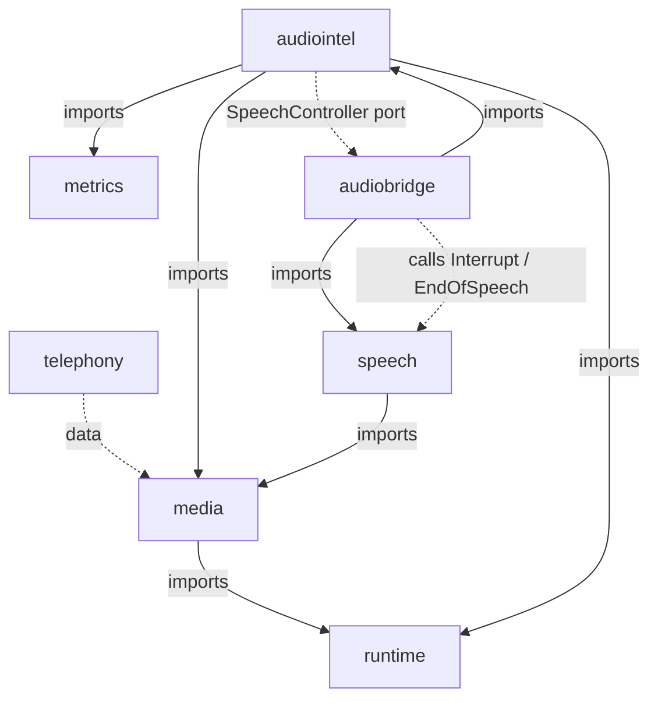
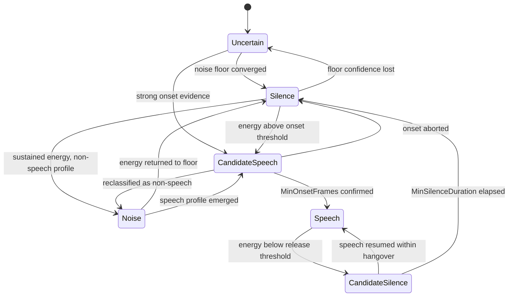

# Phase 11D — Real-Time Audio Intelligence Engine: Design

**Date:** 2026-08-11 · **Status:** awaiting approval · **Depends on:** Phases 10A–10F, 10.5, 11A, 11B, 11C (all frozen)

---

## 1. What this is

The layer between media transport and speech orchestration. It receives
`media.Frame` values from Phase 11B, measures bounded acoustic features, and
emits provider-neutral intelligence signals — voice activity, speech onset and
offset, endpoints, barge-in, overlap, silence classification, noise and audio
quality — to Phase 11C.

It performs no recognition, no synthesis, no transport, and no language
understanding. Every decision is a function of measured features and configured
thresholds, and every decision carries the explanation of which feature crossed
which threshold.

## 2. What this is not

No SIP, RTP, WebRTC, carrier integration, STT provider, TTS provider, LLM, fraud
detection, emergency detection, call screening, memory retrieval, governance
policy, or persistent audio recording. No WebRTC VAD, Silero, Pion, LiveKit,
Agora, Deepgram, Google, AssemblyAI or ElevenLabs voice-activity code, wrapped or
otherwise. No neural model in the hot path.

## 3. Module layout and the dependency rule

```
packages/go/audiointel   requires media, metrics, runtime   → stdlib closure
packages/go/audiobridge  requires audiointel, speech        → the 11C adapter
```

`audiointel` never imports `speech`, `conversation`, `governance`, `memory`,
`toolruntime`, `telephony`, or any provider SDK. Verified by `go list -deps`.

### 3.1 Why the §29 arrow is a data-flow arrow, not an import edge

The brief specifies `Media → Audio Intelligence → Speech`. In this repository the
higher layer imports the lower: `speech` already imports `media`. Placing
`audiointel` between them as an *import* would require `speech` to import
`audiointel` — and `speech` is frozen.

Resolution: `audiointel` imports `media` only, and exposes an outbound port,
`SpeechController`. The data flows Media → AudioIntel → Speech exactly as
specified. The import edge into frozen code is never created.



`audiobridge` is the only place in the repository where audio intelligence and
speech orchestration meet, and it is roughly 150 lines: an adapter implementing
`audiointel.SpeechController` over `*speech.SpeechSession`, plus its tests.

## 4. Frozen budgets this phase is measured against

| Hop | Budget | Source |
|---|---|---|
| Endpoint detection — silence window before a turn is declared ended | **250 ms p50 / 350 ms p95** | ADR-0011 §5.2 hop 1, *"Ours, and a product decision"* |
| Barge-in — detection signal to outbound silence | **≤ 20 ms, one frame interval** | ADR-0004 §12, ADR-0011 §5.1 |
| No queueing between the VAD and the output | structural constraint | ADR-0004 §247 |

There is **no** frozen budget for per-frame analysis, VAD decision latency,
quality classification or noise adaptation. Those are measured and reported as
measurements. This phase creates no new contractual SLA.

## 5. Runtime shape: synchronous, caller-driven, zero goroutines on the hot path

`Analyze(frame)` runs inline on the caller's pump goroutine and returns a
`Decision`. There is no channel, no queue and no background goroutine between
detection and the `SpeechController` call — which is what ADR-0004 §247 requires
and what makes the 20 ms barge-in budget meaningful.

Consequences, all of them wanted:

- Barge-in latency is bounded by the analysis itself, not by scheduling.
- Deterministic replay is trivial: the same frame sequence produces the same
  decision sequence, byte for byte.
- Session isolation is structural. Two sessions share no state and no lock.
- The race surface is the registry only.

Phase 11B established this convention (`PumpInterval = 0` in tests; the caller
calls `Pump`). 11D follows it.

## 6. Ingestion contract

```go
// Analyze is the hot path. The frame's payload is BORROWED — see media.Frame.
// Nothing here retains it.
func (s *Session) Analyze(f media.Frame) (Decision, error)

// ObserveDelivery feeds Phase 11B's own verdict on a frame, so continuity
// detection consumes 11B's signals rather than re-deriving them.
func (s *Session) ObserveDelivery(r media.PipelineResult)

// SetAgentSpeaking is the only conversation-adjacent input: barge-in and
// overlap are undefined without knowing whether the agent holds the floor.
func (s *Session) SetAgentSpeaking(speaking bool)
```

`media.Frame.Payload` is a sub-slice of a ring buffer that is overwritten as it
wraps. Feature extraction reads it in place within the call and retains only
scalars. **No PCM crosses the boundary of `Analyze`** — not into state, not into
events, not into metrics, not into logs. Enforced by a reflection test over every
retained struct.

### 6.1 Formats accepted, and what is refused

Mono, `CodecPCM`, `FormatPCM16` or `FormatPCM32`. Stereo is refused at
construction: voice activity on an interleaved two-channel payload is undefined
without a stated mixing policy, and inventing one silently is worse than
refusing. `CodecOpaque` is refused: its sample count is unknowable to anything
but its own decoder, so no feature can be computed from it. Both refusals are
`ConfigError`s at construction — fail closed, per §15 of the brief.

## 7. Frame features

Computed per frame, bounded, allocation-free:

| Feature | Definition |
|---|---|
| RMS | √(Σx²/n), normalised to full scale |
| Peak | max\|x\|, normalised |
| Zero-crossing rate | sign changes / (n−1) |
| Short-term energy | Σx²/n |
| Energy delta | this frame's energy minus the window mean |
| Energy variance | variance across the bounded feature window |
| SNR estimate | 20·log₁₀(RMS / noise floor), in dB |
| Clip ratio | samples at or beyond ±full-scale, over n |
| Continuity | sequence gap, duplicate, reorder, timestamp discontinuity |

Everything else — speech duration, silence duration, frame continuity history —
lives in the bounded window, never in raw PCM.

## 8. Voice activity detection

### 8.1 The state machine

Declared as an `rt.FSM[VADState]` table. Six states, no implicit transitions.



`Uncertain` is the initial state and it is honest: before the noise floor has
converged, the detector does not know. `Noise` separates "sustained energy that
is not speech" from silence, so a noisy line does not read as continuous speech.

### 8.2 The decision, and why it is not one threshold

Three independently measured features, each with its own configured threshold,
combined by a declared rule:

1. **Energy excess** — `20·log₁₀(RMS / noiseFloor)` against `OnsetThresholdDB`,
   with a lower `ReleaseThresholdDB` providing hysteresis. Relative to the
   *adaptive floor*, never to an absolute level.
2. **Zero-crossing band** — voiced speech occupies a middle ZCR band. A pure tone
   sits below it; white noise and many transients sit above it.
3. **Energy modulation** — stationary noise has low short-term energy variance;
   speech is strongly modulated. Measured across the bounded window.

The combination is an explicit, documented rule producing a score in [0,1] and an
`Explanation` naming exactly which features crossed which thresholds and by what
margin. No weighted sum with unexplainable weights. No single fixed energy
threshold anywhere.

### 8.3 Anti-flapping

Three independent mechanisms, all required:

- **Hysteresis** — onset and release thresholds differ; the gap is configured.
- **Consecutive-frame confirmation** — `MinOnsetFrames` above threshold to enter
  `Speech`; a single loud frame never starts speech.
- **Hangover** — `MinSilenceDuration` of continuous sub-threshold frames to leave
  `Speech`; a single silent frame never ends it. Speech resuming inside the
  hangover returns to `Speech` and emits nothing.

A `speech → silence → speech` flap is therefore not reachable in fewer than
`MinOnsetFrames + MinSilenceFrames` frames, and the test suite asserts that bound
directly.

## 9. Adaptive noise floor

- **Warm-up.** The first `WarmupFrames` frames initialise the floor. The detector
  reports `Uncertain` and refuses to assert speech during warm-up.
- **Speech-gated adaptation.** The floor adapts *only* while the VAD is not in
  `Speech` or `CandidateSpeech`. Speech cannot contaminate it by construction.
- **Asymmetric rates.** Downward adaptation is fast (a room that quietens is
  tracked promptly); upward adaptation is slow, and additionally clamped by
  `MaxRiseDBPerSecond`. A single loud frame that slips through cannot permanently
  redefine the floor — the clamp bounds how far one second of contamination can
  move it, and the speech gate means it should never reach the estimator at all.
- **Bounded history.** A fixed-size ring of `WindowFrames` minima, sized at
  construction. Nothing grows.
- **Confidence.** Reported as a function of window fill and window variance, so a
  consumer can tell a converged floor from a guess.

## 10. Speech onset and offset

**Onset.** Confirmed after `MinOnsetFrames` consecutive above-threshold frames.
The emitted timestamp is the media timestamp of the **first** frame of the run,
not of the confirming frame — backdating is what makes the onset accurate rather
than late by the confirmation window. Emitted exactly once per speech run;
deduplication is structural, being tied to FSM entry rather than to a boolean.

**Offset.** Confirmed after `MinSilenceDuration` of continuous sub-threshold
frames. Handles trailing speech, short pauses and sentence-final pauses through
the hangover, which is configured, not hardcoded.

## 11. Endpoint detection

Endpoint is a *policy* decision distinct from acoustic offset.

`endpoint_candidate` is emitted at acoustic offset. `endpoint_confirmed` follows
when the configured `SilenceWindow` has elapsed **and** every gate passes:

| Gate | Reason |
|---|---|
| `MinSpeechDuration` | A 40 ms cough is not a turn |
| `SilenceWindow` | Default 250 ms — ADR-0011 hop 1 |
| `MaxTurnDuration` | Forced endpoint; a turn cannot run forever |
| Energy trend | A falling trend confirms; a rising one defers |
| Agent-speaking suppression | Configurable |
| Barge-in suppression | An active barge-in defers the endpoint |

Every threshold is configuration. There is no hardcoded English pause model, and
`ENDPOINTING.md` states that explicitly — the 250 ms default comes from ADR-0011,
and a deployment tuning it for Hindi or Hinglish changes configuration, not code.

## 12. Barge-in

Fires when speech onset is confirmed **and** the agent holds the floor.

- **Debounce** — no second barge-in within `MinInterval`. No duplicate
  interruptions.
- **Staleness** — a detection older than `MaxAge` against the injected clock is
  discarded. No stale interruption events.
- **Inbound is never touched.** The caller's new speech is already arriving; it
  is the reason the barge-in fired. This mirrors Phase 11C requirements 4 and 6.
- **Outbound cancellation goes through the port**, synchronously and inline. The
  TTS provider is never touched directly.
- **Latency** measured from the onset frame's `Arrival` to the controller's
  return, against ADR-0004's 20 ms.

## 13. Overlap detection

States: `NoOverlap → PossibleOverlap → ConfirmedOverlap → Resolved → NoOverlap`.
Confirmation requires the agent to hold the floor, caller speech sustained for
`MinOverlapDuration`, and a speech-consistent feature profile.

**Stated limitation, prominently.** Without an acoustic echo canceller, and
without the outbound reference signal being sample-aligned with the inbound one,
echo and genuine double-talk are **not separable**. This engine does not claim
source separation. If an outbound envelope is supplied through the optional port,
correlation with it is used only to *lower* overlap confidence, never to assert
that separation occurred. Output is confidence-based throughout, and
`OVERLAP_DETECTION.md` documents this before it documents anything else.

## 14. Silence intelligence

Six classifications: `InitialSilence`, `ThinkingPause`, `InterWordPause`,
`InterSentencePause`, `EndpointSilence`, `LongSilence` — all threshold-driven,
all configured.

**These are timing signals, not language understanding.** An inter-sentence pause
is a pause of a certain duration in a certain position; it is not a claim that a
sentence ended. The documentation says so in those words, because acoustic
silence cannot carry semantics and a name like `InterSentencePause` invites the
opposite reading.

## 15. Noise and quality

**Noise** — background level, stationary versus transient discrimination
(variance of the floor estimate over the window), clipping, very-low-volume
audio, silence, possible echo, possible double-talk. Every non-trivial output
carries a confidence. Nothing claims perfect separation.

**Quality** — `Good`, `Degraded`, `Poor`, `Unusable`, from declared thresholds
over signal level, clip ratio, frame continuity, noise floor, SNR estimate,
dynamic range and frame loss. Hysteresis prevents flapping across a boundary.
Emits `quality_changed`, `audio_degraded`, `audio_recovered`.

## 16. Frame continuity

Consumes Phase 11B's signals — `Frame.Sequence`, `Frame.Timestamp`,
`FlagSilence`, `FlagDiscontinuity`, and the optional `media.PipelineResult` —
to detect missing sequence, duplicate, out-of-order, timestamp discontinuity,
buffer starvation and excessive jitter. **It re-implements none of 11B's
buffering.** It consumes and classifies.

## 17. Event model

Sixteen event types as specified in the brief. One `AudioEvent` struct carrying
`SessionID`, `CallID`, `TurnID`, `Sequence`, media timestamp, wall timestamp,
classification, confidence, and a **fixed-shape** bounded metadata struct — not a
map, because a map's contents cannot be reviewed.

There is deliberately no field capable of holding a sample, a payload, a
transcript, a phone number or a credential. `TestAudioEvent_CarriesNoAudio`
enforces this by reflection, so a later field addition cannot quietly break it —
the same mechanism `media.MediaEvent` and `speech.SpeechEvent` use.

## 18. Metrics

Type aliases over `packages/go/metrics`, runtime-scoped, following
`media/metrics.go`. No second metrics system. Bounded enum labels only — never a
phone number, never transcript content, never a session identifier as a label.

## 19. The learned-model boundary

`§14` of the brief asks for an adapter boundary without an implementation. This
phase declares:

```go
// SpeechLikelihoodModel is the seam a future learned detector would occupy.
// NOTHING IMPLEMENTS IT IN THIS PHASE and nothing calls it on the hot path.
type SpeechLikelihoodModel interface {
    Score(FrameFeatures) (float64, error)
}
```

Declared, documented, unimplemented, unwired.

## 20. Memory and allocation

Every window is a fixed-size, array-backed ring sized at construction from
configuration. Nothing accumulates. The benchmark asserts **zero allocations per
frame** for `Analyze` in steady state; if that cannot be achieved it is reported
as the measured number, never as a claim.

## 21. Security and privacy

- No durable raw audio storage. None, by default or otherwise, in this module.
- No PCM in logs, events, metrics or snapshots.
- Bounded in-memory windows of *scalars* only.
- Session isolation, explicit cleanup, cancellation propagation.
- No credentials in source.
- `SECURITY_REVIEW.md` will state explicitly whether any debug facility can
  contain PCM. Current design intent: none can, and the reflection test proves
  it for events.

## 22. Evaluation

25 deterministic synthetic scenarios, no microphone, no fixture files required
for the Go suite. Hindi, Hinglish and Devanagari coverage is delivered as:

- Synthetic waveforms whose **envelope** is modelled on documented Hindi and
  Hinglish speech-timing traits — syllable-timed rhythm, geminate closures,
  utterance-final lengthening, code-switch pause distributions.
- Tests proving Phase 11C language and script metadata survives the pipeline
  unmodified.

`EVALUATION_REPORT.md` will state plainly that these validate **timing behaviour
and metadata propagation, not Hindi speech recognition**. No accuracy claim is
made. STT accuracy belongs to Phase 11C.

Python 3.12 tooling lands in `tools/audio-fixtures/` (an existing empty slot) for
offline fixture generation, ROC and threshold analysis, confusion matrices and
latency aggregation. Go emits JSON; Python aggregates. **No production runtime
logic moves to Python.**

## 23. Known environment limits

- **`go test -race` cannot run here.** No C compiler is present (`gcc` absent,
  `CGO_ENABLED=1` fails). Phases 11B and 11C reported this as NOT RUN. 11D will
  do the same — never as PASS.
- **`golangci-lint` is not installed.** Same treatment.
- Windows clock resolution is roughly 520 µs (established in Phase 10F), so
  sub-millisecond latency measurements will be reported against that floor rather
  than as precise figures.
