# Call Lifecycle Diagram

**Phase 11A** · `packages/go/telephony/lifecycle.go`

---

## 1. The eight lifecycle paths

```mermaid
flowchart TD
    subgraph INBOUND
        A1[Carrier offers] --> A2[Coordinator.Begin]
        A2 --> A3{Admission}
        A3 -->|shed| A4[ErrCapacityExceeded<br/>~76 ns]
        A3 -->|admit| A5[incoming]
        A5 --> A6[ringing] --> A7[screening]
        A7 -->|pass| A8[accepted] --> A9[connected]
        A7 -->|reject| A10[rejected] --> A11[ended]
        A7 -->|human| A12[escalated]
    end

    subgraph OUTBOUND
        B1[Platform dials] --> B2{CapDial?}
        B2 -->|no| B3[ErrCapabilityUnsupported]
        B2 -->|yes| B4[ringing] --> B5[accepted] --> B6[connected]
    end

    subgraph IN_CALL
        C1[connected] <--> C2[muted]
        C1 <--> C3[hold]
        C3 --> C4[transferred] --> C5[ended]
        C1 --> C6[escalated] --> C1
    end

    subgraph TERMINATION
        D1[Disconnect] --> D2[provider.Hangup]
        D2 --> D3[ended]
        D4[Fail] --> D5[failed]
        D6[Deadline] --> D7[timeout] --> D8[reaper] --> D3
    end

    subgraph RECOVERY
        E1[Process restart] --> E2[LoadAll snapshots]
        E2 --> E3[Restore → recovery]
        E3 --> E4{LivenessCheck}
        E4 -->|live| E5[connected · resumed]
        E4 -->|dead| E6[ended · concluded]
        E3 -->|bad schema| E7[abandoned · snapshot deleted]
    end
```



---

## 2. Incoming

```
provider adapter
   → Coordinator.Begin(ctx, CallContext{Direction: inbound})
       → CallContext.Validate()          refuses malformed context
       → Scheduler.Admit(provider)       atomic check-and-reserve
       → Registry.Create()               session, ids, FSM at idle
       → Lifecycle.Incoming()            idle → incoming
           → metric CallsStarted
           → event CallCreated
```

The runtime does **not** answer on arrival. Answering is a decision the
screening layer makes, and a runtime that answered on arrival would defeat the
platform's purpose.

If the lifecycle refuses after admission — an unregistered provider, say — the
coordinator **releases the slot**. Every path through `Begin` either releases or
hands the call to a session that releases on termination. There is no third
outcome, and `TestScheduler_FailedStartReleasesTheSlot` covers the failing one.

---

## 3. Outgoing

```
Coordinator.Begin(ctx, CallContext{Direction: outbound})
   → capability check: CapDial
   → Lifecycle.Outgoing()               idle → ringing
```

Straight to `ringing`, with no `incoming`: an outbound call has no arrival.

---

## 4. Connect

```
Lifecycle.Accept(ctx, id, "screening_passed")
   → capability check: CapAnswer
   → provider.Answer(ctx)               ← PROVIDER FIRST, bounded by ProviderTimeout
       ✗ failure → transition to failed, metric ProviderErrors
       ✓ success → screening → accepted
Lifecycle.Connect(ctx, id)              accepted → connected
   → AnsweredAt recorded (talk clock starts)
```

**The provider is called before the state moves.** Moving to `accepted` before
the carrier confirmed would produce a session that believes it answered a call
the carrier never connected — and the next thing that session does is wait
forever for media that is not coming.

A provider failure fails the call with a cause, rather than leaving it to be
swept by the ring deadline. **A failure with a cause beats a timeout without
one.**

---

## 5. Disconnect

```
Coordinator.End(ctx, id, "caller_hung_up")
   → provider.Hangup()                  ← failure is LOGGED, not fatal
   → transition → ended
   → CallDuration, TalkDuration observed
   → Registry.Remove()                  AFTER the terminal event
   → Scheduler.Release(provider)
   → SessionStore.Delete()
```

A hangup the carrier refuses still ends the call locally. The carrier has almost
certainly torn it down anyway, and a session that stayed live because a REST
call failed would hold a capacity slot until the lifecycle timeout.

Removal happens **after** the terminal transition is recorded and published.
Removing first would race a concurrent lookup into `ErrCallNotFound` for a call
that is legitimately still ending.

---

## 6. Timeout

Two halves, and both are needed.

```
Sweep (every SweepInterval)
   → SweepTimeouts:  any state past its deadline → timeout
   → ReapTerminal:   timeout past TeardownTimeout → ended
   → ObserveStates:  per-state gauge census
```

`SweepTimeouts` moves a stalled call to `timeout` and publishes it. Without
`ReapTerminal`, a call whose teardown never completed would sit in `timeout`
forever holding a capacity slot.

`Sweep` is exported so a test drives it directly. A sweeper reachable only via
its own ticker would force every timeout test to wait in real time — which is
exactly what the injected clock exists to avoid.
`TestTimeout_SweepMovesStalledCalls` advances a fake clock past a 45-second
deadline and asserts in microseconds.

---

## 7. Failure

| Failure | Response | Rationale |
|---|---|---|
| Provider `Answer` fails | call → `failed` | a cause beats a timeout |
| Provider `Reject` fails | call → `rejected` anyway, logged | the decision is already made |
| Provider `Hangup` fails | call → `ended` anyway, logged | the carrier has torn down regardless |
| Provider hangs | `ProviderTimeout` binds | a hung SDK must not hold the runtime |
| Publisher fails | transition **succeeds**, event counted as dropped | telemetry is never load-bearing |
| Session store fails | call proceeds, recoverability lost | persistence is for recovery, not the call |
| Capacity exhausted | `ErrCapacityExceeded` in ~76 ns | shed, do not queue |

---

## 8. Transfer

```
Lifecycle.Transfer(ctx, id, "agent_handoff")
   → capability check: CapTransfer
   → transition → transferred            ← THE TRANSITION FIRST
   → mint LegID, session.AddLeg()
   → metric Transfers
```

The transition precedes the leg. The first implementation minted the leg first,
so a **refused** transfer still left a leg on the session — the call looked
transferred to anything counting legs while its state said otherwise, and the
two disagreed permanently. See ENGINEERING_AUDIT F2.

---

## 9. Recovery

```
Runtime.Start()
   → SessionStore.LoadAll()              oldest first, deterministic
   → for each snapshot:
       Restore() → StateRecovery         NOT the snapshotted state
       Registry.Register()
       event RecoveryStarted
       Scheduler.Admit()                 a resumed call holds a slot
       LivenessCheck(snapshot)?
          live → connected  · event RecoveryResumed  · snapshot deleted
          dead → ended      · event RecoveryAbandoned · snapshot deleted
       unrecoverable → abandoned, snapshot DELETED
   → open admission
   → start sweeper and snapshot loops
```

Recovery runs **before** admission opens, so a recovered call cannot lose its
capacity slot to a new call that arrived first.

An unrecoverable snapshot is deleted rather than retried forever: a snapshot at
an unreadable schema will never become readable, and leaving it makes every
subsequent recovery slower and noisier.

---

## 10. Graceful shutdown

```
Runtime.Stop()
   → state = draining                    new calls refused IMMEDIATELY
   → drain (up to DrainTimeout, REAL time)
   → snapshotAll()                        only what could not finish
   → close(stop); wg.Wait()
   → state = stopped
```

The drain budget is measured against **real** time, not the injected clock — see
ENGINEERING_AUDIT F1 for what happened when it was not.

`Stop` returns how many calls were still live at the deadline. Non-zero is not
an error but is worth alerting on: those calls were abandoned mid-flight, and
their snapshots are what the next process will recover.

---

## 11. Related

- [STATE_TRANSITIONS.md](STATE_TRANSITIONS.md)
- [SEQUENCE_DIAGRAMS.md](SEQUENCE_DIAGRAMS.md)
