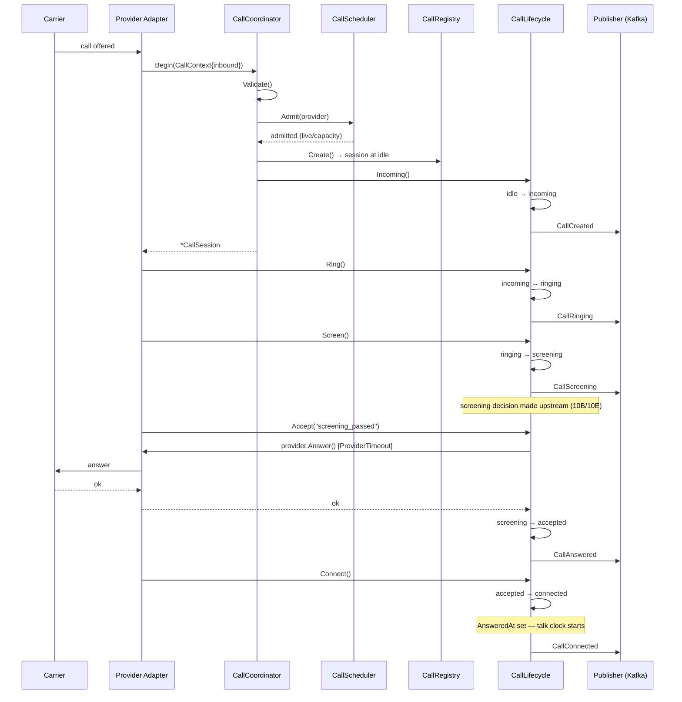
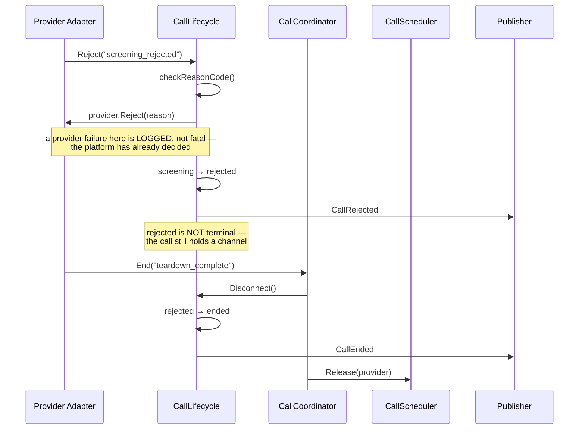
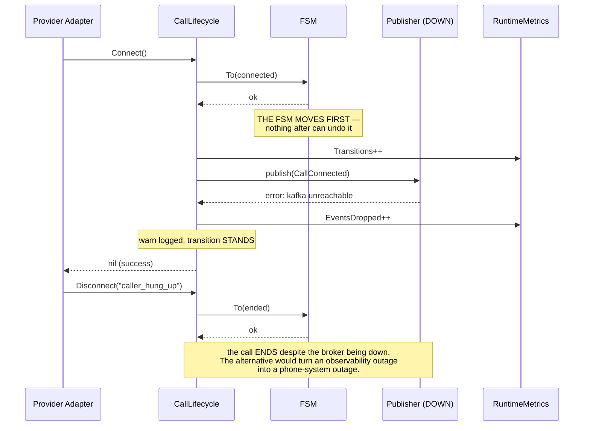
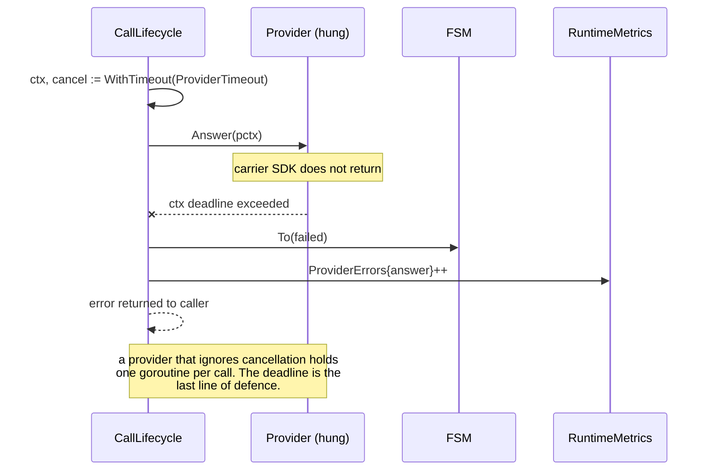
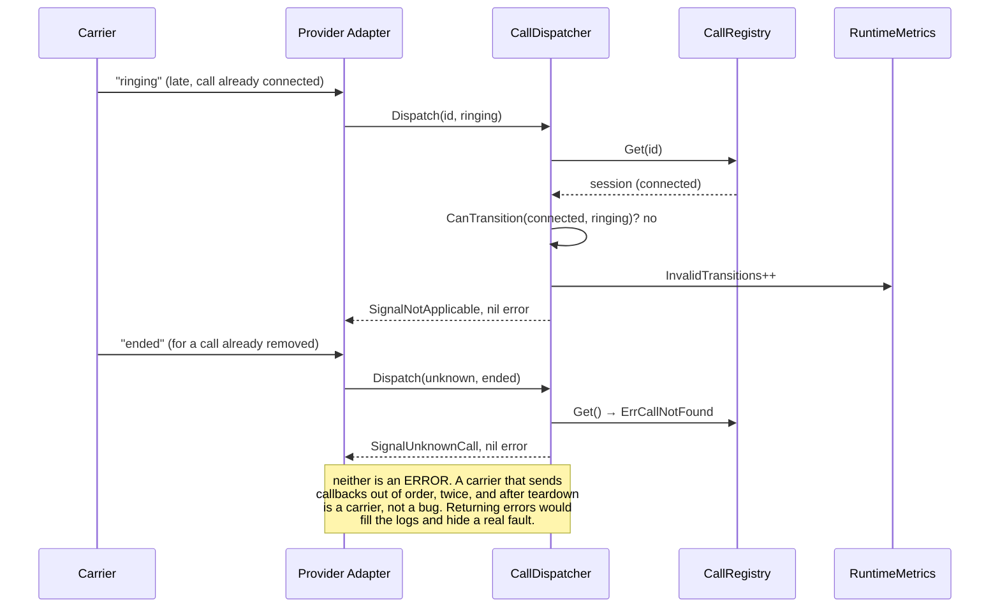

# Sequence Diagrams

**Phase 11A** · `packages/go/telephony`

Six sequences. Each is drawn from the code path a test exercises, and the test
is named.

---

## 1. Inbound screened call, accepted

*`TestLifecycle_InboundHappyPath`*



---

## 2. Screening rejects the call

*`TestLifecycle_ScreeningRejection`*



---

## 3. Broker outage — the call still completes

*`TestFailure_PublisherOutageDoesNotStopCalls`*



---

## 4. Provider hangs — the timeout binds

*`TestFailure_ProviderTimeoutIsBounded`*



---

## 5. Crash recovery

*`TestRecovery_ConcludesCallsThatAreNoLongerLive`, `TestRecovery_ResumesCallsThatAreStillLive`*

```mermaid
sequenceDiagram
    participant OS as Orchestrator
    participant RT as TelephonyRuntime (new process)
    participant ST as SessionStore
    participant R as CallRegistry
    participant LV as LivenessCheck
    participant E as Publisher

    Note over OS,RT: previous process crashed with live calls

    OS->>RT: Start()
    RT->>ST: LoadAll()
    ST-->>RT: snapshots (sorted oldest first — deterministic)

    loop each snapshot
        RT->>RT: Restore() → StateRecovery
        Note over RT: NOT the snapshotted state.<br/>The call existed; whether it still does is unknown.
        RT->>R: Register()
        RT->>E: RecoveryStarted
        RT->>RT: Scheduler.Admit() — a resumed call holds a slot
        RT->>LV: is this call still up?

        alt still live
            LV-->>RT: true
            RT->>RT: recovery → connected
            RT->>E: RecoveryResumed
            RT->>ST: Delete(snapshot)
        else no longer live (the DEFAULT)
            LV-->>RT: false
            RT->>RT: recovery → ended
            RT->>E: RecoveryAbandoned
            RT->>ST: Delete(snapshot)
        end
    end

    RT->>RT: state = running — admission opens ONLY NOW
    RT->>RT: start sweeper, snapshot loop
```

Admission opens after recovery so a recovered call cannot lose its capacity slot
to a new call that arrived first.

---

## 6. Graceful shutdown

*`TestShutdown_SnapshotsLiveCallsAndIsIdempotent`, `TestShutdown_TerminatesWithLiveCalls`*

```mermaid
sequenceDiagram
    participant OS as Orchestrator (SIGTERM)
    participant RT as TelephonyRuntime
    participant CO as CallCoordinator
    participant R as CallRegistry
    participant ST as SessionStore

    OS->>RT: Stop()
    RT->>RT: state = draining
    Note over RT,CO: new calls refused IMMEDIATELY —<br/>ErrRuntimeStopped

    loop until drained or DrainTimeout (REAL time)
        RT->>R: Len()
        alt zero
            R-->>RT: 0 → done
        else still live
            Note over RT: poll interval scaled from DrainTimeout
        end
    end

    RT->>R: Each() → snapshots of non-terminal calls
    RT->>ST: SaveBatch(snapshots)
    Note over RT,ST: after the drain, so only what<br/>genuinely could not finish is captured

    RT->>RT: close(stop); wg.Wait()
    RT->>RT: state = stopped
    RT-->>OS: abandoned count
```

The drain budget is **real** time. Measuring it against the injected clock while
polling with a real ticker produced a shutdown that never terminated — see
ENGINEERING_AUDIT F1.

---

## 7. Late carrier callback

*`TestDispatcher_ClassifiesLateAndDuplicateSignals`*



---

## 8. Related

- [CALL_LIFECYCLE.md](CALL_LIFECYCLE.md)
- [TELEPHONY_ARCHITECTURE.md](TELEPHONY_ARCHITECTURE.md)
