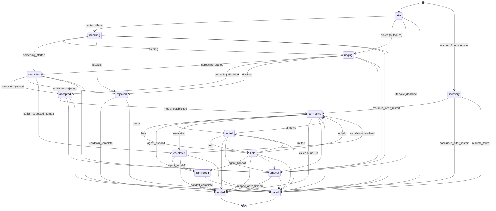

# State Transition Diagram

**Phase 11A** · `packages/go/telephony/state.go`

The complete, declared transition table. Nothing in the runtime moves a call in
a way absent from this document, because nothing in the runtime moves a call in
a way absent from `transitionSpec()`.

---

## 1. The machine

---

## 2. The table

| From | To |
|---|---|
| `idle` | incoming, ringing, failed, timeout |
| `incoming` | ringing, screening, rejected, failed, timeout |
| `ringing` | screening, accepted, rejected, failed, timeout |
| `screening` | accepted, rejected, escalated, failed, timeout |
| `accepted` | connected, failed, timeout |
| `rejected` | ended, failed |
| `connected` | muted, hold, transferred, escalated, ended, failed, timeout |
| `muted` | connected, hold, ended, failed, timeout |
| `hold` | connected, muted, transferred, ended, failed, timeout |
| `transferred` | ended, failed |
| `escalated` | connected, transferred, ended, failed |
| `timeout` | ended, failed |
| `recovery` | connected, ended, failed |
| `ended` | — *(terminal)* |
| `failed` | — *(terminal)* |

---

## 3. Decisions that look arbitrary and are not

### Only two states are terminal

`ended` and `failed`. **`rejected` and `timeout` deliberately are not.**

Both are outcomes that still require teardown. A model in which "rejected" is
the end of the story has nowhere to put the teardown that actually follows, and
a rejected call still holds a carrier channel until it completes — which is why
`CallState.Active()` includes it. A scheduler that assumed otherwise would
over-admit.

### A muted call cannot be transferred

`muted → transferred` is absent while `hold → transferred` is present.

Transferring with outbound audio suppressed hands the far end a silent leg,
and the receiving operator cannot distinguish that from a broken one. The call
must be unmuted first. Enforced by the table, not by a check in `Transfer` —
`TestState_MutedCannotTransfer` pins it.

### Escalation is reversible

`escalated → connected` exists. A human who resolves an escalation hands the
call back, and a model where escalation is one-way would force a transfer for
what is really a resumption.

### `accepted` is distinct from `connected`

The decision has been made; the media path is not yet up. Collapsing them makes
"we accepted but failed to connect" unrepresentable — and that gap is precisely
where carrier faults live. `accepted → failed` is the edge that records one.

### `recovery` is initial-only

Nothing transitions **into** `recovery`. It is reachable only as a starting
state, via `Restore`.

A live session that needs recovery is a session this process already lost —
there is no running machine to move. The state exists for a session
reconstructed by a *different* process from a snapshot.

`TestState_EveryStateIsReachable` exempts it explicitly, so the exemption is a
recorded decision rather than a gap.

### Outbound calls skip `incoming`

`idle → ringing` exists for the outbound case. An outbound call has no arrival,
and routing every outbound call through a state that means nothing for it would
be modelling ceremony.

---

## 4. How "no implicit transitions" is enforced

Three layers, and the first two are compile- or construction-time:

1. **Construction.** `runtime.NewFSM` refuses a spec with a self-transition, an
   outgoing edge from a terminal state, or a transition into an undeclared
   state. A malformed table fails the boot, not the call.

2. **Run time.** `FSM.To` refuses any pair absent from the table and returns
   `ErrInvalidTransition`. There is no setter — `CallSession.Transition` is the
   only mutator and it delegates.

3. **Test.** `TestState_TransitionTableIsComplete` walks all fifteen states and
   fails on a missing entry, an undeclared destination, a self-transition, or a
   non-terminal state with no way out. The last is the subtle one: a state with
   no outgoing edges that nobody declared terminal is a state a call enters and
   never leaves, and the symptom is a leaked session rather than an error.

A call may begin only at `idle` or `recovery`. `newCallFSM` refuses any other
initial state, so a caller cannot fabricate a connected call that never rang.

---

## 5. State predicates

| Predicate | True for | Used by |
|---|---|---|
| `Terminal()` | ended, failed | FSM, registry removal |
| `Active()` | everything except idle, ended, failed | capacity accounting |
| `Connected()` | connected, muted, hold | talk-duration, media checks |

`Active()` including `rejected` and `timeout` is the load-bearing subtlety: both
still occupy a carrier channel until teardown completes.

---

## 6. Deadlines per state

| State | Deadline | Rationale |
|---|---|---|
| idle, incoming | `SetupTimeout` 5s | setup that stalls has failed |
| ringing | `RingTimeout` 45s | longer than a mobile carrier's own alerting timeout, so the carrier gives up first and we record its reason |
| screening | `ScreenTimeout` 20s | a caller listening to a prompt longer than this has concluded the line is dead |
| accepted | `ConnectTimeout` 10s | accepted-but-not-connected is a carrier fault |
| rejected, timeout, transferred | `TeardownTimeout` 15s | teardown that takes longer has failed |
| escalated | `EscalationTimeout` 5m | a human is involved |
| recovery | `RecoveryTimeout` 30s | liveness must resolve |
| **connected, muted, hold** | **none** | a long call is a good call |

Connected having no deadline is deliberate. A runtime that hung up on hour-long
conversations would be a worse product than one that occasionally leaks a
session, and `TestTimeout_ConnectedCallsHaveNoDeadline` advances the clock four
hours to pin it.

The config validator refuses a `SweepInterval` longer than the shortest
deadline, because the sweeper cannot enforce a deadline closer than its own
period and an operator who set 500 ms would reasonably believe otherwise.

---

## 7. Related

- [TELEPHONY_ARCHITECTURE.md](TELEPHONY_ARCHITECTURE.md)
- [CALL_LIFECYCLE.md](CALL_LIFECYCLE.md)
