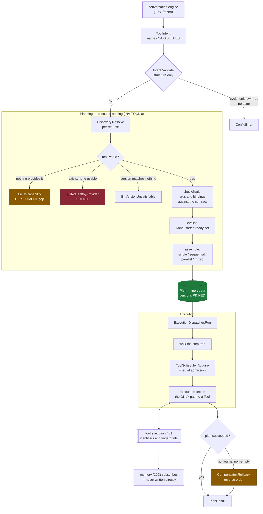
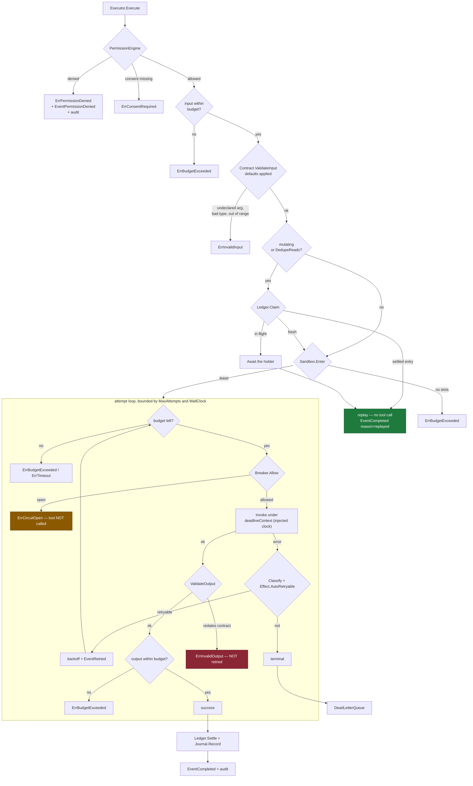
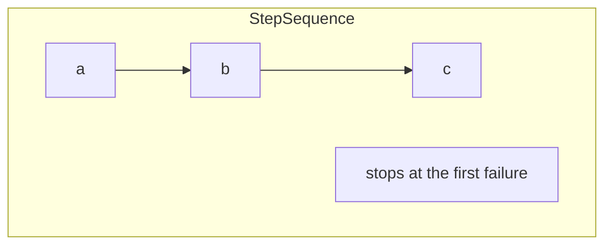
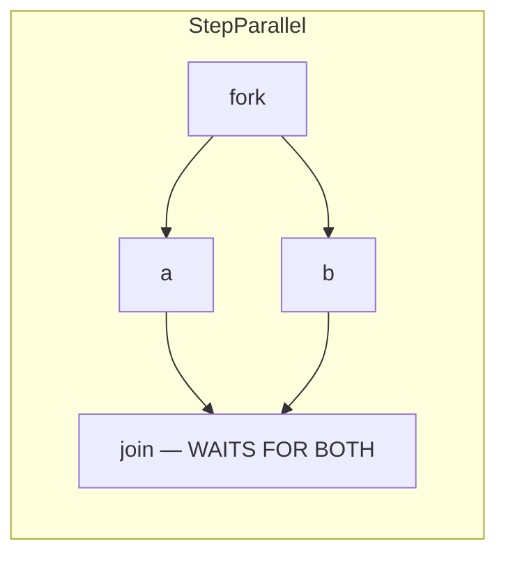
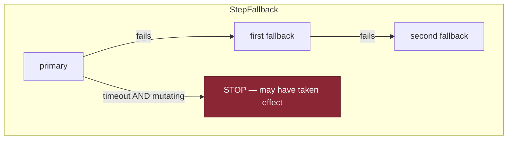
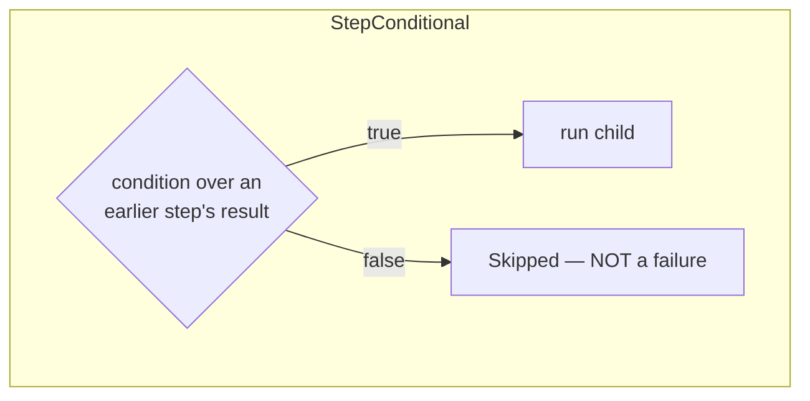
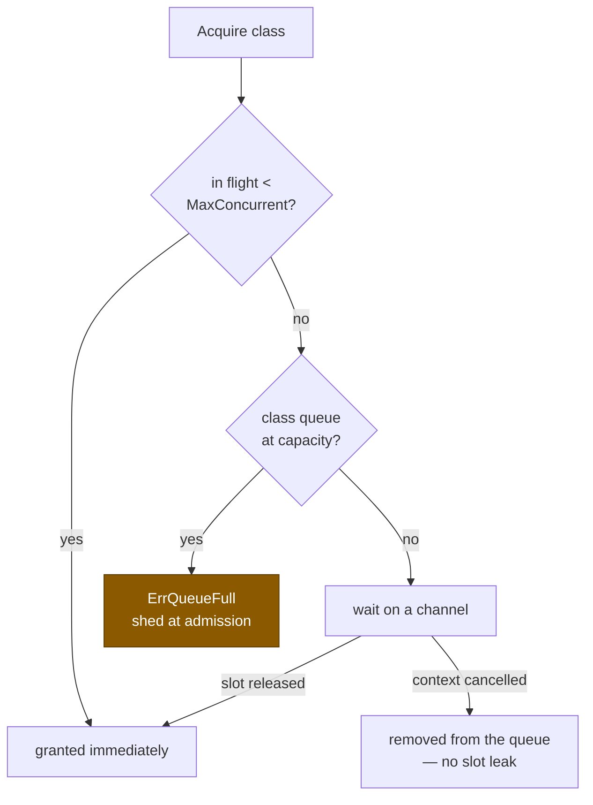
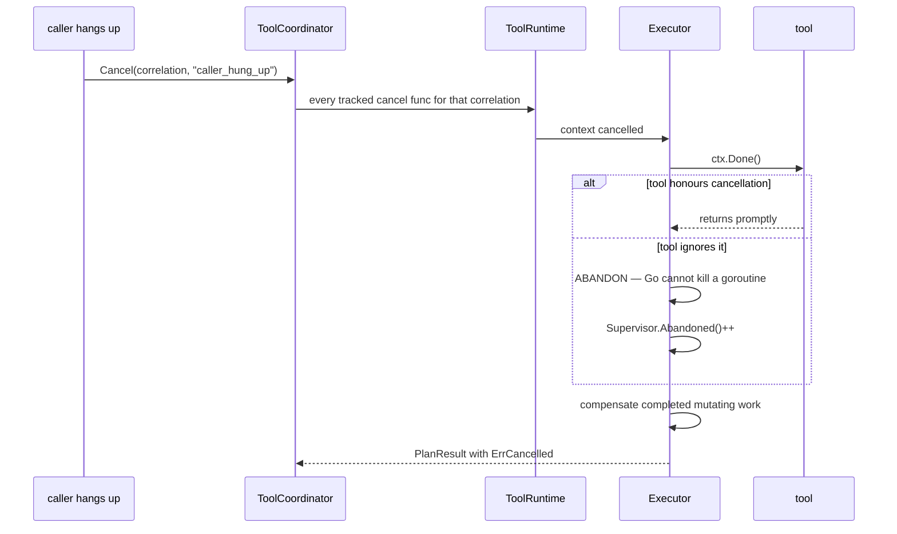
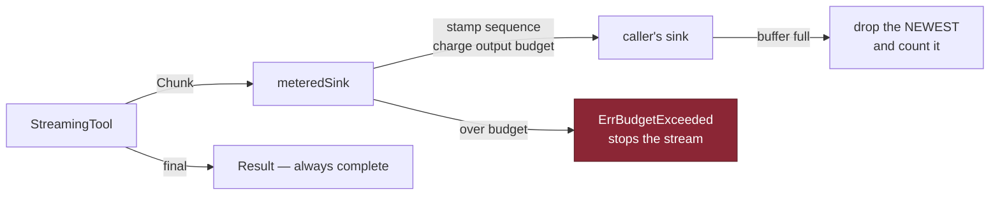

# Execution Flow

**Phase 10D** · Sourced from
[`plan.go`](../../packages/go/toolruntime/plan.go),
[`executor.go`](../../packages/go/toolruntime/executor.go),
[`dispatcher.go`](../../packages/go/toolruntime/dispatcher.go)

---

## 1 · Intent to outcome



**The two resolution failures are different colours on purpose.**
`ErrNoCapability` means nothing in the registry claims to do this — a deployment
gap, fixed by shipping something. `ErrNoHealthyProvider` means tools exist and
none is usable — an outage, fixed by fixing something. Collapsing them means an
on-call engineer cannot tell whether to page the deploy owner or the integration
owner.

---

## 2 · One step, in detail



### Why this order

```
permission → validate → idempotency → sandbox → invoke
```

| Stage | Why here |
|---|---|
| **permission** | Refused work should never reach a ledger, a slot or a tool |
| **validate** | Last chance to fail with no side effect — and the point at which arguments are final enough to derive a key from |
| **idempotency** | A duplicate is answered here, **before it costs any capacity** |
| **sandbox** | Capacity is claimed only for work that will actually invoke something |
| **invoke** | The only step that changes the world |

**Two of these were wrong in the first version.** Claiming the key before
permission meant a denied execution blocked the corrected retry. Claiming a
sandbox slot before the ledger meant a burst of twenty-four identical requests
had most of them shed for concurrency they were never going to use. Both were
found by tests — ENGINEERING_AUDIT §F3.

### `ErrInvalidOutput` is never retried

The tool answered; it answered wrongly. Asking again produces the same wrong
answer while a downstream waits.

### `ErrCircuitOpen` fails fast and says so

Not presented as a timeout. An open circuit is the breaker saying stop, and
retrying past it defeats the point of having one.

---

## 3 · Composite shapes





**Parallel waits for every branch even after one fails.** Cancelling siblings on
the first failure sounds efficient and produces the worst possible state: a
mutating sibling cancelled mid-flight may or may not have taken effect, and
nothing downstream can tell which. Letting every branch reach a definite outcome
is what keeps the compensation journal truthful.

The reported error is the first in **child order**, not completion order, so the
same failure is reported the same way every time.



**A fallback stops on a timeout for a mutating step.** If the first candidate
timed out, it may have taken effect; trying the next risks doing it twice. The
planner refuses a fallback chain over an *irreversible* tool outright.



A skipped conditional does not fail the plan. `ExecutionResult.Skipped` is a
distinct field from `Err` for exactly that reason: a plan that skips a step
because the condition said so has done exactly what it was asked to.

### Six condition operators, and no more

`exists · absent · == · != · > · <`

No arithmetic, no regular expressions, no boolean algebra. **A condition
language grows until it is a programming language, and then the plan is a
program nobody reviews.** Anything more complex belongs in a tool, where it is
testable, ownable and named.

A missing source result evaluates **false** for every operator except `absent` —
treating it as an error would turn a skipped optional step into a plan failure,
which is the opposite of what "optional" means.

---

## 4 · Failure and rollback

```mermaid
sequenceDiagram
    participant D as Dispatcher
    participant J as Journal
    participant C as Compensator
    participant T3 as tool C
    participant T2 as tool B
    participant T1 as tool A

    Note over D: steps A, B succeed; C fails
    D->>J: Record(A) · Record(B)
    Note over J: read-only steps are NOT recorded
    D->>C: Rollback(journal, reason)

    Note over C: own context from Background —<br/>the execution's context is usually dead

    C->>T2: Compensate(B) — REVERSE order
    T2-->>C: ok
    C->>T1: Compensate(A)
    T1-->>C: error
    Note over C: continues anyway; the failure of one<br/>says nothing about the next

    C-->>D: CompensationReport{compensated:1, failed:1, complete:false}
    Note over D: a failed rollback REPLACES the original error
```

| Outcome | Meaning | Operator action |
|---|---|---|
| **Compensated** | Undone | None |
| **Skipped** | No compensation was possible — the tool has none | Decide whether it matters |
| **Failed** | We tried and it did not work | **The world is in a state nobody chose** |

`CompensationReport.Complete` is false whenever anything was skipped or failed.

**What it does not claim:** `Complete` answers *"was everything the runtime knows
about undone"*, not *"is the world back where it started"*. The step that failed
may have taken partial effect before failing, and no runtime can know whether it
did. That gap is recorded in EXECUTION_EVALUATION §E3 rather than papered over.

---

## 5 · Load shedding



Frozen invariant **I11**: under load the platform sheds **at admission** rather
than degrading something mid-flight.

| Class | Queue bound | Rationale |
|---|---|---:|
| Interactive | 32 | **Shortest.** A deadline in hundreds of milliseconds means a deep queue admits work that will time out before it is served |
| Background | 128 | |
| Bulk | 512 | No deadline, so queueing is free |

The interactive queue being the shortest looks backwards and is not.

**Anti-starvation:** strict priority alone is correct until the interactive load
never drops, at which point background work stops entirely and nobody notices
for a week. After `StarvationRatio` consecutive higher-class grants while a
lower class waits, the oldest lower-class waiter is served.

**A cancelled waiter is removed from the queue.** Leaving it would mean a later
release grants a slot to a waiter that has gone — a leak that presents as
gradually falling throughput, which is a diagnosis that costs hours.

---

## 6 · Cancellation



**Cancelled executions still compensate.** Hanging up must not leave a half-made
booking.

**Abandonment is counted, not hidden.** A tool with a rising abandonment count
does not honour cancellation, and that is a bug report with an owner rather than
an invisible goroutine leak.

---

## 7 · Streaming



Three properties worth stating:

**A stream is an early view of the answer, never the answer itself.** The final
`Result` is returned in full, so a consumer that ignored the stream still
receives everything.

**`BufferedSink` drops the newest, not the oldest.** Early chunks are the ones a
caller has already started rendering; dropping those would rewrite what a person
has already seen. Dropping the tail degrades something the final result replaces.

**The metered sink wraps whatever the caller supplied**, so an oversized stream
is caught even when the caller is using a `NoopSink` and would never have
noticed. Budget enforcement that only works when someone is watching is not
enforcement.
