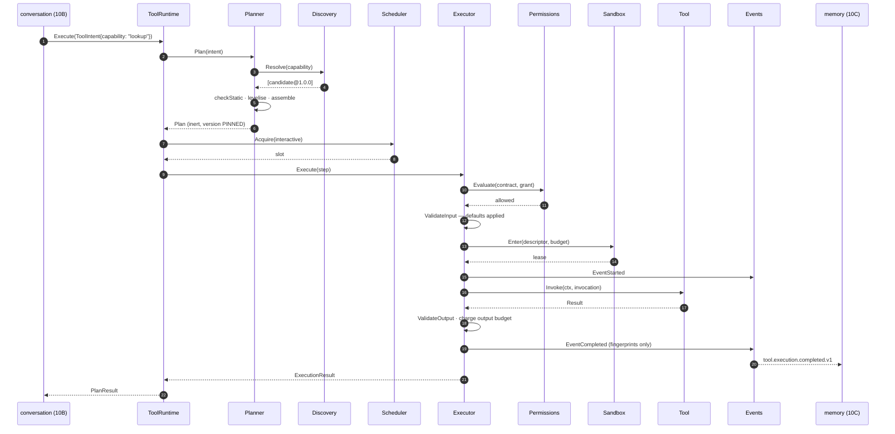
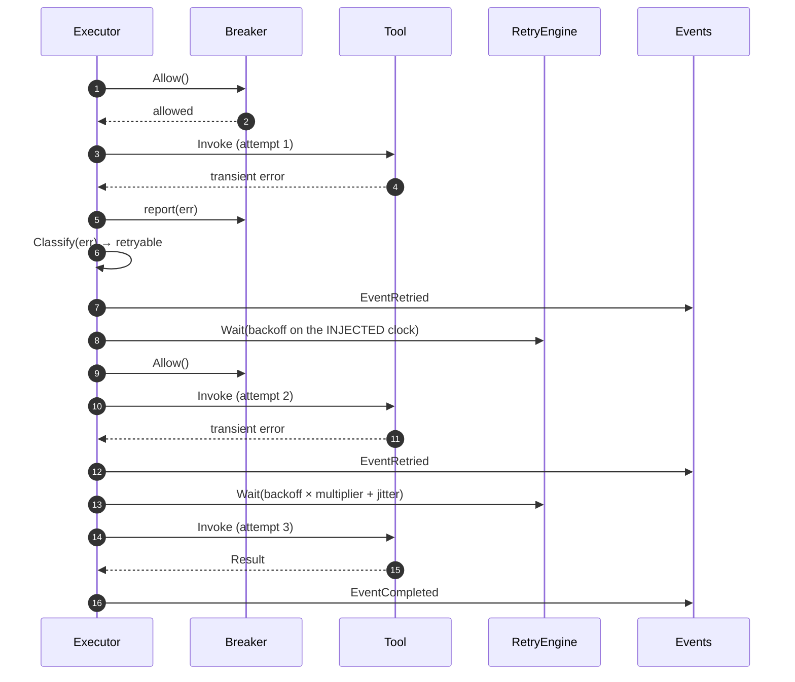
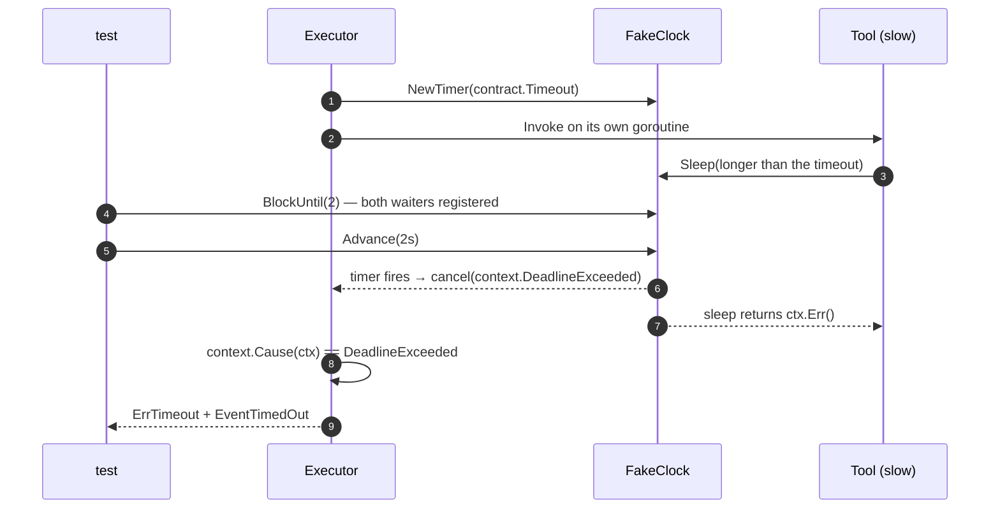
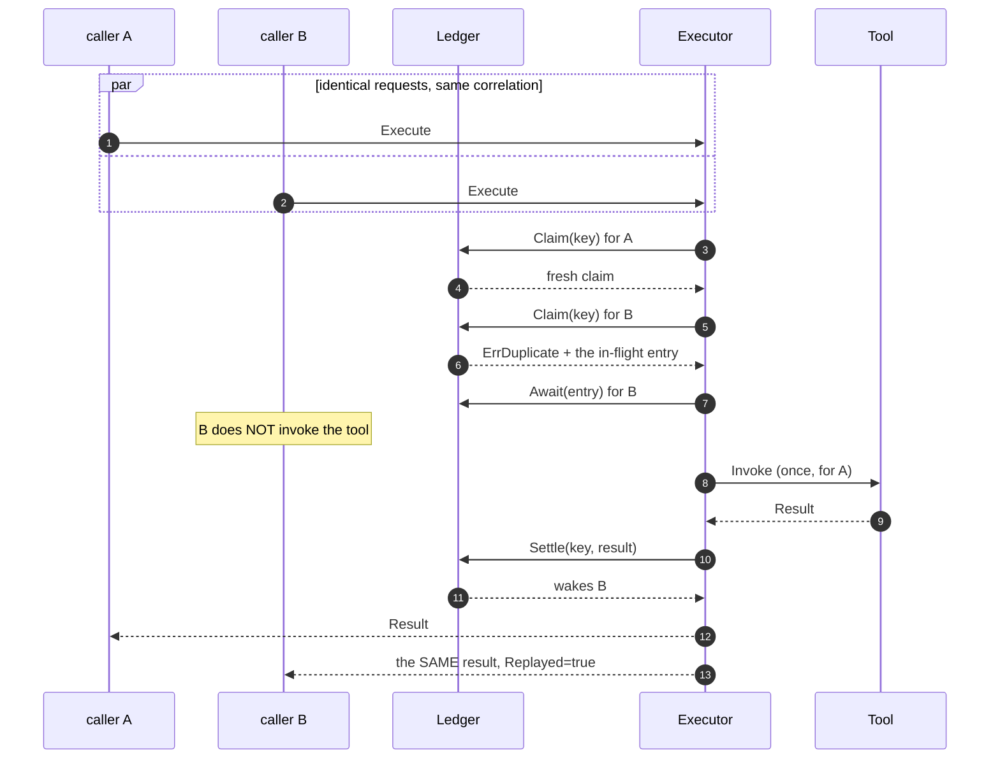
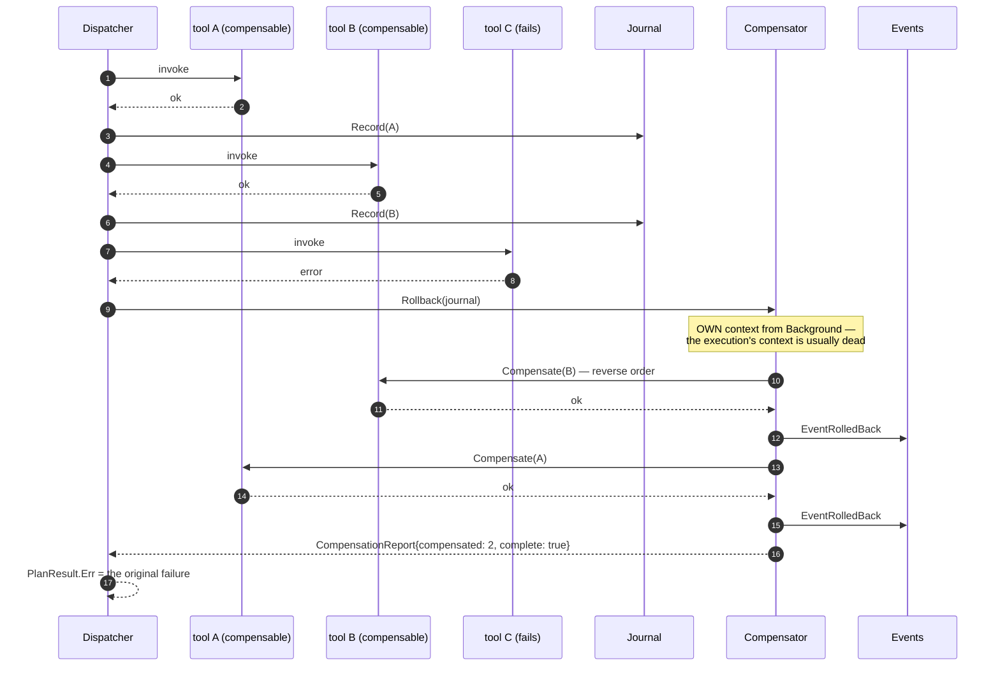
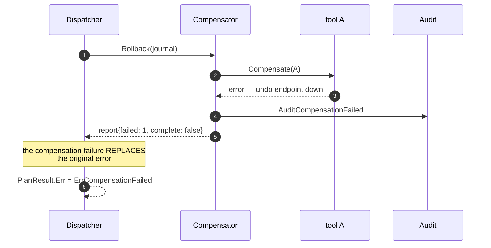
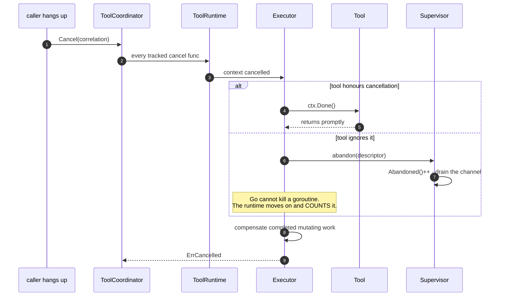
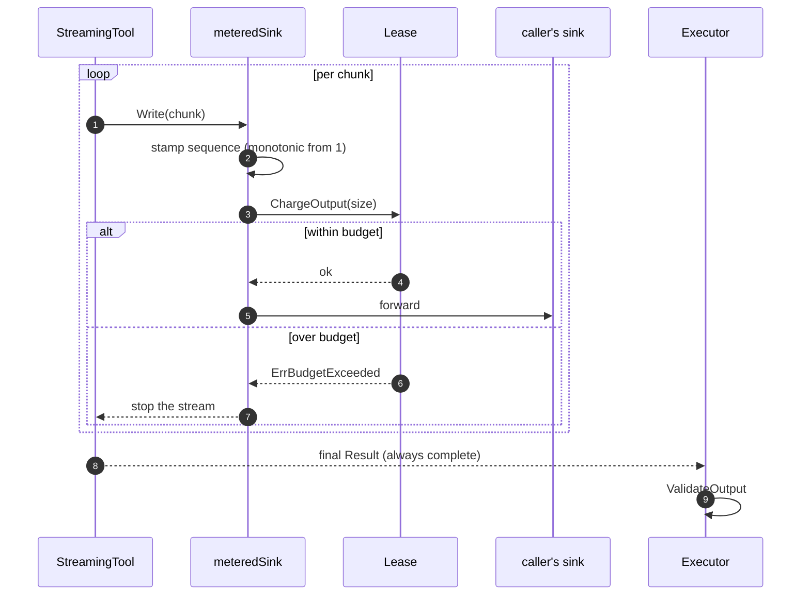

# Sequence Diagrams

**Phase 10D** · `packages/go/toolruntime`

Eight sequences, each one a case that shaped a design decision. Every one is
covered by a named test.

---

## 1 · The happy path



Note what the conversation engine never sees: which tool, which version, which
fallback. It asked for a capability and got an answer.

*Test:* `TestIntegration_SingleToolEndToEnd`

---

## 2 · Retry, then success



**The tool does not get a vote on retryability.** `Classify` lives in the
runtime and sees the sentinel set. A tool marking its own errors retryable will,
eventually, mark a permission denial retryable, and the runtime will hammer a
downstream with a request that cannot ever succeed.

**Jitter comes from a seeded, runtime-owned source**, never the global one. Two
runtimes in one process would otherwise interfere, and a test's backoff sequence
would depend on whatever ran first.

*Test:* `TestIntegration_RetriesTransientFailureThenSucceeds`

---

## 3 · Timeout on the injected clock



Two lessons are encoded here, and one of them was learned twice.

**Deadlines come from the injected clock.** `context.WithDeadline` schedules
against real time; a runtime whose deadlines come from a `FakeClock` but whose
timers come from the OS has tests that either hang or expire instantly. This is
Phase 10A's finding F1, applied here rather than rediscovered.

**The deadline is read from `context.Cause`, not `ctx.Err()`.** A context
cancelled with a cause reports `Err() == context.Canceled` regardless of why, so
reading `Err()` turns every timeout into an anonymous cancellation. That one
*was* rediscovered — ENGINEERING_AUDIT §F2.

*Test:* `TestIntegration_TimeoutIsDrivenByTheInjectedClock`

---

## 4 · Concurrent duplicates share one invocation



This is what a client retry storm looks like, and it produces **one tool call
and N answers**. Measured at 64 callers → 1 invocation, 64 served
(EXECUTION_EVALUATION §E2).

**Deduplication happens before capacity is claimed.** An execution served from
the ledger costs no tool call and no downstream load, so shedding it for want of
a sandbox slot would throw away an answer the runtime already has. The first
ordering got this backwards — ENGINEERING_AUDIT §F3.

*Test:* `TestStress_ConcurrentDuplicatesInvokeTheToolOnce`

---

## 5 · Partial failure and rollback



**Reverse order is not a preference.** Later steps may depend on state earlier
ones created; undoing the earlier one first can make the later one's
compensation impossible.

**Read-only steps are never journalled.** There is nothing to undo about a
lookup, and recording them would fill a rollback report with steps that were
"compensated" by doing nothing.

*Test:* `TestIntegration_FailedPlanRollsBackInReverseOrder`

---

## 6 · A rollback that fails



**The worst outcome this runtime can produce.** The world is in a state nobody
chose, and no further automation can be trusted to fix it.

The original failure is recoverable by retrying; a failed rollback is not.
Surfacing the lesser problem would let a caller retry into a world it does not
understand — so the greater one wins.

*Test:* `TestIntegration_CompensationFailureReplacesTheOriginalError`

---

## 7 · Cancellation mid-call



Abandonment is the honest part of this design. A tool that ignores cancellation
cannot be stopped, so it is abandoned and counted — turning an invisible
goroutine leak into a number on a dashboard with an owner's name against it.

*Tests:* `TestIntegration_CoordinatorCancelsAWholeCorrelation`,
`TestFailure_AbandonedGoroutineIsCounted`

---

## 8 · Load shedding at admission

```mermaid
sequenceDiagram
    autonumber
    participant A as request A
    participant B as request B
    participant C as request C
    participant S as Scheduler
    participant E as Executor

    A->>S: Acquire(interactive)
    S-->>A: slot (MaxConcurrent reached)
    B->>S: Acquire(interactive)
    S-->>B: queued
    C->>S: Acquire(interactive)
    S-->>C: ErrQueueFull — SHED, not queued

    Note over C: a caller receiving ErrQueueFull can degrade;<br/>a caller waiting behind a thousand others cannot

    A->>E: ...finishes
    E->>S: release
    S-->>B: slot passes straight across
```

Frozen invariant **I11**: shed at admission rather than degrade mid-flight.

A shed execution never reaches the tool at all — asserted, along with the
counters adding up, by `TestStress_OverloadShedsCleanlyAndIsAccountedFor`.

*Test:* `TestFailure_QueueFullShedsRatherThanQueueing`

---

## 9 · Streaming with a budget



**An unbounded stream is the same denial of service as an oversized result,
arriving more slowly.** Charging per chunk is what catches it; checking only the
final result never sees it.

The metered sink wraps whatever the caller supplied, so this holds even when the
caller is using a `NoopSink` and would never have noticed.

*Tests:* `TestIntegration_StreamingDeliversPartialResultsInOrder`,
`TestIntegration_UnboundedStreamHitsTheOutputBudget`
