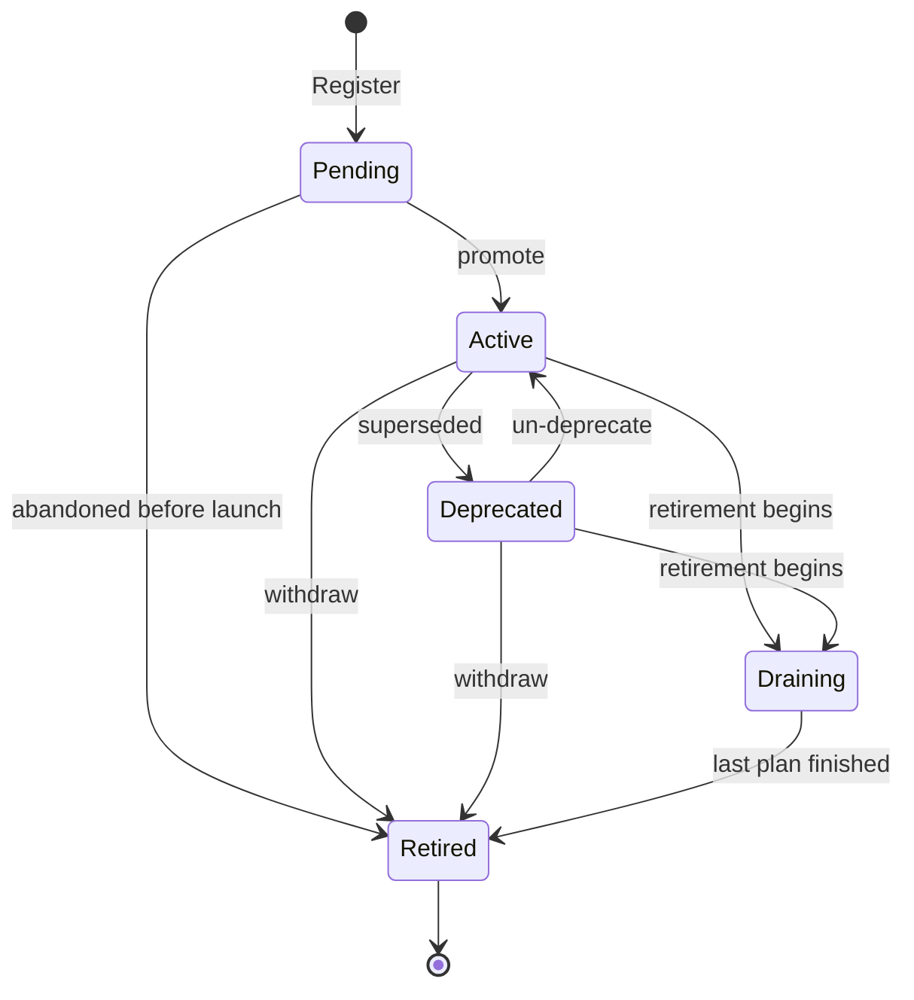
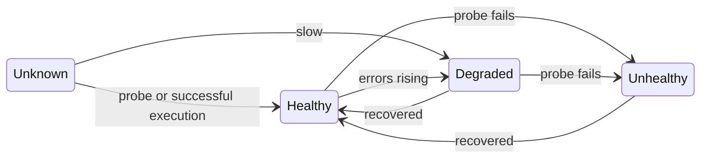
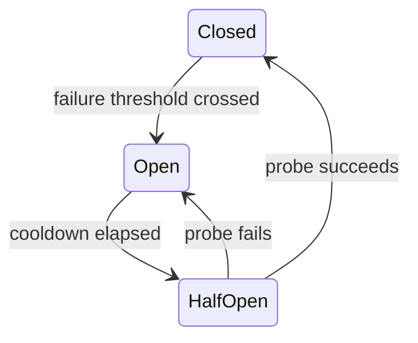
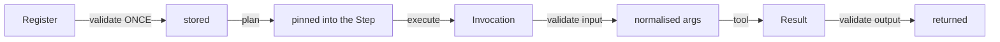

# Tool Lifecycle

**Phase 10D** · Generated from
[`registry.go`](../../packages/go/toolruntime/registry.go)
`lifecycleTransitions()`

Five stages. Every edge below is declared in the table; an undeclared transition
is refused by `canTransition` rather than happening.

---

## 1 · Registration lifecycle



| Stage | Discovery returns it | Executor invokes it | Purpose |
|---|---|---|---|
| **Pending** | No | No | Stage a version before traffic reaches it |
| **Active** | Yes | Yes | Serving normally |
| **Deprecated** | Yes, ranked below active | Yes | Keeps working while callers migrate |
| **Draining** | **No** | **Yes** | See §2 — the stage that makes retirement safe |
| **Retired** | No | No | Retained so an old audit record still resolves |

A registry with only "registered" and "not registered" forces every rollout and
every deprecation to be a hard cutover.

---

## 2 · Draining — the asymmetry that matters

```
   Discovery:  draining is NOT dispatchable  →  no NEW plan pins it
   Executor:   draining IS invocable         →  an EXISTING plan can finish
```

**A plan pinned to a version must be able to finish after somebody has decided
that version is going away.** Retiring a version that is mid-execution converts
a routine rollover into a wave of failed calls, each one a person on a phone
hearing silence.

Asserted by `TestStress_DrainingVersionStillFinishesItsPlans`: an in-flight
execution completes after the drain, and the next plan against that capability
gets `ErrNoHealthyProvider`.

---

## 3 · The two absences that carry weight

```
   Retired  ──▶ Active     ❌ NO SUCH EDGE
   Draining ──▶ Active     ❌ NO SUCH EDGE
```

**`Retired → Active` does not exist.** Reviving a retired version means an audit
record's "retired at" timestamp is a lie. Register a new version instead; that
is what versions are for.

**`Draining → Active` does not exist.** A drain is a decision somebody made with
a reason. Un-deciding it silently would make "is this version going away"
unanswerable, which is the one question a migration depends on.

`Deprecated → Active` **does** exist, because deprecation is a recommendation
rather than a commitment, and withdrawing a recommendation costs nothing.

*Test:* `TestRegistry_LifecycleTableIsWellFormed` asserts reachability from
Pending, terminality of Retired, and both absent edges.

---

## 4 · Health is orthogonal to lifecycle



| Health | Discovery | Rationale |
|---|---|---|
| **Unknown** | **Usable** | Refusing until a probe has run makes every cold start an outage |
| **Healthy** | Preferred | |
| **Degraded** | Usable, ranked below healthy | A slow calendar beats no calendar |
| **Unhealthy** | Refused | |

Health is set by two sources and both are legitimate: a prober knows whether the
tool *answers*, and an execution knows whether it answered *correctly* — a
different and more useful fact.

---

## 5 · Selection order

`preferOver` is a **total** ordering. Every tier is a deliberate choice, and the
last exists purely so that two equally good candidates still order consistently.

```
1. health      healthy → unknown → degraded → (unhealthy excluded)
2. lifecycle   active → deprecated → (others excluded)
3. priority    higher first
4. version     higher first
5. tool ID     alphabetical          ← makes the ordering TOTAL
```

Without tier 5 the same intent resolves differently on different runs, and a
fallback test passes on a Tuesday. Asserted over 50 runs by
`TestDiscovery_OrderIsTotalAndDeterministic`.

The registry **pre-sorts** each capability's candidates at registration time, so
the read path — which runs on every execution — does no sorting at all.

---

## 6 · Circuit breaker, per tool



Reused from the frozen Phase 10A `runtime.Breaker` rather than reimplemented.

**Per tool, not global and not per capability.** A global breaker means one
broken calendar integration stops every unrelated tool in the runtime. A
per-capability breaker means a healthy fallback is punished for its sibling's
outage.

An open circuit produces `ErrCircuitOpen` **without calling the tool**, and it
is not retried within the execution: the breaker is the thing saying stop.

*Test:* `TestIntegration_OpenCircuitFailsFastWithoutCallingTheTool`.

---

## 7 · Contract lifecycle within one execution



**A contract is validated at registration and never again.** Every downstream
stage — planning, permission, validation, audit — assumes a registered contract
is well-formed, which is only safe because nothing enters the registry without
passing `Contract.validate`.

The contract is **carried in the plan**, not looked up at execution time, for
the same reason the descriptor is pinned.

### What registration refuses

| Refusal | Why |
|---|---|
| No capability | A tool no intent can reference is unreachable |
| No owner | A tool with no owner is one nobody fixes at 3 a.m. |
| No timeout, or over `MaxToolTimeout` | An unbounded tool call is an unbounded silence in a phone call |
| Required field with a default | A default **is** the value for absence |
| Irreversible **and** compensable | If it can be undone it is not irreversible |
| Irreversible with `MaxAttempts > 1` | An unanswered call may still have happened |
| `Compensable` without `CompensatingTool` | A plan would promise a rollback that cannot run |
| `Streaming` without `StreamingTool` | Same |
| Enum on a non-string field | |

---

## 8 · Redeploy preserves history

Re-registering the same descriptor keeps `RegisteredAt`, `Executions` and
`Failures`.

A redeploy is not a new tool. Resetting the failure count on every rollout would
hide a tool that fails on every deploy — which is exactly the tool you most want
to see.

*Test:* `TestRegistry_RedeployPreservesCounters`.

---

## 9 · Unregister versus retire

| | Unregister | Retire |
|---|---|---|
| Contract still resolvable | **No** | **Yes** |
| Old audit records still mean something | No | Yes |
| Use for | A tool that should never have been there | A version you are done with |

**Prefer retirement.** Unregistration makes an audit record naming that
descriptor unresolvable, and an audit trail that cannot be read is not a control.

---

## 10 · Reading the table in code

The diagram in §1 is generated from one literal:

```
cd packages/go/toolruntime
go test -run TestRegistry_LifecycleTableIsWellFormed -v .
```

If an edge is added to `lifecycleTransitions()` and not to this document, **the
document is the stale artefact** — the table is the source of truth.
