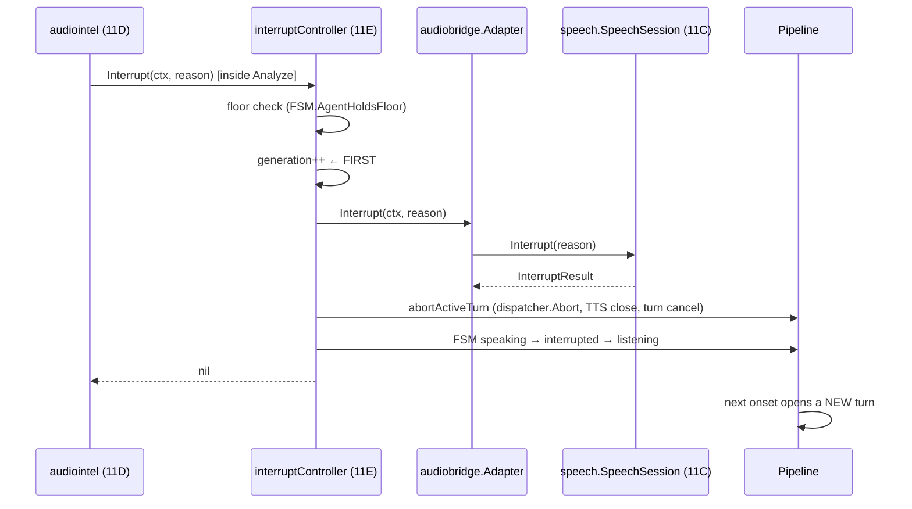

# Barge-In

**Status:** IMPLEMENTED (`bargein.go`) · orchestration **VERIFIED** at the media
sink · real-audio barge-in **NOT RUN** (requires a TTS runtime).

---

## 1. Detection is not here, and neither is cancellation

| Concern | Owner |
|---|---|
| Acoustics, onset confirmation, debounce, staleness, agent-speaking gate | `audiointel.BargeInDetector` (11D) |
| Cancelling Phase 11C synthesis, turn transition, next turn | `speech.SpeechSession.Interrupt` (11C) |
| Bridging the two | `audiobridge.Adapter` (11D) |
| **Everything below** | this layer |

This file contains no acoustic judgement and no second interruption mechanism.
There is exactly **one** detection, **one** call to Phase 11C, and this layer
reacting to the same single event.

## 2. The chain, compiler-checked end to end



Each link carries a compile-time assertion:

```go
var _ audiointel.SpeechController = (*interruptController)(nil)
var _ audiointel.SpeechController = (*audiobridge.Adapter)(nil)   // bargein.go
var _ audiobridge.SpeechSession   = (*speech.SpeechSession)(nil)  // bargein_test.go
```

If Phase 11C or 11D changes a signature, **this stops compiling**.

## 3. Why the generation is bumped first

Every other step takes time — a lock, a channel, a process. Audio already in the
synthesiser's output queue is racing all of it, and a frame that wins is the
agent talking over the caller who just interrupted.

`pumpAudio` compares the generation at the moment of **delivery**, so a frame
already read from the stream is still stopped. A second guard — the turn context,
cancelled synchronously — closes the residual window between comparison and
handover.

## 4. What is asserted, and how

Assertions are made **at the media sink**, per synthesis stream. A plain frame
count cannot answer this: the interruption opens a new turn that legitimately
starts speaking, and its audio would otherwise look like the abandoned turn
leaking through. Frames are therefore stamped with the stream that produced them.

**MEASURED (Task 12):**

| Quantity | Value |
|---|---|
| Generation across barge-in | 0 → 1 |
| Frames **withheld** from the interrupted turn | 38 |
| Frames of the interrupted turn played afterwards | **0** |
| New turn's audio delivered | yes |
| Repeated signals | 41 delivered = 41 Phase 11C calls = generation 41 |

## 5. Inbound audio is not flushed

The caller is speaking — that is what caused the interruption. Discarding the
audio path would throw away the very words that interrupted, forcing the caller
to repeat themselves.

VERIFIED (`TestBargeIn_DoesNotFlushInboundAudio`): a **new recognition stream
opens** and receives the interrupting speech; the frame queue keeps accepting.

## 6. Repeated interruptions

A caller who keeps talking produces detection after detection. The invariant is
**correspondence**, not suppression:

> one delivery ⇄ one Phase 11C interrupt ⇄ one generation increment

"Only the first is delivered" was this test's original shape and it was **wrong**:
each interruption opens a new turn, and a turn that reaches `speaking` again is
legitimately interruptible again. With fast providers that happens between
detections, so repeated deliveries are the pipeline working.

## 7. A Phase 11C refusal is recorded, not propagated

`speech.SpeechSession.Interrupt` refuses when its own turn is no longer
responding or speaking — a legitimate disagreement in the window where the turn
moved on between detection and delivery.

When it happens this layer has **still** interrupted its own synthesis and its
own generation; its FSM said the agent held the floor, and that is authoritative
for what this pipeline is doing. Returning the refusal upward would make
audiointel count a `BargeInRefused` for an interruption that did happen,
undercounting the very thing the metric exists to measure. The disagreement is
counted separately (`SpeechInterruptRefusals`) where it can be seen.

## 8. With no controller wired

A deployment without a Phase 11C session still has a pipeline that can interrupt
itself. What it must never do is keep speaking — VERIFIED by
`TestBargeIn_WithNoControllerStillProtectsTheCaller`. audiointel independently
counts an absent controller as a configuration fault rather than silence.

## 9. Latency — MEASURED, and what it is not

| Quantity | Value |
|---|---|
| Controller call (detection → return) | **below measurable resolution** (clock granularity ~950 µs) |
| `BenchmarkBargeIn_Interrupt` | 1,532 ns/op · 288 B/op · 6 allocs/op |

**PRODUCTION REFERENCE — not a claim made here.** ADR-0004 §12 and ADR-0011 §5.1
budget **20 ms** for **provider cancellation/abort**. That is a provider
cancellation budget, **not** a time-to-first-token budget, and nothing above is
offered as compliance with it: no provider is cancelled in these measurements,
because none is running.

## 10. What did not run

**NOT RUN — real-audio barge-in.** Interrupting the agent requires the agent to
be *speaking*, which requires the TTS leg. Piper is **NOT AVAILABLE** on this
machine, so there is no real agent speech to talk over.

The orchestration above is proven against a deterministic stand-in engine **and a
real `audiobridge.Adapter`**. That is a different claim from real-audio barge-in
and is not presented as one.
