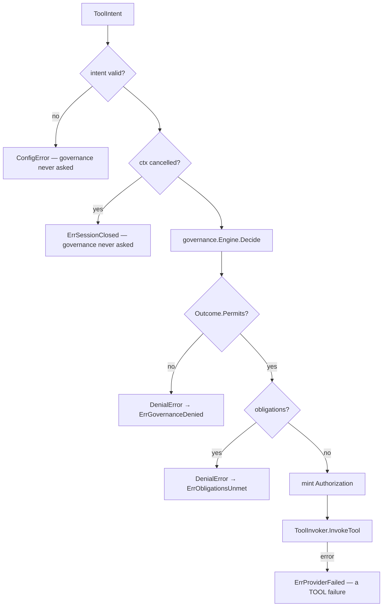

# Governance Integration

**Status:** IMPLEMENTED (`governed.go`) · **VERIFIED** by 27 tests and mutation
testing · real `governance.Engine` exercised in Task 17.

---

## 1. The rule

Nothing originating in the voice layer executes until
`governance.Engine.Decide` has allowed it.

A voice agent that can run a tool can move money, disclose a balance or send a
message on the strength of something a stranger said out loud. A rule enforced by
*remembering to call something* is not enforced.

## 2. Three structural defences

### (1) This module cannot reach a tool runtime at all

`packages/go/voice` does **not** depend on `packages/go/toolruntime`. Execution
happens behind the `ToolInvoker` port, which a service wires up.

`TestGoverned_VoiceCannotReachToolRuntime` reads `go.mod` **and** parses every
file's AST imports. (It parses rather than greps: an earlier version searched
file text and failed on its own documentation, which names the forbidden paths.
A comment naming a thing you must not import is not an import.)

A package that cannot import an executor cannot call one, whatever anybody
forgets.

### (2) The port cannot be called without a decision

```go
type Authorization struct {
	granted   bool
	operation string
	resource  string
	decision  governance.DecisionID
	policy    governance.PolicyID
	reason    string
	at        time.Time
}
```

**Every field is unexported.** No package outside this one can construct a
populated one — not by struct literal, not by assignment. The only thing that
mints one is `ToolGateway.Invoke`, after `Decide` returns Allow. Forging one
requires editing this package, which is a code review rather than an oversight.

VERIFIED structurally by reflection
(`TestGoverned_AuthorizationCannotBeForgedOutsideThisPackage`).

### (3) An unauthorised request is refused at the port

`ToolRequest.Validate()` rejects a zero authorization **and** one granted for a
different operation or resource. An authorization obtained to *read* a balance
cannot be replayed to *transfer* one
(`TestGoverned_AnAuthorizationIsNotReusableForAnotherAction`).

## 3. The order is the contract



Decide, then — and only then — invoke. No fast path, no cache, no branch
reaching the invoker first.

Cancellation is checked **before** asking: a decision obtained for a call that
has already ended is an audit record for something that never happened.

## 4. Refusal is written as "not permitted", deliberately

```go
if !decision.Outcome.Permits() { return g.refuse(...) }
```

Not a list of denying outcomes. A new outcome added to Phase 10E later must
default to **refusing**, not executing; an enumeration of denials would do the
opposite. VERIFIED across all five non-Allow outcomes
(`TestGoverned_EveryNonAllowOutcomeStopsExecution`).

## 5. Obligations are preserved, never discharged locally

An **allowed** decision that still carries obligations has not been discharged.
This layer cannot satisfy one — a confirmation is the caller's to give, a
consent basis is Identity's — so it reports them intact and does not proceed.

`ErrObligationsUnmet` is deliberately distinct from `ErrGovernanceDenied`:
"not yet" and "no" are different situations, and a caller that cannot tell them
apart either retries forever or gives up too early. The obligation's kind,
target, reason, deadline and imposing policy all survive
(`TestGoverned_ObligationsArePreservedAndStopExecution`).

## 6. A tool failure is not a governance outcome

A tool that breaks after approval returns `ErrProviderFailed`, never a denial.
Conflating them would have somebody editing policy to fix an outage.

## 7. Speech itself is governed

Every spoken turn passes `Decide` before generation begins
(`TestPipeline_EverySpokenTurnPassesGovernance`), with
`Reversibility: ReversibleNever` — speech to a caller cannot be unsaid — and no
caller content in the attributes.

## 8. Memory: there is no writer, by design

`packages/go/voice` does not depend on `packages/go/memory`, and no port reaches
one. A voice turn holds the most sensitive material in the system — what a caller
said, in their words — and a convenience writer would be the shortest path from a
live transcript to a durable store.

What a session should remember is the layer above's decision; it owns both the
conversation's meaning and the governance identity to ask about storing it.
Enforced by `TestGoverned_VoiceHasNoMemoryWritePath`.

## 9. Two findings from the real engine (Task 17)

Both are frozen-contract behaviours discovered by running the real
`governance.Engine`, not defects:

1. **`ActionTool` requires a `capability` attribute.** Without it the engine
   returns `deny (malformed_action)` — a **structural** rejection before any
   policy runs. Reporting that as "governance denied" would have looked like a
   policy decision while proving nothing. Callers of the gateway must supply it.
2. **`governance.New` refuses to start without an auditor** — *"a decision with
   no record of what it decided cannot answer why it did that."* Correct, and
   deployments must supply a durable auditor.

With the attribute supplied, the real engine returned a genuine
`deny (no_policy_matched) by <default>` — real default-deny evaluation with
`invoked=0`, proving denial prevented execution.

## 10. Mutation verification

The bypass was deliberately introduced — execute before checking the outcome, and
drop obligations. Every relevant test failed, with the forbidden invoker
reporting exactly what it should:

```
the tool invoker was reached for "lookup" on "account.balance":
governance did not permit this and nothing may execute
```

All five outcomes caught. Mutations removed; 27 governance tests pass.
