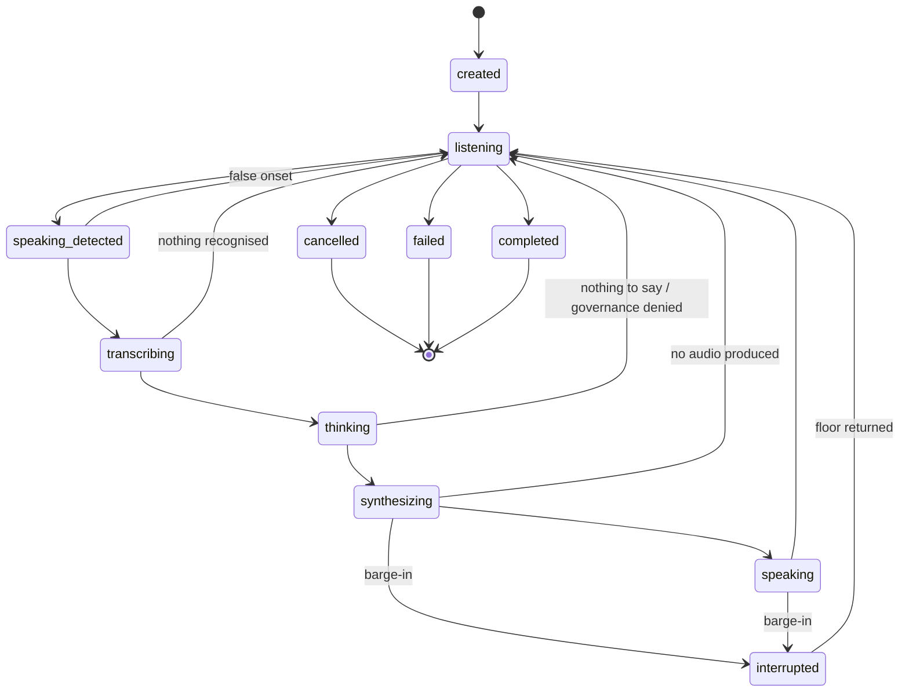

# Session Lifecycle

**Status:** IMPLEMENTED (`fsm.go`, `state.go`) · **VERIFIED** exhaustively —
all 121 ordered state pairs checked, all 38 permitted edges executed.

---

## 1. Why a declared table

A session that slipped from `speaking` to `listening` without the interruption
being orchestrated would leave a synthesiser producing audio for a turn the
caller has already talked over. The symptom is the agent talking over the
caller — the single most damaging thing a voice agent can do — and it would be
invisible: no error, no event, just a session in a state nobody moved it to.

So there is no default branch, no "close enough", and no path that moves the
session by assignment. The field is unexported and `SessionFSM.To` is the only
writer.

## 2. The eleven states

| State | Meaning |
|---|---|
| `created` | Exists, not yet listening. Initial. |
| `listening` | Waiting for the caller. Where a healthy session spends most of its life. |
| `speaking_detected` | Phase 11D confirmed an onset; no recogniser open yet. |
| `transcribing` | Recognition in progress; partials may be arriving. |
| `thinking` | Plan, governance decision and generation. A refusal is a thought that concluded no. |
| `synthesizing` | Text going to the voice, before any audio returns. |
| `speaking` | Outbound audio flowing. The state a barge-in interrupts. |
| `interrupted` | The caller spoke over the agent. Transient. |
| `cancelled` | Ended by request. **Terminal.** |
| `failed` | Ended by an unrecoverable fault. **Terminal.** |
| `completed` | Ended normally. **Terminal.** |

`speaking_detected` is deliberately distinct from `transcribing`: 11D confirms
an onset before any recognition stream exists, and collapsing them would make
"did we hear them but fail to open a recogniser" unanswerable — exactly what a
provider outage produces.

## 3. The transition table

The three terminal states are reachable from **every** non-terminal state
(elided above for readability — shown once from `listening`). A caller hangs up
mid-sentence, a supervisor cancels, a provider dies; forcing a session through a
fake intermediate state to reach an end would be inventing a transition that did
not happen.

**MEASURED (Task 10):** 38 permitted edges · 83 refused · 121 ordered pairs
checked.

## 4. Turns that end with nothing to say

Four edges return to `listening` without a response. None is a failure, and
routing them through `failed` would make an ordinary silence look like an
outage:

| Edge | Cause |
|---|---|
| `speaking_detected → listening` | The onset was noise. |
| `transcribing → listening` | Silence, or audio that was not speech. |
| `thinking → listening` | Nothing to say — including a governance refusal. |
| `synthesizing → listening` | The synthesiser produced no audio. |

## 5. How it is verified

| Property | Test |
|---|---|
| All 121 pairs permitted exactly when the table says | `TestFSM_TableIsExhaustivelyCorrect` |
| All 38 permitted edges executed on a real machine | `TestFSM_EveryDeclaredEdgeIsExecutable` (routes found by breadth-first search, so the test does not encode a second copy of the graph) |
| No unreachable state; no non-terminal dead end | `TestFSM_NoStateIsUnreachableAndNoneIsADeadEnd` |
| Nothing follows a terminal state | `TestFSM_NothingFollowsATerminalState` |
| Ending twice is a no-op; cancelled ≠ failed | `TestFSM_EndingTwiceIsANoOpButChangingHowItEndedIsNot` |
| Exactly one of N racing transitions wins | `TestFSM_IsSafeUnderConcurrentTransitions` |
| `AgentHoldsFloor()` agrees with the barge-in edges | `TestSessionState_AgentHoldsFloorMatchesTheBargeInEdges` |

The expectation in the exhaustive test is written as **independent data**, not
read from the table — a test that consulted the table would pass for any table.
Mutation-verified: adding a `listening → speaking` shortcut is caught
immediately.

## 6. Bounded history

Each session retains its most recent transitions, bounded by `MaxHistory`
(default 64). An unbounded slice per session is a memory leak that presents as a
slow crash days later; a thirty-minute call makes thousands of transitions. The
newest are kept, because the transitions that explain how a call ended are the
ones at the end of it.

## 7. Reasons come from a closed vocabulary

Every transition carries a reason code, and the machine **refuses** a reason that
is not declared in `classifications.go`. The reason reaches an event that leaves
the process; without this rule, a recogniser's or a model's output could become
one. VERIFIED by `TestFSM_RefusesAReasonOutsideTheDeclaredVocabulary`.

## 8. Ending twice, and racing transitions

A supervisor cancelling and a caller hanging up can both decide to end the same
session, from different goroutines, neither aware of the other. Returning an
error to whichever arrived second would turn an ordinary race into a logged
fault, so a transition into the terminal state the session is **already in** is
a no-op — and only that. Moving from one terminal state to a *different* one
still fails: "was it cancelled or did it fail" has one true answer.

## 9. Refused transitions are classified, not swallowed

**KNOWN LIMITATION addressed in Task 19.** Every FSM transition in the pipeline
is non-fatal except those in `beginTurn`, which previously failed the session on
refusal. Under repeated barge-ins that terminated calls (Defect 2).

`classifyTransitionRace` now distinguishes by **evidence**: if the session is no
longer in the state the transition assumed, something else legitimately moved it
and this goroutine lost a benign race. If it **is** still in that state and the
transition was still refused, the table and the code disagree — a genuine
invariant violation, and still fatal.

Both halves are mutation-verified
(`TestFailure_ARealInvariantViolationIsStillFatal`). Tolerating a lost race did
not become tolerating everything.
