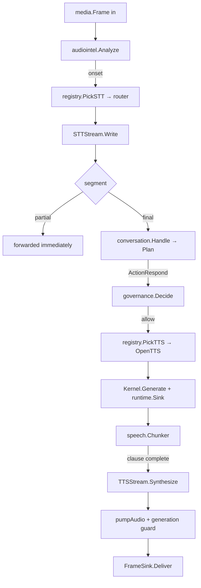

# Streaming Pipeline

**Status:** IMPLEMENTED (`pipeline.go`) · streaming ordering **VERIFIED** ·
overhead **MEASURED**.

---

## 1. The path

Every box outside this layer is a frozen contract. This layer is the arrows.

## 2. Streaming is structural, not a claim

The generation stage does **not** collect a response and cut it up. It attaches
a `runtime.Sink` to the frozen dispatcher, which delivers each chunk as it
arrives. The sink pushes text into `speech.Chunker` and submits every completed
clause to the synthesiser **the moment the clause completes** — while the model
is still generating the rest.

Buffering a whole response before speaking costs the caller the entire
generation latency as dead air, which ADR-0007 describes as *"well over a second
of dead air before the caller hears anything."*

**VERIFIED by ordering, not wall-clock:**

| Property | Test | Evidence |
|---|---|---|
| First clause submitted before the token stream closes | `TestPipeline_SynthesisBeginsBeforeGenerationEnds` | **MEASURED: 241 ms before** |
| Audio reaches media before the turn ends | `TestPipeline_DoesNotWaitForTheWholeResponseBeforeSpeaking` | ordering assertion |
| Partials forwarded before the final exists | `TestPipeline_ForwardsPartialsBeforeTheFinalTranscript` | ordering assertion |

Asserting by ordering rather than by clock means the property cannot decay into
a latency SLA this phase has not measured and does not own.

### A frozen behaviour that shapes the test

`speech.Chunker` treats a **period at the end of its buffer as undecidable**
while text is still streaming — `"1234."` looks like a finished sentence until
`"56"` arrives — so only `Flush` resolves one. `?` and `!` are unambiguous and
cut immediately, precisely so a question does not cost a generator round trip.

This is deliberate frozen design. A test script whose only period is the last
thing generated will see both clauses emitted at `Flush` and *look* like
buffer-then-split when the pipeline is doing nothing wrong. The streaming tests
are shaped accordingly, and say so.

## 3. Every queue is bounded

An unbounded queue in front of a slow consumer does not prevent the failure; it
converts a fast, visible one into a slow, invisible one that ends as an
out-of-memory kill mid-call.

| Queue | Bound | On overflow |
|---|---|---|
| Inbound frames | `MaxPendingFrames` | `ErrBackpressure` returned to the caller |
| Transcript segments | `MaxPendingSegments` | bounded channel |
| Outbound audio | `MaxPendingAudio` | dropped + counted |
| Chunker text | `speech.ChunkConfig.MaxChars` | forced break |
| Provider stderr | fixed ring | oldest overwritten |
| FSM history | `MaxHistory` (64) | oldest dropped |

**Zero is refused at configuration** — the bound cannot be switched off
(`TestSecurity_AnUnboundedQueueIsRefusedAtConfiguration`).

`WriteFrame` **reports** backpressure rather than blocking. Blocking would stall
the media reader, and a stalled media reader backs up into the carrier: a
dropped frame is a small visible loss, a stalled carrier is a dropped call.

**MEASURED under a slow consumer** (Task 11): delivered 3, dropped 93, bounds
held.

## 4. Cancellation propagates both ways

| Trigger | Effect |
|---|---|
| `Cancel(reason)` | generation bumped **first**, FSM → `cancelled`, context cancelled, streams closed |
| `Disconnect()` | as above but FSM → `completed` — a hang-up is a finished call, not an abort |
| Turn timeout | dispatcher aborted; the turn ends, the **call continues** |
| Session end | in-flight tool actions cancelled via a merged context |

The generation bump comes first, before anything that can block. Audio already
in the synthesiser's output queue is racing everything else, and a frame that
wins that race is the agent talking over the caller.

## 5. Two guards on outbound audio

`pumpAudio` checks **both** before handing a frame to media:

1. **Generation** — cheap comparison; catches the common case.
2. **Turn context** — cancelled synchronously by the interruption, closing the
   window between the comparison and the sink accepting the frame.

The second exists because the first alone leaked exactly one frame in a
full-package run. **KNOWN LIMITATION:** a `FrameSink` that ignores its context
can still play the one frame already handed to it. Blocking the abort behind a
slow media write would be worse, so that residual is accepted and stated.

## 6. Turn timeout reclaims a wedged provider

**Defect found in Task 14:** `pumpAudio` watched only the *session* context, so a
synthesiser that accepted text and produced nothing held the turn until the
whole **call** ended. Fixed by also watching the turn context.

**MEASURED: 20.25 s → 1.05 s.** One wedged provider now costs one answer, not the
call.

## 7. An empty transcript is not a question

**Defect found in Task 14:** a recogniser can end a stream with a final segment
whose text is blank — it believes it succeeded, so nothing upstream reports an
error. The pipeline passed it to the planner, then generation, then synthesis:
**the agent would speak, unprompted, at someone who said nothing.** Blank finals
are now handled as silence.

## 8. A closed recogniser is a dropped frame, not a fault

**Defect found in Task 19 (Defect 2):** `p.sttOpen` is read under the mutex but
written to outside it, so turn teardown — which runs constantly during repeated
barge-ins — can close the stream in between. Every non-backpressure write error
was fatal, so an ordinary teardown race **ended the caller's call**.

A stream closing underneath a frame is normal during an interruption. It now
costs one frame and is counted.

## 9. Orchestration cost — MEASURED

From [PERFORMANCE.md](PERFORMANCE.md); **no inference is included in any figure**:

| Stage | ns/op | B/op | allocs/op |
|---|---:|---:|---:|
| Inbound queue handover | ~368 | ~23 | 0 |
| Partial transcript forwarding | 393.7 | 384 | 0 |
| TTS chunk scheduling | 449.9 | 48 | 1 |
| Generation guard (per frame) | 0.553 | 0 | 0 |
| **Whole turn** | **95,474** | **55,700** | **406** |

A real turn adds a recogniser, a model and a synthesiser — each orders of
magnitude larger. The orchestration is not the bottleneck, and this says so
quantitatively rather than as an opinion.
